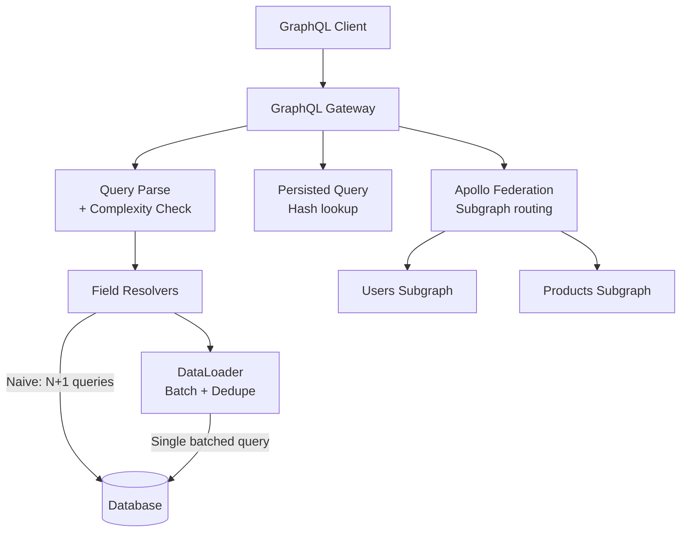
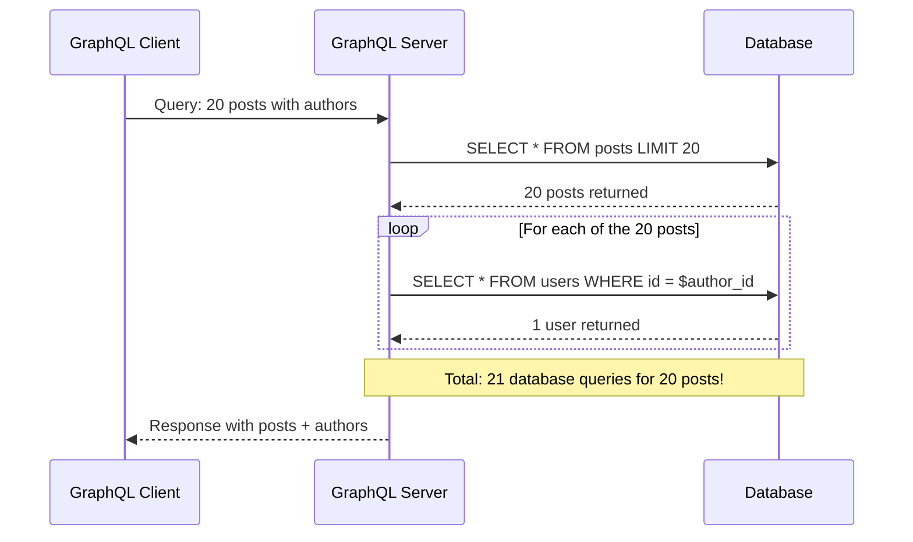
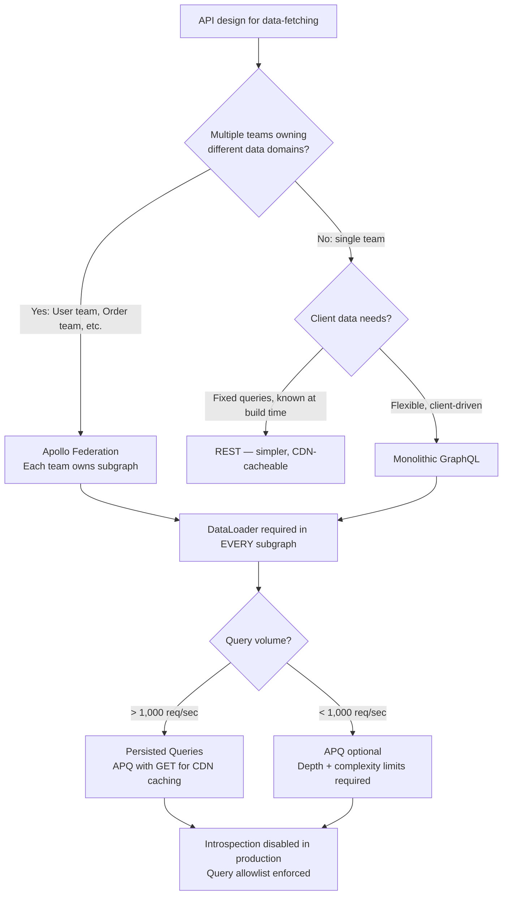

# GraphQL at Scale: N+1 Problem, DataLoader, Persisted Queries, and Federation

## 🗺️ Quick Overview



*DataLoader batches N field-resolver DB calls into one; persisted queries and federation add production safety and multi-team ownership.*

**GraphQL is a query language, not a performance guarantee.** The flexibility to request exactly the fields you need comes with a cost: each field resolver runs independently, and naive implementations turn a single API request into hundreds of database queries. Understanding DataLoader, query complexity analysis, and persisted queries is the difference between a GraphQL API that's faster than REST and one that silently destroys your database.

---

## The Problem Class `[Mid]`

A client queries a list of posts with their authors. Seems simple. Naive implementation fires one database query per author — the N+1 problem.

**Scenario:** Blog platform. Client requests:
```graphql
query {
  posts(first: 20) {
    title
    author {
      name
      email
    }
  }
}
```



> 💡 **What this means in practice:** You wrote one GraphQL query. The server fired 21 database queries. At 1,000 concurrent users each fetching 20 posts, that's 21,000 database queries per second instead of 2,000. Your database melts.

**The naive resolver code that causes this:**

```javascript
// This looks fine but is catastrophically inefficient
const resolvers = {
  Query: {
    posts: () => db.query('SELECT * FROM posts LIMIT 20')
  },
  Post: {
    // This resolver runs ONCE PER POST — 20 times for 20 posts
    author: (post) => db.query('SELECT * FROM users WHERE id = $1', [post.authorId])
  }
};

// At 1,000 concurrent requests × 21 queries each:
// 21,000 DB queries/sec — most are identical "SELECT user WHERE id = X"
// Most users are authors of multiple posts — same query fired repeatedly
```

---

## Why the Obvious Solution Fails `[Senior]`

**"Just eager-load everything"** — this is REST's approach: always JOIN the author table when fetching posts. GraphQL's promise is that you only pay for what you request. If you always JOIN, you break that promise. When a client queries only `title` without `author`, you're paying JOIN cost for nothing. GraphQL resolvers must be lazy by design — only run when the field is actually requested.

**"Join in the posts resolver"** — works for simple cases but breaks when the graph is deeper. What if the query also requests `author.company.headquarters`? You'd need to JOIN posts → users → companies → locations in a single query to avoid N+1. But the schema might not always request all these fields. You cannot statically know which fields to JOIN without parsing the incoming query at runtime — which is exactly what DataLoader does (dynamically).

**"Use field-level caching"** — caching identical field resolvers per request doesn't solve N+1; it reduces duplicate queries within a single request. If 20 posts all have the same author, caching returns the author from the first query for subsequent lookups. But the first query still runs once per unique author, not once per batch of unique authors.

---

## The Solution Landscape `[Senior]`

### Solution 1: DataLoader — Batching and Per-Request Caching

**What it is**

DataLoader accumulates field resolver invocations within a single tick of the event loop, then fires a single batched query for all accumulated IDs. Per-request caching returns the same object for duplicate IDs without additional queries.

**How it actually works at depth**

```javascript
import DataLoader from 'dataloader';

// The batch function: receives an array of keys, returns array of values in same order
async function batchLoadUsers(userIds) {
  // One query for all unique user IDs
  const users = await db.query(
    'SELECT * FROM users WHERE id = ANY($1)',
    [userIds]
  );

  // DataLoader requires: returned array must be same length and same order as input keys
  // If a user is not found, return null for that index
  const userMap = new Map(users.map(u => [u.id, u]));
  return userIds.map(id => userMap.get(id) || null);
}

// DataLoader is created per request — never share across requests (cache is per-request)
function createContext(req) {
  return {
    userLoader: new DataLoader(batchLoadUsers, {
      // Batch window: wait up to 1 tick (default) for more IDs before firing query
      // Can configure: cache: true (default), maxBatchSize: 100
      maxBatchSize: 100,  // Never batch more than 100 IDs — prevents huge IN() queries
      cache: true          // Cache within this request (same ID = same object)
    }),
    companyLoader: new DataLoader(batchLoadCompanies, { maxBatchSize: 50 })
  };
}

// Resolver: just call load() — DataLoader handles batching transparently
const resolvers = {
  Post: {
    author: (post, args, context) => {
      // This looks like a single query per post
      // DataLoader batches all these calls into one
      return context.userLoader.load(post.authorId);
    }
  },
  User: {
    company: (user, args, context) => {
      return context.companyLoader.load(user.companyId);
    }
  }
};

// Result: 20 posts → 1 batched query for up to 20 unique authorIds
// "SELECT * FROM users WHERE id = ANY([1,2,3,...,20])"
// If posts share authors: 20 posts, 5 unique authors → 1 query for 5 users
```

**How the batch window works:**

```
Tick 0: GraphQL execution starts
  - posts resolver fires → returns 20 posts
  - 20 author field resolvers are queued (one per post)
  - Each calls userLoader.load(authorId)
  - DataLoader queues: [authorId1, authorId2, ..., authorId20]

Tick 1: Event loop processes microtasks
  - DataLoader's batch function fires with [authorId1...20]
  - One DB query: SELECT * FROM users WHERE id = ANY([...20 ids])
  - Returns 5 unique users (posts share authors)
  - DataLoader resolves all 20 pending promises

Total: 2 DB queries (posts + authors) instead of 21
```

**Sizing guidance** `[Staff+]`

```
DataLoader batch window tuning:
  Default: next tick of event loop (~0ms — same request execution cycle)
  Custom: { batchScheduleFn: cb => setTimeout(cb, 10) }  // 10ms window

  Tradeoff:
    Shorter window: lower latency, smaller batches (fewer IDs co-located)
    Longer window: larger batches (more DB efficiency), higher latency

  Practical sizing:
    For most OLTP queries: default tick window is correct
    For write-heavy workloads with many independent requests: 1-5ms window
    maxBatchSize: match your DB's efficient IN() performance
      PostgreSQL: IN() efficient up to ~1,000 values with GIN/btree index
      MySQL: IN() degrades after ~1,000 values — set maxBatchSize: 500
      DynamoDB: BatchGetItem max 100 items — set maxBatchSize: 100

  Memory per DataLoader:
    Cache stores: {key → Promise} map
    Per request, per loader, per unique key: ~200 bytes
    1,000 unique users per request × 200B = 200KB per request
    At 500 concurrent requests: 100MB for DataLoader caches — acceptable
    Clear cache between requests: DataLoader per-request creation handles this
```

**Failure modes** `[Staff+]`

| Failure | Root cause | Mitigation |
|---|---|---|
| DataLoader shared across requests | Singleton DataLoader — cache leaks across users | Create new DataLoader per request in context factory |
| Batch returns wrong order | Batch function not returning results in key order | Always map results back to input key order |
| N+1 still occurs | Resolver bypasses DataLoader (`db.query` directly) | Code review: ban direct DB calls in field resolvers |
| Huge IN() query on large batch | maxBatchSize not set | Set maxBatchSize based on DB performance profile |

---

### Solution 2: Query Depth Limiting and Complexity Analysis

**What it is**

GraphQL allows arbitrarily deep queries. Without limits, a malicious or buggy client can send a query that causes millions of database operations.

**How it actually works at depth**

```graphql
# This query is O(10 × 10 × 10) = 1,000 database lookups
query MaliciousQuery {
  users(first: 10) {        # 10 users
    friends(first: 10) {    # 10 friends per user = 100 users
      posts(first: 10) {    # 10 posts per user = 1,000 posts
        comments(first: 10) { # 10 comments per post = 10,000 comments
          author { name }
        }
      }
    }
  }
}
```

```javascript
import { createComplexityLimitRule } from 'graphql-query-complexity';
import depthLimit from 'graphql-depth-limit';
import { validationRules } from 'graphql';

// Rule 1: Depth limit — no query deeper than 7 levels
const depthLimitRule = depthLimit(7);

// Rule 2: Query complexity — weighted cost per field
const complexityRule = createComplexityLimitRule(1000, {
  // Estimate: each field costs 1, list fields cost N × child_cost
  estimators: [
    // fieldExtensionsEstimator allows per-field cost in schema definition
    fieldExtensionsEstimator(),
    // Default: 1 per field, N × child_cost for list fields
    simpleEstimator({ defaultComplexity: 1 })
  ],
  onComplete: (complexity) => {
    console.log('Query complexity:', complexity);
    metrics.record('graphql_query_complexity', complexity);
  },
  createError: (max, actual) =>
    new Error(`Query complexity ${actual} exceeds maximum allowed ${max}`)
});

// Apply both rules
const server = new ApolloServer({
  typeDefs,
  resolvers,
  validationRules: [depthLimitRule, complexityRule]
});
```

**Sizing guidance** `[Staff+]`

```
Query complexity budget allocation:
  Max complexity budget: 1000 (start here, tune based on observed queries)

  Field cost mapping:
    Scalar field (id, name): 1
    Object field (user.address): 2
    List field (posts): N × child_complexity (N = pagination limit argument)
    Connection field (posts with pagination): 2 + (limit × child_complexity)

  Example query cost:
    posts(first: 20) {          # 20 × child_cost
      title                     # 1
      author {                  # 2
        name                    # 1
      }
    }
  Total: 20 × (1 + 2 + 1) = 80 — well within 1000 budget

  Introspection queries:
    Complexity: ~500 (large schema)
    Disable in production or rate-limit separately
    Never allow __schema queries from unauthenticated clients
```

---

### Solution 3: Persisted Queries

**What it is**

Instead of sending the full query string on every request, the client sends a hash. The server looks up the full query by hash. Reduces payload size and allows allowlisting of approved queries.

**How it actually works at depth**

```javascript
// Automatic Persisted Queries (APQ) — Apollo standard protocol

// Step 1: Client sends hash only (optimistic)
POST /graphql
{
  "extensions": {
    "persistedQuery": {
      "version": 1,
      "sha256Hash": "ecf4edb46db40b5132295c0291d62fb65d6759a9eedfa4d5d612dd5ec54a6b38"
    }
  }
}

// Server response: hash not found yet
{
  "errors": [{ "message": "PersistedQueryNotFound" }]
}

// Step 2: Client sends full query + hash (registers it)
POST /graphql
{
  "query": "query GetPosts { posts(first: 20) { title author { name } } }",
  "extensions": {
    "persistedQuery": {
      "version": 1,
      "sha256Hash": "ecf4edb46db40b5132295c0291d62fb65d6759a9eedfa4d5d612dd5ec54a6b38"
    }
  }
}

// Server: stores hash → query mapping, processes query
// Step 3: All future requests use hash only (Step 1 succeeds)
```

**Server implementation:**

```javascript
import { ApolloServer } from '@apollo/server';
import { createPersistedQueryLink } from '@apollo/client/link/persisted-queries';

// Server: store persisted queries in Redis
const persistedQueryPlugin = {
  async requestDidStart() {
    return {
      async willSendResponse({ request, response }) {
        const { extensions } = request;
        const hash = extensions?.persistedQuery?.sha256Hash;

        if (hash && request.query) {
          // Cache the query for future requests
          await redis.set(`pq:${hash}`, request.query, 'EX', 86400);
        }
      }
    };
  }
};
```

**Sizing guidance** `[Staff+]`

```
Persisted query benefits:
  Typical GraphQL query size: 200–2,000 bytes
  SHA-256 hash size: 64 bytes
  Bandwidth reduction: (200-2000) / 64 = 3–31× per request after first registration

  At 10,000 req/sec, average 500-byte query:
    Without APQ: 10,000 × 500B = 5MB/sec inbound
    With APQ: 10,000 × 64B = 640KB/sec inbound (8× reduction)

  CDN cacheability:
    Without APQ: POST requests are not CDN-cacheable
    With APQ + GET: Client sends GET /graphql?extensions={...hash}
    GET requests with fixed hash → CDN cacheable!
    Apollo Client: useGETForHashedQueries option enables this

  Security benefit (trusted client security):
    Pre-register all queries at build time → server rejects unknown hashes
    Prevents ad-hoc introspection and query injection
    Only works with trusted clients (mobile apps, own web frontend)
    Cannot use for third-party API consumers (they need dynamic queries)
```

---

### Solution 4: Apollo Federation

**What it is**

Federation composes multiple GraphQL subgraph schemas into a single supergraph. Each team owns their subgraph; the Apollo Router stitches queries at runtime.

**How it actually works at depth**

```javascript
// Order subgraph — owns Order type
// orders-service/schema.graphql
type Query {
  order(id: ID!): Order
  orders(first: Int): [Order]
}

type Order @key(fields: "id") {  # Declares Order as a federated entity
  id: ID!
  status: OrderStatus!
  customerId: ID!
  items: [OrderItem!]!
  # customer field is resolved by User subgraph — not here
}

// User subgraph — extends Order to add customer field
// users-service/schema.graphql
type User @key(fields: "id") {
  id: ID!
  name: String!
  email: String!
  orders: [Order]  # Cross-subgraph reference
}

// Extends Order type from orders-service with customer resolution
extend type Order @key(fields: "id") {
  id: ID! @external
  customer: User! @requires(fields: "customerId")
}

// User subgraph resolver for cross-subgraph query
const resolvers = {
  Order: {
    // Called by Router when Order.customer is requested
    // Receives representations: [{__typename: "Order", id: "ord_123", customerId: "usr_456"}]
    __resolveReference: async (orderRef) => {
      const user = await userLoader.load(orderRef.customerId);
      return user;
    }
  }
};
```

**How the Router stitches the query:**

```
Client query:
  query { order(id: "ord_123") { status customer { name email } } }

Router query plan:
  Step 1: Fetch from orders-service
    query { order(id: "ord_123") { status customerId __typename } }

  Step 2: Fetch from users-service using representation
    query { _entities(representations: [{__typename: "Order", id: "ord_123", customerId: "usr_456"}]) {
      ... on Order { customer { name email } }
    }}

  Total: 2 subgraph queries (parallel where possible) for any depth of query
```

**Sizing guidance** `[Staff+]`

```
Federation overhead:
  Apollo Router (Rust): 0.5–2ms overhead per query plan execution
  Apollo Gateway (Node.js): 3–10ms overhead per query plan execution
  Recommendation: Router for production (Rust, lower memory, lower latency)

  Query plan caching:
    Router caches query plans by normalized query hash
    Cache hit: O(1) plan lookup + subgraph queries
    Cache miss: plan computation (~5ms) + subgraph queries
    Hit rate target: > 95% (most apps have < 1,000 unique query shapes)

  Subgraph DataLoader integration:
    Each subgraph must implement DataLoader for _entities resolver
    Router batches entity lookups: 20 Orders → one _entities call to users-service
    Without DataLoader in _entities: Router's batching is wasted

  Number of subgraphs:
    < 10: manageable with single Router cluster
    10–50: Router cluster + subgraph health monitoring
    > 50: consider Domain Gateway pattern (gateway of gateways)
```

---

## Trade-off Matrix `[Senior]` → `[Staff+]`

| Dimension | REST | Monolithic GraphQL | Federated GraphQL |
|---|---|---|---|
| Overfetching | Common | Eliminated | Eliminated |
| N+1 problem | Solved with JOINs | Requires DataLoader | Requires DataLoader + entity batching |
| Schema ownership | Per-team (per-endpoint) | Single team (bottleneck) | Per-team (subgraphs) |
| Query complexity control | Not applicable | Depth + complexity rules | Per-subgraph + router-level |
| Type safety | Optional (OpenAPI) | Native (SDL) | Native (composed SDL) |
| Client flexibility | Low | High | High |
| Caching | HTTP cache (ETags, CDN) | Requires APQ + GET | Requires APQ + GET |
| Operational complexity | Low | Medium | High |

---

## Decision Framework `[Senior]` → `[Staff+]`



---

## Production Failure Story `[Staff+]`

**The DataLoader singleton that leaked user data across requests:**

A team implemented DataLoader as a module-level singleton to "improve performance by reusing the cache between requests." This seemed smart — why re-fetch users that were already fetched?

```javascript
// DANGEROUS: Module-level DataLoader — singleton shared across all requests
const userLoader = new DataLoader(batchLoadUsers); // ← WRONG

const resolvers = {
  Post: {
    author: (post) => userLoader.load(post.authorId) // ← loads from shared cache
  }
};
```

**What actually happened:** User A queries for posts. User A's data is cached. User B queries for the same posts. DataLoader returns User A's author objects from cache — but those objects contained user A's private profile data (email, phone, settings). User B received User A's private data.

**Root cause:** DataLoader's per-request cache is a security boundary. It must be recreated per request. The cache is not just a performance cache — it's scoped to the current request's authorization context.

**Resolution:**

```javascript
// CORRECT: DataLoader created per request in context factory
function createContext(req) {
  const user = authenticate(req);
  return {
    // New DataLoader per request — cache scoped to this request only
    userLoader: new DataLoader(async (ids) => {
      // Authorization: only load users this requester can see
      return batchLoadUsersForViewer(ids, user.id);
    })
  };
}

const server = new ApolloServer({
  context: ({ req }) => createContext(req) // Called fresh for every request
});
```

---

## Observability Playbook `[Staff+]`

```
GraphQL-specific metrics:

1. Field resolver execution time
   graphql_resolver_duration_ms{field="Post.author", type="Post"} p99 > 10ms
   High resolver time + low batch size = DataLoader not batching correctly

2. DataLoader batch efficiency
   dataloader_batch_size_avg{loader="userLoader"} — should be > 5 for list queries
   dataloader_cache_hit_rate{loader="userLoader"} — should be > 50% within a request

3. Query complexity distribution
   graphql_query_complexity histogram
   p99 complexity > 800 → approaching limit, consider stricter limits

4. Persisted query hit rate
   graphql_persisted_query_hit_rate > 90% expected for known clients
   Low hit rate → clients not using APQ, paying full query parse overhead

5. Subgraph health (federation)
   graphql_subgraph_request_duration_ms{subgraph="orders-service"} p99
   graphql_subgraph_errors_total{subgraph="orders-service"} — partial responses

6. N+1 detection (proactive)
   Monitor: requests where resolver_calls / query_count > threshold
   Example: 1 query → 50 resolver calls for same type = N+1 not fixed by DataLoader
```

---

## Architectural Evolution `[Staff+]`

**2026 tooling perspective:**

- **Apollo Router 2.x (Rust):** Production standard for federation. Rhai scripting for custom router logic (auth, rate limiting, header manipulation) without plugin compilation. Significantly lower memory footprint than Node.js Gateway.
- **GraphQL Yoga + Pothos:** Alternative to Apollo Server. Yoga runs on any JS runtime (Cloudflare Workers, Bun, Deno). Pothos is a code-first schema builder with built-in complexity analysis. TypeScript-native.
- **Hive Schema Registry (The Guild):** Open-source alternative to Apollo Studio. Schema registry, usage analytics, breaking change detection. Self-hostable. Recommended for teams avoiding Apollo's SaaS cost.
- **GraphQL over HTTP spec (finalized 2024):** Standardizes the HTTP transport for GraphQL. Implementations: Yoga, Apollo Server 4. Enables SSE-based subscriptions over HTTP (no WebSocket required for subscriptions).
- **Relay compiler (Meta):** Client-side query compilation with automatic fragment colocating and persisted query generation. If using React + GraphQL, Relay provides the most optimized data-fetching pattern. Steep learning curve but state-of-the-art performance.

**The evolution trajectory:**
```
Phase 1 (MVP):         Apollo Server, single schema, no DataLoader (discover N+1 fast)
Phase 2 (Production):  Add DataLoader, complexity limits, APQ
Phase 3 (Scale):       Apollo Federation, subgraphs per domain team, Router (Rust)
Phase 4 (Platform):    Schema registry (Hive/Apollo Studio), CDN query caching,
                       per-consumer query allowlists
```

---

## Decision Framework Checklist `[All Levels]`

- [ ] Is DataLoader created per request (not as a singleton)?
- [ ] Does every list field resolver use DataLoader (not direct db.query)?
- [ ] Is maxBatchSize set on DataLoaders to match database IN() performance?
- [ ] Are query depth limits enforced (recommend: max depth 7)?
- [ ] Is query complexity analysis enabled with a reasonable budget (start at 1000)?
- [ ] Is introspection disabled in production for public-facing schemas?
- [ ] Are persisted queries implemented for known/trusted clients?
- [ ] Are GET requests used with APQ for CDN caching of safe queries?
- [ ] In federation: does every subgraph implement DataLoader in the `__resolveReference` resolver?
- [ ] Are error responses partial (data + errors) rather than all-or-nothing when subgraphs fail?
- [ ] Is query complexity tracked per consumer for capacity planning?
- [ ] Are N+1 patterns proactively detected in staging (resolver call count monitoring)?

*Written by Gaurav Porwal — 10+ Year Engineer | Tech Lead | Product Owner | Business-Minded Builder*
*Last updated: 2026-03-18*
