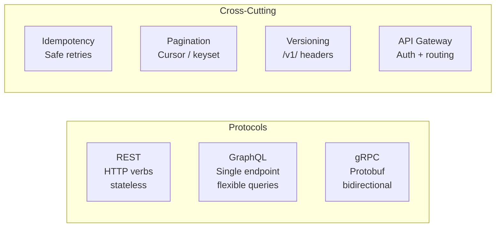

# API Design Concepts

Core principles of API design: protocols, versioning, pagination, idempotency, and gateways.

```mermaid
graph LR
    subgraph "Protocols"
        REST[REST\nHTTP verbs\nstateless]
        GQL[GraphQL\nSingle endpoint\nflexible queries]
        GRPC[gRPC\nProtobuf\nbidirectional]
    end
    subgraph "Cross-Cutting"
        IDM[Idempotency\nSafe retries]
        PAGE[Pagination\nCursor / keyset]
        VER[Versioning\n/v1/ headers]
        GW[API Gateway\nAuth + routing]
    end
```
