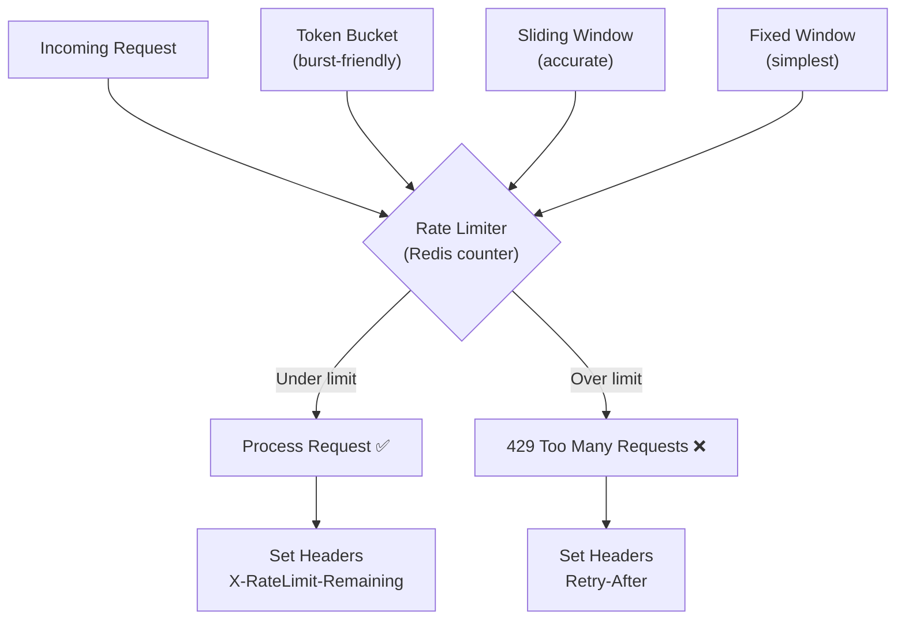

# Rate Limiting Strategies - Protect Your API from Traffic Storms

> **Reading Time:** 16 minutes
> **Difficulty:** 🟡 Intermediate
> **Impact:** Prevents system overload, ensures fair resource distribution, stops abuse

## 🗺️ Quick Overview



*A rate limiter sits in front of every API endpoint, counting requests per client per time window and rejecting traffic that exceeds the configured threshold.*

## The GitHub Problem: 5,000 Requests per Hour

**How GitHub protects 100M developers without blocking legitimate users:**

```
GitHub's Rate Limiting:
├── Authenticated users: 5,000 requests/hour
├── Unauthenticated: 60 requests/hour
├── Search API: 30 requests/minute
├── GraphQL: 5,000 points/hour (query complexity)
└── Burst: Short spikes allowed with token bucket

Headers returned:
X-RateLimit-Limit: 5000
X-RateLimit-Remaining: 4987
X-RateLimit-Reset: 1623456789

Result: Millions of CI/CD pipelines run reliably
```

**The lesson:** Smart rate limiting protects your system while keeping legitimate users happy.

---

## The Problem: Traffic Can Kill Your API

### Without Rate Limiting

```
Normal traffic:    100 requests/second → System healthy ✅
Marketing email:   10,000 req/sec → Database overwhelmed ❌
Viral tweet:       50,000 req/sec → Complete outage ❌
Malicious bot:     100,000 req/sec → DoS attack succeeds ❌

Cascade failure:
1. Database connections exhausted
2. Response times spike to 30+ seconds
3. Health checks fail
4. Load balancer marks all servers unhealthy
5. Total system outage
```

### With Rate Limiting

```
Any traffic level → Controlled to 1,000 req/sec max
├── First 1,000 requests: Processed ✅
├── Excess requests: 429 Too Many Requests
├── System stays healthy
├── Legitimate users continue working
└── Attack neutralized
```

---

## Rate Limiting Algorithms

### 1. Token Bucket (Most Common)

```
Concept: Bucket holds tokens, refilled at constant rate
         Each request consumes a token
         No tokens = request rejected

┌─────────────────────────────────────────────┐
│           TOKEN BUCKET                       │
├─────────────────────────────────────────────┤
│                                              │
│    Tokens added: 10/second                   │
│    Bucket size: 100 tokens                   │
│    Request cost: 1 token                     │
│                                              │
│    [████████████████░░░░░░░░░░░░░░░░]       │
│     60 tokens remaining                      │
│                                              │
│    Burst: Can handle 100 requests instantly  │
│    Sustained: 10 requests/second             │
│                                              │
└─────────────────────────────────────────────┘
```

```javascript
class TokenBucket {
  constructor(capacity, refillRate) {
    this.capacity = capacity;        // Max tokens
    this.tokens = capacity;          // Current tokens
    this.refillRate = refillRate;    // Tokens per second
    this.lastRefill = Date.now();
  }

  tryConsume(tokens = 1) {
    this.refill();

    if (this.tokens >= tokens) {
      this.tokens -= tokens;
      return true;
    }

    return false;
  }

  refill() {
    const now = Date.now();
    const elapsed = (now - this.lastRefill) / 1000;
    const tokensToAdd = elapsed * this.refillRate;

    this.tokens = Math.min(this.capacity, this.tokens + tokensToAdd);
    this.lastRefill = now;
  }

  getState() {
    this.refill();
    return {
      remaining: Math.floor(this.tokens),
      resetIn: Math.ceil((this.capacity - this.tokens) / this.refillRate)
    };
  }
}

// Usage
const bucket = new TokenBucket(100, 10); // 100 capacity, 10/sec refill

if (bucket.tryConsume()) {
  // Process request
} else {
  // Return 429 Too Many Requests
}
```

### 2. Sliding Window Log

```
Concept: Track timestamps of all requests in window
         Count requests, reject if over limit

Timeline: [-------- 1 minute window --------]
Requests: |--x--x----x--x--x----x--x--x--x--|
Count:    9 requests in window
Limit:    10 requests/minute
Result:   1 more request allowed
```

```javascript
class SlidingWindowLog {
  constructor(redis, windowMs, maxRequests) {
    this.redis = redis;
    this.windowMs = windowMs;
    this.maxRequests = maxRequests;
  }

  async tryRequest(userId) {
    const now = Date.now();
    const windowStart = now - this.windowMs;
    const key = `ratelimit:${userId}`;

    // Lua script for atomic operation
    const script = `
      -- Remove old entries
      redis.call('ZREMRANGEBYSCORE', KEYS[1], 0, ARGV[1])

      -- Count current entries
      local count = redis.call('ZCARD', KEYS[1])

      if count < tonumber(ARGV[2]) then
        -- Add new request
        redis.call('ZADD', KEYS[1], ARGV[3], ARGV[3])
        redis.call('EXPIRE', KEYS[1], ARGV[4])
        return {1, ARGV[2] - count - 1}
      else
        return {0, 0}
      end
    `;

    const [allowed, remaining] = await this.redis.eval(
      script,
      1,
      key,
      windowStart,
      this.maxRequests,
      now,
      Math.ceil(this.windowMs / 1000)
    );

    return { allowed: allowed === 1, remaining };
  }
}
```

### 3. Sliding Window Counter (Efficient Approximation)

```
Concept: Combine fixed windows with weighted average
         Less memory than log, more accurate than fixed

Previous window: 8 requests (40% weight)
Current window:  4 requests (60% weight)
Weighted count:  8 * 0.4 + 4 * 0.6 = 5.6 requests
Limit: 10
Result: Allowed ✅
```

```javascript
class SlidingWindowCounter {
  constructor(redis, windowMs, maxRequests) {
    this.redis = redis;
    this.windowMs = windowMs;
    this.maxRequests = maxRequests;
  }

  async tryRequest(userId) {
    const now = Date.now();
    const currentWindow = Math.floor(now / this.windowMs);
    const previousWindow = currentWindow - 1;
    const windowProgress = (now % this.windowMs) / this.windowMs;

    const currentKey = `ratelimit:${userId}:${currentWindow}`;
    const previousKey = `ratelimit:${userId}:${previousWindow}`;

    // Get counts from both windows
    const [previousCount, currentCount] = await this.redis.mget(
      previousKey,
      currentKey
    );

    // Calculate weighted count
    const prev = parseInt(previousCount || 0);
    const curr = parseInt(currentCount || 0);
    const weightedCount = prev * (1 - windowProgress) + curr;

    if (weightedCount >= this.maxRequests) {
      return {
        allowed: false,
        remaining: 0,
        resetIn: Math.ceil(this.windowMs * (1 - windowProgress) / 1000)
      };
    }

    // Increment current window
    await this.redis.multi()
      .incr(currentKey)
      .expire(currentKey, Math.ceil(this.windowMs / 1000) * 2)
      .exec();

    return {
      allowed: true,
      remaining: Math.floor(this.maxRequests - weightedCount - 1)
    };
  }
}
```

### 4. Fixed Window Counter (Simplest)

```
Concept: Reset count at fixed intervals
         Simple but allows bursts at window edges

Window: 10:00-10:01    10:01-10:02
        ████████░░    ██░░░░░░░░
        80 requests    20 requests

Problem: 80 at 10:00:59 + 80 at 10:01:01 = 160 in 2 seconds!
         (Limit was 100/minute)
```

```javascript
class FixedWindowCounter {
  constructor(redis, windowMs, maxRequests) {
    this.redis = redis;
    this.windowMs = windowMs;
    this.maxRequests = maxRequests;
  }

  async tryRequest(userId) {
    const window = Math.floor(Date.now() / this.windowMs);
    const key = `ratelimit:${userId}:${window}`;

    const count = await this.redis.incr(key);

    if (count === 1) {
      await this.redis.expire(key, Math.ceil(this.windowMs / 1000));
    }

    const allowed = count <= this.maxRequests;

    return {
      allowed,
      remaining: Math.max(0, this.maxRequests - count),
      limit: this.maxRequests
    };
  }
}
```

### Algorithm Comparison

| Algorithm | Memory | Accuracy | Burst Handling | Complexity |
|-----------|--------|----------|----------------|------------|
| Token Bucket | O(1) | Good | ✅ Configurable | Medium |
| Sliding Log | O(n) | Perfect | ❌ None | Low |
| Sliding Counter | O(1) | Good | ⚠️ Edge bursts | Medium |
| Fixed Window | O(1) | Fair | ❌ Edge bursts | Low |

---

## Distributed Rate Limiting

### Redis-Based (Recommended)

```javascript
class DistributedRateLimiter {
  constructor(redis, options) {
    this.redis = redis;
    this.windowMs = options.windowMs || 60000;
    this.maxRequests = options.max || 100;
    this.keyPrefix = options.keyPrefix || 'rl';
  }

  getKey(identifier) {
    const window = Math.floor(Date.now() / this.windowMs);
    return `${this.keyPrefix}:${identifier}:${window}`;
  }

  async consume(identifier, cost = 1) {
    const key = this.getKey(identifier);

    // Atomic increment with expiry
    const script = `
      local current = redis.call('INCRBY', KEYS[1], ARGV[1])
      if current == tonumber(ARGV[1]) then
        redis.call('EXPIRE', KEYS[1], ARGV[2])
      end
      return current
    `;

    const count = await this.redis.eval(
      script,
      1,
      key,
      cost,
      Math.ceil(this.windowMs / 1000)
    );

    const remaining = Math.max(0, this.maxRequests - count);
    const allowed = count <= this.maxRequests;

    return {
      allowed,
      remaining,
      limit: this.maxRequests,
      resetAt: Math.ceil(Date.now() / this.windowMs) * this.windowMs
    };
  }
}
```

### Express Middleware

```javascript
const rateLimit = (options) => {
  const limiter = new DistributedRateLimiter(redis, options);

  return async (req, res, next) => {
    // Identify the client
    const identifier = options.keyGenerator
      ? options.keyGenerator(req)
      : req.ip;

    const result = await limiter.consume(identifier);

    // Set standard rate limit headers
    res.set({
      'X-RateLimit-Limit': result.limit,
      'X-RateLimit-Remaining': result.remaining,
      'X-RateLimit-Reset': Math.floor(result.resetAt / 1000)
    });

    if (!result.allowed) {
      res.set('Retry-After', Math.ceil((result.resetAt - Date.now()) / 1000));
      return res.status(429).json({
        error: 'Too Many Requests',
        retryAfter: result.resetAt
      });
    }

    next();
  };
};

// Usage
app.use('/api', rateLimit({
  windowMs: 60000,  // 1 minute
  max: 100,         // 100 requests per window
  keyGenerator: (req) => req.user?.id || req.ip
}));
```

---

## Advanced Patterns

### Tiered Rate Limits

```javascript
const tierLimits = {
  free: { requests: 100, window: 60000 },
  pro: { requests: 1000, window: 60000 },
  enterprise: { requests: 10000, window: 60000 }
};

const tieredRateLimit = async (req, res, next) => {
  const tier = req.user?.tier || 'free';
  const limits = tierLimits[tier];

  const limiter = new DistributedRateLimiter(redis, {
    windowMs: limits.window,
    max: limits.requests,
    keyPrefix: `rl:${tier}`
  });

  const result = await limiter.consume(req.user?.id || req.ip);

  // Include tier info in headers
  res.set({
    'X-RateLimit-Limit': result.limit,
    'X-RateLimit-Remaining': result.remaining,
    'X-RateLimit-Tier': tier
  });

  if (!result.allowed) {
    return res.status(429).json({
      error: 'Rate limit exceeded',
      upgradeUrl: tier === 'free' ? '/pricing' : null
    });
  }

  next();
};
```

### Cost-Based Rate Limiting

```javascript
// Different operations have different costs
const operationCosts = {
  'GET /users': 1,
  'GET /users/:id': 1,
  'POST /users': 5,
  'GET /search': 10,
  'POST /export': 100
};

const costBasedLimit = async (req, res, next) => {
  const route = `${req.method} ${req.route?.path || req.path}`;
  const cost = operationCosts[route] || 1;

  const result = await limiter.consume(req.user?.id, cost);

  res.set('X-RateLimit-Cost', cost);

  if (!result.allowed) {
    return res.status(429).json({
      error: 'Quota exceeded',
      cost,
      remaining: result.remaining
    });
  }

  next();
};
```

### Adaptive Rate Limiting

```javascript
class AdaptiveRateLimiter {
  constructor(redis, baseLimit = 1000) {
    this.redis = redis;
    this.baseLimit = baseLimit;
  }

  async getLimit(identifier) {
    // Check user's error rate
    const errorRate = await this.getErrorRate(identifier);
    const successRate = 1 - errorRate;

    // Good actors get higher limits
    if (successRate > 0.99) return this.baseLimit * 2;
    if (successRate > 0.95) return this.baseLimit;
    if (successRate > 0.90) return this.baseLimit * 0.5;

    // Bad actors get throttled
    return this.baseLimit * 0.1;
  }

  async getErrorRate(identifier) {
    const window = Math.floor(Date.now() / 3600000); // 1 hour
    const key = `errors:${identifier}:${window}`;

    const [errors, total] = await this.redis.mget(
      `${key}:errors`,
      `${key}:total`
    );

    if (!total || total === '0') return 0;
    return parseInt(errors || 0) / parseInt(total);
  }

  async recordRequest(identifier, isError) {
    const window = Math.floor(Date.now() / 3600000);
    const key = `errors:${identifier}:${window}`;

    const multi = this.redis.multi();
    multi.incr(`${key}:total`);
    if (isError) multi.incr(`${key}:errors`);
    multi.expire(`${key}:total`, 7200);
    multi.expire(`${key}:errors`, 7200);
    await multi.exec();
  }
}
```

---

## Real-World Implementations

### How Cloudflare Does It

```
Cloudflare's Rate Limiting:
├── Edge-based (close to users)
├── Real-time token bucket per IP/API key
├── Configurable per route
├── Challenge mode (CAPTCHA) vs block
└── Analytics and monitoring

Features:
├── 10,000 requests/10 seconds (configurable)
├── Response actions: Block, Challenge, JS Challenge
├── Rule ordering and priorities
└── Rate limit by: IP, Header, Cookie, Query param
```

### How Stripe Does It

```
Stripe's Rate Limiting:
├── 100 requests/second per API key (live mode)
├── 25 requests/second (test mode)
├── Separate limits per endpoint type
├── Burst allowance with token bucket
└── Clear error messages and headers

Headers:
X-RateLimit-Limit: 100
X-RateLimit-Remaining: 97
X-RateLimit-Reset: 1623456789

Best practice: Implement exponential backoff on 429
```

---

## Quick Win: Add Rate Limiting Today

```javascript
// Using express-rate-limit (npm install express-rate-limit rate-limit-redis)
const rateLimit = require('express-rate-limit');
const RedisStore = require('rate-limit-redis');
const Redis = require('ioredis');

const redis = new Redis(process.env.REDIS_URL);

// Basic rate limiter
const limiter = rateLimit({
  store: new RedisStore({
    sendCommand: (...args) => redis.call(...args)
  }),
  windowMs: 60 * 1000, // 1 minute
  max: 100,            // 100 requests per window
  standardHeaders: true,
  legacyHeaders: false,
  handler: (req, res) => {
    res.status(429).json({
      error: 'Too many requests',
      retryAfter: res.getHeader('Retry-After')
    });
  }
});

// Apply to all routes
app.use(limiter);

// Or specific routes with different limits
app.use('/api/auth', rateLimit({ windowMs: 60000, max: 10 }));
app.use('/api/search', rateLimit({ windowMs: 60000, max: 30 }));
```

---

## Key Takeaways

### Rate Limiting Decision Matrix

```
1. WHAT to limit?
   ├── All traffic → Global limit
   ├── Per user → User ID key
   ├── Per IP → IP address key
   └── Per API key → API key as key

2. WHAT algorithm?
   ├── Need burst support → Token Bucket
   ├── Need perfect accuracy → Sliding Log
   ├── Need efficiency → Sliding Counter
   └── Keep it simple → Fixed Window

3. HOW to respond?
   ├── 429 Too Many Requests
   ├── Retry-After header
   ├── X-RateLimit-* headers
   └── Clear error message
```

### The Rules

| Traffic Pattern | Algorithm | Settings |
|-----------------|-----------|----------|
| Steady stream | Fixed Window | Simple counter |
| Bursty traffic | Token Bucket | Bucket size = burst, refill = sustained |
| Abuse prevention | Sliding Log | Exact tracking |
| High scale | Sliding Counter | Balance accuracy/memory |

---

## Related Content

- [Idempotency in Distributed Systems](/07-api-design/concepts/idempotency)
- [REST vs GraphQL vs gRPC](/07-api-design/concepts/rest-graphql-grpc)
- [POC #60: API Gateway & Rate Limiting](/07-api-design/hands-on/api-gateway-rate-limiting)
- [Thundering Herd Problem](/problems-at-scale/availability/thundering-herd)

---

**Remember:** Rate limiting isn't about saying "no" to users—it's about ensuring your system stays healthy so you can keep saying "yes" to everyone. The best rate limit is one your users never hit.
