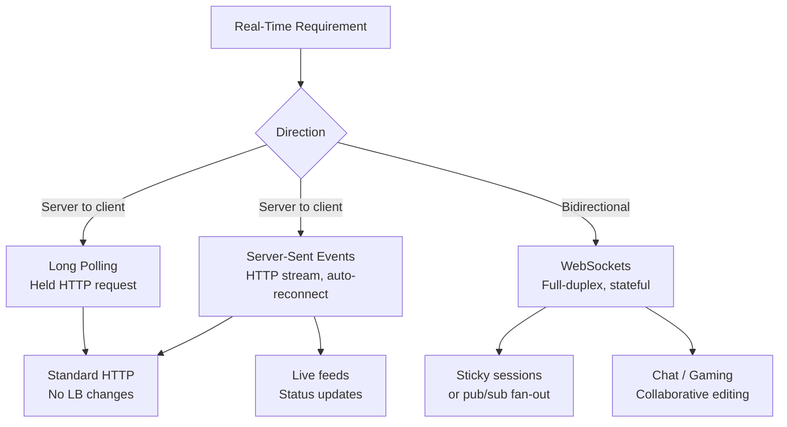
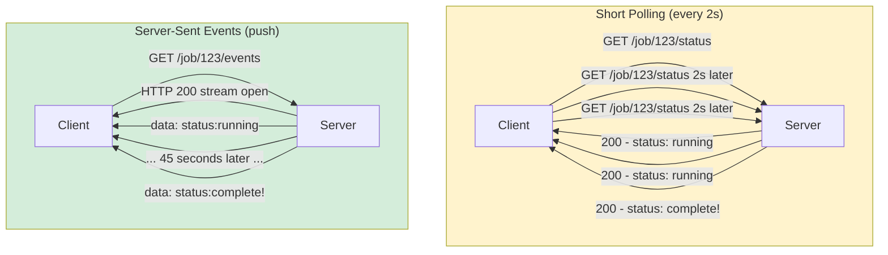
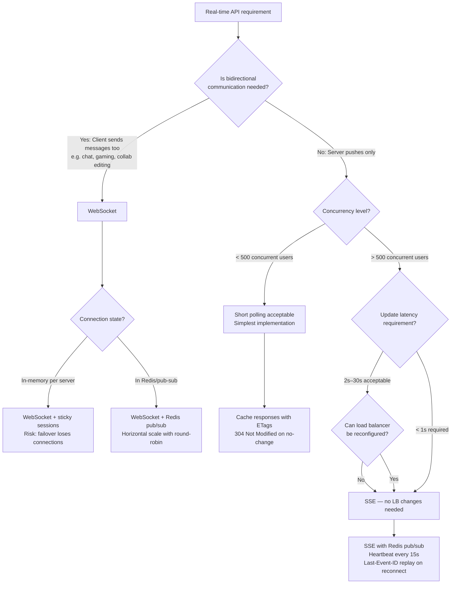

# Real-Time APIs: Long Polling, SSE, and WebSocket Trade-offs

## 🗺️ Quick Overview



*Match the technique to the data direction: SSE covers 80% of server-push needs over plain HTTP; WebSockets are reserved for true bidirectional communication.*

**"Just use WebSockets"** is the wrong answer to most real-time requirements. WebSockets are stateful, bidirectional, and require specialized load balancer configuration. Server-Sent Events handle 80% of real-time use cases with regular HTTP, automatic reconnection, and zero load balancer changes. Choosing the wrong technique wastes engineering effort and creates operational fragility. This article shows you how to match the technique to the requirement.

---

## The Problem Class `[Mid]`

You need to push data from server to client in near-real-time. The client cannot predict when data will arrive. Polling wastes resources; push is needed.

**Scenario:** SaaS dashboard showing live job processing status. 50,000 concurrent users. Each user watches 1–5 jobs. When a job status changes, the user needs to know within 2 seconds.



**Resource cost comparison for 50,000 concurrent users, each polling 1 job:**

```
Short polling (every 2s):
  Requests/sec: 50,000 / 2 = 25,000 req/sec
  Server compute: 25,000 × (DB query + HTTP overhead) = significant
  Network: 25,000 × ~800 bytes = 20 MB/sec inbound + 20 MB/sec outbound
  % of responses that contain new data: ~5% (most polls return "still running")
  Wasted requests: 95% of 25,000 = 23,750/sec

SSE (push on change):
  Connections: 50,000 persistent (HTTP/1.1 or HTTP/2 streams)
  Events sent: only when status changes (5% of users × ~10 changes/session)
  Network: only for actual changes → 95% reduction in data transfer
  Server compute: 50,000 idle connections + event fan-out on change
```

---

## Why the Obvious Solution Fails `[Senior]`

**Short polling fails at scale:** Every poll requires a full HTTP request cycle including TLS handshake amortization, HTTP header parsing, middleware execution, database query, and response serialization. 99% of these requests return the same "no change" response. The server pays full compute cost to return empty answers.

**WebSockets fail as the default choice:** WebSockets create persistent, stateful, bidirectional TCP connections. Every WebSocket connection is pinned to a specific server process. When that process restarts (deployment, crash, scale-down), the connection drops. Load balancers must use sticky sessions or specialized WebSocket-aware routing. Traditional HTTP load balancers cannot transparently route WebSocket reconnections. The operational overhead is 3–5x higher than SSE for unidirectional use cases.

**Long polling fails silently under load:** Long polling holds HTTP connections open waiting for data. Under high concurrency, this exhausts connection pools — both on the server (file descriptors) and intermediaries (load balancers have connection timeout policies that may close long-held connections before data arrives). The "held connection" approach requires careful configuration of every layer in the stack.

---

## The Solution Landscape `[Senior]`

### Solution 1: Short Polling

**What it is**

Client requests the resource on a fixed interval. If the resource has changed, the new version is returned. If not, the current version is returned.

**How it actually works at depth**

```javascript
// Client-side polling implementation
class JobStatusPoller {
  constructor(jobId, onStatusChange) {
    this.jobId = jobId;
    this.onStatusChange = onStatusChange;
    this.lastStatus = null;
    this.interval = null;
  }

  start(intervalMs = 2000) {
    this.interval = setInterval(async () => {
      const { status } = await fetch(`/api/jobs/${this.jobId}`).then(r => r.json());
      if (status !== this.lastStatus) {
        this.lastStatus = status;
        this.onStatusChange(status);
      }
      if (status === 'complete' || status === 'failed') {
        this.stop();
      }
    }, intervalMs);
  }

  stop() { clearInterval(this.interval); }
}
```

**When short polling is acceptable:**
- Low user concurrency (< 1,000 concurrent pollers)
- Infrequent update checks (> 30-second interval)
- Simple infrastructure (no WebSocket support needed)
- Low latency requirement relaxed (seconds acceptable)

**Sizing guidance** `[Staff+]`

```
Short polling cost formula:
  Server requests/sec = concurrent_users / poll_interval_sec
  Wasted requests = requests/sec × (1 - update_rate)

  At 50,000 users, 2s interval, 5% update rate:
    25,000 req/sec, 23,750 wasted req/sec
    At $0.10/million requests (API Gateway): $2.10/hour in wasted requests alone

  Break-even vs SSE:
    Short polling wins: < 500 concurrent users OR > 60s poll interval
    SSE wins: > 500 concurrent users AND < 60s update latency requirement
```

---

### Solution 2: Long Polling

**What it is**

Client sends a request. Server holds the connection open until data is available or a timeout is reached. When data arrives, the server responds and the client immediately sends another request.

**How it actually works at depth**

```javascript
// Server: hold connection until data changes or timeout
app.get('/api/jobs/:id/poll', async (req, res) => {
  const jobId = req.params.id;
  const sinceTimestamp = parseInt(req.query.since) || 0;
  const timeoutMs = 30000; // 30-second hold max
  const checkInterval = 500; // check every 500ms

  const deadline = Date.now() + timeoutMs;

  while (Date.now() < deadline) {
    const job = await db.getJob(jobId);

    if (job.updated_at.getTime() > sinceTimestamp) {
      return res.json({ status: job.status, updated_at: job.updated_at.getTime() });
    }

    // Wait before next check — avoid busy-loop
    await new Promise(resolve => setTimeout(resolve, checkInterval));
  }

  // Timeout — return current status so client can re-poll
  const job = await db.getJob(jobId);
  return res.json({ status: job.status, updated_at: job.updated_at.getTime(), timeout: true });
});

// Client: re-poll immediately after response
async function longPoll(jobId) {
  let since = 0;
  while (true) {
    const result = await fetch(`/api/jobs/${jobId}/poll?since=${since}`).then(r => r.json());
    since = result.updated_at;
    onStatusChange(result.status);
    if (result.status === 'complete' || result.status === 'failed') break;
  }
}
```

**Sizing guidance** `[Staff+]`

```
Long polling connection cost:
  Each connection holds a server thread/event loop slot
  Node.js (async): 50,000 concurrent long polls → ~50,000 pending async operations
    Memory: ~2KB per async context = ~100MB — manageable
  Java (thread-per-connection): 50,000 connections → 50,000 threads
    Memory: ~512KB per thread = ~25GB — requires non-blocking IO (Netty, Reactor)

  Load balancer timeout configuration (CRITICAL):
    AWS ALB default idle timeout: 60 seconds
    Must set to > long poll hold duration (30s hold → ALB timeout > 30s)
    Nginx: proxy_read_timeout must exceed long poll timeout
    Without this: ALB drops the connection before server responds
```

**Failure modes** `[Staff+]`

| Failure | Root cause | Mitigation |
|---|---|---|
| 502 Gateway Timeout | Load balancer timeout < hold duration | Configure LB timeout > server hold timeout |
| Connection exhaustion on server | Thread-per-connection model | Use async I/O (Node.js, Netty, Tornado) |
| Thundering herd on timeout | All connections timeout simultaneously | Add ±5s jitter to timeout value per connection |
| Database polling overload | N connections each querying DB every 500ms | Use pub/sub (Redis) to push to waiting connections instead of polling |

---

### Solution 3: Server-Sent Events (SSE)

**What it is**

A one-directional persistent HTTP connection where the server pushes newline-delimited text events to the client. Built on HTTP/1.1 (or HTTP/2 streams). Native browser support via `EventSource` API.

**How it actually works at depth**

```javascript
// Server: SSE endpoint
app.get('/api/jobs/:id/events', (req, res) => {
  const jobId = req.params.id;

  // Required SSE headers
  res.setHeader('Content-Type', 'text/event-stream');
  res.setHeader('Cache-Control', 'no-cache');
  res.setHeader('Connection', 'keep-alive');
  res.setHeader('X-Accel-Buffering', 'no'); // Disable Nginx buffering

  // Send initial state immediately
  res.write(`data: ${JSON.stringify({ status: 'connected', jobId })}\n\n`);

  // Subscribe to job updates via pub/sub
  const unsubscribe = pubsub.subscribe(`job:${jobId}:update`, (event) => {
    res.write(`id: ${event.id}\n`);
    res.write(`event: ${event.type}\n`);
    res.write(`data: ${JSON.stringify(event.payload)}\n\n`);

    if (event.payload.status === 'complete' || event.payload.status === 'failed') {
      res.write(`event: close\ndata: done\n\n`);
      cleanup();
    }
  });

  // Heartbeat to keep connection alive through proxies
  const heartbeat = setInterval(() => {
    res.write(`: heartbeat\n\n`); // SSE comment — ignored by client
  }, 15000);

  function cleanup() {
    clearInterval(heartbeat);
    unsubscribe();
    res.end();
  }

  req.on('close', cleanup);
});

// Client: EventSource API (browser native)
const eventSource = new EventSource(`/api/jobs/${jobId}/events`);

eventSource.addEventListener('status_update', (e) => {
  const data = JSON.parse(e.data);
  updateUI(data.status);
});

eventSource.addEventListener('close', () => {
  eventSource.close();
});

// Automatic reconnection is built into EventSource
// Browser reconnects with Last-Event-ID header after connection drop
eventSource.onerror = (e) => {
  console.log('SSE connection dropped, browser will auto-reconnect');
};
```

**Sizing guidance** `[Staff+]`

```
SSE connection overhead per technique:
  HTTP/1.1 SSE: 1 TCP connection per subscription
    50,000 users × 3 job subscriptions = 150,000 open TCP connections
    File descriptor limit: ulimit -n 500000 (set on server)
    Memory per connection: ~8KB = 1.2GB for 150,000 connections

  HTTP/2 SSE: multiple SSE streams multiplexed over 1 TCP connection
    50,000 users × 1 TCP connection = 50,000 TCP connections
    Memory: ~2KB per stream × 150,000 streams + TCP connection overhead
    Net: ~70% fewer TCP connections than HTTP/1.1

Load balancer requirements:
  SSE is plain HTTP — no special LB configuration needed
  Sticky sessions NOT required (SSE is connectionless state-wise)
  Exception: if server holds in-memory subscription state, sticky sessions needed
  Best practice: put subscription state in Redis pub/sub — then any server can handle reconnect
```

**Failure modes** `[Staff+]`

| Failure | Root cause | Mitigation |
|---|---|---|
| Events buffered, not streamed | Nginx/proxy response buffering | `X-Accel-Buffering: no` header, Nginx `proxy_buffering off` |
| Connection drops every 30s | Proxy idle timeout | Heartbeat comment every 15s; configure proxy idle timeout > 15s |
| Client receives duplicate events on reconnect | EventSource reconnects with `Last-Event-ID` but server doesn't honor it | Server reads `Last-Event-ID` header and replays missed events |
| SSE doesn't work through HTTP/1.1 proxies | Some corporate proxies buffer indefinitely | Detect buffering proxy; fall back to long polling |

---

### Solution 4: WebSocket

**What it is**

A persistent, bidirectional, full-duplex connection upgraded from HTTP. Both client and server can send messages at any time.

**How it actually works at depth**

```javascript
// Server: WebSocket endpoint (ws library or socket.io)
import { WebSocketServer } from 'ws';
import { createServer } from 'http';

const server = createServer(app);
const wss = new WebSocketServer({ server, path: '/ws' });

wss.on('connection', (ws, req) => {
  const userId = authenticate(req);
  const subscriptions = new Set();

  ws.on('message', (message) => {
    const { type, payload } = JSON.parse(message);

    switch (type) {
      case 'subscribe':
        subscriptions.add(payload.jobId);
        pubsub.subscribe(`job:${payload.jobId}:update`, (event) => {
          if (ws.readyState === ws.OPEN) {
            ws.send(JSON.stringify({ type: 'job_update', ...event }));
          }
        });
        break;

      case 'unsubscribe':
        subscriptions.delete(payload.jobId);
        break;

      case 'ping':
        ws.send(JSON.stringify({ type: 'pong' }));
        break;
    }
  });

  ws.on('close', () => {
    subscriptions.forEach(jobId => pubsub.unsubscribe(`job:${jobId}:update`));
  });

  // Server-initiated ping to detect stale connections
  const pingInterval = setInterval(() => {
    if (ws.readyState === ws.OPEN) {
      ws.ping();
    } else {
      clearInterval(pingInterval);
    }
  }, 30000);
});

// Client: WebSocket API
const ws = new WebSocket('wss://api.example.com/ws');

ws.onopen = () => {
  ws.send(JSON.stringify({ type: 'subscribe', payload: { jobId: '123' } }));
};

ws.onmessage = (event) => {
  const data = JSON.parse(event.data);
  if (data.type === 'job_update') updateUI(data.status);
};

// Reconnection must be implemented manually (no automatic reconnect)
ws.onclose = () => setTimeout(reconnect, 1000);
```

**Sizing guidance** `[Staff+]`

```
WebSocket connection overhead:
  Per connection: ~10KB kernel memory + ~2KB userspace state
  50,000 connections: ~600MB memory on connection state alone

  Load balancer requirements (the non-obvious part):
    HTTP/HTTPS ALB: WebSocket supported natively (AWS ALB, GCP HTTPS LB)
    Nginx: requires proxy_http_version 1.1; Upgrade and Connection headers
    HAProxy: WebSocket supported; configure timeout tunnel
    AWS Classic ELB: NOT supported for WebSocket — must use ALB

  Sticky sessions:
    Required if connection state is in-memory on the server
    Not required if state is in Redis (preferred for horizontal scaling)
    Sticky session risk: if server fails, all its clients must reconnect to new server

  Horizontal scaling:
    WebSocket servers cannot statically scale behind round-robin LB
    Need: sticky sessions OR shared pub/sub (Redis, Kafka) for message routing
    Pattern: WebSocket gateway layer (handles connections) + backend (handles business logic)
```

---

## Trade-off Matrix `[Senior]` → `[Staff+]`

| Dimension | Short Polling | Long Polling | SSE | WebSocket |
|---|---|---|---|---|
| Protocol | HTTP request/response | HTTP request/response | HTTP persistent stream | TCP (HTTP upgrade) |
| Direction | Client → Server only | Client → Server only | Server → Client only | Bidirectional |
| Latency | Poll interval (2s–30s) | Near-real-time (< 1s) | Near-real-time (< 1s) | Real-time (< 100ms) |
| Browser support | Universal | Universal | Universal (IE 10+) | Universal (IE 11+) |
| Auto-reconnect | Client implements | Client implements | Browser native | Client must implement |
| Load balancer changes | None | None (if timeout configured) | None | WebSocket upgrade support |
| Sticky sessions | Not required | Not required | Not required | Required (if stateful) |
| Server connections | Stateless requests | Held connections | Persistent streams | Persistent sockets |
| HTTP/2 multiplexing | Yes | Yes | Yes (multiple streams / TCP) | No (separate TCP) |
| Use case | Simple status, low frequency | Semi-real-time, simple setup | Push notifications, live feeds | Chat, gaming, collaborative editing |
| Operational complexity | Low | Medium | Low-Medium | High |

---

## Decision Framework `[Senior]` → `[Staff+]`



---

## Production Failure Story `[Staff+]`

**The WebSocket deployment that took 30 minutes of downtime to roll back:**

A team migrated their live dashboard from SSE to WebSocket to support bidirectional "user action" events (clicking a notification marks it as read). The migration worked perfectly in staging.

In production, they deployed to 12 application servers behind an AWS ALB. They had not configured sticky sessions. The ALB distributed each WebSocket connection across the 12 servers — load-balanced correctly. But when a server-initiated push event occurred (a job completed), the notification was sent to the pub/sub system and routed to the specific server handling that user's WebSocket connection.

Except: the pub/sub routing was broken. The server sending the event published to Redis channel `user:${userId}:notifications`. The server holding the WebSocket connection subscribed to the same channel. This worked correctly.

The failure: **when a server rebooted during a rolling deployment, all 4,000 connections it held dropped**. Those clients reconnected to different servers (round-robin). The Redis pub/sub subscriptions were on the old server — not migrated. The new server holding the reconnected clients had no Redis subscriptions. Those 4,000 users stopped receiving any real-time updates silently, with no error.

**Root cause:** WebSocket reconnection and Redis pub/sub re-subscription were not atomic. The reconnect happened; the subscription did not.

**Resolution:** Subscription is established in the WebSocket `connection` event handler (which fires on both new connections and reconnections). Ensuring that every `connection` event unconditionally creates a fresh Redis subscription. No state about "was this client subscribed before" is stored — subscribe always.

**The non-obvious lesson:** SSE's automatic reconnection with `Last-Event-ID` makes this problem harder to trigger because the browser handles reconnection transparently. WebSocket reconnection is manual and requires careful re-initialization of all server-side state.

---

## Observability Playbook `[Staff+]`

```
Real-time connection metrics:

1. Active connections by type
   realtime_connections_active{type="sse"} → scale servers when > 30,000 per node
   realtime_connections_active{type="websocket"} → connection density monitoring

2. Event delivery latency
   realtime_event_delivery_latency_ms p99 > 500ms → pub/sub bottleneck

3. Reconnection rate (health indicator)
   realtime_reconnections_per_minute > 100 → instability (proxy dropping connections)

4. Connection duration distribution
   realtime_connection_duration_seconds histogram → short connections indicate instability

5. Heartbeat failures
   realtime_heartbeat_missed_total → proxy buffering issues

6. Message backlog (pub/sub lag)
   redis_pubsub_channel_lag{channel="job_updates"} > 0 → pub/sub consumer lag

Alert thresholds:
   reconnection_rate > 5% of active connections per minute → immediate investigation
   event_delivery_latency p99 > 1s → SLO breach
```

---

## Architectural Evolution `[Staff+]`

**2026 tooling perspective:**

- **HTTP/3 (QUIC):** SSE over HTTP/3 eliminates head-of-line blocking that affects HTTP/2 under packet loss. Multiple SSE streams over a single QUIC connection are truly independent — one lagging stream does not block others. Browser support: 95%+ as of 2026.
- **Cloudflare Durable Objects:** Stateful WebSocket servers without sticky sessions. Each Durable Object maintains WebSocket state; Cloudflare routes connections to the correct Object globally. Eliminates the Redis pub/sub reconnection problem.
- **AWS API Gateway WebSocket APIs:** Managed WebSocket infrastructure with automatic connection routing and built-in presence tracking. `@connections/connectionId` API for server-initiated pushes.
- **Partykit:** Purpose-built platform for multiplayer/collaborative real-time features. Abstracts WebSocket + state management. Worth evaluating for collaborative editing use cases.
- **tRPC subscriptions:** Type-safe real-time subscriptions over WebSocket with automatic reconnection and type inference. Recommended for TypeScript full-stack applications.

**The evolution trajectory:**
```
Phase 1 (MVP):         Short polling — simplest, acceptable for < 500 users
Phase 2 (Growth):      SSE — handles 50,000+ connections, no LB changes
Phase 3 (Scale):       SSE + Redis pub/sub fan-out, horizontal scaling
Phase 4 (Bidirectional): WebSocket + Cloudflare Durable Objects or AWS API Gateway WebSocket
                          Only when bidirectional is genuinely required
```

---

## Decision Framework Checklist `[All Levels]`

- [ ] Does my use case require bidirectional communication? (If no, SSE is probably right)
- [ ] What is my peak concurrent connection count? (> 500 → avoid short polling)
- [ ] What is my latency requirement? (> 2s acceptable → short polling may suffice)
- [ ] Have I configured my load balancer idle timeout to exceed long-poll/SSE hold duration?
- [ ] Is `X-Accel-Buffering: no` set for SSE endpoints behind Nginx?
- [ ] Does my SSE implementation implement `Last-Event-ID` replay for reconnection?
- [ ] Are server-side heartbeats implemented to keep connections alive through proxies?
- [ ] Is WebSocket connection state stored in Redis (not in-memory) for horizontal scaling?
- [ ] Does WebSocket reconnection re-subscribe to all server-side pub/sub channels?
- [ ] Are active connection counts monitored with capacity alerts?
- [ ] Have I load-tested the connection limit on a single server node?
- [ ] Is reconnection handling tested by killing the server mid-connection in staging?

*Written by Gaurav Porwal — 10+ Year Engineer | Tech Lead | Product Owner | Business-Minded Builder*
*Last updated: 2026-03-18*
