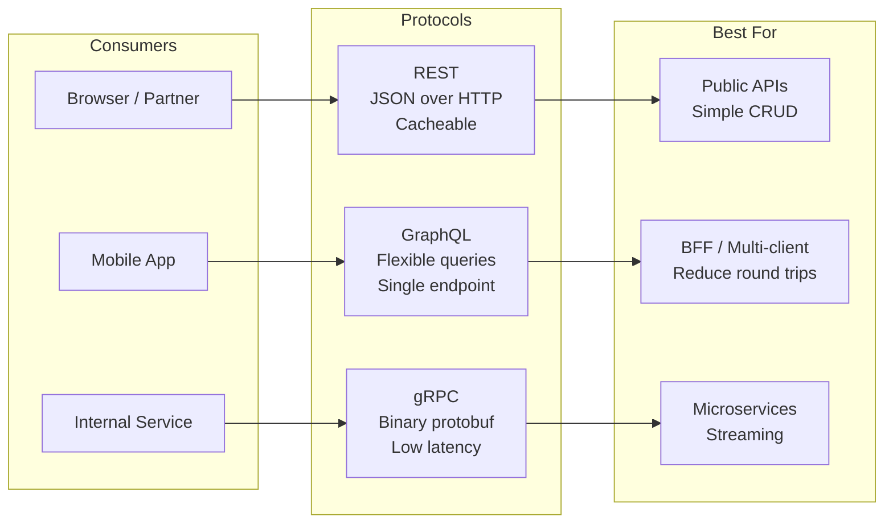

# REST vs GraphQL vs gRPC - Choose the Right API for Your Scale

> **Reading Time:** 18 minutes
> **Difficulty:** 🟡 Intermediate
> **Impact:** Determines your system's flexibility, performance, and maintenance cost

## 🗺️ Quick Overview



*Choose REST for public/partner APIs, GraphQL for mobile clients needing flexible data shapes, and gRPC for high-throughput internal service-to-service calls.*

## The Netflix Problem: 1000+ Microservices, One API Gateway

**How Netflix serves 230M subscribers with 3 different API styles:**

```
External APIs (Mobile/Web):
└── GraphQL → Flexible queries for diverse clients
    └── Why: iOS, Android, TV, Browser all need different data shapes

Internal APIs (Service-to-Service):
└── gRPC → High-performance binary protocol
    └── Why: 1000+ microservices, billions of calls/day

Legacy/Partner APIs:
└── REST → Simple, cacheable, widely understood
    └── Why: External partners expect REST
```

**The lesson:** There's no "best" API style—only the right one for your use case.

---

## The Problem: One Size Doesn't Fit All

### REST Pain Points

```javascript
// Mobile app needs user profile with recent orders
// REST requires multiple requests:

// Request 1: Get user
GET /users/123
Response: { id: 123, name: "Alice", email: "alice@example.com" }

// Request 2: Get orders
GET /users/123/orders?limit=5
Response: [{ id: 1, total: 99.99 }, { id: 2, total: 149.99 }]

// Request 3: Get order items for each order
GET /orders/1/items
GET /orders/2/items
// ... more requests

// Total: 5+ round trips for one screen
// On 3G network: 5 × 300ms = 1.5 seconds of latency
// Mobile users: Frustrated, leave app
```

### GraphQL Pain Points

```javascript
// Simple CRUD operation becomes complex

// REST: Simple and cacheable
GET /users/123
// Cache key: /users/123, TTL: 60s, CDN cacheable ✅

// GraphQL: Complex, hard to cache
POST /graphql
{
  query: `{ user(id: 123) { name email orders { id } } }`
}
// Cache key: ??? (query is in POST body)
// CDN caching: Difficult ❌
// Cache invalidation: Nightmare
```

### gRPC Pain Points

```javascript
// Browser can't call gRPC directly

// gRPC service definition
service UserService {
  rpc GetUser(UserRequest) returns (User);
}

// Browser: "What's a .proto file?"
// Solution: gRPC-Web proxy (extra infrastructure)
// Or: REST gateway in front of gRPC (complexity)
```

---

## The Paradigm Shift: Match Protocol to Use Case

### Old Mental Model
```
"Pick one API style for everything"
→ Fight the protocol's limitations everywhere
```

### New Mental Model
```
"Use the right protocol for each boundary"
→ REST for external/public
→ GraphQL for client-facing aggregation
→ gRPC for internal service-to-service
```

### Decision Matrix

| Factor | REST | GraphQL | gRPC |
|--------|------|---------|------|
| **Best for** | Public APIs, CRUD | Mobile apps, BFF | Microservices |
| **Caching** | ✅ Excellent | ⚠️ Complex | ❌ Poor |
| **Browser support** | ✅ Native | ✅ Native | ❌ Needs proxy |
| **Payload size** | Medium (JSON) | Medium (JSON) | Small (binary) |
| **Latency** | Medium | Medium | Low |
| **Learning curve** | Low | Medium | High |
| **Tooling** | Excellent | Good | Growing |
| **Type safety** | ❌ Optional | ✅ Schema | ✅ Proto |

---

## REST: The Universal Standard

### When to Use REST

```
✅ Public APIs (partners, third-party developers)
✅ Simple CRUD operations
✅ Cacheable read-heavy workloads
✅ Browser-first applications
✅ Teams new to API design
```

### REST Best Practices

```javascript
// Resource-based URLs
GET    /users          // List users
GET    /users/123      // Get user 123
POST   /users          // Create user
PUT    /users/123      // Replace user 123
PATCH  /users/123      // Update user 123 (partial)
DELETE /users/123      // Delete user 123

// Nested resources
GET /users/123/orders           // User's orders
GET /users/123/orders/456       // Specific order
GET /users/123/orders/456/items // Order items

// Filtering, pagination, sorting
GET /users?status=active&sort=-created_at&page=2&limit=20

// Response structure
{
  "data": { "id": 123, "name": "Alice" },
  "meta": { "page": 2, "total": 100 }
}
```

### REST Caching (The Superpower)

```javascript
// HTTP caching headers
app.get('/users/:id', async (req, res) => {
  const user = await getUser(req.params.id);

  res.set({
    'Cache-Control': 'public, max-age=60',  // Cache for 60s
    'ETag': `"${user.version}"`,            // Version for validation
    'Last-Modified': user.updatedAt         // Timestamp for validation
  });

  res.json(user);
});

// Client can use:
// - CDN caching (Cloudflare, CloudFront)
// - Browser caching
// - Conditional requests (If-None-Match, If-Modified-Since)

// Result: 80% of requests never hit your server
```

### Real-World: Stripe's REST API

```javascript
// Stripe's API design principles:

// 1. Consistent resource naming
POST /v1/customers
POST /v1/charges
POST /v1/subscriptions

// 2. Expandable responses (reduce round trips)
GET /v1/charges/ch_123?expand[]=customer&expand[]=invoice

// 3. Idempotency keys (safe retries)
POST /v1/charges
Idempotency-Key: "unique-request-id-123"

// 4. Versioning via header
Stripe-Version: 2023-10-16

// Result: Developer-friendly, reliable, scalable
```

---

## GraphQL: The Flexible Aggregator

### When to Use GraphQL

```
✅ Mobile apps (minimize round trips)
✅ Multiple clients with different data needs
✅ Backend-for-Frontend (BFF) pattern
✅ Rapid frontend iteration
✅ Complex, nested data relationships
```

### GraphQL Schema Design

```graphql
# Type definitions
type User {
  id: ID!
  name: String!
  email: String!
  orders(first: Int, after: String): OrderConnection!
  totalSpent: Float!
}

type Order {
  id: ID!
  total: Float!
  status: OrderStatus!
  items: [OrderItem!]!
  createdAt: DateTime!
}

type OrderItem {
  id: ID!
  product: Product!
  quantity: Int!
  price: Float!
}

# Queries
type Query {
  user(id: ID!): User
  users(filter: UserFilter, first: Int, after: String): UserConnection!
  order(id: ID!): Order
}

# Mutations
type Mutation {
  createUser(input: CreateUserInput!): User!
  updateUser(id: ID!, input: UpdateUserInput!): User!
  createOrder(input: CreateOrderInput!): Order!
}
```

### GraphQL Server Implementation

```javascript
// Node.js with Apollo Server
const { ApolloServer, gql } = require('apollo-server');

const typeDefs = gql`
  type User {
    id: ID!
    name: String!
    orders: [Order!]!
  }

  type Order {
    id: ID!
    total: Float!
  }

  type Query {
    user(id: ID!): User
  }
`;

const resolvers = {
  Query: {
    user: async (_, { id }) => {
      return await db.users.findById(id);
    }
  },
  User: {
    // Field-level resolver (only called if orders requested)
    orders: async (user) => {
      return await db.orders.findByUserId(user.id);
    }
  }
};

const server = new ApolloServer({ typeDefs, resolvers });
```

### Solving the N+1 Problem (DataLoader)

```javascript
// Without DataLoader: N+1 queries
// Query: { users { orders { id } } }
// SQL: SELECT * FROM users (1 query)
//      SELECT * FROM orders WHERE user_id = 1 (N queries)
//      SELECT * FROM orders WHERE user_id = 2
//      ...

// With DataLoader: Batched queries
const DataLoader = require('dataloader');

const orderLoader = new DataLoader(async (userIds) => {
  // Single batched query
  const orders = await db.orders.findByUserIds(userIds);
  // SQL: SELECT * FROM orders WHERE user_id IN (1, 2, 3, ...)

  // Map results back to user IDs
  return userIds.map(id => orders.filter(o => o.userId === id));
});

const resolvers = {
  User: {
    orders: (user) => orderLoader.load(user.id)
  }
};
```

### Real-World: GitHub's GraphQL API

```graphql
# One request gets everything needed for a PR page
query PullRequestPage($owner: String!, $repo: String!, $number: Int!) {
  repository(owner: $owner, name: $repo) {
    pullRequest(number: $number) {
      title
      body
      state
      author {
        login
        avatarUrl
      }
      commits(last: 10) {
        nodes {
          commit {
            message
            author { name }
          }
        }
      }
      comments(first: 20) {
        nodes {
          body
          author { login }
        }
      }
      reviews(first: 10) {
        nodes {
          state
          author { login }
        }
      }
    }
  }
}

# REST equivalent: 6+ separate API calls
```

---

## gRPC: The Performance Champion

### When to Use gRPC

```
✅ Microservice-to-microservice communication
✅ High-throughput, low-latency requirements
✅ Streaming data (real-time updates)
✅ Polyglot environments (auto-generated clients)
✅ Strong typing requirements
```

### Protocol Buffer Definition

```protobuf
// user.proto
syntax = "proto3";

package user;

service UserService {
  // Unary RPC
  rpc GetUser(GetUserRequest) returns (User);
  rpc CreateUser(CreateUserRequest) returns (User);

  // Server streaming
  rpc ListUsers(ListUsersRequest) returns (stream User);

  // Client streaming
  rpc BatchCreateUsers(stream CreateUserRequest) returns (BatchCreateResponse);

  // Bidirectional streaming
  rpc Chat(stream ChatMessage) returns (stream ChatMessage);
}

message User {
  int64 id = 1;
  string name = 2;
  string email = 3;
  repeated Order orders = 4;
}

message Order {
  int64 id = 1;
  double total = 2;
  OrderStatus status = 3;
}

enum OrderStatus {
  PENDING = 0;
  SHIPPED = 1;
  DELIVERED = 2;
}

message GetUserRequest {
  int64 id = 1;
}

message ListUsersRequest {
  int32 page_size = 1;
  string page_token = 2;
}
```

### gRPC Server (Node.js)

```javascript
// server.js
const grpc = require('@grpc/grpc-js');
const protoLoader = require('@grpc/proto-loader');

const packageDefinition = protoLoader.loadSync('user.proto');
const userProto = grpc.loadPackageDefinition(packageDefinition).user;

const server = new grpc.Server();

server.addService(userProto.UserService.service, {
  getUser: async (call, callback) => {
    try {
      const user = await db.users.findById(call.request.id);
      callback(null, user);
    } catch (error) {
      callback({
        code: grpc.status.NOT_FOUND,
        message: 'User not found'
      });
    }
  },

  listUsers: async (call) => {
    // Server streaming
    const users = await db.users.findAll();
    for (const user of users) {
      call.write(user);
    }
    call.end();
  }
});

server.bindAsync('0.0.0.0:50051', grpc.ServerCredentials.createInsecure(), () => {
  server.start();
  console.log('gRPC server running on port 50051');
});
```

### gRPC Client (Node.js)

```javascript
// client.js
const grpc = require('@grpc/grpc-js');
const protoLoader = require('@grpc/proto-loader');

const packageDefinition = protoLoader.loadSync('user.proto');
const userProto = grpc.loadPackageDefinition(packageDefinition).user;

const client = new userProto.UserService(
  'localhost:50051',
  grpc.credentials.createInsecure()
);

// Unary call
client.getUser({ id: 123 }, (error, user) => {
  if (error) {
    console.error('Error:', error.message);
    return;
  }
  console.log('User:', user);
});

// Server streaming
const stream = client.listUsers({ pageSize: 100 });
stream.on('data', (user) => console.log('Received:', user));
stream.on('end', () => console.log('Stream ended'));
stream.on('error', (error) => console.error('Error:', error));
```

### Real-World: Uber's gRPC Usage

```
Uber's microservice communication:
├── 4,000+ microservices
├── gRPC for all internal communication
├── ~10 billion RPCs per day

Why gRPC:
├── 10x smaller payloads than JSON
├── 3x faster serialization
├── Auto-generated clients in Go, Java, Python, Node
├── Built-in load balancing
├── Streaming for real-time driver locations

Architecture:
├── Mobile → REST Gateway → gRPC internal
├── Service A → gRPC → Service B
└── Service B → gRPC → Service C
```

---

## Hybrid Architecture: The Real-World Pattern

```
┌─────────────────────────────────────────────────────────────┐
│                      API Gateway                             │
├─────────────────────────────────────────────────────────────┤
│                                                              │
│  Mobile/Web ──► GraphQL ──► BFF (aggregates data)           │
│                              │                               │
│  Partners ────► REST ────────┼──► Internal Services         │
│                              │         │                     │
│  Internal ────► gRPC ────────┘         │                     │
│                                        ▼                     │
│                              ┌─────────────────┐            │
│                              │  Microservices  │            │
│                              │    (gRPC)       │            │
│                              └─────────────────┘            │
│                                                              │
└─────────────────────────────────────────────────────────────┘

Why this works:
├── GraphQL: Flexible for diverse clients
├── REST: Simple for partners, cacheable
├── gRPC: Fast for internal services
```

---

## Quick Win: Add the Right Protocol Today

### For New Public API → REST

```javascript
// Express.js REST API in 5 minutes
const express = require('express');
const app = express();

app.get('/api/v1/users/:id', async (req, res) => {
  const user = await db.users.findById(req.params.id);

  res.set('Cache-Control', 'public, max-age=60');
  res.json({ data: user });
});

app.listen(3000);
```

### For Mobile App → GraphQL

```javascript
// Apollo Server in 5 minutes
const { ApolloServer, gql } = require('apollo-server');

const typeDefs = gql`
  type Query {
    user(id: ID!): User
  }
  type User {
    id: ID!
    name: String!
  }
`;

const resolvers = {
  Query: {
    user: (_, { id }) => db.users.findById(id)
  }
};

new ApolloServer({ typeDefs, resolvers }).listen(4000);
```

### For Microservices → gRPC

```bash
# Generate code from proto
npm install @grpc/grpc-js @grpc/proto-loader

# Define service in .proto file
# Implement server and client as shown above
```

---

## Key Takeaways

### Decision Framework

```
1. WHO is the consumer?
   ├── Public/Partners → REST
   ├── Mobile apps → GraphQL
   └── Internal services → gRPC

2. WHAT data patterns?
   ├── Simple CRUD → REST
   ├── Complex nested → GraphQL
   └── High throughput → gRPC

3. WHAT performance needs?
   ├── Cacheable → REST
   ├── Flexible → GraphQL
   └── Fast → gRPC
```

### The Rules

| Scenario | Choice | Reason |
|----------|--------|--------|
| Public API | REST | Universal, cacheable |
| Mobile BFF | GraphQL | Flexible, fewer round trips |
| Service mesh | gRPC | Fast, typed, streaming |
| Webhooks | REST | Simple, widely supported |
| Real-time | gRPC streaming | Efficient bidirectional |

---

## Related Content

- [POC #56: REST API Best Practices](/interview-prep/practice-pocs/rest-api-best-practices)
- [POC #57: GraphQL Server](/interview-prep/practice-pocs/graphql-server-implementation)
- [POC #58: gRPC Service](/interview-prep/practice-pocs/grpc-protocol-buffers)
- [Rate Limiting Strategies](/system-design/api-design/rate-limiting)

---

**Remember:** The best API is the one your consumers can easily use. REST for simplicity, GraphQL for flexibility, gRPC for performance. Most production systems use all three.
