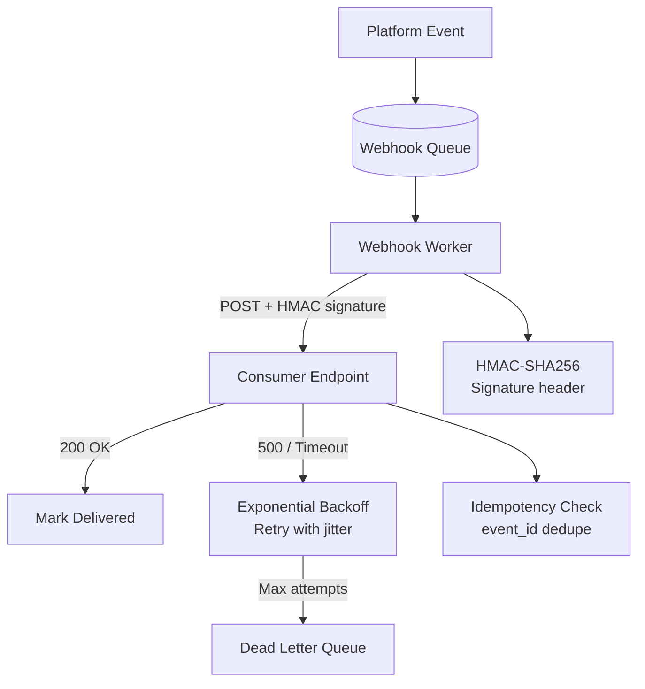
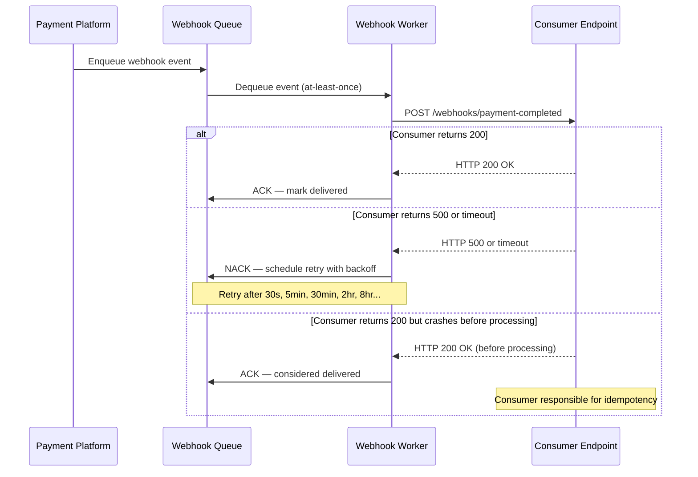
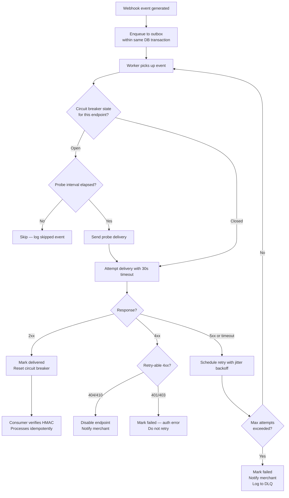

# Webhook Design: Reliable Delivery, Retry Logic, and Consumer Security

## 🗺️ Quick Overview



*Reliable webhook delivery requires a durable queue, signed payloads, exponential-backoff retries, and idempotent consumers to handle at-least-once delivery.*

**A webhook is an HTTP request that your system makes to someone else's server. Everything that can go wrong with their server is now your problem.** Their server is down, slow, returns 500, accepts the payload but discards it, or processes it twice because your retry hit a race condition. Building reliable webhook delivery means solving distributed systems problems on behalf of consumers who aren't even on your team.

---

## The Problem Class `[Mid]`

Your platform generates events (payment completed, order shipped, user signup) and consumers need to react to them in near-real-time. Webhooks are the standard mechanism: you POST the event payload to a URL the consumer registers.

**Scenario:** Payment platform. 10,000 merchants. Each merchant receives 50–500 webhook events per day. Total: ~2 million webhook deliveries per day, ~23 per second average with peaks at 200/second (end-of-day batches). Each delivery must survive consumer downtime.



**The fundamental guarantee:** Webhooks can only achieve **at-least-once delivery**. Exactly-once delivery between two independent systems is impossible without a distributed coordination protocol both parties implement. This means consumers **must** handle duplicate events.

---

## Why the Obvious Solution Fails `[Senior]`

**"Just POST the event and log failures"** — the simplest implementation fails in three ways under production load:

**Failure 1: No retry means dropped events.** Consumer endpoints have rolling deploys, network blips, and load spikes. Without retry, every 502 from a consumer's load balancer during deployment means lost events. Payment-completed events that never arrive mean merchants don't ship orders.

**Failure 2: Synchronous delivery blocks your event pipeline.** If webhook delivery happens synchronously in the transaction commit path (`save payment → POST webhook → return response`), a slow consumer (3-second timeout) adds 3 seconds to your payment processing latency. A dead consumer blocks the entire transaction.

**Failure 3: No retry amplification control.** If 5,000 consumers all go down simultaneously (AWS us-east-1 outage), and you retry all failed events immediately, you generate 5,000 × average_retry_count requests against already-struggling infrastructure. Without exponential backoff and circuit breaking, retries make the outage worse.

**Sizing the retry amplification problem:**

```
Normal throughput: 23 webhooks/second
Consumer average availability: 99.5% → 0.5% failure rate
Failed deliveries per second: 23 × 0.005 = 0.115/sec → manageable

During partial outage (20% consumer failure rate):
Failed deliveries per second: 23 × 0.20 = 4.6/sec
Without backoff: retry immediately → 4.6 × retry_multiplier/sec added load
With exponential backoff: retry delayed → load spread over hours instead of seconds

During major outage (AWS us-east-1, 60% consumer failure):
Failed deliveries per second: 23 × 0.60 = 13.8/sec
Without backoff: retry storm → your delivery infrastructure also degrades
With backoff + circuit breaker: surviving consumers unaffected
```

---

## The Solution Landscape `[Senior]`

### Solution 1: Async Queue-Based Delivery with Exponential Backoff

**What it is**

Webhook events are enqueued immediately (decoupled from the business transaction), then delivered by workers with retry logic.

**How it actually works at depth**

```javascript
// Enqueue — synchronous, fast, part of the business transaction
async function recordPaymentAndEnqueueWebhook(paymentData) {
  const trx = await db.transaction();
  try {
    const payment = await Payment.create(paymentData, { transaction: trx });

    // Enqueue webhook as part of the same transaction (outbox pattern)
    await WebhookOutbox.create({
      event_type: 'payment.completed',
      merchant_id: payment.merchant_id,
      payload: JSON.stringify({ payment_id: payment.id, amount: payment.amount }),
      created_at: new Date(),
      status: 'pending'
    }, { transaction: trx });

    await trx.commit();
    return payment;
  } catch (err) {
    await trx.rollback();
    throw err;
  }
}

// Worker — asynchronous delivery with retry
class WebhookDeliveryWorker {
  RETRY_DELAYS_SECONDS = [30, 300, 1800, 7200, 28800]; // 30s, 5m, 30m, 2h, 8h

  async deliver(webhookRecord) {
    const endpoint = await MerchantWebhookConfig.findByMerchantId(webhookRecord.merchant_id);
    if (!endpoint || !endpoint.is_active) return;

    const attempt = webhookRecord.attempt_count;
    if (attempt >= this.RETRY_DELAYS_SECONDS.length + 1) {
      await this.markAsFailed(webhookRecord, 'max_retries_exceeded');
      return;
    }

    const payload = JSON.parse(webhookRecord.payload);
    const signature = this.signPayload(payload, endpoint.secret);

    try {
      const response = await fetch(endpoint.url, {
        method: 'POST',
        headers: {
          'Content-Type': 'application/json',
          'X-Webhook-ID': webhookRecord.id,
          'X-Webhook-Timestamp': Date.now().toString(),
          'X-Webhook-Signature': signature,
          'X-Webhook-Attempt': attempt.toString()
        },
        body: JSON.stringify(payload),
        signal: AbortSignal.timeout(30000) // 30-second consumer timeout
      });

      if (response.ok) {
        await this.markAsDelivered(webhookRecord, response.status);
      } else if (response.status >= 400 && response.status < 500) {
        // 4xx: consumer error, do not retry (misconfigured endpoint, auth failure)
        await this.markAsFailed(webhookRecord, `consumer_error_${response.status}`);
      } else {
        // 5xx or unexpected: schedule retry
        await this.scheduleRetry(webhookRecord, attempt);
      }
    } catch (err) {
      // Network error or timeout: schedule retry
      await this.scheduleRetry(webhookRecord, attempt);
    }
  }

  async scheduleRetry(webhookRecord, currentAttempt) {
    const delaySeconds = this.RETRY_DELAYS_SECONDS[currentAttempt] || 28800;
    const nextAttemptAt = new Date(Date.now() + delaySeconds * 1000);

    await WebhookOutbox.update(webhookRecord.id, {
      attempt_count: currentAttempt + 1,
      next_attempt_at: nextAttemptAt,
      status: 'pending'
    });
  }
}
```

**Sizing guidance** `[Staff+]`

```
Queue sizing for webhook delivery:
  Throughput: 23 webhooks/sec normal, 200/sec peak
  Worker count: ceil(peak_tps × avg_delivery_latency_sec / 1) + 20% headroom
    = ceil(200 × 0.5 / 1) × 1.2 = 120 workers

  Queue depth at 60% consumer failure during outage:
    Failed rate: 120/sec
    Retry delays: 30s, 5m, 30m... → load spreads over time
    Queue depth spike: 120 × 30 = 3,600 events queued for first retry wave
    Queue depth at 5m retry: 120 × 300 = 36,000 events
    Manageable with SQS/Redis queue at these volumes

  Storage for webhook records:
    23/sec × 86400 sec/day = 1,987,200 records/day
    At 1KB per record: ~2GB/day
    Retention 30 days: ~60GB — manageable in PostgreSQL with partitioning by date
```

**Configuration decisions that matter** `[Staff+]`

- **Retry on 4xx vs 5xx:** Never retry 4xx (consumer-side error — retrying wastes resources). Always retry 5xx and timeouts. The tricky case is 404: could mean the endpoint was removed (do not retry) or a transient routing issue (might retry). Best practice: retry 404 twice, then disable endpoint.
- **Consumer timeout:** 30 seconds maximum. Consumers who need longer processing should return 200 immediately and process asynchronously. Document this contract explicitly. Implement a configurable timeout per endpoint (some consumers are slower).
- **Jitter on retry timing:** Pure exponential backoff causes retry waves (all failed events retry at exactly T+30s). Add ±20% jitter: `delay × (0.8 + Math.random() × 0.4)`.
- **Per-endpoint circuit breaker:** If a consumer endpoint returns 5xx for 10 consecutive requests, mark the endpoint as "circuit open" and stop delivering. Check every 5 minutes with a single probe request. This prevents wasted deliveries to dead endpoints consuming worker capacity.

**Failure modes** `[Staff+]`

| Failure | Root cause | Mitigation |
|---|---|---|
| Duplicate events delivered to consumer | Retry after delivery success (network drop after response) | Consumers implement idempotency; include `X-Webhook-ID` for deduplication |
| Webhook backlog grows unbounded | Consumer down for days, events accumulate | Max retention 72 hours; after that, mark failed and notify merchant |
| Worker memory exhaustion | Large payload × high concurrency | Enforce max payload size (64KB); stream large payloads via signed URL |
| Retry storm on outage recovery | All queued retries fire simultaneously when consumer comes back | Random jitter + circuit breaker with exponential reconnect |

---

### Solution 2: HMAC-SHA256 Payload Signing

**What it is**

Sign each webhook payload with a shared secret. Consumers verify the signature before processing. Prevents replay attacks and payload tampering.

**How it actually works at depth**

```javascript
// Producer: Sign the payload
function signWebhookPayload(payload, secret) {
  const timestamp = Math.floor(Date.now() / 1000).toString();
  const payloadString = JSON.stringify(payload);

  // Signed string includes timestamp to prevent replay attacks
  const signedString = `${timestamp}.${payloadString}`;

  const hmac = crypto.createHmac('sha256', secret);
  hmac.update(signedString);
  const signature = hmac.digest('hex');

  return {
    'X-Webhook-Timestamp': timestamp,
    'X-Webhook-Signature': `v1=${signature}`,
    'X-Webhook-ID': generateWebhookId()
  };
}

// Consumer: Verify the signature (Node.js example)
function verifyWebhookSignature(req, secret) {
  const timestamp = req.headers['x-webhook-timestamp'];
  const receivedSignature = req.headers['x-webhook-signature'];

  // Reject old webhooks (replay attack prevention: 5-minute window)
  const currentTime = Math.floor(Date.now() / 1000);
  if (Math.abs(currentTime - parseInt(timestamp)) > 300) {
    throw new Error('Webhook timestamp too old — possible replay attack');
  }

  // Reconstruct signed string
  const payloadString = JSON.stringify(req.body);
  const signedString = `${timestamp}.${payloadString}`;

  // Compute expected signature
  const hmac = crypto.createHmac('sha256', secret);
  hmac.update(signedString);
  const expectedSignature = `v1=${hmac.digest('hex')}`;

  // Use timing-safe comparison to prevent timing attacks
  if (!crypto.timingSafeEqual(
    Buffer.from(receivedSignature),
    Buffer.from(expectedSignature)
  )) {
    throw new Error('Webhook signature verification failed');
  }

  return true;
}
```

**Why `timingSafeEqual` matters:** String comparison in JavaScript short-circuits — it returns false at the first mismatched character. An attacker can measure response time to determine how many characters of the signature are correct, incrementally guessing the signature. `timingSafeEqual` always compares all bytes in constant time.

**Sizing guidance** `[Staff+]`

```
HMAC computation cost:
  SHA-256 on 1KB payload: ~0.01ms per operation
  At 200 webhooks/sec: 200 × 0.01ms = 2ms total CPU — negligible

Secret rotation:
  Stripe approach: support v1= and v2= signature versions simultaneously
  During rotation: produce both signatures, consumer accepts either
  Rotation window: 24 hours
  After rotation: remove old signature, consumers must have updated secret

  Header format during rotation:
  X-Webhook-Signature: v1=old_sig,v2=new_sig
```

---

### Solution 3: Circuit Breaker for Dead Endpoints

**What it is**

Track failure rate per consumer endpoint. When failure rate exceeds threshold, stop delivering (open circuit) to avoid wasting resources on a dead endpoint.

**How it actually works at depth**

```javascript
class WebhookCircuitBreaker {
  constructor(redis) {
    this.redis = redis;
    this.FAILURE_THRESHOLD = 10;     // consecutive failures to open
    this.PROBE_INTERVAL_SECONDS = 300; // 5 minutes between probes
  }

  async isCircuitOpen(endpointId) {
    const state = await this.redis.get(`webhook:circuit:${endpointId}`);
    if (state === 'open') {
      const probeAllowed = await this.redis.set(
        `webhook:circuit:probe:${endpointId}`,
        '1',
        'NX',
        'EX',
        this.PROBE_INTERVAL_SECONDS
      );
      // Allow one probe request every PROBE_INTERVAL_SECONDS
      return probeAllowed ? false : true;
    }
    return false;
  }

  async recordSuccess(endpointId) {
    await this.redis.del(`webhook:circuit:${endpointId}`);
    await this.redis.del(`webhook:circuit:failures:${endpointId}`);
  }

  async recordFailure(endpointId) {
    const failures = await this.redis.incr(`webhook:circuit:failures:${endpointId}`);
    await this.redis.expire(`webhook:circuit:failures:${endpointId}`, 3600);

    if (failures >= this.FAILURE_THRESHOLD) {
      await this.redis.set(`webhook:circuit:${endpointId}`, 'open', 'EX', 86400);
      await this.notifyMerchantEndpointDisabled(endpointId);
    }
  }
}
```

---

## Trade-off Matrix `[Senior]` → `[Staff+]`

| Dimension | Fire-and-forget | Queue + Retry | Queue + Retry + Circuit Breaker |
|---|---|---|---|
| Delivery guarantee | None | At-least-once | At-least-once with dead endpoint protection |
| Consumer downtime handling | Events lost | Events queued for 72h | Events queued; circuit opens after N failures |
| Infrastructure complexity | Trivial | Medium | Medium-High |
| Duplicate event rate | Low | Medium (retries cause dupes) | Medium |
| Worker resource waste on dead endpoints | N/A | High (retries to dead endpoint) | Low (circuit open) |
| Retry storm risk | None | High without jitter | Low (circuit breaker prevents mass retries) |
| Consumer observability | None | Delivery logs | Delivery logs + circuit state |

---

## Decision Framework `[Senior]` → `[Staff+]`



---

## Production Failure Story `[Staff+]`

**The retry storm that brought down a payment platform:**

A mid-size payment platform had webhook delivery working reliably for 18 months. During a Black Friday sale, a major e-commerce platform (their largest merchant, 15% of webhook volume) had a deployment that returned 503 for 45 minutes.

The webhook worker had retry logic — but it retried immediately with no backoff and no circuit breaker. For 45 minutes, the worker retried the same ~50,000 queued events every 10 seconds. Each retry spawned 50,000 HTTP connections. The worker fleet (40 nodes) exhausted TCP connections and file descriptors. Worker nodes started failing. Now other merchants' webhooks also stopped delivering.

**What failed simultaneously:**
1. No exponential backoff — retried every 10 seconds
2. No circuit breaker — continued retrying a known-dead endpoint
3. No connection pool limit — each worker spawned unlimited connections
4. Worker fleet shared across all merchants — one large merchant's outage starved all others

**Resolution (incident timeline):**
- T+0: Webhook delivery latency alarm fires
- T+15: On-call identifies retry storm targeting single endpoint
- T+20: Manually disabled the failing merchant endpoint in production
- T+45: Merchant deployment completes; endpoint re-enabled
- T+60: Worker fleet recovered; other merchant deliveries caught up

**Post-incident changes:**
1. Exponential backoff with jitter (30s → 5m → 30m → 2h → 8h)
2. Circuit breaker per endpoint: 5 consecutive failures → open circuit
3. Worker pool isolation: large merchants run in dedicated worker pools
4. Connection pool per worker: max 100 outbound connections per worker node
5. Merchant-level queue depth alerting: > 10,000 queued events → alert merchant

---

## Observability Playbook `[Staff+]`

```
Webhook delivery metrics:

1. Delivery success rate by merchant
   webhook_delivery_success_rate{merchant_id=M} < 95% → alert merchant

2. Queue depth by merchant
   webhook_queue_depth{merchant_id=M} > 10000 → escalate

3. Circuit breaker state
   webhook_circuit_open{endpoint_id=E} == 1 → merchant notification

4. Delivery latency (time from event to first delivery attempt)
   webhook_delivery_latency_seconds p99 > 5 → worker scaling needed

5. Retry rate (indicates consumer instability)
   webhook_retry_rate{attempt=2} → high = consumer reliability issue

6. Dead letter queue depth
   webhook_dlq_depth > 0 → undeliverable events need manual review

Logging per delivery attempt:
{
  "webhook_id": "wh_abc123",
  "merchant_id": "m_456",
  "event_type": "payment.completed",
  "attempt": 1,
  "endpoint_url": "https://merchant.com/webhooks",  // log domain only in prod
  "response_status": 200,
  "response_latency_ms": 340,
  "signature_algorithm": "hmac-sha256",
  "delivered_at": "2026-03-18T10:30:00.000Z"
}
```

---

## Architectural Evolution `[Staff+]`

**2026 tooling perspective:**

- **Svix / Hookdeck:** Managed webhook delivery platforms. Handles retry, signing, circuit breaking, consumer dashboards, and delivery history out-of-the-box. Evaluate before building in-house — the operational complexity is high.
- **AWS EventBridge + API Destinations:** Native AWS managed webhook delivery. Handles retry, DLQ, and delivery status. Integration with CloudWatch for monitoring. Rate limit: 300 events/sec per API destination — check for your scale.
- **Temporal.io:** Workflow-based webhook delivery. Each webhook delivery is a durable workflow with retry, compensation, and observability built in. Overkill for simple webhooks; valuable for webhooks that require multi-step delivery confirmation.
- **Kafka + Kafka Connect HTTP Sink:** For high-volume webhook delivery (> 10,000/sec), Kafka as the delivery queue with HTTP Sink connector handles fan-out. Partition per merchant for isolation.
- **WebSockets as webhook alternative:** For consumers that can maintain a persistent connection, WebSocket event streams eliminate the delivery/retry complexity. Stripe's new developer dashboard uses this. The tradeoff: consumer must maintain connection; server must handle connection management at scale.

**The evolution trajectory:**
```
Phase 1 (MVP):         Simple POST, no retry, basic logging
Phase 2 (Production):  Queue + retry + HMAC signing
Phase 3 (Scale):       Circuit breaker + merchant isolation + DLQ
Phase 4 (Platform):    Managed service (Svix/Hookdeck) or Kafka-based delivery
                       Consumer self-service dashboard, delivery history, replay
```

---

## Decision Framework Checklist `[All Levels]`

- [ ] Is webhook enqueue decoupled from the business transaction (async queue)?
- [ ] Is delivery implemented with exponential backoff and jitter (not immediate retry)?
- [ ] Is HMAC-SHA256 signing implemented with timestamp to prevent replay attacks?
- [ ] Does the signing use `crypto.timingSafeEqual` (not `===`) for comparison?
- [ ] Is there a circuit breaker per consumer endpoint (not global)?
- [ ] Is the maximum consumer timeout enforced (e.g., 30 seconds)?
- [ ] Is there a dead letter queue for events that exceed max retry attempts?
- [ ] Are consumers documented to be idempotent (handle duplicate deliveries)?
- [ ] Is `X-Webhook-ID` included for consumer-side deduplication?
- [ ] Is delivery status (success/failure/retry count) observable per merchant?
- [ ] Is there a merchant-facing dashboard showing delivery history and circuit state?
- [ ] Are 4xx responses treated as permanent failures (no retry)?

*Written by Gaurav Porwal — 10+ Year Engineer | Tech Lead | Product Owner | Business-Minded Builder*
*Last updated: 2026-03-18*
