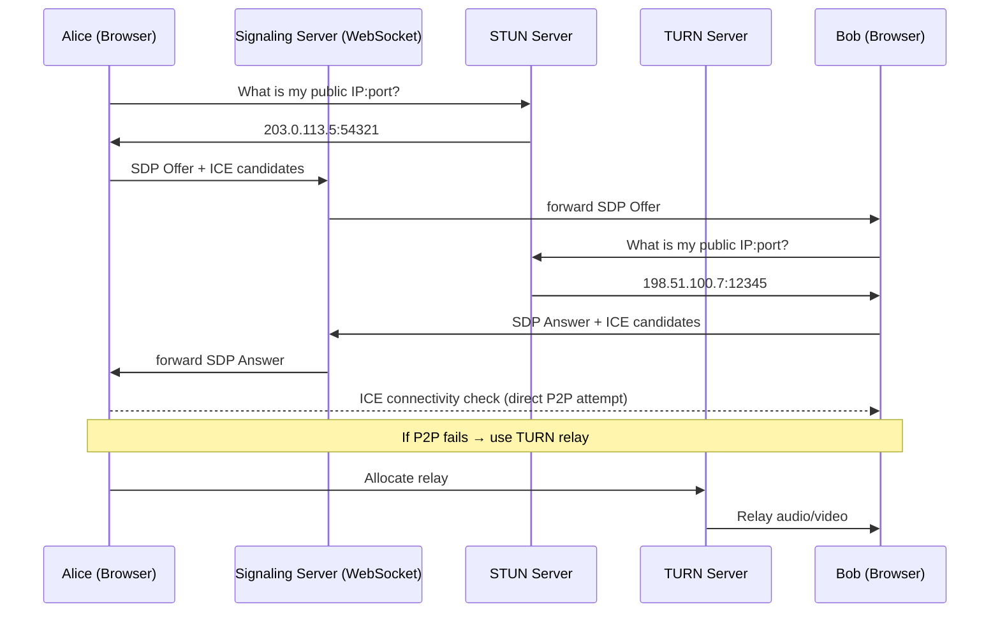
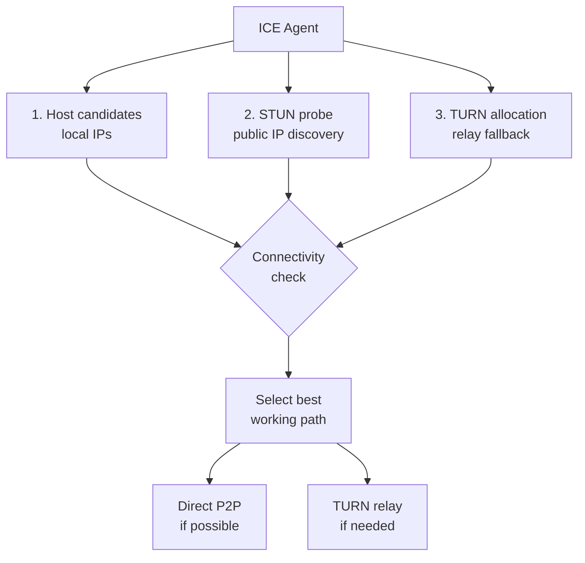
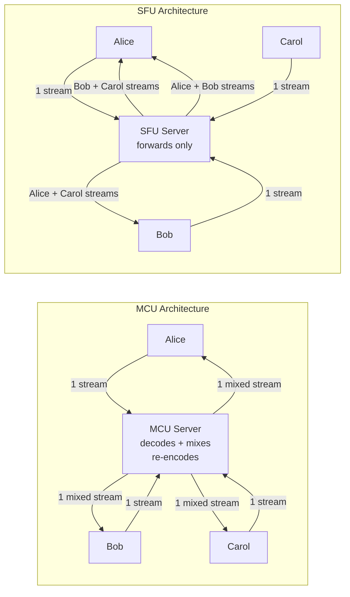
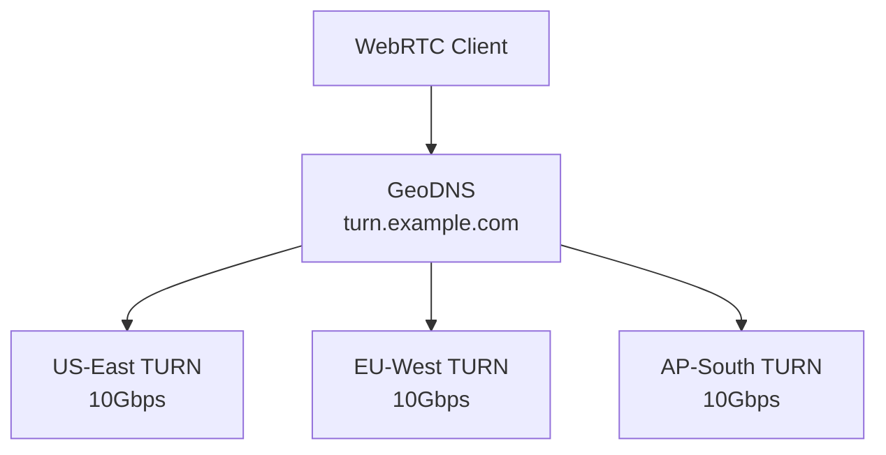

# WebRTC, STUN, and TURN: Real-Time Communication Architecture

## Level 1 — Surface (2-minute read)

### What It Is
WebRTC (Web Real-Time Communication) is a browser API and protocol stack for P2P audio/video/data without plugins. It handles: media capture, codec negotiation, NAT traversal, encryption (DTLS-SRTP mandatory), and adaptive bitrate.

### When You Need It
- Video/audio calls between browsers or apps (Zoom, Discord, Google Meet)
- Low-latency data channels (< 100ms vs WebSocket's ~200ms for real-time gaming)
- P2P file transfer (no server in the data path = lower cost)
- **NOT for**: server-to-client streaming (use HLS/DASH), chat (use WebSocket), unreliable browser support needed

### Core Concepts (5 bullets)
- **Signaling**: SDP offer/answer exchange tells peers about codecs, IPs, ports — WebRTC doesn't define how; you use WebSocket
- **ICE**: Interactive Connectivity Establishment — finds the best path through NATs using STUN (discover public IP) and TURN (relay fallback)
- **STUN**: Simple Traversal of UDP through NATs — server tells you your public IP:port (~15% of calls need TURN instead)
- **TURN**: relay server when P2P fails (symmetric NAT, corporate firewalls) — adds 50–200ms latency, costs bandwidth
- **SFU vs MCU**: for group calls, SFU (Selective Forwarding Unit) forwards streams without mixing; MCU mixes on server

### Architecture: P2P Call Setup



### Use This When / Don't Use When

| Use WebRTC | Don't Use WebRTC |
|-----------|-----------------|
| Browser-to-browser calls | Server → browser streaming (use HLS) |
| < 500ms latency required | Chat messages (WebSocket simpler) |
| P2P to avoid server costs | You need message ordering/reliability guarantees |
| Screen sharing | Broadcast to millions simultaneously |

---

## Level 2 — Deep Dive

### Component Deep Dive 1: ICE, STUN, and TURN — NAT Traversal

NAT traversal is why WebRTC is hard. Most users are behind NAT (home routers, corporate firewalls) which hides their real IP. ICE is the protocol that finds a working connection path.

**ICE candidate types (in priority order):**
1. **Host candidate**: local IP (works only on same LAN)
2. **Server Reflexive (srflx)**: public IP discovered via STUN (works for most home NATs)
3. **Relayed (relay)**: traffic routed through TURN server (always works, highest latency)

**The STUN exchange:**
A STUN server is a simple UDP server that receives your packet and replies with the public IP:port it saw. This works for "cone NATs" (full cone, restricted cone, port-restricted cone) — about 85% of NATs.

**Why STUN fails (symmetric NAT):**
Symmetric NATs assign a different external port for each destination. STUN tells you port 54321 was used to reach the STUN server, but a different port 54322 is used for the peer. ICE falls back to TURN relay.



**TURN server bandwidth cost:**
TURN relays ALL media through the server. For a 1Mbps video call between two TURN users: 1Mbps in + 1Mbps out = 2Mbps per call. At 10,000 concurrent TURN calls: 20Gbps of relay bandwidth. This is why you minimize TURN usage.

**TURN usage statistics:**
- ~15–20% of WebRTC calls need TURN (corporate firewalls, strict NATs)
- Zoom reported ~15% TURN usage pre-COVID; spiked to ~25% during corporate VPN surge
- Google STUN servers: stun.l.google.com:19302 (free, for development only)

| NAT Type | STUN Works | TURN Needed |
|----------|-----------|-------------|
| Full cone | Yes | No |
| Restricted cone | Yes | No |
| Port-restricted cone | Yes | No |
| Symmetric | No | Yes |
| Corporate firewall blocking UDP | No | Yes (TCP TURN) |

### Component Deep Dive 2: SFU vs MCU — Group Call Topology

For 2-person calls, P2P is optimal. For group calls (3+ participants), you need a server. Two approaches:

**MCU (Multipoint Control Unit):**
Each client sends 1 stream to the server. Server decodes all streams, composites them into a single video grid, re-encodes, sends to each client. Client receives 1 stream.
- Client bandwidth: O(1) — great for mobile
- Server CPU: very high (decode N streams, encode N streams) — expensive
- Latency: high (decode + composite + encode = extra 100–300ms)
- Used by: legacy video conferencing hardware, old enterprise systems

**SFU (Selective Forwarding Unit):**
Each client sends 1 stream to the SFU. SFU forwards individual streams to each client without decoding. Client receives N-1 streams.
- Client bandwidth: O(N) — increases with participants (issue at N > 10)
- Server CPU: low (just routing, no transcoding)
- Latency: low (no decode/re-encode)
- Used by: Zoom (2020+), Discord, Twilio, Daily.co, Jitsi



| Topology | Client Bandwidth | Server CPU | Latency | Best For |
|----------|-----------------|------------|---------|----------|
| P2P mesh | O(N²) | None | Lowest | 2-3 participants |
| SFU | O(N) | Low (routing only) | Low | 4-50 participants |
| MCU | O(1) | Very high (transcoding) | Higher | Mobile-first, bandwidth-constrained users |
| Cascaded SFU | O(N/k) | Low per node | Low | 50+ participants (cascade multiple SFUs) |

**Simulcast**: SFU clients send 3 quality tiers (high/medium/low). SFU sends each recipient the tier matching their bandwidth. This is why Zoom looks ok on poor connections.

### Component Deep Dive 3: Adaptive Bitrate and Congestion Control

WebRTC's congestion control prevents a bad connection from ruining a call. Two algorithms:

**REMB (Receiver Estimated Maximum Bitrate)**:
Receiver measures packet loss and inter-arrival jitter, estimates available bandwidth, sends RTCP REMB feedback. Sender reduces bitrate to the estimated max. Simple but slow to react (100–500ms feedback loop).

**TWCC (Transport-Wide Congestion Control)**:
Each packet gets a transport-wide sequence number. Receiver reports arrival timestamps for all packets. Sender runs a bandwidth estimation model (GCC — Google Congestion Control) with faster reaction (< 100ms). Standard in Chrome, Firefox, Safari since 2020.

**Adaptive resolution and framerate:**
Under bandwidth pressure, WebRTC first reduces framerate (30fps → 15fps → 7.5fps), then reduces resolution (720p → 360p → 180p), then increases quantization (quality). This prioritizes motion smoothness over resolution.

### Data Model

**Signaling server state (Redis):**
```
room:{room_id}:participants  → Set of peer_ids
room:{room_id}:sdp:{peer_id} → SDP offer/answer JSON (TTL: 30s)
room:{room_id}:ice:{peer_id} → List of ICE candidates (TTL: 30s)
```

**TURN server allocation table (in-memory):**
```
allocation_id  peer_ip        relay_ip       relay_port  expiry
abc123         203.0.113.5    10.0.1.5       49152       now+600s
```

**Call analytics (PostgreSQL):**
```sql
CREATE TABLE call_sessions (
  session_id UUID PRIMARY KEY,
  room_id TEXT NOT NULL,
  participant_count INT,
  used_turn BOOLEAN DEFAULT false,
  avg_rtt_ms FLOAT,
  peak_bitrate_kbps INT,
  codec TEXT,  -- 'opus' for audio, 'vp8'/'h264'/'vp9'/'av1' for video
  started_at TIMESTAMPTZ,
  ended_at TIMESTAMPTZ
);
```

### Scale Bottlenecks

| Traffic Level | Component That Breaks | Symptom | Mitigation |
|--------------|----------------------|---------|------------|
| 1,000 concurrent calls | Signaling server single instance | Dropped connections, slow offer/answer | Horizontal scale behind load balancer (WebSocket sticky sessions) |
| 10,000 concurrent TURN users | Single TURN server bandwidth (20Gbps) | Packet loss, latency spikes | TURN cluster with anycast routing |
| 100 participants in one call | SFU forwards 100 streams per subscriber | Client CPU/bandwidth exhaustion | Limit active cameras (25 max), simulcast with quality tiers |
| 1M signaling events/sec | In-memory signaling state | State loss on restart | Redis cluster for signaling state |

### How Discord Built This

Discord handles 2.5M+ concurrent voice users using WebRTC SFUs. Key architectural decisions:

**Regional SFU deployment**: Discord runs SFUs in 30+ regions. The client's bot/API connects to the nearest SFU (GeoDNS routing). Cross-region calls relay through a SFU cascade.

**Voice activity detection (VAD)**: Instead of forwarding all participants' audio streams, Discord sends only the top 5 loudest speakers' streams. This reduces client bandwidth by 80% in large voice channels (100+ users).

**Opus codec at 32kbps**: Discord chose Opus (open-source, royalty-free) at 32kbps for voice. At 2.5M concurrent users: 2.5M × 32kbps × 2 (in+out) = 160Gbps of voice bandwidth. They relay this through their SFU network, not P2P.

**No video in large channels**: Discord gates video (camera sharing) at 25 participants. Above that, only screen share (lower framerate, more compressible). This keeps the SFU CPU manageable.

Source: [Discord Engineering Blog — How Discord Handles Two and a Half Million Concurrent Voice Users](https://discord.com/blog/how-discord-handles-two-and-half-million-concurrent-voice-users-using-webrtc)

### Interview Angle

**What the interviewer is testing**: Understanding that WebRTC isn't just "peer-to-peer" — most production systems add an SFU, and NAT traversal (STUN/TURN) is a non-trivial infrastructure problem.

**Common mistakes candidates make:**
1. Designing a video call system using only WebSocket for media (WebSocket is for signaling, not media; WebRTC's SRTP/DTLS provides the media channel)
2. Forgetting TURN servers — P2P works for ~80% of users, but if you skip TURN, 20% of your users can't connect
3. Suggesting MCU for a 50-person call system — MCU requires transcoding (10x more CPU than SFU) and adds latency

**Key insight**: The signaling server (your WebSocket) never touches media. It only exchanges SDP and ICE candidates (~few KB total). The media flows P2P or via TURN. This separation means you can scale signaling and media independently.

### Key Numbers to Remember

| Metric | Value | Context |
|--------|-------|---------|
| STUN round-trip | < 100ms | Discovering public IP |
| TURN relay overhead | +50–200ms | vs P2P direct |
| Calls needing TURN | ~15–20% | Corporate firewalls, symmetric NAT |
| Opus voice bitrate | 6–510 kbps (32kbps common) | Discord uses 32kbps |
| VP9 video (720p 30fps) | 1–3 Mbps | WebRTC adaptive |
| SFU client bandwidth | O(N) | N = number of participants |
| MCU server CPU | O(N) transcoding | Per-stream decode+encode |
| Discord concurrent users | 2.5M | Handled by regional SFU fleet |
| Zoom TURN users | ~15% | Pre-COVID, spiked during lockdown |
| WebRTC ICE timeout | 5 seconds | Before falling back to TURN |

### How Zoom Rebuilt for Scale

Zoom originally used P2P for 2-person calls and MCU for groups. During COVID (March 2020), daily meeting participants surged from 10M to 300M in 3 months — a 30x spike in 90 days.

**The MCU bottleneck:** MCU requires transcoding — decoding every participant's stream and re-encoding a composite. At COVID scale, Zoom's MCU clusters saturated. CPU cost scales linearly with participants × meetings.

**Migration to SFU:** Zoom migrated group calls to SFU architecture starting 2020:
- **Simulcast**: each client sends 3 quality layers (360p/720p/1080p). SFU selects the appropriate tier per recipient based on bandwidth.
- **Active speaker switching**: SFU only forwards the current active speaker's high-quality stream. Background participants get low-quality thumbnails.
- **Regional data centers**: 23 regions. Calls route to nearest cluster, SFU-to-SFU relay for cross-region participants.

**E2EE + SFU tension:** E2EE and SFU conflict — SFU needs to read packet headers to route streams. Zoom solved this with per-client encryption keys: SFU routes encrypted packets without decrypting content. The meeting host manages key distribution.

Result: Zoom handled 300M daily participants without adding MCU capacity — the SFU migration happened under live load.

---

### Codec Selection Guide

| Codec | Type | Bitrate (720p) | CPU Cost | Browser Support | Best For |
|-------|------|----------------|----------|-----------------|----------|
| VP8 | Video | 1–3 Mbps | Low | Universal | Safe default everywhere |
| VP9 | Video | 0.7–1.5 Mbps | Medium | Chrome, Firefox | 40% better compression than VP8 |
| H.264 | Video | 1–2.5 Mbps | Low (HW accel) | Universal + HW on mobile | Battery-sensitive mobile clients |
| AV1 | Video | 0.5–1 Mbps | Very high (encode) | Chrome 90+, Firefox 93+ | Best compression, requires fast CPU |
| Opus | Audio | 6–510 kbps | Very low | Universal (mandatory) | **Always use Opus for audio** |

**Decision rule:** Mobile on battery → H.264 (hardware encoder on every phone). Desktop Chrome/Firefox → VP9. Cross-platform safe default → VP8. Lowest bandwidth when CPU allows → AV1.

**Opus for audio:** Always Opus. It adapts from 6kbps (barely intelligible) to 510kbps (studio quality). WebRTC mandates Opus in all browsers.

---

### Production TURN Server Deployment

**Capacity planning per TURN node:**
- 1Gbps NIC → ~500 concurrent 1Mbps video calls
- 10Gbps NIC → ~5,000 concurrent calls
- CPU: minimal (network-bound, not CPU-bound)

**Deployment pattern — regional TURN fleet:**



**Open-source options:** coturn (C, battle-tested at Twilio scale), Pion TURN (Go, cloud-native), mediasoup (full SFU+TURN, Node.js).

**Cost model:** 1,000 concurrent calls × 15% TURN × 2Mbps = 300Mbps relay bandwidth. At AWS pricing: ~$12/hour. Dedicated colo TURN node (10Gbps) ≈ $200/month handling 5k concurrent TURN calls — far cheaper at scale.

**Security:** Always use time-limited HMAC credentials (1-hour TTL). Permanent TURN credentials can be harvested and abused for free bandwidth relay.

---

### Common Anti-Patterns

1. **WebSocket for media:** TCP retransmission causes jitter. WebRTC uses SRTP over UDP. Never route video/audio through WebSocket.
2. **Single global TURN server:** A US-East TURN adds 200ms RTT for Asia users. Run TURN in every user-facing region.
3. **No ICE restart:** When user switches WiFi→4G, ICE restart re-negotiates without dropping the call. Not implementing this = dropped calls on network change.
4. **No TURN TCP fallback:** Some firewalls block UDP entirely. Configure TURN on TCP port 443 to bypass corporate firewalls.
5. **Ignoring simulcast:** Without simulcast, a participant on 2G gets the same 3Mbps stream as a participant on fiber — call quality degrades for everyone.

---

## References

| Resource | Type | What You'll Learn |
|----------|------|------------------|
| [WebRTC for the Curious](https://webrtcforthecurious.com/) | 📚 Docs | Deep dive into every WebRTC protocol layer |
| [Discord Voice Architecture](https://discord.com/blog/how-discord-handles-two-and-half-million-concurrent-voice-users-using-webrtc) | 📖 Blog | SFU at 2.5M concurrent users |
| [Zoom Architecture White Paper](https://zoom.us/docs/doc/Zoom-White-Paper.pdf) | 📚 Docs | How Zoom scaled from P2P to SFU |
| [Google TURN Protocol RFC 5766](https://tools.ietf.org/html/rfc5766) | 📚 Docs | TURN spec for relay |
| [High Performance Browser Networking — WebRTC](https://hpbn.co/webrtc/) | 📖 Blog | Ilya Grigorik's definitive WebRTC performance guide |
