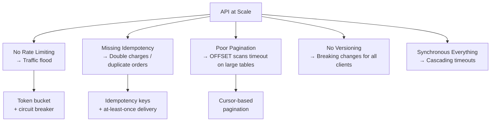

# API Design Failure Modes

Common API design mistakes that cause production incidents at scale.

```mermaid
graph TD
    API[API at Scale]
    API --> F1[No Rate Limiting\n→ Traffic flood]
    API --> F2[Missing Idempotency\n→ Double charges / duplicate orders]
    API --> F3[Poor Pagination\n→ OFFSET scans timeout on large tables]
    API --> F4[No Versioning\n→ Breaking changes for all clients]
    API --> F5[Synchronous Everything\n→ Cascading timeouts]
    F1 --> FIX1[Token bucket\n+ circuit breaker]
    F2 --> FIX2[Idempotency keys\n+ at-least-once delivery]
    F3 --> FIX3[Cursor-based\npagination]
```
