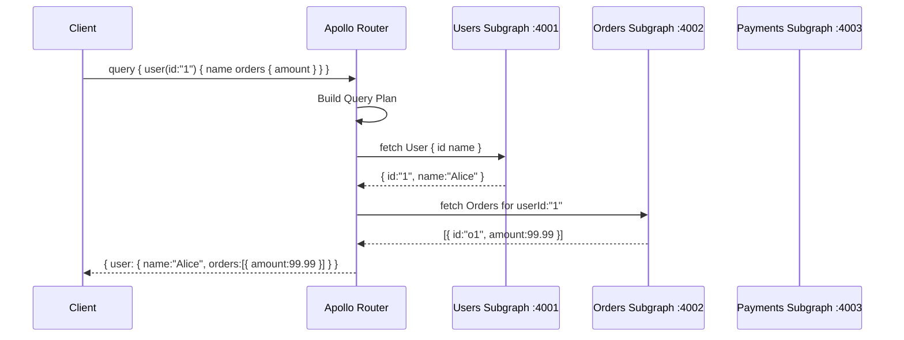

# POC: GraphQL Federation with Apollo Router

## 🗺️ Quick Overview



*Apollo Router splits one federated query into parallel sub-requests, joins the results, and returns a single response — the client never touches multiple services.*

## What You'll Build

A 3-service GraphQL Federation setup: a **Users subgraph** (owns `User` type), an **Orders subgraph** (extends `User` with `orders`), and a **Payments subgraph** added mid-demo with zero changes to existing services. Apollo Router composes them into one unified schema and executes query plans that join data across services in ~5ms overhead.

## Why This Matters

- **Netflix**: Migrated to GraphQL Federation to let 30+ teams own independent subgraphs without coordination — each team deploys their schema independently.
- **Walmart**: Uses federation to expose a unified product + inventory + pricing graph while keeping backend services decoupled across org boundaries.
- **Expedia**: Federation lets their flights, hotels, and packages teams each own their graph slice; the router assembles the traveler-facing unified API.

---

## Prerequisites

- Docker Desktop installed and running
- Node.js 18+ (for local subgraph development)
- `curl` or any GraphQL client (Insomnia, Postman, or Apollo Sandbox)
- 10-15 minutes

---

## Setup

### Project Structure

```
graphql-federation-poc/
├── docker-compose.yml
├── router/
│   └── router.yaml
├── users-service/
│   ├── package.json
│   └── index.js
├── orders-service/
│   ├── package.json
│   └── index.js
└── payments-service/
    ├── package.json
    └── index.js
```

### docker-compose.yml

```yaml
version: '3.8'

services:
  users-service:
    build: ./users-service
    ports:
      - "4001:4001"
    environment:
      - PORT=4001

  orders-service:
    build: ./orders-service
    ports:
      - "4002:4002"
    environment:
      - PORT=4002

  router:
    image: ghcr.io/apollographql/router:v1.45.0
    ports:
      - "4000:4000"
    volumes:
      - ./router/router.yaml:/dist/config/router.yaml
    command: >
      --config /dist/config/router.yaml
      --supergraph http://users-service:4001/graphql,http://orders-service:4002/graphql
    depends_on:
      - users-service
      - orders-service
```

### router/router.yaml

```yaml
supergraph:
  introspection: true

sandbox:
  enabled: true

homepage:
  enabled: false

cors:
  origins:
    - "*"

telemetry:
  exporters:
    logging:
      common:
        enabled: true
```

### users-service/package.json

```json
{
  "name": "users-service",
  "version": "1.0.0",
  "type": "module",
  "scripts": { "start": "node index.js" },
  "dependencies": {
    "@apollo/subgraph": "^2.7.0",
    "apollo-server": "^3.13.0",
    "graphql": "^16.8.1"
  }
}
```

### users-service/index.js

```javascript
import { ApolloServer } from 'apollo-server';
import { buildSubgraphSchema } from '@apollo/subgraph';
import { gql } from 'graphql-tag';

// In-memory user store — replace with DB in production
const users = [
  { id: '1', name: 'Alice Chen',  email: 'alice@example.com' },
  { id: '2', name: 'Bob Tanaka',  email: 'bob@example.com'   },
  { id: '3', name: 'Carol Smith', email: 'carol@example.com' },
];

// @key(fields: "id") tells the router: "this type is owned here,
// keyed by id — other subgraphs may extend it using that key"
const typeDefs = gql`
  extend schema
    @link(url: "https://specs.apollo.dev/federation/v2.0",
          import: ["@key"])

  type User @key(fields: "id") {
    id:    ID!
    name:  String!
    email: String!
  }

  type Query {
    user(id: ID!): User
    users: [User!]!
  }
`;

const resolvers = {
  Query: {
    user:  (_, { id }) => users.find(u => u.id === id),
    users: ()         => users,
  },
  User: {
    // __resolveReference is called when another subgraph asks:
    // "give me the User fields for this key { id }"
    __resolveReference(ref) {
      return users.find(u => u.id === ref.id);
    },
  },
};

const server = new ApolloServer({
  schema: buildSubgraphSchema({ typeDefs, resolvers }),
});

server.listen({ port: process.env.PORT || 4001 }).then(({ url }) => {
  console.log(`Users subgraph ready at ${url}`);
});
```

### orders-service/package.json

```json
{
  "name": "orders-service",
  "version": "1.0.0",
  "type": "module",
  "scripts": { "start": "node index.js" },
  "dependencies": {
    "@apollo/subgraph": "^2.7.0",
    "apollo-server": "^3.13.0",
    "graphql": "^16.8.1"
  }
}
```

### orders-service/index.js

```javascript
import { ApolloServer } from 'apollo-server';
import { buildSubgraphSchema } from '@apollo/subgraph';
import { gql } from 'graphql-tag';

const orders = [
  { id: 'o1', userId: '1', amount: 99.99,  status: 'delivered' },
  { id: 'o2', userId: '1', amount: 249.00, status: 'shipped'   },
  { id: 'o3', userId: '2', amount: 19.99,  status: 'pending'   },
  { id: 'o4', userId: '3', amount: 499.00, status: 'delivered' },
];

const typeDefs = gql`
  extend schema
    @link(url: "https://specs.apollo.dev/federation/v2.0",
          import: ["@key", "@external"])

  type Order {
    id:     ID!
    userId: ID!
    amount: Float!
    status: String!
  }

  # Extend the User type from the users-service.
  # @key(fields: "id") must match EXACTLY what users-service declared.
  # @external marks id as coming from the other subgraph, not stored here.
  type User @key(fields: "id") {
    id:     ID! @external
    orders: [Order!]!
  }

  type Query {
    order(id: ID!): Order
    ordersByUser(userId: ID!): [Order!]!
  }
`;

const resolvers = {
  Query: {
    order:        (_, { id })     => orders.find(o => o.id === id),
    ordersByUser: (_, { userId }) => orders.filter(o => o.userId === userId),
  },
  User: {
    // When the router asks "resolve User.orders for id=1",
    // it passes { id: '1' } as the reference object.
    orders(user) {
      return orders.filter(o => o.userId === user.id);
    },
    __resolveReference(ref) {
      // We don't own User fields — just return the ref so
      // Apollo can attach our orders field to it.
      return { id: ref.id };
    },
  },
};

const server = new ApolloServer({
  schema: buildSubgraphSchema({ typeDefs, resolvers }),
});

server.listen({ port: process.env.PORT || 4002 }).then(({ url }) => {
  console.log(`Orders subgraph ready at ${url}`);
});
```

### Dockerfile (same for all services)

Create `users-service/Dockerfile`, `orders-service/Dockerfile`:

```dockerfile
FROM node:18-alpine
WORKDIR /app
COPY package.json .
RUN npm install
COPY index.js .
CMD ["node", "index.js"]
```

### Start the stack

```bash
docker-compose up -d
# Expected output:
# [+] Running 3/3
#  ✔ Container users-service    Started   0.4s
#  ✔ Container orders-service   Started   0.5s
#  ✔ Container router           Started   1.1s
```

---

## Step-by-Step

### Step 1: Verify Each Subgraph Is Running

```bash
# Check users subgraph schema
curl -s http://localhost:4001/graphql \
  -H 'Content-Type: application/json' \
  -d '{"query":"{ users { id name email } }"}' | jq .

# Expected:
# {
#   "data": {
#     "users": [
#       { "id": "1", "name": "Alice Chen",  "email": "alice@example.com" },
#       { "id": "2", "name": "Bob Tanaka",  "email": "bob@example.com"   },
#       { "id": "3", "name": "Carol Smith", "email": "carol@example.com" }
#     ]
#   }
# }

# Check orders subgraph
curl -s http://localhost:4002/graphql \
  -H 'Content-Type: application/json' \
  -d '{"query":"{ ordersByUser(userId: \"1\") { id amount status } }"}' | jq .

# Expected:
# {
#   "data": {
#     "ordersByUser": [
#       { "id": "o1", "amount": 99.99,  "status": "delivered" },
#       { "id": "o2", "amount": 249.00, "status": "shipped"   }
#     ]
#   }
# }
```

### Step 2: Run a Federated Query Through the Router

This is the key moment — one query that spans two services:

```bash
curl -s http://localhost:4000/graphql \
  -H 'Content-Type: application/json' \
  -d '{
    "query": "{ user(id: \"1\") { name email orders { id amount status } } }"
  }' | jq .

# Expected — router joined User fields from :4001 with orders from :4002:
# {
#   "data": {
#     "user": {
#       "name":  "Alice Chen",
#       "email": "alice@example.com",
#       "orders": [
#         { "id": "o1", "amount": 99.99,  "status": "delivered" },
#         { "id": "o2", "amount": 249.00, "status": "shipped"   }
#       ]
#     }
#   }
# }
```

### Step 3: Inspect the Query Plan

Apollo Router exposes query plans via the `x-query-plan` header. This reveals exactly how the router split your query:

```bash
curl -s http://localhost:4000/graphql \
  -H 'Content-Type: application/json' \
  -H 'Apollo-Query-Plan-Experimental: true' \
  -d '{"query":"{ user(id: \"1\") { name orders { amount } } }"}' \
  -D - 2>&1 | grep -A 30 'query-plan'

# You will see a plan like:
# QueryPlan {
#   Sequence {
#     Fetch(service: "users-service") {
#       { user(id: "1") { name __typename id } }
#     },
#     Flatten(path: "user") {
#       Fetch(service: "orders-service") {
#         { ... on User { __typename id } } =>
#         { ... on User { orders { amount } } }
#       }
#     }
#   }
# }
```

The plan shows: first fetch `name` from users-service, then use the returned `id` to fetch `orders` from orders-service. The `=>` arrow is the "entity representation" hand-off.

### Step 4: Compare to REST — Same Join, More Work

The equivalent REST approach requires 2 round trips plus client-side assembly:

```bash
# REST equivalent — step 1: get user
USER=$(curl -s http://localhost:4001/rest/users/1)   # hypothetical REST endpoint
echo $USER
# { "id": "1", "name": "Alice Chen", "email": "alice@example.com" }

# REST equivalent — step 2: get orders using user id from step 1
ORDERS=$(curl -s http://localhost:4002/rest/orders?userId=1)
echo $ORDERS
# [{ "id":"o1", "amount":99.99 }, { "id":"o2", "amount":249.00 }]

# REST equivalent — step 3: client merges the two responses
# ... manual JSON assembly in your frontend or BFF layer

# Federation equivalent — 1 request, router does the join:
curl -s http://localhost:4000/graphql \
  -H 'Content-Type: application/json' \
  -d '{"query":"{ user(id: \"1\") { name orders { amount } } }"}' | jq .
```

**Difference**: With REST, your client (or BFF) makes 2 HTTP calls and writes join logic. With Federation, the router makes 2 internal calls in sequence and returns one merged response — the complexity moves from client to infrastructure.

### Step 5: Add a Third Subgraph With Zero Changes to Existing Services

Create `payments-service/index.js`:

```javascript
import { ApolloServer } from 'apollo-server';
import { buildSubgraphSchema } from '@apollo/subgraph';
import { gql } from 'graphql-tag';

const payments = [
  { id: 'p1', orderId: 'o1', method: 'card',   last4: '4242', refundable: true  },
  { id: 'p2', orderId: 'o2', method: 'paypal',  last4: null,   refundable: false },
  { id: 'p3', orderId: 'o3', method: 'card',    last4: '1234', refundable: true  },
];

const typeDefs = gql`
  extend schema
    @link(url: "https://specs.apollo.dev/federation/v2.0",
          import: ["@key", "@external"])

  type Payment {
    id:         ID!
    orderId:    ID!
    method:     String!
    last4:      String
    refundable: Boolean!
  }

  # Extend Order from orders-service — same @key pattern
  type Order @key(fields: "id") {
    id:      ID! @external
    payment: Payment
  }

  type Query {
    payment(orderId: ID!): Payment
  }
`;

const resolvers = {
  Query: {
    payment: (_, { orderId }) => payments.find(p => p.orderId === orderId),
  },
  Order: {
    payment(order) {
      return payments.find(p => p.orderId === order.id) ?? null;
    },
    __resolveReference(ref) {
      return { id: ref.id };
    },
  },
};

const server = new ApolloServer({
  schema: buildSubgraphSchema({ typeDefs, resolvers }),
});

server.listen({ port: process.env.PORT || 4003 }).then(({ url }) => {
  console.log(`Payments subgraph ready at ${url}`);
});
```

Update `docker-compose.yml` — add payments-service and update router command:

```yaml
  payments-service:
    build: ./payments-service
    ports:
      - "4003:4003"
    environment:
      - PORT=4003

  router:
    # ... same as before but add payments-service to supergraph list
    command: >
      --config /dist/config/router.yaml
      --supergraph http://users-service:4001/graphql,http://orders-service:4002/graphql,http://payments-service:4003/graphql
```

```bash
# Restart with the new service — existing services are NOT restarted
docker-compose up -d payments-service
docker-compose restart router

# Now query all three layers in one request:
curl -s http://localhost:4000/graphql \
  -H 'Content-Type: application/json' \
  -d '{
    "query": "{ user(id: \"1\") { name orders { id amount payment { method refundable } } } }"
  }' | jq .

# Expected — all 3 subgraphs joined:
# {
#   "data": {
#     "user": {
#       "name": "Alice Chen",
#       "orders": [
#         {
#           "id": "o1",
#           "amount": 99.99,
#           "payment": { "method": "card", "refundable": true }
#         },
#         {
#           "id": "o2",
#           "amount": 249.00,
#           "payment": { "method": "paypal", "refundable": false }
#         }
#       ]
#     }
#   }
# }
```

No changes were made to users-service or orders-service. The router automatically picked up the new subgraph.

---

## What to Observe

### Router Query Plan Depth

Open Apollo Sandbox at `http://localhost:4000` and run the 3-subgraph query. Toggle "Query Plan" in the response panel. You should see a 3-step plan: Fetch users → Flatten → Fetch orders → Flatten → Fetch payments.

### Latency Breakdown

```bash
# Measure end-to-end latency with timing
time curl -s http://localhost:4000/graphql \
  -H 'Content-Type: application/json' \
  -d '{"query":"{ user(id: \"1\") { name orders { amount payment { method } } } }"}' \
  > /dev/null

# Expected: ~20-40ms total for 3 sequential subgraph calls in this local setup
# Production Apollo Router adds ~5ms overhead on top of subgraph latency
```

### Router Logs — Subgraph Calls Visible

```bash
docker-compose logs router --follow

# Watch for lines like:
# [INFO] Executing fetch to subgraph "users-service"
# [INFO] Executing fetch to subgraph "orders-service"
# [INFO] Executing fetch to subgraph "payments-service"
# [INFO] Query plan executed in 18ms
```

---

## What Breaks It

### Break 1: @key Field Mismatch

Change `orders-service/index.js` — use `userId` as the key instead of `id`:

```javascript
// orders-service/index.js — intentionally wrong key
type User @key(fields: "userId") {   // <-- WRONG: users-service uses "id"
  userId: ID! @external
  orders: [Order!]!
}
```

Restart orders-service. The router will fail to compose the schema:

```bash
docker-compose restart orders-service router

curl -s http://localhost:4000/graphql \
  -H 'Content-Type: application/json' \
  -d '{"query":"{ user(id: \"1\") { orders { amount } } }"}' | jq .

# Error:
# {
#   "errors": [{
#     "message": "Cannot satisfy @key(fields: \"userId\") on User in orders-service:
#                 the declaring subgraph uses @key(fields: \"id\")",
#     "extensions": { "code": "INVALID_FEDERATION_SUPERGRAPH" }
#   }]
# }
```

**Fix**: Both subgraphs must declare `@key(fields: "id")` — the key field name and type must be identical. Revert to `id` and restart.

### Break 2: Missing __resolveReference

Comment out `__resolveReference` in orders-service:

```javascript
User: {
  orders(user) {
    return orders.filter(o => o.userId === user.id);
  },
  // __resolveReference removed — federation entity lookup will fail
},
```

```bash
docker-compose restart orders-service

curl -s http://localhost:4000/graphql \
  -H 'Content-Type: application/json' \
  -d '{"query":"{ user(id: \"1\") { name orders { amount } } }"}' | jq .

# Error: orders field returns null or throws "Cannot return null for non-nullable field"
# The router sent the entity representation { __typename: "User", id: "1" }
# but orders-service had no resolver to handle it
```

**Fix**: Every subgraph that extends a type with `@key` must implement `__resolveReference` to accept and return entity representations from the router.

---

## Extend It

1. **Add authentication via router plugin**: Configure the Apollo Router to validate a JWT and inject `x-user-id` header into all subgraph requests — subgraphs trust the header without re-verifying the token.

2. **Enable @defer**: Add `@defer` to the payments field so the router streams the base response (user + orders) immediately and sends payments as a follow-up chunk — ideal for non-critical data.

3. **Schema registry with Rover CLI**: Replace the `--supergraph` inline flag with Apollo GraphOS or a self-hosted schema registry. Run `rover subgraph publish` on deploy so the router picks up schema changes without restart.

4. **Add distributed tracing**: Set `telemetry.exporters.tracing.otlp` in `router.yaml` to forward traces to Jaeger. Each subgraph call becomes a span — you can see exactly where latency comes from.

5. **Simulate N+1 with lists**: Query `users { orders { payment { method } } }` — this is a classic N+1: the router must fetch payments for each order individually. Add DataLoader to orders-service to batch the calls.

---

## Key Takeaways

- **Apollo Router adds ~5ms overhead per federated query** — negligible compared to subgraph execution time, but it means federation is not free; measure before using for sub-millisecond latency paths.
- **@key field names must match exactly across subgraphs** — `id` in one and `userId` in another causes a compose-time error, not a runtime error; catch it in CI with `rover subgraph check`.
- **Adding a subgraph requires zero changes to existing subgraphs** — the payments-service extended `Order` without touching orders-service or users-service; this is the core organizational benefit Netflix and Walmart cite.
- **One federated query replaces 2-3 REST round trips** — the client sends one request; the router makes N sequential or parallel internal fetches; client-side join logic disappears entirely.
- **__resolveReference is the federation handshake** — every subgraph that extends a foreign type must implement it; omitting it silently returns null fields in production.

---

## References

- 📚 [Apollo Federation v2 docs](https://www.apollographql.com/docs/federation/) — official spec, @key, @external, query planning
- 📖 [Netflix: How We Scaled to 30 Teams with GraphQL Federation](https://netflixtechblog.com/how-netflix-scales-its-api-with-graphql-federation-part-1-ae3557c187e2) — production learnings, schema governance, and CI integration
- 📖 [Apollo Router Query Planning Explained](https://www.apollographql.com/blog/apollo-router-query-planning) — how the query planner builds execution plans, parallel vs sequential fetches
- 📺 [GraphQL Summit: Federation at Walmart](https://www.youtube.com/watch?v=YFxalXlK3hk) — real-world migration story, 50+ teams, schema ownership model
- 📚 [Rover CLI — Schema Registry](https://www.apollographql.com/docs/rover/) — CI/CD integration for subgraph schema checks and publishing
