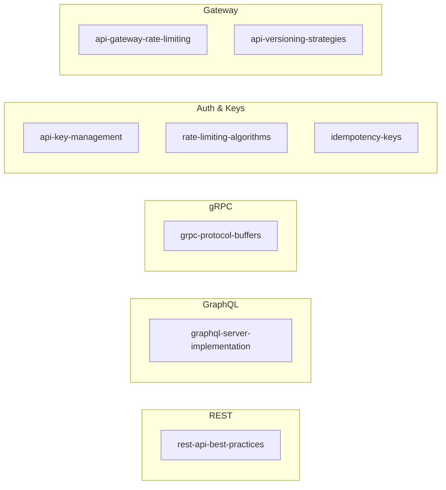

# API Design Hands-On

Build REST APIs, GraphQL servers, and gRPC services with working code.

```mermaid
graph LR
    subgraph "REST"
        RP[rest-api-best-practices]
    end
    subgraph "GraphQL"
        GS[graphql-server-implementation]
    end
    subgraph "gRPC"
        GP[grpc-protocol-buffers]
    end
    subgraph "Auth & Keys"
        AK[api-key-management]
        RL[rate-limiting-algorithms]
        IK[idempotency-keys]
    end
    subgraph "Gateway"
        AG[api-gateway-rate-limiting]
        VS[api-versioning-strategies]
    end
```
