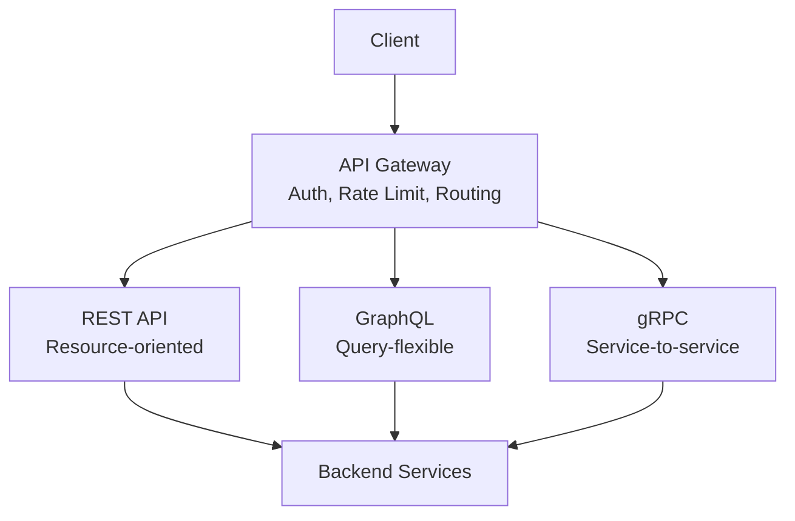

# API Design

Good API design is what separates systems that scale gracefully from systems that become liabilities. This section covers REST, GraphQL, gRPC, idempotency, pagination, versioning, and more.

## What You'll Learn

- **Concepts**: REST vs GraphQL vs gRPC, idempotency, pagination, API gateways
- **Hands-On**: Build real API implementations with working code
- **Failures**: Common API design mistakes at scale

## Where to Start

1. [REST vs GraphQL vs gRPC](/07-api-design/concepts/rest-graphql-grpc) — When to use each protocol
2. [Idempotency](/07-api-design/concepts/idempotency) — Safe retries in distributed systems
3. [Pagination Strategies](/07-api-design/concepts/pagination-strategies) — Cursor vs offset vs keyset
4. [REST API Best Practices](/07-api-design/hands-on/rest-api-best-practices) — Production-grade REST

## Topic Map

| Topic | Concepts | Hands-On | Problems at Scale | Interview Prep |
|-------|----------|----------|-------------------|----------------|
| Protocol selection | [rest-graphql-grpc](/07-api-design/concepts/rest-graphql-grpc) | [rest-api-best-practices](/07-api-design/hands-on/rest-api-best-practices), [graphql-server-implementation](/07-api-design/hands-on/graphql-server-implementation), [grpc-protocol-buffers](/07-api-design/hands-on/grpc-protocol-buffers) | — | [api-design-rest-graphql-grpc](/12-interview-prep/system-design/fundamentals/api-design-rest-graphql-grpc) |
| Rate limiting | [rate-limiting](/07-api-design/concepts/rate-limiting) | [rate-limiting-algorithms](/07-api-design/hands-on/rate-limiting-algorithms), [api-gateway-rate-limiting](/07-api-design/hands-on/api-gateway-rate-limiting) | — | [rate-limiting](/12-interview-prep/system-design/fundamentals/rate-limiting) |
| Idempotency | [idempotency](/07-api-design/concepts/idempotency) | [idempotency-keys](/07-api-design/hands-on/idempotency-keys) | — | — |
| API gateway | [api-gateway-deep-dive](/07-api-design/concepts/api-gateway-deep-dive) | [api-gateway-rate-limiting](/07-api-design/hands-on/api-gateway-rate-limiting), [api-key-management](/07-api-design/hands-on/api-key-management) | — | [api-gateway-pattern](/12-interview-prep/system-design/fundamentals/api-gateway-pattern) |
| Versioning | [api-versioning-strategies](/07-api-design/concepts/api-versioning-strategies) | [api-versioning-strategies](/07-api-design/hands-on/api-versioning-strategies) | — | — |
