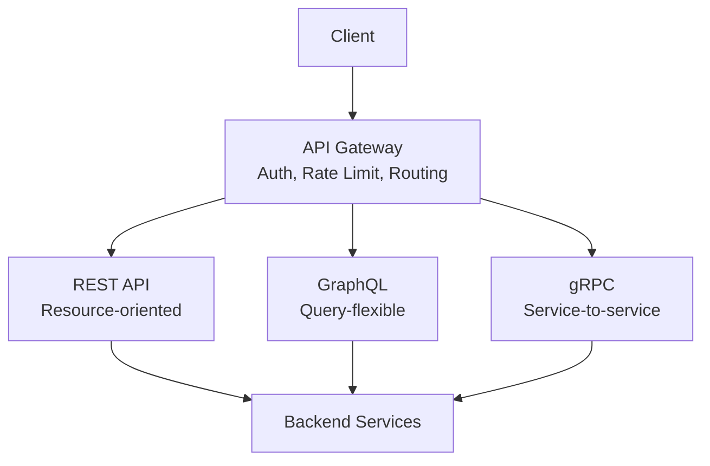

# API Design

Good API design is what separates systems that scale gracefully from systems that become liabilities. This section covers REST, GraphQL, gRPC, idempotency, pagination, versioning, and more.

## Navigate by Role

| I am... | Start here | Goal |
|---------|-----------|------|
| 🟢 Junior | [rest-graphql-grpc](./concepts/rest-graphql-grpc) | Understand API paradigm trade-offs |
| 🟡 Mid-level | [idempotency](./concepts/idempotency) + [api-versioning-strategies](./concepts/api-versioning-strategies) | Build reliable, evolvable APIs |
| 🔴 Senior / TL | [api-gateway-deep-dive](./concepts/api-gateway-deep-dive) + [failures](./failures) | API design at scale: gateways, failures, security |
| 🏆 Interview prepping | [fundamentals questions](../../12-interview-prep/system-design/fundamentals) | API design interview patterns |

## What You'll Learn

- **Concepts**: REST vs GraphQL vs gRPC, idempotency, pagination, API gateways
- **Hands-On**: Build real API implementations with working code
- **Failures**: Common API design mistakes at scale

## Where to Start

1. [REST vs GraphQL vs gRPC](/07-api-design/concepts/rest-graphql-grpc) — When to use each protocol
2. [Idempotency](/07-api-design/concepts/idempotency) — Safe retries in distributed systems
3. [Pagination Strategies](/07-api-design/concepts/pagination-strategies) — Cursor vs offset vs keyset
4. [REST API Best Practices](/07-api-design/hands-on/rest-api-best-practices) — Production-grade REST

## Topic Map

| Topic | 📖 Concept | 🔬 Hands-On | ⚠️ Failures | 🎯 Interview |
|-------|-----------|------------|------------|-------------|
| Protocol selection | [rest-graphql-grpc](./concepts/rest-graphql-grpc) | [rest-api-best-practices](./hands-on/rest-api-best-practices), [graphql-server-implementation](./hands-on/graphql-server-implementation), [grpc-protocol-buffers](./hands-on/grpc-protocol-buffers) | — | [api-design-rest-graphql-grpc](../../12-interview-prep/system-design/fundamentals/api-design-rest-graphql-grpc) |
| Rate limiting | [rate-limiting](./concepts/rate-limiting) | [api-gateway-rate-limiting](./hands-on/api-gateway-rate-limiting) | — | [rate-limiting](../../12-interview-prep/system-design/fundamentals/rate-limiting) |
| Idempotency | [idempotency](./concepts/idempotency) | [idempotency-keys](./hands-on/idempotency-keys) | — | — |
| API gateway | [api-gateway-deep-dive](./concepts/api-gateway-deep-dive) | [api-gateway-rate-limiting](./hands-on/api-gateway-rate-limiting), [api-key-management](./hands-on/api-key-management) | — | [api-gateway-pattern](../../12-interview-prep/system-design/fundamentals/api-gateway-pattern) |
| Versioning | [api-versioning-strategies](./concepts/api-versioning-strategies) | [api-versioning-strategies](./hands-on/api-versioning-strategies) | — | — |
| Pagination | [pagination-strategies](./concepts/pagination-strategies) | — | — | — |
| Webhooks | [webhook-design](./concepts/webhook-design) | — | — | — |
| Realtime APIs | [realtime-api-patterns](./concepts/realtime-api-patterns) | — | — | — |
| gRPC patterns | [grpc-design-patterns](./concepts/grpc-design-patterns) | [grpc-protocol-buffers](./hands-on/grpc-protocol-buffers) | — | — |
| GraphQL at scale | [graphql-production-patterns](./concepts/graphql-production-patterns) | [graphql-server-implementation](./hands-on/graphql-server-implementation) | — | — |
| API key management | — | [api-key-management](./hands-on/api-key-management) | — | — |
