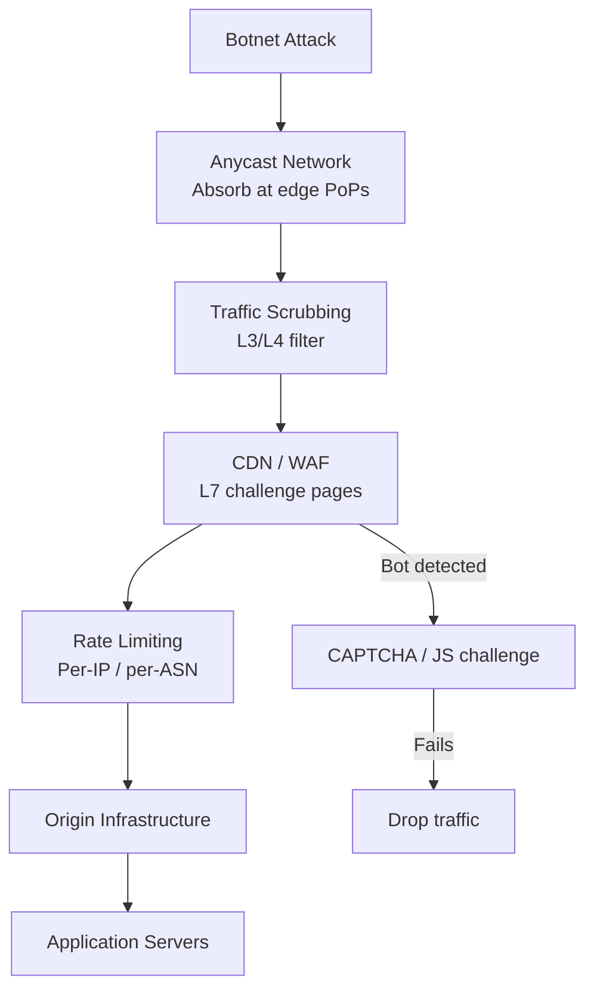
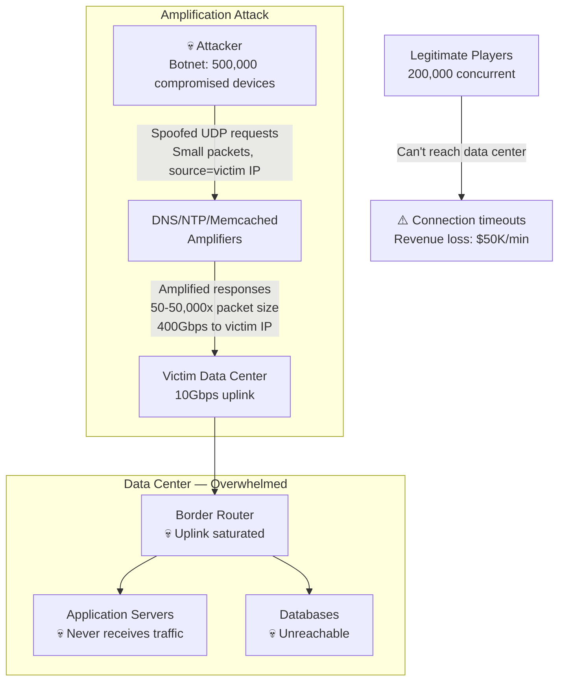
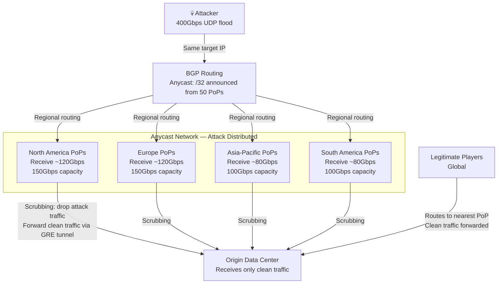
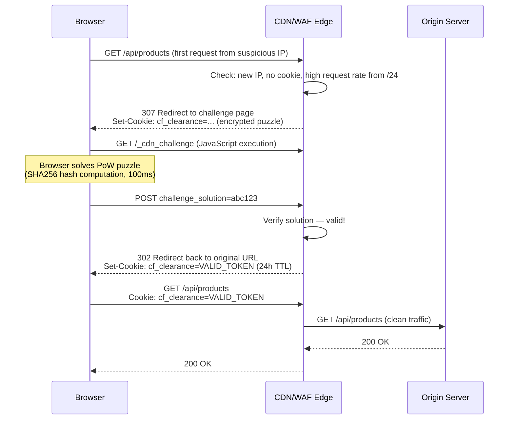
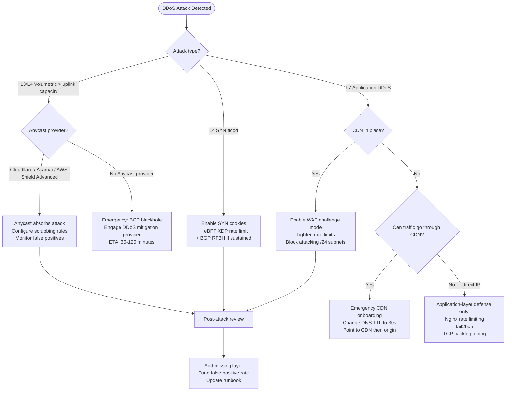

# DDoS Protection: Anycast, Rate Limiting, WAF, and Traffic Absorption

## 🗺️ Quick Overview



*Multi-layer DDoS defence absorbs volumetric traffic at edge Anycast PoPs, scrubs L3/L4 floods, and uses WAF challenges to filter L7 application-layer attacks before they reach the origin.*

**A 300Gbps volumetric DDoS will saturate your data center's uplink before your application can respond to a single request.** Modern DDoS protection is not about building walls — it's about absorbing attacks at the edge, near the source, before malicious traffic reaches your infrastructure.

---

## The Problem Class `[Mid]`

A gaming company's matchmaking API gets hit by a 400Gbps UDP amplification attack targeting their IP space. Their single data center has 10Gbps uplinks. Within seconds, legitimate player traffic is drowned out by 40× the link capacity. The entire data center loses connectivity — not just the game servers, but payment processing, user accounts, and their monitoring stack.



Three distinct DDoS attack types require different mitigations:
1. **Volumetric (L3/L4)**: Exhaust bandwidth. Requires Anycast + scrubbing center absorption.
2. **Protocol (L4)**: Exhaust connection state. SYN floods, ACK floods. Requires SYN cookies + stateless packet processing.
3. **Application (L7)**: Exhaust server resources with valid-looking requests. Requires WAF + behavioral analysis.

---

## Why the Obvious Solution Fails `[Senior]`

**"Just block malicious IPs at the firewall"**: At 400Gbps, traffic hits your uplink before reaching your firewall. Blocking at the firewall doesn't help when the attack saturates your ISP's link to you.

**"Scale up horizontally"**: Application DDoS (L7) can be defeated with more servers. Volumetric attacks cannot — you can't buy enough servers faster than an attacker can add botnet capacity. You need upstream absorption.

**"Use a CDN"**: CDNs protect web traffic well. They don't help with game UDP traffic, VoIP, or non-HTTP APIs. CDNs also have finite capacity — the largest CDNs (Cloudflare, Akamai) have 100+ Tbps capacity; most CDNs do not.

**"BGP blackhole (RTBH)"**: BGP blackholing stops attacks by dropping all traffic to the victim IP — which also drops legitimate traffic. It's a DDoS mitigation that completes the attacker's goal (taking you offline). Useful only as a last resort to protect other systems.

---

## The Solution Landscape `[Senior]`

### Solution 1: Anycast Absorption for Volumetric Attacks (L3/L4)

**What it is**

Anycast announces the same IP address from multiple geographic locations. BGP routing directs traffic to the nearest announcer. A 400Gbps attack is distributed across 50 PoPs, each receiving ~8Gbps — well within link capacity for scrubbing.

**How it actually works at depth**



**Sizing guidance** `[Staff+]`

- Scrubbing center capacity: Size for 2× your expected peak attack. Largest attacks in 2025-2026: 1-3Tbps. Cloudflare handles 200+ Tbps network capacity. For self-hosted anycast: each PoP needs 100Gbps+ connectivity for serious protection.
- GRE tunnel overhead: ~28 bytes per packet. At 64-byte minimum packets (worst case), GRE adds ~44% overhead. Size tunnel capacity accordingly.
- BGP convergence time: When a new attack shifts origin, BGP reconverges in ~30-60 seconds. During convergence, some traffic may be misrouted. Use BFD (Bidirectional Forwarding Detection) to accelerate convergence to <1 second.
- RTBH as last resort: If a specific /32 is under sustained attack you can't scrub, announce a BGP blackhole community (`no-export` + `blackhole` communities) to upstream ISPs to drop the traffic before it reaches your network. Takes ~2 minutes to propagate via BGP.

**Configuration decisions that matter** `[Staff+]`

- **Anycast vs Unicast for specific protocols**: Anycast works for stateless protocols (UDP, HTTP). For stateful protocols requiring session persistence (TCP game connections), use a unicast IP with DDoS protection upstream.
- **GRE vs MPLS forwarding**: GRE tunnels add ~1ms latency. MPLS with segment routing can reduce this to ~0.2ms. For latency-sensitive applications (real-time games), MPLS is worth the complexity.
- **Scrubbing heuristics**: Start with threshold-based scrubbing (>100Mbps UDP from single /24 = drop). Evolve to ML-based traffic profiling (Cloudflare's "Gatebot" system analyzes traffic patterns in real-time using Rust-written eBPF programs at the edge).

**Failure modes** `[Staff+]`

- **Anycast routing asymmetry**: Traffic enters from PoP A but return traffic exits via PoP B. Stateful firewall rules break. Use stateless ACLs for DDoS filtering at Anycast PoPs.
- **Scrubbing center false positives**: Aggressive scrubbing drops legitimate traffic. Tune false positive rate for your traffic profile. Start conservative (flag, don't drop), measure false positives, then enforce.
- **GRE tunnel as attack vector**: GRE tunnels can carry attack traffic if an attacker controls a host inside your network. Authenticate GRE tunnels using GRE key field or IPsec encapsulation.

---

### Solution 2: SYN Cookies for Protocol-Layer Protection (L4)

**What it is**

A SYN flood exhausts your server's connection state table by sending millions of SYN packets without completing the 3-way handshake. SYN cookies defer allocating connection state until the handshake completes, using a cryptographic encoding in the SYN-ACK's sequence number.

**How it actually works at depth**

Normal TCP: server allocates state on receiving SYN, waiting for ACK. Under attack: state table fills, legitimate connections are rejected.

With SYN cookies:
1. Server receives SYN from client IP:port.
2. Instead of allocating state, server encodes `(timestamp, MSS, hash(server_IP, server_port, client_IP, client_port, secret))` into the ISN (Initial Sequence Number) of the SYN-ACK.
3. If the client is legitimate, it sends ACK with ISN+1. Server verifies the cookie and allocates connection state only now.
4. Spoofed SYNs never send an ACK — no state allocated.

**Sizing guidance** `[Staff+]`

- SYN cookie computation: ~0.5μs per SYN packet. At 10Mpps (10 million packets/second) flood: ~5% single-core CPU overhead. Negligible for modern multi-core servers.
- Linux SYN cookie activation: Automatic when SYN backlog fills (`/proc/sys/net/ipv4/tcp_syncookies=2` enables unconditionally). Set `net.ipv4.tcp_max_syn_backlog=65536` and `net.core.somaxconn=65536`.
- eBPF-based SYN flood mitigation: In 2026, eBPF XDP (eXpress Data Path) programs process SYN floods at the NIC level before the kernel network stack. Throughput: 25-100Mpps on commodity hardware. Implemented by Cloudflare's `Gatebot` and Facebook's XDP-based DDoS mitigation.

**Failure modes** `[Staff+]`

- **SYN cookies disable TCP options**: SACK (Selective ACK), Window Scaling, and Timestamps cannot be negotiated via SYN cookies (no state to store options). This reduces throughput for connections made during SYN cookie mode. Accept this trade-off — degraded performance during attack is better than no connectivity.
- **Distributed SYN flood defeats per-IP rate limiting**: A botnet with 1M IPs sends 1 SYN per IP. Per-IP limits don't help. Use SYN cookies + rate limiting by destination port + global SYN rate limiting.

---

### Solution 3: WAF and Challenge Pages for Application-Layer DDoS (L7)

**What it is**

Application-layer DDoS sends valid-looking HTTP requests that require server processing (database queries, complex computations). Volumetric scrubbing can't filter these because they're legitimate requests from compromised browsers. WAF + challenge pages add computational cost to prove humanity without blocking legitimate users.

**How it actually works at depth**



**Sizing guidance** `[Staff+]`

- Challenge page capacity: Served from edge CDN, no origin involvement. A 100Gbps WAF edge can serve 10 million challenge pages/second without touching your origin.
- False positive rate tuning: Challenge pages are shown based on risk score (IP reputation + request rate + behavior). At challenge threshold 50/100: ~0.1% false positives (legitimate users challenged). At 20/100: ~2% false positives but more effective against sophisticated bots. Tune based on your user tolerance for friction.
- WAF rule update latency: Cloudflare propagates new WAF rules globally in ~30 seconds. For self-managed WAF (ModSecurity, AWS WAF): rule updates require deployment — build a fast-path for DDoS-specific rules.
- L7 DDoS signatures: Common patterns — identical User-Agent, high-rate from /24 subnet, specific URL pattern hammering, bypassing cache (adding cache-busting query params). These are fingerprint-able by WAF rules.

**Configuration decisions that matter** `[Staff+]`

- **Under Attack Mode**: Cloudflare's "I'm Under Attack" mode shows JS challenge to ALL visitors — effective against bots but adds 5-second delay for all users. Use only during active attacks; disable immediately after.
- **IP reputation vs behavioral analysis**: IP reputation lists lag behind attacks (new botnet IPs aren't listed). Behavioral analysis (rate per /24, request patterns) catches attacks faster. Combine both.
- **Rate limiting at CDN vs origin**: Set CDN rate limits to shed load before it reaches origin. Set conservative origin rate limits as backup. CDN rate limits: 1000 req/min per IP for API endpoints, 100 req/min for login endpoints.

**Failure modes** `[Staff+]`

- **WAF false positives during high-traffic events**: A product launch spike can look like DDoS to behavioral rate limiting. Pre-configure "scheduled high traffic" windows that relax rate limits. Alert humans when automatic WAF changes are triggered.
- **Headless browser bypass**: Sophisticated attackers use headless Chrome to solve JS challenges. Next-generation bot detection uses behavioral biometrics (mouse movement, typing patterns, scroll behavior). Canvas fingerprinting, TLS fingerprinting (JA3 hashes). In 2026: ML models trained on billions of requests achieve >99.9% bot detection accuracy.
- **API endpoints without browser**: For non-browser API clients (mobile apps, B2B API consumers), JS challenges don't work. Use mutual TLS + API keys + rate limiting by client ID for these endpoints.

---

## Trade-off Matrix `[Senior]` → `[Staff+]`

| Dimension | BGP Blackhole | Anycast Scrubbing | SYN Cookies | WAF + Challenge | CDN-based DDoS |
|---|---|---|---|---|---|
| Attack type | All (nuclear option) | L3/L4 volumetric | L4 SYN flood | L7 application | L7 + some L4 |
| Impact on legitimate users | Total outage | Minimal (<1% FP) | Negligible | 0.1-2% FP rate | Negligible |
| Capacity ceiling | No limit (drops all) | Scrubbing center cap | Server NIC rate | WAF capacity | CDN edge capacity |
| Time to activate | 2-5 minutes (BGP) | Instant (always on) | Kernel-automatic | Configurable trigger | CDN policy |
| Cost | Network: free | Expensive ($50K+/mo) | Free (OS kernel) | $500-50K/month | $500-100K/month |
| False positive control | Binary (on/off) | Threshold-based | None needed | Tunable | Tunable |
| 2026 tooling | Still valid | Cloudflare Magic Transit | Linux eBPF XDP | Cloudflare WAF | Cloudflare, Akamai, Fastly |

---

## Decision Framework `[Senior]` → `[Staff+]`



---

## Production Failure Story `[Staff+]`

**The WAF False Positive That Blocked 30% of Legitimate Traffic**

An e-commerce company enabled their WAF vendor's "Enhanced DDoS Protection" mode during what appeared to be an application-layer attack. The WAF's behavioral analysis flagged any IP making more than 50 requests/minute as malicious.

What the team didn't account for: their mobile app made API calls on behalf of multiple users per IP when users were behind carrier-grade NAT (CGN). A single mobile carrier's egress IP appeared to be making 500 requests/minute — 10 users × 50 requests each. The WAF blocked the carrier's IP, instantly blocking all users on that carrier — roughly 30% of their user base.

Revenue impact: $800K in 45 minutes before the team identified the pattern and whitelisted the carrier IP ranges.

**Root cause**: Rate limiting by client IP doesn't account for CGN. Large carrier IPs can represent thousands of users behind a single IP.

**Fix**:
1. Rate limiting by `X-Forwarded-For` when trusted (App Store clients send their real IP in headers).
2. Separate rate limit tiers: authenticated users get 10× the limit of unauthenticated.
3. WAF rules tested against production traffic replay before enabling in enforcement mode.
4. Carrier IP ranges pre-identified and placed in an elevated trust tier.

---

## Observability Playbook `[Staff+]`

```
# Attack detection and volume
network_inbound_bps{interface, direction}  # Alert: >70% of uplink capacity
network_packet_rate_pps{protocol="tcp|udp|icmp"}  # Alert: >1Mpps
syn_cookie_activations_total  # Linux counter — indicates SYN flood
tcp_syn_backlog_overflows_total  # Connections dropped due to full backlog

# WAF and CDN metrics
waf_requests_blocked_total{rule_id, action}
waf_challenge_success_rate  # Low rate = sophisticated bots defeating challenges
cdn_edge_bandwidth_gbps{pop_location}  # Per-PoP attack absorption
cdn_origin_traffic_vs_edge_traffic  # Large delta = effective CDN absorption

# False positive monitoring
waf_blocked_legitimate_requests_total  # Requires sampling + manual verification
waf_challenge_abandonment_rate  # High = excessive challenge friction

# Business impact correlation
application_request_rate  # Should be flat or growing during attack if mitigation working
application_error_rate_5xx  # Should not spike if attack is absorbed at edge
checkout_conversion_rate  # Leading indicator of false positive impact

# 2026: AI-assisted anomaly detection
attack_traffic_entropy_score  # Low entropy = obvious botnet, high entropy = sophisticated
botnet_c2_ip_detection_score  # ML model on traffic patterns
```

---

## Architectural Evolution `[Staff+]`

**Stage 1 (Startup)**: CDN in front of all web traffic (Cloudflare free tier). Enables basic WAF + L7 DDoS protection. Linux SYN cookies enabled by default. Total cost: $0. Handles most opportunistic attacks.

**Stage 2 (Growth)**: Cloudflare Pro/Business + WAF rules tuned for your app. Cloudflare Rate Limiting on API endpoints. AWS Shield Standard (free, automatic L3/L4 protection on AWS resources). Total cost: $200-2,000/month.

**Stage 3 (Scale)**: AWS Shield Advanced OR Cloudflare Magic Transit. Dedicated response team from DDoS provider. BGP-level protection with scrubbing. DDoS runbook tested quarterly. Total cost: $3,000-50,000/month.

**Stage 4 (Enterprise)**: Multi-CDN with automatic failover. Custom eBPF-based DDoS mitigation at your own edge. BGP anycast for non-HTTP traffic. Dedicated security team with 24/7 NOC. Contracted DDoS response SLA. Total cost: $50,000+/month.

---

## Decision Framework Checklist `[All Levels]`

- [ ] Is all web traffic behind a CDN? (First and cheapest layer of DDoS protection)
- [ ] Are Linux SYN cookies enabled on all servers? (`sysctl net.ipv4.tcp_syncookies`)
- [ ] Do we have WAF rules for our top 10 most-targeted endpoints?
- [ ] Is our rate limiting IP-aware of CGN? (Per-authenticated-user limits, not just per-IP)
- [ ] Do we have a DDoS runbook? (What to do in first 5, 30, 60 minutes of an attack)
- [ ] Have we tested "Under Attack Mode" before needing it? (Understand false positive rate)
- [ ] Do we monitor inbound bandwidth as % of uplink capacity?
- [ ] Is our monitoring stack on a different IP/provider than our main service?
- [ ] Do we have BGP blackhole as a break-glass option? (Even if it takes us offline)
- [ ] Are carrier NAT IP ranges identified and given elevated rate limit tiers?
- [ ] Is our DDoS provider contract reviewed annually? (Capacity, response time SLAs)

*Written by Gaurav Porwal — 10+ Year Engineer | Tech Lead | Product Owner | Business-Minded Builder*
*Last updated: 2026-03-18*
