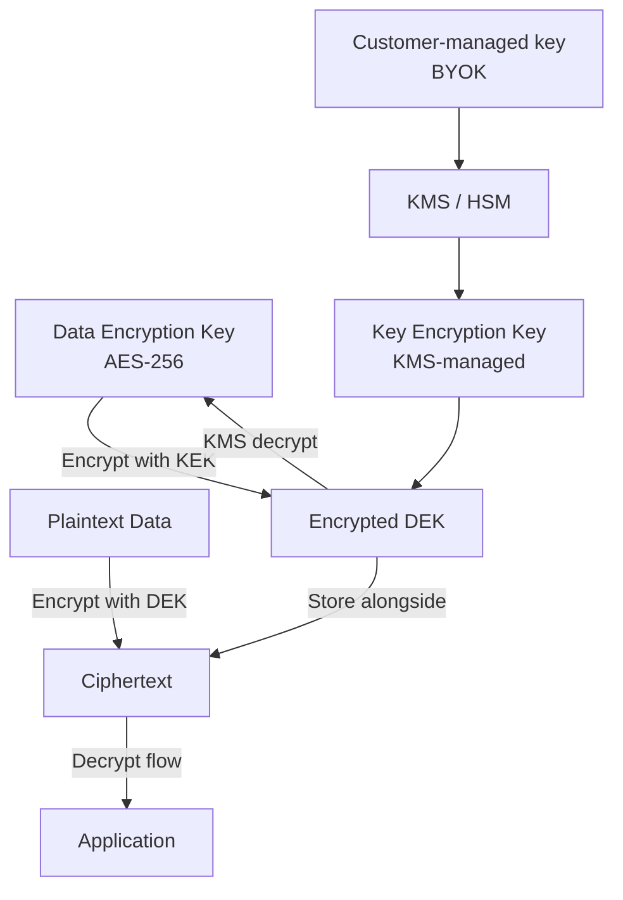
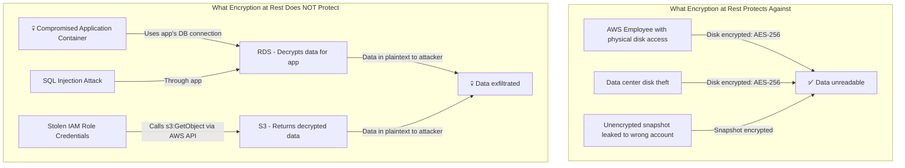
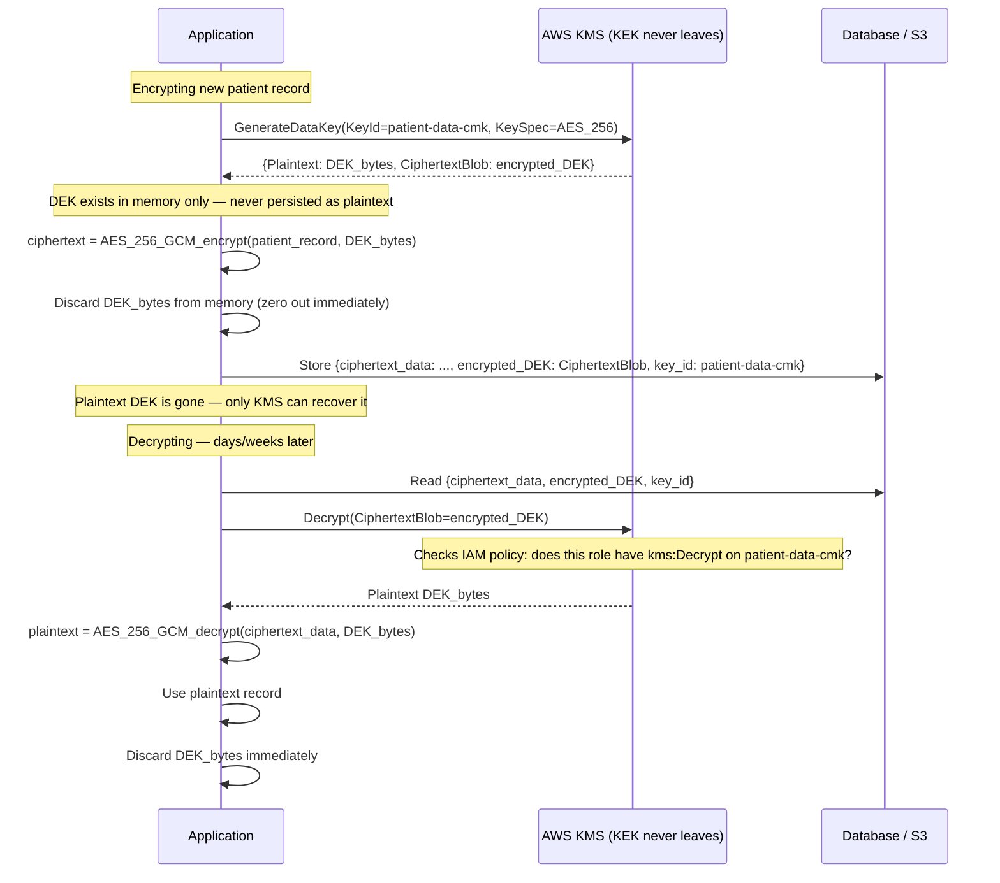
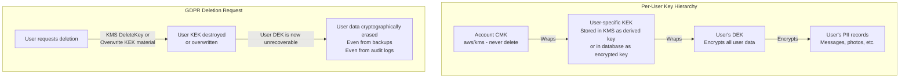
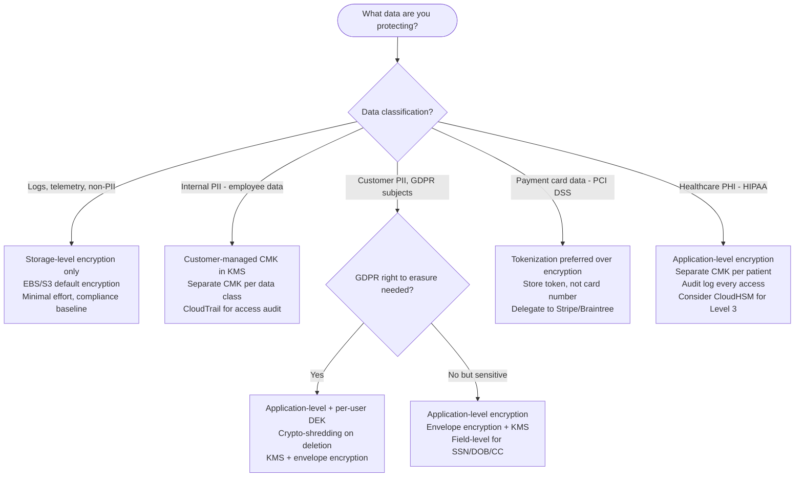

# Encryption at Rest: Key Management, Envelope Encryption, and BYOK

## 🗺️ Quick Overview



*Envelope encryption wraps a per-record DEK with a KMS-managed KEK; only the encrypted DEK is stored, so rotating or revoking the KEK protects all data at once.*

**Your S3 bucket is encrypted at rest with AES-256. Your database volume is encrypted. Your backup snapshots are encrypted.** And none of it matters if your application's IAM role has `s3:GetObject *` and an attacker compromises a container. Encryption at rest protects you against a very specific threat — someone stealing the physical disk — not against the attacks you'll actually face.

---

## The Problem Class `[Mid]`

A healthcare company stores patient records in an encrypted RDS instance (AWS-managed encryption, `aws/rds` KMS key). An attacker compromises a Node.js application via a dependency vulnerability, establishes a reverse shell inside the application container, and runs SQL queries directly through the application's database connection. The RDS encryption doesn't help — the data is decrypted by RDS before the application sees it, and the attacker is using the application's own credentials.



> 💡 **What this means in practice:** Encryption at rest is like having a safe in your house. It protects against a burglar who steals the safe but can't crack it. It doesn't protect against someone who finds the combination — which is what happens when your application is compromised.

The real protection comes from encryption at the application layer, where keys are controlled separately from the application, and field-level encryption where even a compromised application can only see the specific data it needs.

---

## Why the Obvious Solution Fails `[Senior]`

**"Enable RDS encryption / EBS encryption — done"**: Storage-level encryption (provider-managed) protects against physical media theft. It provides zero protection against application compromise, stolen credentials, or privilege escalation within your cloud account.

**"Use one KMS key for everything"**: A single compromised KMS key (via an overly permissive IAM policy) exposes all data. Separate keys by data classification (PII, financial, audit logs). An attacker who compromises the payment service IAM role should not be able to decrypt user authentication tokens.

**"Rotate keys to improve security"**: Key rotation is important for compliance (PCI-DSS requires it annually). But rotation doesn't automatically re-encrypt existing data. With envelope encryption, rotating the KEK (Key Encryption Key) in KMS is transparent — existing DEKs are re-wrapped, data doesn't need re-encryption. This is why envelope encryption is the standard pattern.

**"BYOK means we control our keys"**: BYOK (Bring Your Own Key) lets you import your own key material into AWS KMS. You retain a copy of the key material. But KMS still controls access to the key — an attacker with KMS permissions can still call `Decrypt`. BYOK solves compliance requirements (key material generated in customer-controlled HSM), not operational security.

---

## The Solution Landscape `[Senior]`

### Solution 1: Envelope Encryption with KMS

**What it is**

Envelope encryption uses a two-level key hierarchy. The Key Encryption Key (KEK) lives in KMS and never leaves it. Data Encryption Keys (DEKs) are generated per-object, encrypt the data, then are themselves encrypted by the KEK. The encrypted DEK is stored alongside the encrypted data.

**How it actually works at depth**



The key insight: the DEK never leaves the application in plaintext and is never stored unencrypted. An attacker who steals the database gets only ciphertext data + encrypted DEKs. Without KMS access, it's computationally unbreakable.

**Pseudocode — Application-level envelope encryption:**

```python
import boto3
import os
from cryptography.hazmat.primitives.ciphers.aead import AESGCM

kms = boto3.client('kms', region_name='us-east-1')

class EnvelopeEncryption:
    def __init__(self, key_id: str):
        self.key_id = key_id  # ARN or alias of your CMK
        # DEK cache: avoid KMS call on every encrypt for same data class
        # Cache TTL: 5 minutes. Balance latency vs security.
        self._dek_cache = {}

    def encrypt(self, plaintext: bytes, context: dict) -> dict:
        """
        context = {'data_class': 'patient_pii', 'user_id': '123'}
        Encryption context is authenticated but not secret —
        it prevents using this DEK to decrypt different data class
        """
        # Generate fresh DEK for each record (or use cached for batch)
        response = kms.generate_data_key(
            KeyId=self.key_id,
            KeySpec='AES_256',
            EncryptionContext=context  # Must match on decrypt
        )

        plaintext_dek = response['Plaintext']    # In memory only
        encrypted_dek = response['CiphertextBlob']  # Store this

        # AES-256-GCM: authenticated encryption with associated data
        nonce = os.urandom(12)  # 96-bit nonce, unique per encryption
        aesgcm = AESGCM(plaintext_dek)
        ciphertext = aesgcm.encrypt(nonce, plaintext, None)

        # CRITICAL: zero out the DEK before function returns
        plaintext_dek = b'\x00' * len(plaintext_dek)

        return {
            'ciphertext': ciphertext,
            'nonce': nonce,
            'encrypted_dek': encrypted_dek,
            'encryption_context': context,
            'key_id': self.key_id,
            'algorithm': 'AES-256-GCM'
        }

    def decrypt(self, encrypted_record: dict) -> bytes:
        response = kms.decrypt(
            CiphertextBlob=encrypted_record['encrypted_dek'],
            EncryptionContext=encrypted_record['encryption_context']
            # If encryption_context doesn't match, KMS rejects the call
            # This prevents using a patient_pii DEK to decrypt audit_log data
        )

        plaintext_dek = response['Plaintext']
        aesgcm = AESGCM(plaintext_dek)
        plaintext = aesgcm.decrypt(
            encrypted_record['nonce'],
            encrypted_record['ciphertext'],
            None
        )

        # Zero out DEK
        plaintext_dek = b'\x00' * len(plaintext_dek)
        return plaintext

# Usage
enc = EnvelopeEncryption(key_id='alias/patient-data')
record = b'{"ssn": "123-45-6789", "dob": "1985-03-15"}'
encrypted = enc.encrypt(record, context={'data_class': 'patient_pii'})
# encrypted['encrypted_dek'] stored in DB alongside encrypted['ciphertext']

decrypted = enc.decrypt(encrypted)
# decrypted == original record
```

**Sizing guidance** `[Staff+]`

- KMS `GenerateDataKey` latency: ~5-10ms. Cache DEKs for batch operations (encrypt 1,000 records with one DEK, then discard). Cache TTL: 5 minutes for low-sensitivity data, no cache for PII/payment data.
- KMS request limits: 10,000 req/s per key (symmetric) in us-east-1. At 1,000 RPS with no DEK caching: 2,000 KMS calls/s (encrypt + decrypt). If you're approaching limits, use DEK caching.
- DEK size in storage: 300-400 bytes (encrypted DEK blob). Per-record overhead: ~400 bytes + 12-byte nonce + metadata. For a database of 100M records: ~50GB overhead for encryption metadata. Acceptable.
- Encryption context overhead: ~100 bytes per encryption operation. Negligible.

**Configuration decisions that matter** `[Staff+]`

- **One CMK per data classification**: Separate CMKs for PII, payment card data, audit logs, application secrets. An IAM policy granting `kms:Decrypt` on `payment-cmk` should not also grant access to `pii-cmk`.
- **DEK per record vs per batch**: Per-record DEKs are safest (compromised record doesn't expose others). Per-batch DEKs reduce KMS call volume. For GDPR "right to be forgotten": per-user DEK allows deleting one user's data by destroying their DEK (crypto-shredding).
- **Encryption context**: Always use encryption context for additional authentication. The context is logged in CloudTrail — creates an audit trail of what was encrypted/decrypted with what context.
- **AWS KMS vs self-managed HSM**: AWS KMS is FIPS 140-2 Level 2 (Level 3 available with CloudHSM). For PCI-DSS Level 1 or government compliance requiring Level 3: use CloudHSM. Cost: CloudHSM is ~$1.50/hr ($1,080/month per HSM) vs KMS at $1/CMK/month.

**Failure modes** `[Staff+]`

- **KMS unavailability**: If KMS is unreachable, applications can't decrypt data. Cache plaintext DEKs in memory (with careful TTL management) to ride out brief KMS outages. For critical operations: fail open (use cached DEK) vs fail closed (reject request). Choose based on data sensitivity.
- **Encryption context mismatch**: A bug changes the encryption context between encrypt and decrypt calls. KMS rejects the decrypt. Data becomes unrecoverable unless you stored the original context. Always store the exact encryption context dict with the encrypted record.
- **CMK deletion**: AWS KMS has a minimum 7-day waiting period before CMK deletion. During this period, decrypt calls return errors. This is intentional — it prevents accidental permanent data loss. You have 7 days to cancel the deletion.

---

### Solution 2: Crypto-Shredding for GDPR Right to Erasure

**What it is**

Instead of deleting data (expensive in distributed systems — you need to find and delete every copy, every backup, every log entry), you delete the encryption key. Data encrypted with a deleted key is permanently unreadable — cryptographically erased without touching the actual data.

**How it actually works at depth**



> 💡 **What this means in practice:** Imagine you gave someone a locked box with a unique key. When you want to "delete" the contents, you destroy the key. The box is still there — it's in your backups, your data lake, your audit logs — but nobody can ever open it again. That's crypto-shredding.

**Pseudocode — Per-user key and crypto-shredding:**

```python
# User key management for GDPR compliance
class UserDataEncryption:

    def get_or_create_user_key(self, user_id: str) -> str:
        """Each user gets their own CMK alias in KMS"""
        alias = f"alias/user-{user_id}-key"

        try:
            kms.describe_key(KeyId=alias)
            return alias  # Key exists
        except kms.exceptions.NotFoundException:
            # Create new CMK for this user
            key = kms.create_key(
                Description=f"User data key for {user_id}",
                KeyUsage='ENCRYPT_DECRYPT',
                KeySpec='SYMMETRIC_DEFAULT',
                Tags=[
                    {'TagKey': 'user_id', 'TagValue': user_id},
                    {'TagKey': 'data_class', 'TagValue': 'user_pii'},
                    {'TagKey': 'gdpr_subject', 'TagValue': 'true'}
                ]
            )
            kms.create_alias(AliasName=alias, TargetKeyId=key['KeyMetadata']['KeyId'])
            return alias

    def gdpr_delete_user(self, user_id: str):
        """
        GDPR right to erasure — cryptographic shredding
        Data becomes permanently unreadable without touching backups
        """
        alias = f"alias/user-{user_id}-key"
        try:
            # Get the key ID behind the alias
            key_info = kms.describe_key(KeyId=alias)
            key_id = key_info['KeyMetadata']['KeyId']

            # Schedule key deletion — minimum 7 days waiting period
            # During waiting period: all decrypt calls fail immediately
            # This effectively deletes all user data from the user's perspective
            kms.schedule_key_deletion(
                KeyId=key_id,
                PendingWindowInDays=7  # Minimum allowed by AWS
            )
            kms.delete_alias(AliasName=alias)

            # Log the deletion event for GDPR audit
            print(f"Scheduled crypto-shredding for user {user_id}, key_id={key_id}")
            # Note: actual data rows still exist in DB but are permanently unreadable
            # This satisfies GDPR Art. 17 — data is "erased" if it cannot be read

        except kms.exceptions.NotFoundException:
            # User never had data encrypted — nothing to delete
            pass
```

**Sizing guidance** `[Staff+]`

- CMK cost: $1/key/month. At 1M users each with their own CMK: $1M/month — too expensive. Use a shared CMK per user segment (by registration month, by geography) or store user-specific DEKs encrypted by a shared CMK.
- Alternative: store a user-specific DEK in a `user_encryption_keys` table, encrypted by a shared CMK. To erase: delete the row from `user_encryption_keys`. No KMS CMK per user needed.
- Crypto-shredding propagation: data in backups, read replicas, and CDN caches is immediately unreadable once the DEK is deleted — no need to coordinate deletion across systems.

---

## Trade-off Matrix `[Senior]` → `[Staff+]`

| Dimension | Storage-Level (EBS/RDS) | Provider-Managed KMS | Customer-Managed CMK | Application-Level Encryption |
|---|---|---|---|---|
| Protects against | Physical disk theft | Physical theft + some insider | Insider + cross-account | Application compromise |
| Transparency | Completely transparent | Transparent | Transparent | Requires code changes |
| Key control | None | Shared with provider | You control rotation/policy | Full control |
| Performance impact | 0ms | 0ms (storage handles it) | 5-10ms per KMS call | 5-10ms + CPU for AES |
| GDPR crypto-shredding | No | No | No (data re-encrypted if you rotate) | Yes (delete DEK) |
| Compliance value | Baseline | PCI-DSS, HIPAA checkbox | SOC2, ISO27001 | Highest — field-level |
| Complexity | None | None | Low | High |

---

## Decision Framework `[Senior]` → `[Staff+]`



---

## Production Failure Story `[Staff+]`

**The Key Rotation That Broke Decryption for 2 Million Records**

A company rotated their RDS master key in KMS as part of a quarterly security review. They ran `aws kms rotate-key-on-demand` on their application-level CMK. Key rotation in KMS is transparent for most operations — KMS automatically uses the new key version for new encryptions and can still decrypt data encrypted with old key versions.

However, this company had implemented their own envelope encryption with DEK caching. The cached DEKs in their application memory were encrypted with the old key version. After rotation, when the cache expired and they called KMS `Decrypt` on the old encrypted DEKs, some calls started failing — not all, inconsistently.

Investigation revealed: their KMS client library had a bug where it didn't pass the key version in decrypt requests for cached DEKs, and an edge case in the KMS regional replication caused the new key version to be replicated before the old key version was properly retired in one region. Specific records were encrypted with a DEK wrapped by a key version that only existed in us-east-1, and requests routed to eu-west-1 couldn't decrypt them.

**Root cause**: Multi-region key replication lag + DEK cache + client library bug. A chain of three independent issues that individually were benign.

**Fix**:
1. DEK cache now stores the key version alongside the encrypted DEK.
2. Decrypt calls always specify the key version explicitly.
3. Key rotation tested in staging with full application traffic replay before production.
4. Monitoring added: `DecryptionErrors` metric alerted at any non-zero value.

---

## Observability Playbook `[Staff+]`

```
# KMS access metrics
aws_kms_request_count{key_id, operation="GenerateDataKey|Decrypt|ReEncrypt"}
aws_kms_throttled_requests{key_id}  # Alert if >0 for 5+ minutes
aws_kms_invalid_key_usage{key_id}  # Wrong operation for key type — configuration error

# CloudTrail KMS events (forward to SIEM)
# kms:Decrypt from unexpected IAM role/source IP = exfiltration signal
# kms:DeleteKey scheduled = alert for human review
# kms:DisableKey = immediate alert

# Application-level encryption health
encryption_operation_errors_total{operation, error_type}
decryption_cache_hit_rate  # Target: >90% for batch operations
dek_age_seconds  # Alert if DEK is older than cache TTL

# GDPR compliance
pending_key_deletions_total  # Open GDPR requests
crypto_shred_completion_latency_days  # GDPR: must complete within 30 days

# 2026: ML anomaly detection on KMS access patterns
kms_decrypt_volume_anomaly_score  # Spike in decryption = bulk exfiltration?
kms_access_from_new_principal  # First-time access from this IAM role
```

---

## Architectural Evolution `[Staff+]`

**Stage 1**: AWS-managed encryption everywhere (EBS, RDS, S3 SSE). Zero code changes, compliance baseline. Handles physical media threat model.

**Stage 2**: Customer-managed CMKs per data classification. Separate CMK policies per team. CloudTrail on KMS events → SIEM. Handles insider threat from AWS.

**Stage 3**: Application-level envelope encryption for PII. Per-user DEK support for GDPR. Crypto-shredding capability. Handles application compromise.

**Stage 4**: Field-level encryption in production database. Tokenization for payment data. CloudHSM for FIPS Level 3 compliance. HSM-backed root CA. Hardware security for key material.

---

## Decision Framework Checklist `[All Levels]`

- [ ] Is all storage (EBS, RDS, S3, backups) encrypted at rest? (Baseline compliance)
- [ ] Are we using customer-managed CMKs, not provider-managed `aws/rds` keys?
- [ ] Do we have separate CMKs per data classification? (PII, financial, audit)
- [ ] Are KMS API calls logged in CloudTrail and forwarded to SIEM?
- [ ] Do we alert on KMS `Decrypt` calls from unexpected sources?
- [ ] For GDPR subjects: do we support crypto-shredding via DEK deletion?
- [ ] Is encryption context used on all KMS operations? (Prevents key misuse)
- [ ] Do we test key rotation in staging before production?
- [ ] Are CMK key policies reviewed quarterly? (Not just IAM policies)
- [ ] Do we cache DEKs with bounded TTLs? (Balance KMS cost vs security)
- [ ] Is CloudHSM evaluated for workloads requiring FIPS 140-2 Level 3?

*Written by Gaurav Porwal — 10+ Year Engineer | Tech Lead | Product Owner | Business-Minded Builder*
*Last updated: 2026-03-18*
