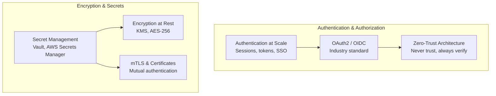

# Security Concepts

Production security patterns: authentication, authorization, encryption, and zero-trust.

```mermaid
graph TD
    subgraph "Authentication & Authorization"
        A1[Authentication at Scale\nSessions, tokens, SSO]
        A2[OAuth2 / OIDC\nIndustry standard]
        A3[Zero-Trust Architecture\nNever trust, always verify]
    end
    subgraph "Encryption & Secrets"
        E1[Encryption at Rest\nKMS, AES-256]
        E2[mTLS & Certificates\nMutual authentication]
        E3[Secret Management\nVault, AWS Secrets Manager]
    end
    A1 --> A2 --> A3
    E3 --> E1
    E3 --> E2
```
