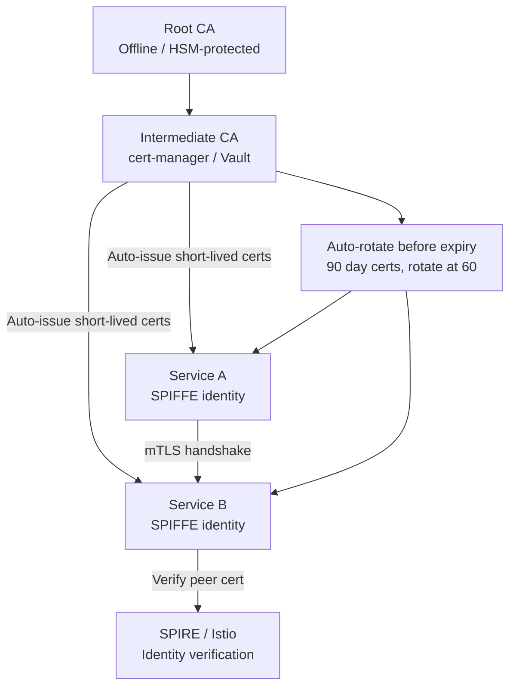
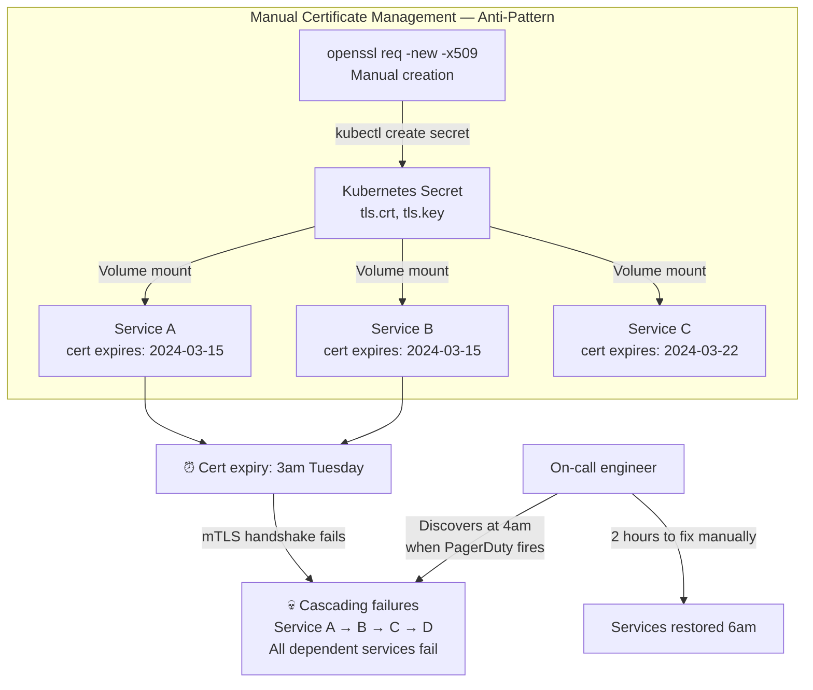
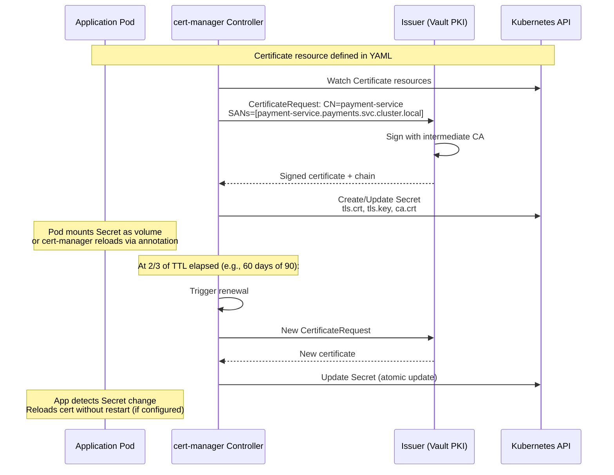
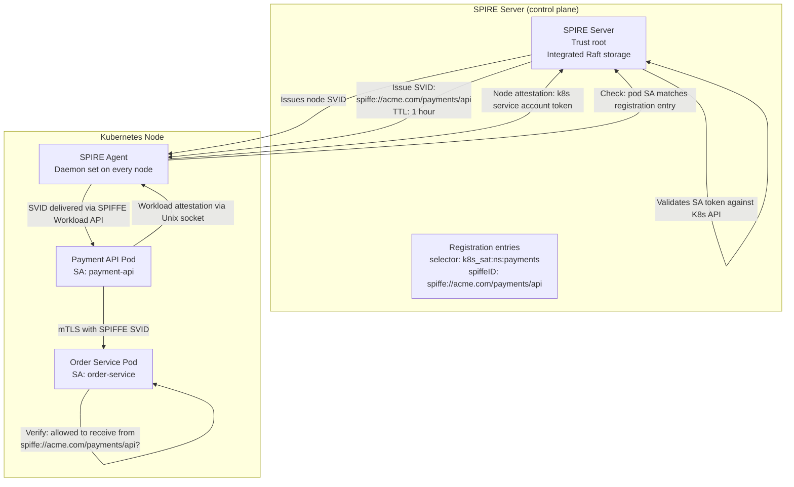
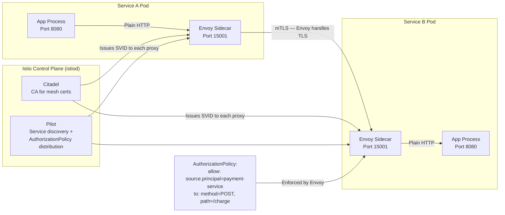
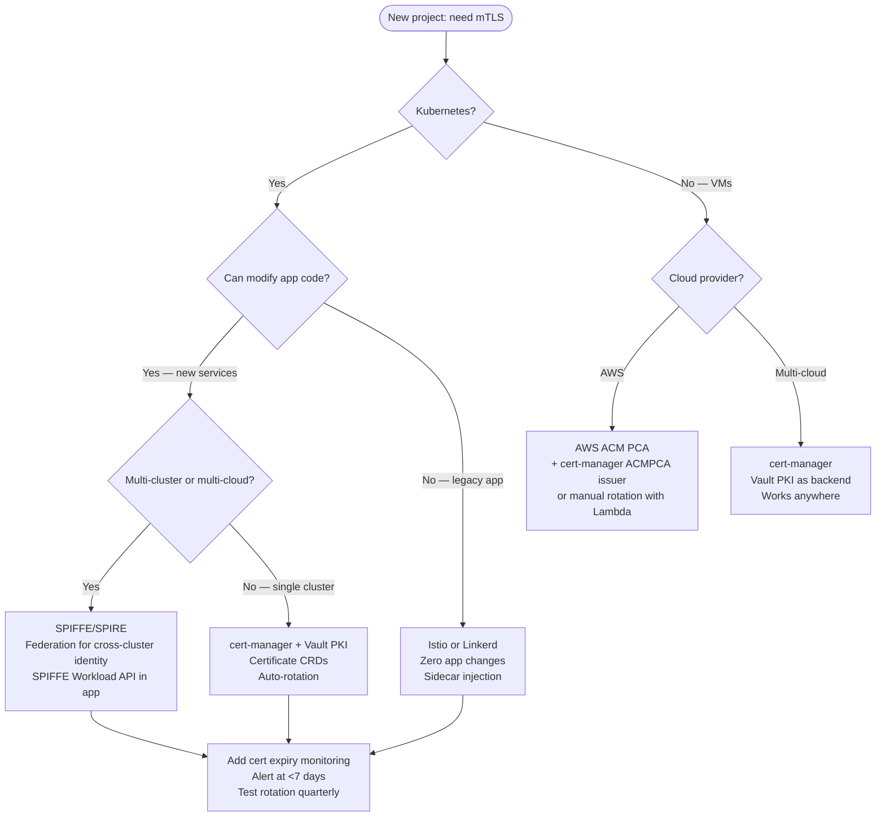

# mTLS at Scale: Certificate Management, Rotation, and Service Mesh Integration

## 🗺️ Quick Overview



*Automated certificate issuance and rotation via a service mesh removes the manual expiry risk; SPIFFE identities bind certs to workload identity, not IP address.*

**A certificate expired at 3am and took down your entire payment processing pipeline.** Not because nobody knew it would expire — cert-manager had been sending warnings for a week — but because the rotation process required a manual kubectl command that nobody ran, in a namespace owned by a team that didn't get the alert. Certificate management at scale is fundamentally an automation problem, not a cryptography problem.

---

## The Problem Class `[Mid]`

A fintech company with 80 microservices decides to implement mutual TLS (mTLS) to prevent lateral movement between services. They manually create certificates using openssl, store them as Kubernetes Secrets, and mount them as volumes. 90 days later, 12 services simultaneously lose their certificates to expiry. The ops team spends a weekend rotating certificates by hand, making typos, and accidentally deploying the wrong cert to the wrong service.



The cascade happens because service discovery returns healthy IPs, but every connection attempt fails at the TLS handshake layer with `certificate has expired` — often logged as a generic connection error that obscures the root cause.

> 💡 **What this means in practice:** Imagine every lock in your building changes its key every 90 days, but nobody automatically updates the keys on the keycards. Eventually someone can't get in. mTLS certificates are the same — they must rotate automatically or they become a ticking outage.

---

## Why the Obvious Solution Fails `[Senior]`

**"Use long-lived certificates (1 year)"**: Reduces rotation frequency but increases blast radius. A compromised long-lived certificate is valid for up to a year. NIST now recommends 90 days or less for machine-to-machine certificates. Let's Encrypt moved to 90-day certs in 2015 specifically to force automation.

**"Manually track expiry in a spreadsheet"**: Doesn't scale past 20 services. Humans miss entries. Expiry dates aren't automatically updated after rotation. The spreadsheet diverges from reality within weeks.

**"Add cert expiry monitoring and react"**: Reactive — you're managing incidents, not preventing them. Certificate expiry is 100% predictable and 100% preventable with automation.

**"Self-signed certs with no CA hierarchy"**: Each service needs to explicitly trust every other service's cert. N×N trust relationships. Adding a new service requires updating trust anchors on all other services. With a CA hierarchy, trust is established at the CA level — add a service by issuing a cert from the shared CA.

---

## The Solution Landscape `[Senior]`

### Solution 1: cert-manager with Automated Rotation

**What it is**

cert-manager is a Kubernetes controller that manages the full lifecycle of X.509 certificates: issuance from multiple backends (Let's Encrypt, Vault PKI, AWS ACM PCA, self-signed CAs), automatic renewal before expiry, and storage as Kubernetes TLS Secrets.

**How it actually works at depth**



The diagram shows the happy path. cert-manager handles the full lifecycle: it watches for Certificates nearing expiry, requests new ones from the configured Issuer, and atomically updates the Kubernetes Secret. Your application only needs to watch for Secret changes.

> 💡 **What this means in practice:** You write a YAML file saying "I want a certificate for payment-service that's valid for 90 days." cert-manager handles everything else — creating it, renewing it at 60 days, and updating it in the Secret. You never run openssl manually again.

**Pseudocode — Certificate resource definition:**

```yaml
# Define once, cert-manager handles forever
apiVersion: cert-manager.io/v1
kind: Certificate
metadata:
  name: payment-service-tls
  namespace: payments
spec:
  secretName: payment-service-tls-secret
  duration: 2160h    # 90 days
  renewBefore: 720h  # Renew at 60 days (30 days before expiry)
  issuerRef:
    name: vault-issuer
    kind: ClusterIssuer
  dnsNames:
    - payment-service.payments.svc.cluster.local
    - payment-service.payments.svc
  subject:
    organizations:
      - "acme-payments"
  privateKey:
    algorithm: ECDSA   # Faster than RSA, smaller keys
    size: 256          # P-256
```

```python
# Application cert reloading (Python example — works for Go/Node/Java similarly)
import ssl
import threading
import inotify.adapters  # Watch filesystem for changes

class CertificateWatcher:
    def __init__(self, cert_path: str, key_path: str):
        self.cert_path = cert_path
        self.key_path = key_path
        self.ssl_context = self._load_cert()
        self._start_watching()

    def _load_cert(self) -> ssl.SSLContext:
        ctx = ssl.SSLContext(ssl.PROTOCOL_TLS_SERVER)
        ctx.load_cert_chain(self.cert_path, self.key_path)
        ctx.verify_mode = ssl.CERT_REQUIRED  # mTLS: require client cert
        ctx.load_verify_locations(cafile="/etc/ssl/ca.crt")
        return ctx

    def _start_watching(self):
        def watch():
            i = inotify.adapters.Inotify()
            i.add_watch(self.cert_path)
            for event in i.event_gen():
                if event is not None:
                    # Secret was updated by cert-manager
                    self.ssl_context = self._load_cert()
                    print(f"Certificate reloaded: {self.cert_path}")
        threading.Thread(target=watch, daemon=True).start()

    def get_context(self) -> ssl.SSLContext:
        return self.ssl_context  # Always returns current cert context
```

**Sizing guidance** `[Staff+]`

- cert-manager controller: 1 pod with 3 replicas (leader election). Memory: ~200MB per replica. Handles thousands of Certificate resources.
- Certificate renewal batch: If all certs have the same issuance date (e.g., bulk migration), they all renew simultaneously, creating a spike on your Issuer. Spread issuance dates by adding jitter: `renewBefore: ${random(600h, 800h)}`.
- Vault PKI throughput: Default Vault can sign 10,000 certificates/hour. Burst of cert renewals should stay well below this.
- ECDSA vs RSA: ECDSA P-256 keys are 256 bits vs RSA 2048-4096 bits. TLS handshake is 2-10× faster with ECDSA. Always use ECDSA for new deployments.

**Configuration decisions that matter** `[Staff+]`

- **`renewBefore` timing**: Set to 1/3 of `duration`. If renewal fails, you have 1/3 of the cert lifetime to debug before expiry.
- **Leader election**: cert-manager leader election uses Lease resources. In multi-region clusters, network partitions can cause leader election failures. Use separate cert-manager installations per cluster, not a single shared one.
- **Issuer vs ClusterIssuer**: `Issuer` is namespace-scoped. `ClusterIssuer` is cluster-scoped. For a single-cluster deployment with well-defined namespace ownership, use `Issuer` (least privilege). For cluster-wide cert management, use `ClusterIssuer`.

**Failure modes** `[Staff+]`

- **cert-manager controller crash during renewal window**: cert-manager lost state (described in article intro). Mitigation: 3 replicas, leader election, separate monitoring of certificate age from outside the cluster.
- **Issuer rate limiting**: Let's Encrypt limits 50 certs/domain/week. For production services, use a private CA (Vault PKI, AWS ACM PCA) — no rate limits. Use Let's Encrypt only for public-facing services.
- **Secret rotation without pod restart**: By default, Kubernetes volumes don't update after pod creation (depends on kubelet sync period). Use `cert-manager.io/inject-ca-from` annotation or configure application-level cert watching (see pseudocode above).

---

### Solution 2: SPIFFE/SPIRE for Workload Identity

**What it is**

SPIFFE defines a standard for workload identity: every workload gets a SPIFFE ID (`spiffe://trust-domain/path/workload-name`) encoded in an X.509 certificate (SVID — SPIFFE Verifiable Identity Document). SPIRE is the reference implementation that issues SVIDs based on platform attestation.

**How it actually works at depth**



SPIRE binds identity to platform-verifiable attributes (Kubernetes service account, pod label, namespace) — not IP addresses, which change constantly in cloud-native environments. The SPIFFE ID is the stable identity across restarts, scaling events, and IP changes.

> 💡 **What this means in practice:** Instead of saying "the server at 10.0.1.42 is trusted," you say "the workload running as Kubernetes service account `payment-api` in namespace `payments` is trusted." When the pod restarts and gets IP 10.0.1.99, the trust relationship still works — because identity is based on what the workload *is*, not where it runs.

**Pseudocode — SPIFFE Workload API usage:**

```go
// Go service using SPIFFE Workload API to get its own SVID
// SPIRE agent runs as a sidecar/daemonset and exposes a Unix socket
package main

import (
    "context"
    "crypto/tls"
    "net/http"
    "github.com/spiffe/go-spiffe/v2/spiffeid"
    "github.com/spiffe/go-spiffe/v2/spiffetls"
    "github.com/spiffe/go-spiffe/v2/workloadapi"
)

func main() {
    ctx := context.Background()

    // Connect to SPIRE agent's Workload API (Unix socket)
    // Agent is on the same node — no network call needed
    source, err := workloadapi.NewX509Source(ctx,
        workloadapi.WithClientOptions(
            workloadapi.WithAddr("unix:///run/spire/sockets/agent.sock"),
        ),
    )
    // source automatically rotates SVID when cert approaches expiry
    // No manual renewal code needed

    // Create mTLS server that accepts connections from specific SPIFFE IDs
    // This enforces: only workloads with identity "order-service" can call us
    allowedCallers := spiffeid.RequireIDFromString(
        "spiffe://acme.com/ns/orders/sa/order-service",
    )

    tlsConfig := spiffetls.TLSServerConfig(source)
    tlsConfig.ClientAuth = tls.RequireAnyClientCert
    tlsConfig.VerifyPeerCertificate = func(rawCerts [][]byte, _ [][]*x509.Certificate) error {
        // Verify caller has the expected SPIFFE ID
        return spiffetls.VerifyPeerCertificate(rawCerts, allowedCallers, source)
    }

    // Every connection is now mutually authenticated with SPIFFE identity
    server := &http.Server{TLSConfig: tlsConfig}
    server.ListenAndServeTLS("", "") // No cert files needed — from SPIRE
}
```

**Sizing guidance** `[Staff+]`

- SVID TTL: 1 hour default. Shorter = more SPIRE server load, better security. 15 minutes for sensitive workloads.
- SPIRE server scale: 1 server handles 10,000 SVID renewals/hour comfortably. At 1,000 services × 1-hour TTL = ~17 renewals/min — trivial.
- SPIRE HA: Embedded Raft needs 3 nodes. External Postgres for >100,000 registrations (each entry is ~1KB).
- SVID size: ~2KB per X.509 SVID. TLS handshake transmits full cert chain — keep intermediate CA chain short (2 levels max).

**Failure modes** `[Staff+]`

- **SPIRE agent crash**: In-flight SVIDs are cached in memory. Agent crash = cache lost. Services continue with cached SVIDs until they expire. At 1-hour TTL with 50% renewal threshold, you have 30 minutes before renewals start failing.
- **Clock skew causing SVID rejection**: TLS certificates validate `Not Before` and `Not After` against local clock. >5 minutes skew = cert appears expired or not yet valid. Enforce NTP with `chrony`, monitor clock offset.
- **Registration entry misconfiguration**: A wrong selector (e.g., wrong namespace) means the workload doesn't match any registration entry and gets no SVID. Pod can't make mTLS connections. Test registration entries in a staging environment before production.

---

### Solution 3: Service Mesh mTLS (Istio / Linkerd)

**What it is**

Service meshes implement mTLS transparently at the sidecar proxy layer. Applications don't need to handle TLS at all — Envoy (Istio) or the Linkerd proxy intercepts all traffic and adds mTLS without application code changes.

**How it actually works at depth**



The sidecar model means zero application changes to get mTLS. The trade-off: sidecar overhead (~50MB RAM, ~0.5ms latency per hop) and Istio control plane complexity.

**Sizing guidance** `[Staff+]`

- Envoy sidecar overhead: 50-80MB RAM per pod, 0.3-0.7ms added latency per service hop.
- Istiod control plane: 1 istiod instance handles up to 1,000 services (1 vCPU, 1GB RAM). Scale istiod horizontally for >1,000 services.
- mTLS handshake frequency: TLS session resumption reduces overhead for persistent connections. Envoy enables TLS session tickets by default — subsequent requests on the same connection skip the full handshake.

---

## Trade-off Matrix `[Senior]` → `[Staff+]`

| Dimension | Manual Certs | cert-manager | SPIFFE/SPIRE | Service Mesh (Istio) |
|---|---|---|---|---|
| App code changes | Required (load cert) | Required (load cert) | Minimal (Workload API) | None |
| Rotation automation | Manual | Automatic | Automatic (SVID TTL) | Automatic |
| Identity model | IP/hostname | IP/hostname | Workload (SPIFFE ID) | Workload (SPIFFE ID) |
| Cross-cluster support | Hard | Hard | Native (federation) | Limited (multicluster) |
| Ops complexity | Low (until it breaks) | Medium | High | Very High |
| Latency overhead | Cert load only | Cert load only | ~1ms TLS handshake | ~0.5ms sidecar hop |
| Best for | Small teams, few services | K8s-native, <100 services | Multi-cluster, multi-cloud | Kubernetes-native, greenfield |

---

## Decision Framework `[Senior]` → `[Staff+]`



---

## Production Failure Story `[Staff+]`

**The Intermediate CA Expiry That Wasn't in the Monitoring**

An e-commerce company ran a two-level CA hierarchy: root CA (10-year cert) → intermediate CA (2-year cert) → service certs (90-day). cert-manager automatically renewed the 90-day service certs. Nobody monitored the 2-year intermediate CA.

Two years after setup, the intermediate CA expired. cert-manager continued renewing service certs successfully — but the renewed certs were signed by an expired CA. Services presented the renewed cert + expired CA chain. Other services validating the chain failed the CA expiry check. Entire mTLS mesh collapsed simultaneously.

Root cause: monitoring was `certificate_expiry_seconds{type="service"}` — the intermediate CA was a different Kubernetes resource type (Secret, not Certificate) and wasn't included in the alert.

**Fix**:
1. Monitor ALL TLS certificates in the cluster: `kubeconfig`-based external scanner that inspects all Secrets of type `kubernetes.io/tls` across all namespaces.
2. Alert on any certificate expiring in <90 days — CA certs should be renewed well in advance.
3. CA certificates are now `Certificate` resources managed by cert-manager, not manually created Secrets.
4. Annual "certificate audit" calendar event to review entire CA hierarchy.

---

## Observability Playbook `[Staff+]`

```
# cert-manager metrics
certmanager_certificate_expiration_timestamp_seconds  # Alert: <604800 (7 days)
certmanager_certificate_renewal_total{reason="Expiring|NotYetValid|UpToDate"}
certmanager_http_acme_client_request_count{status="200|4xx|5xx"}
certmanager_certificate_ready_status{condition="True|False"}  # Alert if False

# SPIRE metrics
spire_server_api_workload_attestation_count{result="success|error"}
spire_server_svid_issued_total
spire_server_uptime_seconds  # Alert if restarts detected
spire_agent_svid_renewal_errors_total  # Alert if >0

# mTLS handshake health (Istio/Envoy)
istio_requests_total{connection_security_policy="mutual_tls|none"}
envoy_ssl_handshake  # Handshakes per second
envoy_ssl_handshake_error  # Failed mTLS handshakes — alert if rising
envoy_ssl_session_reused  # High reuse = good, means session tickets working

# External cert expiry scanner (runs outside cluster)
# Check every 1h, alerts go to PagerDuty
external_cert_expiry_days{service, namespace, cert_type="service|intermediate|root"}
# Alert: <7 days for service certs, <90 days for CA certs

# 2026: eBPF-based TLS visibility
# Cilium Hubble can observe mTLS identity without decryption
hubble_flows_processed_total{verdict="FORWARDED|DROPPED"}
hubble_policy_verdict_total{policy, direction, verdict}
```

---

## Architectural Evolution `[Staff+]`

**Stage 1**: cert-manager + self-signed ClusterIssuer. Automated rotation. No SPIFFE yet. Works for single cluster, few services.

**Stage 2**: cert-manager + Vault PKI as issuer. Full audit trail of certificate issuance. Consistent CA hierarchy.

**Stage 3**: Add service mesh (Istio) for zero-code-change mTLS on legacy services. SPIFFE/SPIRE for new services requiring cross-cluster identity.

**Stage 4**: Full SPIFFE mesh with SPIRE federation across clusters and clouds. OPA authorization policies using SPIFFE IDs. Hardware attestation (TPM) for VM-based workloads. Certificate Transparency logs for audit.

---

## Decision Framework Checklist `[All Levels]`

- [ ] Is certificate rotation fully automated? (No manual rotation process)
- [ ] Do we alert when certificates are <7 days from expiry?
- [ ] Do we monitor CA certificates separately from service certificates?
- [ ] Is cert-manager deployed with 3 replicas and leader election?
- [ ] Are we using ECDSA P-256 (not RSA 2048) for new certificates?
- [ ] Is our Vault PKI issuer HA? (Not single-node)
- [ ] Do we test certificate rotation in staging quarterly?
- [ ] Do we have a break-glass procedure if cert-manager is unavailable?
- [ ] Are service mesh AuthorizationPolicies enforcing mTLS (not just opportunistic)?
- [ ] Is clock synchronization (NTP/chrony) monitored on all nodes?
- [ ] Do we scan all TLS Secrets across all namespaces for expiry?

*Written by Gaurav Porwal — 10+ Year Engineer | Tech Lead | Product Owner | Business-Minded Builder*
*Last updated: 2026-03-18*
