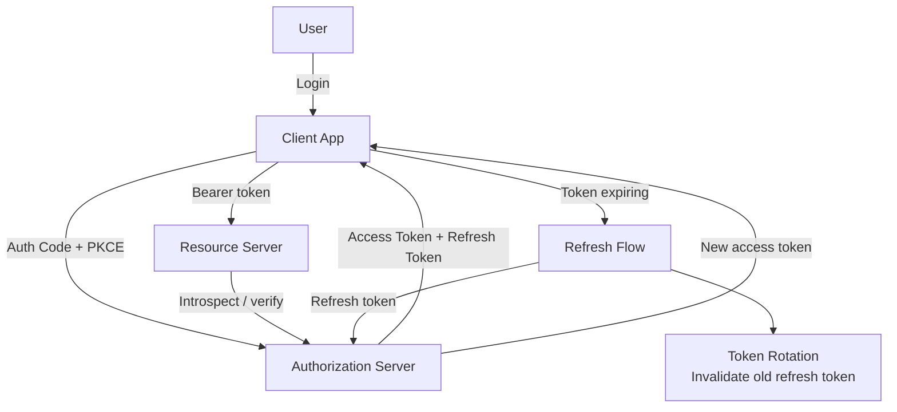
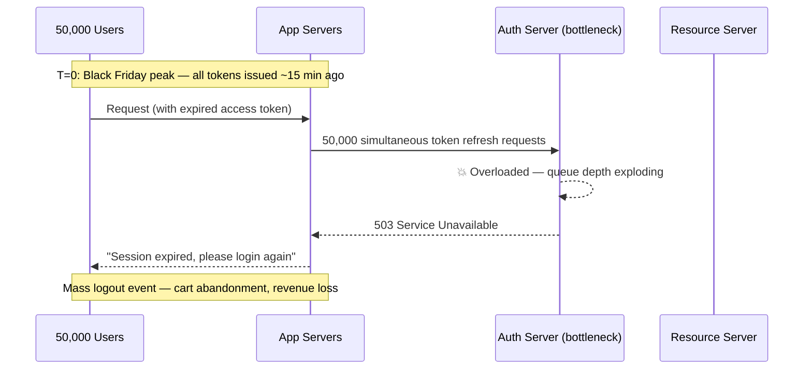
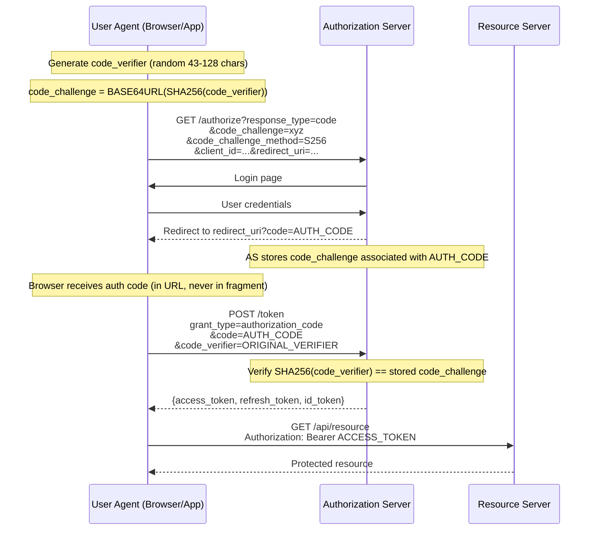
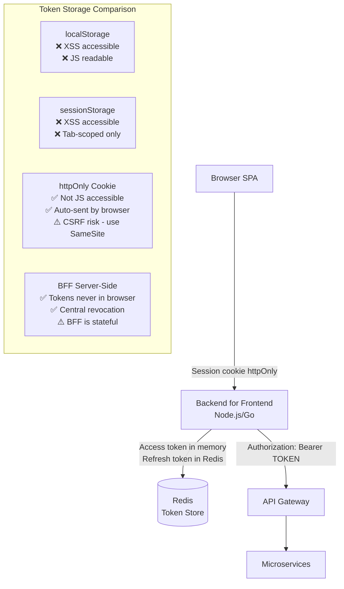
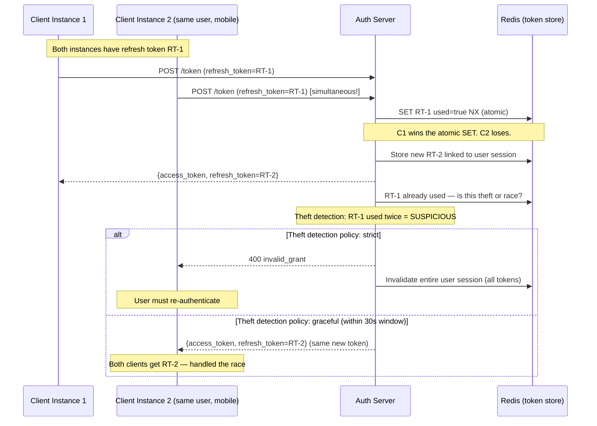
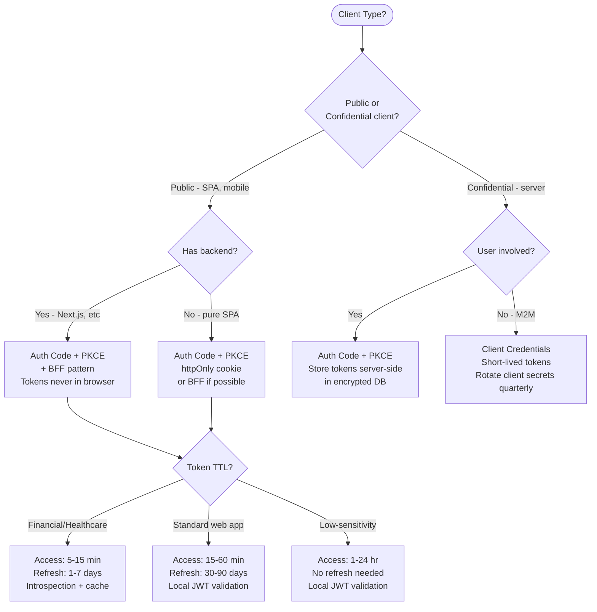

# OAuth 2.0 and OIDC: Flows, Token Storage, and Refresh Strategy at Scale

## 🗺️ Quick Overview



*OAuth 2.0 separates authorization from resource access; PKCE prevents code interception, and refresh token rotation limits the blast radius of stolen tokens.*

**Most OAuth implementations work fine until they don't — then they fail in ways that lock out thousands of users simultaneously.** Token expiry storms, refresh race conditions in distributed clients, and misunderstood token storage trade-offs are the failure modes that separate production-hardened auth from a tutorial implementation.

---

## The Problem Class `[Mid]`

An e-commerce platform uses OAuth 2.0 for user authentication. Access tokens expire in 15 minutes. At peak traffic (Black Friday, 50,000 concurrent users), a thundering herd of token refresh requests floods the auth server when tokens issued at login time all expire simultaneously. The auth server — scaled for normal refresh patterns — buckles under 3,000 simultaneous refresh requests per second. Users see "session expired" errors. Revenue impact: $2M/hour.



The same system has a second problem: mobile clients store refresh tokens in localStorage (copied from a web tutorial). A single XSS vulnerability can exfiltrate all refresh tokens for all logged-in users — refresh tokens are long-lived (30 days) and can be used to generate new access tokens indefinitely.

---

## Why the Obvious Solution Fails `[Senior]`

**"Just use longer-lived access tokens"**: A 24-hour access token means a compromised token is valid for up to 24 hours after detection. For payment-capable sessions, this is unacceptable. Token lifetime is a direct security knob — longer = more convenience, longer blast radius.

**"Store refresh tokens in localStorage for SPAs"**: localStorage is accessible to any JavaScript running on the page — including injected scripts from XSS, malicious npm packages, or browser extensions. OWASP explicitly recommends against storing sensitive tokens in localStorage.

**"Validate JWTs locally on every microservice"**: Without a token introspection endpoint, revoked tokens remain valid until expiry. If a user logs out or a token is compromised, your services don't know until the JWT expires.

**"Use implicit flow for SPAs"**: Implicit flow (returning access tokens directly in URL fragments) is deprecated in OAuth 2.1. URL fragments appear in browser history, server logs, and referrer headers. Use auth code + PKCE instead.

---

## The Solution Landscape `[Senior]`

### Solution 1: Authorization Code Flow with PKCE

**What it is**

PKCE (Proof Key for Code Exchange, RFC 7636) extends the auth code flow to protect against authorization code interception attacks. It's mandatory for public clients (SPAs, mobile apps) in OAuth 2.1 and strongly recommended for all clients.

**How it actually works at depth**



**Why PKCE prevents code interception**: If an attacker intercepts the auth code (via URL sniffing, malicious app registering the same redirect URI), they cannot exchange it for tokens without the `code_verifier` — which never leaves the originating client.

**Sizing guidance** `[Staff+]`

- Auth code exchange: 1 database lookup (verify code_challenge) + 1 token signing operation. Target: <50ms P99.
- Code lifetime: 60 seconds maximum (RFC recommends single-use). Store in Redis with TTL, delete on first use.
- Authorization server capacity: each token endpoint request requires 1 JWT signing (ECDSA P-256: ~1ms CPU, RS256: ~5ms CPU). At 10,000 logins/minute: 166 req/s — easily handled by 2 auth server instances.
- PKCE verification: SHA256 is ~0.01ms. Negligible.

**Configuration decisions that matter** `[Staff+]`

- **`code_challenge_method`**: Always `S256`. Never `plain` — it provides no security benefit over no PKCE.
- **`redirect_uri` exact matching**: Require exact string match, not prefix match. An attacker could register `https://yourapp.com.evil.com` if you allow prefix matching.
- **Auth code single-use enforcement**: Use Redis `SET NX` (set if not exists) — if a code is presented twice, invalidate the entire session and alert (possible replay attack).
- **State parameter**: Always validate the `state` parameter to prevent CSRF. Use a cryptographically random value stored in the session.

**Failure modes** `[Staff+]`

- **PKCE downgrade attack**: If your AS allows clients to skip PKCE (for backward compat), attackers can initiate flows without PKCE. Enforce PKCE for all public clients — reject flows without it.
- **Redirect URI open redirector**: If your app has an open redirect vulnerability (e.g., `/redirect?to=https://evil.com`), an attacker can use it as a registered redirect URI to capture auth codes. Audit all redirect endpoints.
- **Thundering herd on token endpoint**: Rate limit by `client_id` + IP. Use Redis-based token bucket. Shed load gracefully with 429 + `Retry-After` header rather than 503.

---

### Solution 2: Token Storage — httpOnly Cookies vs BFF Pattern

**What it is**

For browser-based SPAs, the Backend-for-Frontend (BFF) pattern keeps tokens server-side entirely. The browser gets a session cookie (httpOnly, Secure, SameSite=Strict) that references a server-side session. The BFF exchanges the session for tokens when calling APIs.

**How it actually works at depth**



**Sizing guidance** `[Staff+]`

- BFF session storage: 1 Redis entry per active session. At 100,000 concurrent users × 2KB per session = 200MB Redis memory. Trivial.
- BFF latency overhead: +1 Redis lookup per request (~0.5ms). Acceptable.
- Session cookie size: 32 bytes (session ID). vs JWT in cookie: ~500 bytes. Cookie size affects every request — prefer session IDs over JWTs in cookies.

**Configuration decisions that matter** `[Staff+]`

- **`SameSite=Strict` vs `SameSite=Lax`**: Strict prevents all cross-site cookie sending (breaks OAuth redirects from external IdP). Lax allows top-level navigation — use Lax for auth cookies, Strict for session cookies after auth.
- **Cookie `__Host-` prefix**: Forces `Secure`, removes `Domain`, limits `Path` to `/`. Use `__Host-session=...` to prevent subdomain attacks.
- **Token storage in BFF Redis**: Encrypt refresh tokens at rest in Redis using AES-256-GCM with a key from KMS. Redis is not encrypted by default.

---

### Solution 3: Refresh Token Rotation and Race Condition Handling

**What it is**

Refresh token rotation issues a new refresh token on every use and immediately invalidates the old one. This detects token theft: if a stolen token is used, the legitimate client's next refresh attempt fails (old token already invalidated), alerting you to a potential breach.

**How it actually works at depth — including the race condition**



**Sizing guidance** `[Staff+]`

- Redis atomic SET NX for refresh token use: <1ms. This is the critical path for race condition handling.
- Grace window for concurrent refreshes: 30 seconds is a reasonable default. Two requests for the same refresh token within 30 seconds = likely race condition (distribute mobile + web). >30 seconds = suspicious (possible theft). Log and alert.
- Refresh token family tracking: Store a `family_id` with each token chain. If a revoked token in a family is used, invalidate the entire family — this catches refresh token replay chains.

**Failure modes** `[Staff+]`

- **Redis unavailability during token refresh**: If Redis is down and you can't validate refresh tokens, you have a choice: fail closed (reject all refreshes, users logged out) or fail open (accept refreshes without revocation check, security risk). For most apps: fail closed. For critical user-facing flows: consider a read-only secondary Redis that can validate but not revoke.
- **Token rotation storms**: If a client has a bug that repeatedly refreshes tokens, each refresh invalidates the previous one. Family tracking with refresh count limits (max 1,000 rotations per family) catches this.
- **Refresh token revocation latency**: When a user logs out, you revoke their refresh token in Redis. But if they have active access tokens, those remain valid until expiry. Accept this — it's a known OAuth limitation. Use short access token TTLs (15 min) as the mitigation.

---

### Solution 4: Token Introspection vs Local JWT Validation

**What it is**

Local JWT validation (verify signature + claims without network call) is fast but can't handle revoked tokens. Token introspection (RFC 7662) calls the auth server on every request to check if the token is still valid.

**How to choose — the latency vs security trade-off**:

| Approach | Latency | Revocation support | Scale impact |
|---|---|---|---|
| Local JWT validation | <1ms | No (until expiry) | None |
| Introspection on every request | 5-20ms | Yes (real-time) | High — AS must handle all API traffic |
| Introspection with cache (30s) | <1ms (hit) / 15ms (miss) | Yes (with 30s lag) | Low — 95%+ cache hit rate |
| Short-lived tokens (15min) + local validation | <1ms | Effectively yes (15min lag) | None |

**For most systems**: Short-lived JWTs (15 min) with local validation is the right answer. Introspection with caching is appropriate when you need near-real-time revocation (banking, healthcare).

**Sizing guidance** `[Staff+]`

- Introspection cache: `token_hash → {valid: bool, expires_at: timestamp}`. TTL = min(30 seconds, token_expiry - now). At 100,000 req/s with 99% cache hit rate: ~1,000 introspection calls/s to auth server. Manageable.
- Token hash for cache key: SHA256(token) — never store the token itself in the cache key. ~0.01ms hashing overhead.

---

## Trade-off Matrix `[Senior]` → `[Staff+]`

| Dimension | Implicit Flow (deprecated) | Auth Code + PKCE | Client Credentials | Device Flow |
|---|---|---|---|---|
| Use case | Legacy SPAs | SPAs, mobile apps | Server-to-server | Smart TVs, CLIs |
| Security | Low (token in URL) | High | High | Medium |
| User interaction | Yes | Yes | No | Yes (separate device) |
| PKCE required | N/A | Yes | N/A | N/A |
| Refresh tokens | No | Yes | No (re-auth) | Yes |
| 2026 recommendation | Never use | Default choice | M2M/service accounts | IoT/CLI |

---

## Decision Framework `[Senior]` → `[Staff+]`



---

## Production Failure Story `[Staff+]`

**The Refresh Token Race Condition That Logged Out 40,000 Users**

A SaaS company's mobile app (iOS + Android) used refresh token rotation. Users who enabled background refresh on both a phone and a tablet would have both clients attempt to refresh simultaneously when they opened the app after being idle.

The auth server used strict theft detection: any second use of a refresh token within the rotation window immediately invalidated the entire user session. The result: users who opened the app on two devices simultaneously would find themselves logged out of both.

The support volume was staggering — "app logged me out for no reason" — and investigation took 3 weeks because the logs showed "refresh token reuse detected" which was interpreted as a security finding rather than a product bug.

**Fix**: A 30-second grace window for concurrent refreshes of the same token. Within the window, both clients receive the same new refresh token. Outside the window (>30s), full session invalidation. Device fingerprinting added to distinguish "same user, two devices" from "stolen token."

**Lesson**: Refresh token rotation is conceptually elegant but operationally complex with multi-device users. Define your threat model before choosing the strictness level.

---

## Observability Playbook `[Staff+]`

```
# Token lifecycle metrics
oauth_token_requests_total{grant_type, client_id, result="success|error"}
oauth_token_refresh_duration_p99
oauth_refresh_token_reuse_total{reason="concurrent|theft_suspected"}
oauth_session_invalidations_total{reason="logout|theft|expiry"}

# Revocation lag (how long before a revoked token is rejected everywhere)
oauth_revoked_token_accepted_total  # Should be 0 for introspection, non-zero for JWT-only

# Auth server health
oauth_authorization_server_latency_p99{endpoint="/authorize|/token|/introspect"}
oauth_token_cache_hit_rate{type="introspection"}  # Target: >95%

# Security signals
oauth_pkce_missing_requests_total  # Should be 0 for public clients
oauth_invalid_redirect_uri_total  # Potential attack signal
oauth_concurrent_refresh_detected_total  # Monitor for theft vs race

# 2026: AI-assisted anomaly detection
oauth_unusual_client_behavior_score{client_id}  # ML model
oauth_geo_anomaly_detected_total{user_id}  # Login from new country
```

---

## Architectural Evolution `[Staff+]`

**Phase 1 (MVP)**: Auth Code + PKCE, JWTs with 1-hour access tokens, refresh tokens in httpOnly cookies, local JWT validation. Works for 0-100K users.

**Phase 2 (Growth)**: Reduce access token TTL to 15 minutes. Add refresh token rotation with grace window. Add introspection cache for sensitive endpoints. Add anomaly detection on login patterns. Handles 100K-1M users.

**Phase 3 (Scale)**: BFF pattern for all browser clients. Centralized token store (Redis Cluster) for cross-datacenter revocation. AI-assisted fraud detection on auth flows. Separate auth service per region for latency. Handles 1M+ users.

**Phase 4 (Enterprise)**: Multi-tenant auth with per-tenant policies. FIDO2/WebAuthn for step-up auth. Passkeys replacing password+TOTP. Continuous access evaluation (CAE) for near-real-time revocation. Compliance audit logs (SOC2, PCI-DSS).

---

## Decision Framework Checklist `[All Levels]`

- [ ] Are we using PKCE for all public clients (SPA, mobile)? (Never use implicit flow)
- [ ] Is the `state` parameter validated on every auth callback? (CSRF prevention)
- [ ] Are refresh tokens stored server-side or in httpOnly cookies? (Never localStorage)
- [ ] Do we have refresh token rotation enabled? (Theft detection)
- [ ] Is our grace window for concurrent refreshes defined? (Multi-device users)
- [ ] Are access token TTLs ≤15 minutes for sensitive operations?
- [ ] Do we have token introspection for revocation-sensitive endpoints?
- [ ] Is our auth server horizontally scalable? (Token endpoint is a chokepoint)
- [ ] Do we alert on refresh token reuse outside the grace window?
- [ ] Are client secrets rotated at least quarterly? (For confidential clients)
- [ ] Are we monitoring for unusual auth patterns? (New geo, impossible travel)
- [ ] Is our PKCE `code_challenge_method` forced to `S256`? (Never `plain`)

*Written by Gaurav Porwal — 10+ Year Engineer | Tech Lead | Product Owner | Business-Minded Builder*
*Last updated: 2026-03-18*
