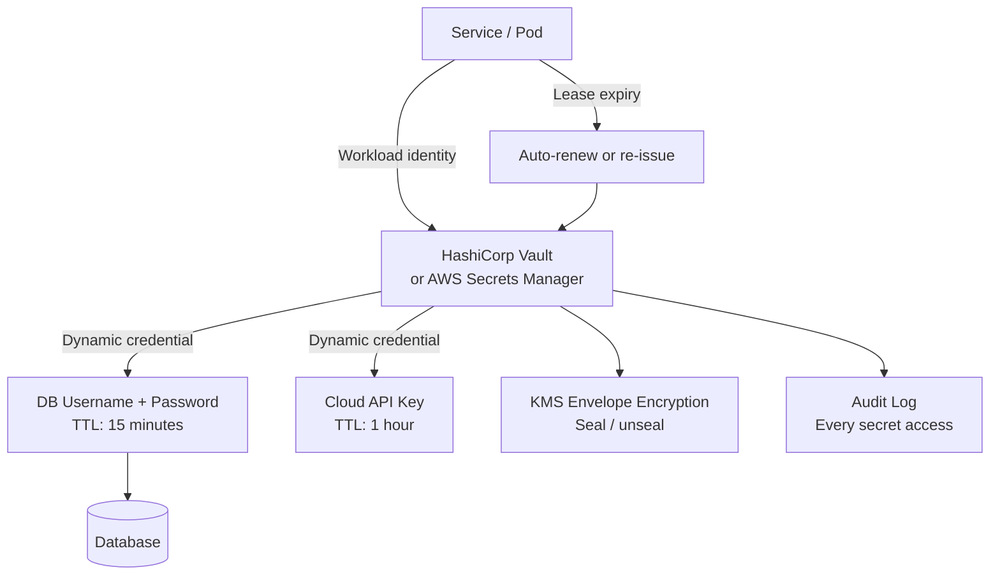
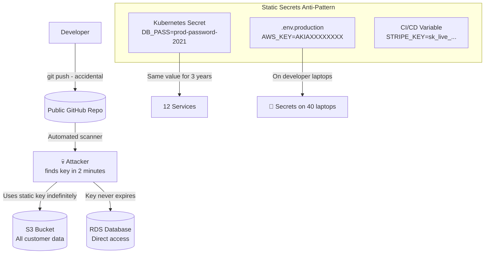
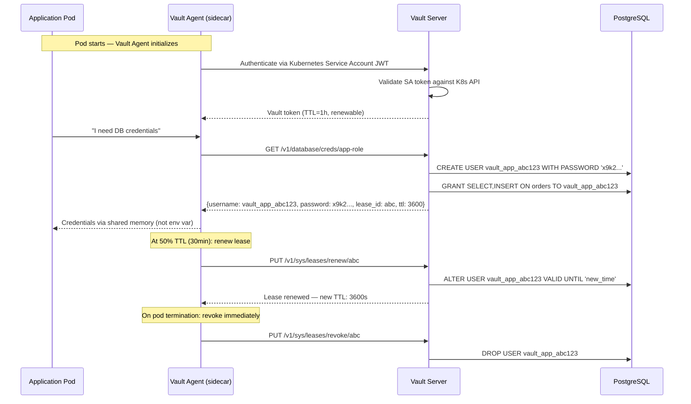
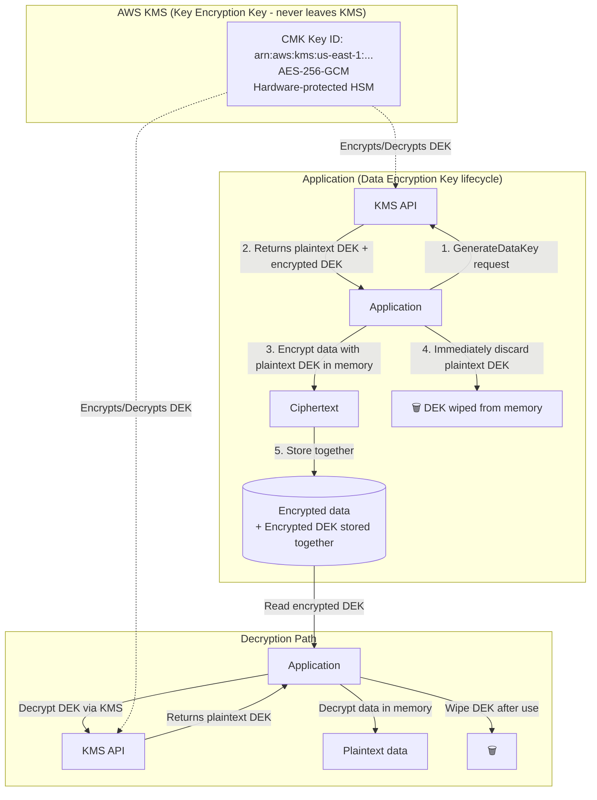
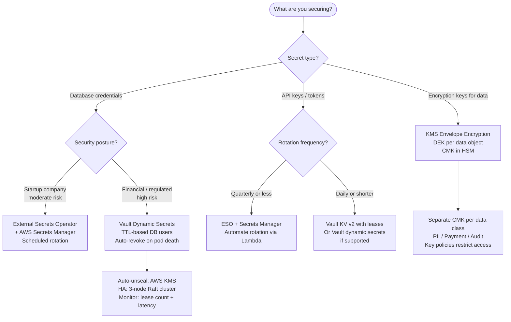

# Secret Management: HashiCorp Vault, KMS, and Secret Rotation at Scale

## 🗺️ Quick Overview



*Dynamic secrets issued with short TTLs shrink the breach window from months to minutes; Vault centralises issuance, rotation, and audit logging across all services.*

**Your `.env` file is a liability that compounds with every new service, every new engineer, and every new environment.** Static secrets never expire, proliferate across CI systems and developer laptops, and turn a single credential breach into a months-long compromise. Dynamic secrets — credentials that exist for minutes, not months — fundamentally change the attacker's economics.

---

## The Problem Class `[Mid]`

A company with 50 microservices manages secrets via environment variables in Kubernetes manifests stored in a git repository. The database password for production Postgres has been the same for 3 years. When a developer leaves the company, no one rotates the credentials — it would require updating 12 services and coordinating a deployment.

One day, an AWS access key appears in a public GitHub repository (accidentally committed by a contractor). By the time it's detected 48 hours later, the attacker has exfiltrated 2GB of customer data. The key had no expiry, no IP restriction, and admin-level S3 access.



The blast radius of a single compromised static credential is unbounded in time. Dynamic secrets solve this by ensuring credentials self-destruct after minutes.

---

## Why the Obvious Solution Fails `[Senior]`

**"Just rotate secrets manually on a schedule"**: Manual rotation requires coordination across all consuming services. Teams delay rotations for months to avoid downtime. When rotation does happen, it's often botched — one service is missed, causing an outage, which is blamed on "the rotation," creating cultural resistance to future rotations.

**"Store secrets in Kubernetes Secrets"**: Kubernetes Secrets are base64-encoded, not encrypted, by default. `kubectl get secret -o yaml` reveals them in plaintext to anyone with read access. Without etcd encryption at rest and RBAC limiting Secret access, Kubernetes Secrets are just obfuscated environment variables.

**"Use AWS Secrets Manager for everything"**: AWS Secrets Manager is excellent but has a critical limitation: it stores static credentials with scheduled rotation. If you rotate a database password in Secrets Manager, you still need a window where both old and new passwords work (or a brief connection interruption). Dynamic credentials eliminate this problem class entirely.

---

## The Solution Landscape `[Senior]`

### Solution 1: HashiCorp Vault with Dynamic Secrets

**What it is**

Vault's dynamic secrets engine creates credentials on-demand with a configurable TTL. For databases: when a service requests credentials, Vault creates a new database user with a random password, limited to required permissions, that automatically expires. No static password ever exists.

**How it actually works at depth**



**Sizing guidance** `[Staff+]`

- Vault server capacity: 10,000+ requests/second per single Vault server node with Raft storage. For 1,000 services each renewing leases every 30 minutes: ~0.5 lease renewals/second — trivially handled.
- Vault HA cluster: minimum 3 nodes (Raft integrated storage). Write throughput: ~1,000 req/s. Read: ~10,000 req/s. Separates secret issuance from lease management if needed.
- Database connections during rotation: Dynamic credentials create new DB users. PostgreSQL max_connections applies — ensure your connection pool doesn't exhaust connections during credential issuance spikes. Set `max_connections_per_lease` in Vault's DB engine config.
- Vault agent memory: ~50MB per sidecar. For 500 pods: 25GB cluster memory overhead. Use Vault Secrets Operator (VSO) instead to reduce sidecar sprawl — one operator pod handles all pods.

**Configuration decisions that matter** `[Staff+]`

- **Default lease TTL**: 1 hour for application credentials. 15 minutes for elevated-privilege credentials. 8 hours for human operators (matches work shift, logged out at end of day).
- **Max lease TTL**: Set `max_ttl` to cap how long a credential can be renewed. Even if a lease is continuously renewed, force re-issuance after 24 hours to create fresh audit trail entries.
- **Vault auto-unseal**: On restart, Vault is sealed and cannot serve secrets. Use AWS KMS, GCP Cloud KMS, or Azure Key Vault as auto-unseal mechanism. Never use Shamir shamir shares in production (requires manual intervention on restart).
- **Token accessor log**: Every Vault token has an accessor (non-sensitive identifier). Log all token creates, renewals, and revocations via the audit log. Correlate with your SIEM.

**Failure modes** `[Staff+]`

- **Vault unavailability during app startup**: Applications fail to get credentials and crash. Vault agent can pre-cache credentials to disk (encrypted with a transit key). On startup, agent reads from cache if Vault is unreachable. Set max cache age = credential TTL - 5 minutes.
- **Lease explosion**: If a bug causes your app to request new credentials without renewing existing ones, you'll exhaust your `max_leases` limit (default: 256,000). Monitor `vault.expire.num_leases` metric. Alert at 50% of max_leases.
- **Database max_connections exhausted**: Each Vault lease = 1 DB user (with connection pool per user). Vault's DB engine doesn't pool connections between users. With 100 services × 10 replicas × 5 connections each = 5,000 DB connections. Set `max_open_connections` in Vault DB engine role to limit per-lease connections.

**Observability** `[Staff+]`

```
# Vault health metrics
vault.core.handle_request  # Request rate
vault.expire.num_leases    # Active leases — alert at 50% of max
vault.runtime.gc_pause_ns  # GC pauses causing latency spikes
vault.token.creation       # Token issuance rate

# Dynamic secrets
vault.secret.kv.list       # Secret access patterns
vault.database.createRole  # New DB credential issuances
vault.expire.revoke        # Lease revocations (normal=orderly, spikes=bug)

# Audit log analysis (forward to SIEM)
# Every access logged: timestamp, token_accessor, operation, path, remote_addr
```

---

### Solution 2: AWS KMS Envelope Encryption

**What it is**

Envelope encryption uses a hierarchy of keys: a Key Encryption Key (KEK) managed by KMS, and Data Encryption Keys (DEKs) that actually encrypt data. The DEK is encrypted by the KEK and stored alongside the data. To decrypt: call KMS to unwrap the DEK, use DEK to decrypt data. The KEK never leaves KMS.

**How it actually works at depth**



**Sizing guidance** `[Staff+]`

- KMS API latency: ~5-10ms per call (us-east-1, well-connected client).
- KMS pricing: $0.03 per 10,000 API calls. At 1M API operations/day: $3/day. Cost is not the concern — latency is.
- DEK caching strategy: Cache plaintext DEKs in memory (TTL=5 minutes). At 10,000 req/s with 99% cache hit rate: ~100 KMS calls/s. Well within limits (10,000 requests/s per key limit for symmetric keys).
- KMS request limits: Default 5,500 req/s per key in us-east-1. Monitor `KMS ThrottledRequests` CloudWatch metric.

**Configuration decisions that matter** `[Staff+]`

- **Key rotation**: Enable automatic annual rotation for CMKs. Rotation is transparent — KMS keeps old key material for decryption while new material is used for new encryptions. Existing encrypted data doesn't need re-encryption.
- **Key policies vs IAM policies**: Use KMS key policies as the primary access control. IAM policies alone don't grant KMS access — both must allow the operation. This prevents IAM privilege escalation from granting unexpected KMS access.
- **Multi-region keys**: For DR/latency — use KMS multi-region keys (MRKs) that can decrypt in any region. Replicated, same key ID structure. Critical for active-active multi-region architectures.
- **CloudTrail for KMS**: Every KMS API call is logged in CloudTrail. Enable CloudTrail and pipe KMS events to your SIEM. A spike in `Decrypt` calls from an unexpected source is an anomaly signal.

---

### Solution 3: Kubernetes External Secrets Operator

**What it is**

External Secrets Operator (ESO) syncs secrets from external stores (Vault, AWS Secrets Manager, GCP Secret Manager, Azure Key Vault) into Kubernetes Secrets, keeping them updated as the external source changes.

**How it actually works at depth**

```mermaid
graph LR
    subgraph "External Secret Stores"
        VAULT[HashiCorp Vault<br/>database/creds/app]
        ASM[AWS Secrets Manager<br/>prod/app/api-keys]
        GSM[GCP Secret Manager<br/>projects/prod/stripe-key]
    end

    subgraph "Kubernetes Cluster"
        ESO[External Secrets Operator<br/>Controller] -->|Creates/Updates| K8S_SEC[Kubernetes Secret<br/>app-credentials]
        ESO -.->|Watches| EXT_SEC[ExternalSecret CRD<br/>spec: refreshInterval: 1h<br/>data: vault path mappings]
        K8S_SEC -->|Mounted as env vars<br/>or volume| POD[Application Pod]
    end

    VAULT -->|Fetch on schedule| ESO
    ASM -->|Fetch on schedule| ESO
    GSM -->|Fetch on schedule| ESO

    subgraph "etcd Encryption at Rest"
        ETCD[etcd<br/>EncryptionConfiguration<br/>provider: aescbc|secretbox]
    end
    K8S_SEC -->|Encrypted at rest| ETCD
```

**Sizing guidance** `[Staff+]`

- ESO controller: 1 pod handles thousands of ExternalSecret resources. Memory: ~200MB per controller. CPU: spikes during batch refresh cycles.
- `refreshInterval`: Balance freshness vs external API rate limits. 1 hour for static credentials, 5 minutes for credentials with short TTLs, 30 seconds minimum (API rate limit protection).
- Secret sync latency: ESO detects external secret changes within one `refreshInterval`. For sub-minute propagation, use Vault Agent with sidecar injection instead.

**Failure modes** `[Staff+]`

- **External store unavailable at pod startup**: Pod can't mount the secret — pod fails to start. Use `immutable: true` on Kubernetes Secrets plus a startup webhook that pre-warms secrets. Or accept the failure (K8s restarts the pod when ESO syncs successfully).
- **ExternalSecret CRD reconciliation loop**: If the external store has a transient error, ESO will keep retrying. Add exponential backoff to prevent hammering the external store. ESO has configurable retry policies.
- **Secret drift**: If someone manually edits the Kubernetes Secret, ESO will overwrite it on the next sync. This is a feature — external store is source of truth. Document this to prevent confusion.

---

## Trade-off Matrix `[Senior]` → `[Staff+]`

| Dimension | Static Env Vars | K8s Secrets + ESO | Vault Dynamic Secrets | KMS Envelope Encryption |
|---|---|---|---|---|
| Credential lifetime | Forever | Days-weeks | Minutes-hours | Keys: years (rotated annually) |
| Rotation complexity | High (manual coord) | Medium (automated) | None (automatic TTL) | Transparent (KMS handles) |
| Breach blast radius | Unlimited (time) | Days max | Hours max | Data unreadable without KMS access |
| Developer experience | Simple | Moderate | Complex (sidecar) | Transparent (library) |
| Audit trail | None | Kubernetes audit | Full Vault audit log | CloudTrail |
| Cost | Free | Free + ESO ops | Vault Enterprise = $$$ | $0.03/10K KMS calls |
| Vendor lock-in | None | Kubernetes | HashiCorp | AWS/GCP/Azure |
| Emergency access | Any developer | RBAC-controlled | Vault break-glass | KMS policy override |

---

## Decision Framework `[Senior]` → `[Staff+]`



---

## Production Failure Story `[Staff+]`

**The Vault Unseal Failure That Took Down Production for 6 Hours**

A startup used Vault with Shamir key shares for unsealing: 5 key holders, 3 required to unseal. On a Tuesday morning, a Vault server was rebooted for a kernel patch. The server came up sealed — waiting for key holders to unseal it.

Of the 5 key holders: 1 was in a timezone 8 hours ahead (asleep), 1 was on vacation, and 1 had left the company 3 months ago (key share was lost). Only 2 of the needed 3 holders were available. Vault stayed sealed for 6 hours until the vacationing engineer could be reached.

During those 6 hours: new pods couldn't get database credentials, new feature deployments failed, and on-call engineers spent hours trying to work around the issue.

**Root causes**:
1. Shamir unsealing in production requires operational discipline that rarely exists.
2. No key share succession planning (departed employee's share was never rotated).
3. No auto-unseal configured.

**Fix**:
- Migrated to AWS KMS auto-unseal. Vault unseals automatically on restart using a CMK — no human intervention required.
- Shamir shares still exist as "break glass" backup (in case KMS is unavailable), stored in sealed envelopes in the company safe.
- Added monitoring: `vault_core_unsealed` metric — alert if Vault is sealed for >5 minutes.

---

## Observability Playbook `[Staff+]`

```
# Vault core health
vault_core_unsealed{instance}  # Alert immediately if 0
vault_core_leadership_setup_failed  # HA election issues
vault_expire_num_leases  # Alert at >50% of max (default: 256,000)
vault_runtime_alloc_bytes  # Memory pressure

# Secret access patterns (audit log → SIEM)
vault_audit_log_response_failure  # Audit failures = security event — block access
vault_policy_deny_total{policy, path}  # Access denied — potential reconnaissance
vault_secret_kv_read_total{path}  # High read rate from unusual source

# Rotation tracking
secret_last_rotation_age_seconds{secret_name}  # Alert: static secrets >90 days
vault_database_lease_creation_failed  # DB credential issuance failures

# KMS metrics (CloudWatch)
aws_kms_request_count{key_id, operation}
aws_kms_throttled_requests  # Alert if >0 for sustained period
aws_kms_key_usage{key_id}  # Identify hot keys for optimization

# 2026: ML-assisted anomaly detection
secret_access_anomaly_score{source_service, secret_path}  # Unusual access pattern
credential_exfiltration_signal{reason}  # Bulk secret reads, new source, off-hours
```

---

## Architectural Evolution `[Staff+]`

**Stage 1 (Startup, <20 services)**: AWS Secrets Manager + ESO. Automated quarterly rotation via Lambda. Cost: minimal, ops burden: low. Not zero-trust but vastly better than `.env` files.

**Stage 2 (Growth, 20-100 services)**: Add Vault for dynamic DB credentials. Keep Secrets Manager for API keys. Vault auto-unseal via KMS. Enable Vault audit log → CloudWatch.

**Stage 3 (Scale, 100+ services)**: Vault Secrets Operator (replaces per-pod agents). Dynamic secrets for all databases. KMS envelope encryption for PII data. Cross-region Vault replication for DR.

**Stage 4 (Enterprise)**: Vault Enterprise namespaces for multi-tenant isolation. Hardware Security Module (HSM) for root CA keys. FIPS 140-2 Level 3 compliance. SOC2 Type II audit coverage for secret access logs. Secret lifecycle dashboards.

---

## Decision Framework Checklist `[All Levels]`

- [ ] Are any static credentials committed to git? (Run `git log --all -- '*.env'` + gitleaks)
- [ ] Do all database credentials have a defined rotation schedule?
- [ ] Is Vault configured with auto-unseal? (Never Shamir shares in production)
- [ ] Is the Vault audit log being captured and forwarded to SIEM?
- [ ] Are Kubernetes Secrets encrypted at rest in etcd? (Check EncryptionConfiguration)
- [ ] Do we have break-glass procedures for when Vault is unavailable?
- [ ] Are KMS CMK key policies reviewed quarterly?
- [ ] Do we monitor `vault_expire_num_leases` for lease explosion?
- [ ] Are dynamic DB credentials scoped to minimum required permissions per role?
- [ ] Do we scan CI/CD pipeline logs for accidentally printed secrets?
- [ ] Is there a defined process for secret access when an engineer leaves the company?
- [ ] Are DEK keys cached in memory with appropriate TTLs? (Balance KMS cost vs freshness)

*Written by Gaurav Porwal — 10+ Year Engineer | Tech Lead | Product Owner | Business-Minded Builder*
*Last updated: 2026-03-18*
