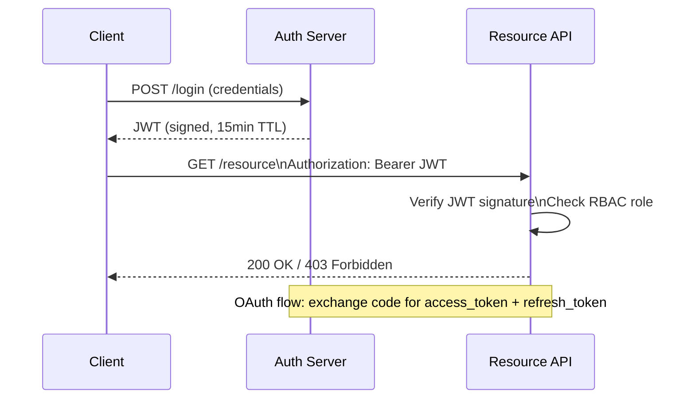

# Security Hands-On

Implement JWT authentication, OAuth flows, and role-based access control.

```mermaid
sequenceDiagram
    participant C as Client
    participant A as Auth Server
    participant R as Resource API

    C->>A: POST /login (credentials)
    A-->>C: JWT (signed, 15min TTL)
    C->>R: GET /resource\nAuthorization: Bearer JWT
    R->>R: Verify JWT signature\nCheck RBAC role
    R-->>C: 200 OK / 403 Forbidden

    Note over A,R: OAuth flow: exchange code for access_token + refresh_token
```
