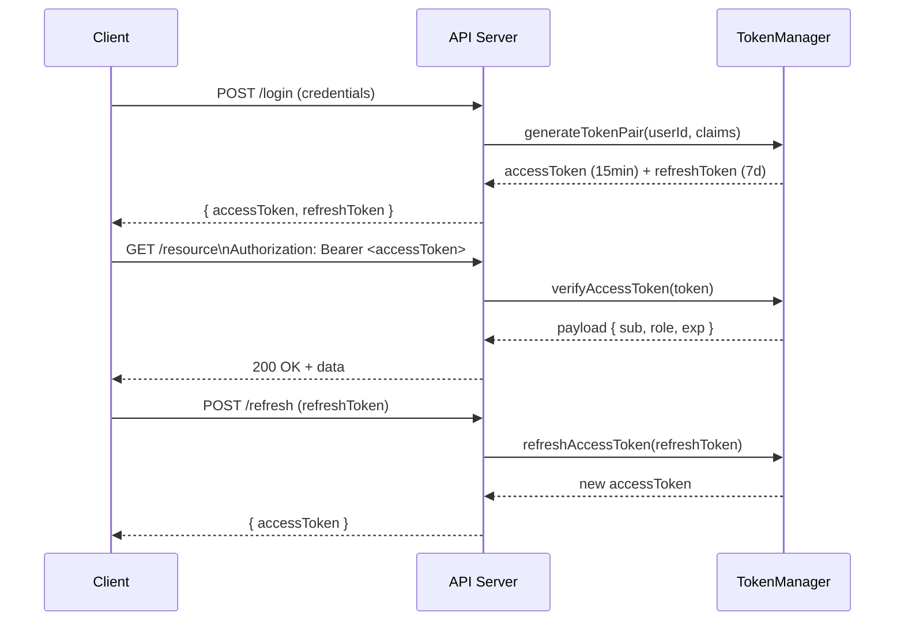

# POC #86: JWT Authentication

## 🗺️ Quick Overview



*Short-lived access tokens (15 min) keep sessions stateless and scalable; refresh tokens (7 days, stored server-side) allow revocation without invalidating every active session.*

> **Difficulty:** 🟡 Intermediate
> **Time:** 25 minutes
> **Prerequisites:** Node.js, HTTP basics, Cryptography basics

## What You'll Learn

JWT (JSON Web Token) is a stateless authentication mechanism that encodes user claims in a signed token, eliminating server-side session storage.

```
JWT STRUCTURE:
┌─────────────────────────────────────────────────────────────────┐
│                                                                 │
│  eyJhbGciOiJIUzI1NiJ9.eyJzdWIiOiIxMjM0In0.signature            │
│  ─────────────────────  ───────────────────  ─────────          │
│       HEADER                 PAYLOAD           SIGNATURE        │
│                                                                 │
│  ┌──────────────┐     ┌──────────────────┐   ┌──────────────┐  │
│  │ {            │     │ {                │   │ HMACSHA256(  │  │
│  │   "alg":"HS256",   │   "sub": "1234", │   │   header +   │  │
│  │   "typ":"JWT"│     │   "exp": 16800..│   │   payload,   │  │
│  │ }            │     │   "role": "admin"│   │   secret     │  │
│  └──────────────┘     │ }                │   │ )            │  │
│                       └──────────────────┘   └──────────────┘  │
│                                                                 │
│  ✅ Self-contained: All user info in token                     │
│  ✅ Stateless: No server-side session storage                  │
│  ✅ Scalable: Any server can validate                          │
└─────────────────────────────────────────────────────────────────┘
```

---

## Implementation

```javascript
// jwt-authentication.js
const crypto = require('crypto');

// ==========================================
// JWT UTILITIES
// ==========================================

class JWT {
  constructor(secret, options = {}) {
    this.secret = secret;
    this.algorithm = options.algorithm || 'HS256';
    this.expiresIn = options.expiresIn || 3600; // 1 hour default
  }

  // Base64URL encode (URL-safe base64)
  base64UrlEncode(data) {
    const base64 = Buffer.from(JSON.stringify(data)).toString('base64');
    return base64.replace(/\+/g, '-').replace(/\//g, '_').replace(/=/g, '');
  }

  base64UrlDecode(str) {
    let base64 = str.replace(/-/g, '+').replace(/_/g, '/');
    while (base64.length % 4) base64 += '=';
    return JSON.parse(Buffer.from(base64, 'base64').toString());
  }

  // Create signature
  sign(data) {
    return crypto
      .createHmac('sha256', this.secret)
      .update(data)
      .digest('base64')
      .replace(/\+/g, '-')
      .replace(/\//g, '_')
      .replace(/=/g, '');
  }

  // Generate token
  generateToken(payload) {
    const header = {
      alg: this.algorithm,
      typ: 'JWT'
    };

    const now = Math.floor(Date.now() / 1000);
    const tokenPayload = {
      ...payload,
      iat: now,                      // Issued at
      exp: now + this.expiresIn,     // Expiration
      jti: crypto.randomUUID()       // JWT ID (for revocation)
    };

    const headerEncoded = this.base64UrlEncode(header);
    const payloadEncoded = this.base64UrlEncode(tokenPayload);
    const signature = this.sign(`${headerEncoded}.${payloadEncoded}`);

    return `${headerEncoded}.${payloadEncoded}.${signature}`;
  }

  // Verify and decode token
  verifyToken(token) {
    const parts = token.split('.');
    if (parts.length !== 3) {
      throw new JWTError('Invalid token format');
    }

    const [headerEncoded, payloadEncoded, signature] = parts;

    // Verify signature
    const expectedSignature = this.sign(`${headerEncoded}.${payloadEncoded}`);
    if (signature !== expectedSignature) {
      throw new JWTError('Invalid signature');
    }

    // Decode payload
    const payload = this.base64UrlDecode(payloadEncoded);

    // Check expiration
    const now = Math.floor(Date.now() / 1000);
    if (payload.exp && payload.exp < now) {
      throw new JWTError('Token expired');
    }

    // Check not before
    if (payload.nbf && payload.nbf > now) {
      throw new JWTError('Token not yet valid');
    }

    return payload;
  }

  // Decode without verification (for debugging)
  decode(token) {
    const parts = token.split('.');
    if (parts.length !== 3) return null;

    return {
      header: this.base64UrlDecode(parts[0]),
      payload: this.base64UrlDecode(parts[1])
    };
  }
}

class JWTError extends Error {
  constructor(message) {
    super(message);
    this.name = 'JWTError';
  }
}

// ==========================================
// REFRESH TOKEN MANAGEMENT
// ==========================================

class TokenManager {
  constructor(jwt, options = {}) {
    this.jwt = jwt;
    this.refreshTokens = new Map(); // In production: Use Redis
    this.revokedTokens = new Set(); // Blacklist for logout
    this.accessTokenExpiry = options.accessTokenExpiry || 900;    // 15 min
    this.refreshTokenExpiry = options.refreshTokenExpiry || 604800; // 7 days
  }

  // Generate access + refresh token pair
  generateTokenPair(userId, claims = {}) {
    // Short-lived access token
    const accessToken = this.jwt.generateToken({
      sub: userId,
      type: 'access',
      ...claims
    });

    // Long-lived refresh token
    const refreshTokenId = crypto.randomUUID();
    const refreshToken = this.jwt.generateToken({
      sub: userId,
      type: 'refresh',
      jti: refreshTokenId
    });

    // Store refresh token (for revocation)
    this.refreshTokens.set(refreshTokenId, {
      userId,
      expiresAt: Date.now() + this.refreshTokenExpiry * 1000
    });

    return { accessToken, refreshToken };
  }

  // Refresh access token
  refreshAccessToken(refreshToken) {
    try {
      const payload = this.jwt.verifyToken(refreshToken);

      if (payload.type !== 'refresh') {
        throw new JWTError('Invalid token type');
      }

      // Check if refresh token is revoked
      if (!this.refreshTokens.has(payload.jti)) {
        throw new JWTError('Refresh token revoked');
      }

      // Generate new access token
      const accessToken = this.jwt.generateToken({
        sub: payload.sub,
        type: 'access'
      });

      return { accessToken };
    } catch (error) {
      throw new JWTError('Invalid refresh token');
    }
  }

  // Revoke refresh token (logout)
  revokeRefreshToken(refreshToken) {
    try {
      const payload = this.jwt.verifyToken(refreshToken);
      this.refreshTokens.delete(payload.jti);
      console.log(`🔒 Revoked refresh token: ${payload.jti}`);
    } catch (error) {
      // Token already invalid, ignore
    }
  }

  // Revoke all tokens for user (security breach)
  revokeAllUserTokens(userId) {
    for (const [jti, data] of this.refreshTokens) {
      if (data.userId === userId) {
        this.refreshTokens.delete(jti);
      }
    }
    console.log(`🔒 Revoked all tokens for user: ${userId}`);
  }

  // Verify access token
  verifyAccessToken(accessToken) {
    const payload = this.jwt.verifyToken(accessToken);

    if (payload.type !== 'access') {
      throw new JWTError('Invalid token type');
    }

    // Check blacklist (for immediate revocation)
    if (this.revokedTokens.has(payload.jti)) {
      throw new JWTError('Token revoked');
    }

    return payload;
  }
}

// ==========================================
// EXPRESS MIDDLEWARE
// ==========================================

function authMiddleware(tokenManager) {
  return (req, res, next) => {
    const authHeader = req.headers.authorization;

    if (!authHeader || !authHeader.startsWith('Bearer ')) {
      return res.status(401).json({ error: 'Missing authorization header' });
    }

    const token = authHeader.substring(7);

    try {
      const payload = tokenManager.verifyAccessToken(token);
      req.user = payload;
      next();
    } catch (error) {
      if (error.message === 'Token expired') {
        return res.status(401).json({ error: 'Token expired', code: 'TOKEN_EXPIRED' });
      }
      return res.status(401).json({ error: 'Invalid token' });
    }
  };
}

function requireRole(...roles) {
  return (req, res, next) => {
    if (!req.user) {
      return res.status(401).json({ error: 'Not authenticated' });
    }

    if (!roles.includes(req.user.role)) {
      return res.status(403).json({ error: 'Insufficient permissions' });
    }

    next();
  };
}

// ==========================================
// DEMONSTRATION
// ==========================================

async function demonstrate() {
  console.log('='.repeat(60));
  console.log('JWT AUTHENTICATION');
  console.log('='.repeat(60));

  const secret = 'your-256-bit-secret-key-here-min-32-chars';
  const jwt = new JWT(secret, { expiresIn: 900 }); // 15 min
  const tokenManager = new TokenManager(jwt);

  // Generate token pair for user
  console.log('\n--- Generating Token Pair ---');
  const { accessToken, refreshToken } = tokenManager.generateTokenPair('user-123', {
    email: 'user@example.com',
    role: 'admin'
  });

  console.log('Access Token:', accessToken.substring(0, 50) + '...');
  console.log('Refresh Token:', refreshToken.substring(0, 50) + '...');

  // Decode and inspect token
  console.log('\n--- Decoding Token ---');
  const decoded = jwt.decode(accessToken);
  console.log('Header:', decoded.header);
  console.log('Payload:', decoded.payload);

  // Verify token
  console.log('\n--- Verifying Token ---');
  try {
    const payload = tokenManager.verifyAccessToken(accessToken);
    console.log('✅ Token valid for user:', payload.sub);
    console.log('   Role:', payload.role);
    console.log('   Expires:', new Date(payload.exp * 1000).toISOString());
  } catch (error) {
    console.log('❌ Token invalid:', error.message);
  }

  // Refresh access token
  console.log('\n--- Refreshing Access Token ---');
  const { accessToken: newAccessToken } = tokenManager.refreshAccessToken(refreshToken);
  console.log('New Access Token:', newAccessToken.substring(0, 50) + '...');

  // Simulate logout (revoke refresh token)
  console.log('\n--- Logout (Revoke Refresh Token) ---');
  tokenManager.revokeRefreshToken(refreshToken);

  // Try to refresh after logout
  console.log('\n--- Attempting Refresh After Logout ---');
  try {
    tokenManager.refreshAccessToken(refreshToken);
  } catch (error) {
    console.log('✅ Correctly rejected:', error.message);
  }

  // Expired token demo
  console.log('\n--- Expired Token Demo ---');
  const shortLivedJwt = new JWT(secret, { expiresIn: 1 }); // 1 second
  const expiredToken = shortLivedJwt.generateToken({ sub: 'user-456' });
  console.log('Waiting for token to expire...');
  await new Promise(r => setTimeout(r, 1500));

  try {
    shortLivedJwt.verifyToken(expiredToken);
  } catch (error) {
    console.log('✅ Correctly rejected:', error.message);
  }

  // Tampered token demo
  console.log('\n--- Tampered Token Demo ---');
  const tamperedToken = accessToken.slice(0, -5) + 'XXXXX';
  try {
    jwt.verifyToken(tamperedToken);
  } catch (error) {
    console.log('✅ Correctly rejected:', error.message);
  }

  console.log('\n✅ Demo complete!');
}

demonstrate().catch(console.error);
```

---

## JWT Best Practices

| Practice | Recommendation |
|----------|----------------|
| **Secret Key** | Min 256 bits, use environment variable |
| **Expiration** | Short-lived (15-60 min) for access tokens |
| **Refresh Tokens** | Long-lived, stored securely, rotatable |
| **Algorithm** | HS256 for symmetric, RS256 for asymmetric |
| **Claims** | Minimal data, no sensitive info |
| **Storage** | HttpOnly cookies or secure storage |

---

## Token Types Comparison

```
ACCESS TOKEN (Short-lived):
├── Duration: 15-60 minutes
├── Contains: User ID, roles, permissions
├── Verified: On every request
└── Revocation: Wait for expiry or blacklist

REFRESH TOKEN (Long-lived):
├── Duration: 7-30 days
├── Contains: User ID, token ID only
├── Used: Only to get new access tokens
└── Revocation: Delete from database

ID TOKEN (OpenID Connect):
├── Duration: Same as access token
├── Contains: User profile info
├── Used: Client-side user display
└── Standard: OpenID Connect spec
```

---

## Security Considerations

```
✅ DO:
├── Use HTTPS only
├── Set short expiration times
├── Validate all claims (exp, iat, iss, aud)
├── Use HttpOnly cookies for web apps
├── Implement token refresh rotation
└── Log authentication events

❌ DON'T:
├── Store sensitive data in payload
├── Use weak secrets
├── Skip signature verification
├── Store tokens in localStorage (XSS risk)
├── Use JWTs for sessions (can't revoke)
└── Share tokens between services
```

---

## Related POCs

- [OAuth 2.0 Flows](/12-interview-prep/practice-pocs/oauth-flows)
- [API Key Management](/12-interview-prep/practice-pocs/api-key-management)
- [RBAC Implementation](/12-interview-prep/practice-pocs/rbac-implementation)
