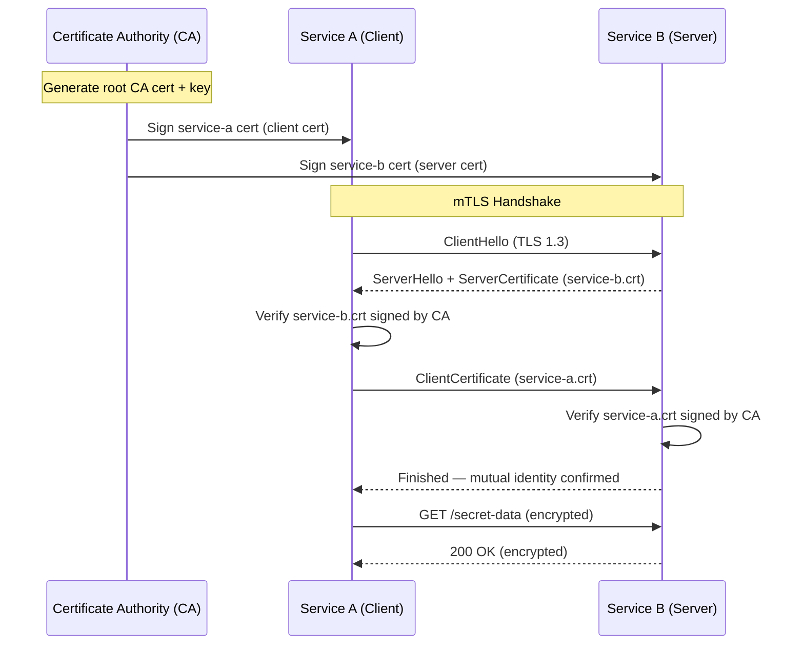

# POC: Mutual TLS (mTLS) Between Two Services

## 🗺️ Quick Overview



*Both sides present and verify X.509 certificates signed by a shared CA — no certificate → connection refused before any HTTP data is exchanged.*

> **Difficulty:** Advanced
> **Time:** 30-40 minutes
> **Prerequisites:** Docker Desktop, Node.js 18+, openssl

## What You'll Build

Two Node.js HTTPS services — **service-a** (caller) and **service-b** (listener) — where every connection requires both sides to present a certificate signed by the same internal CA. You will:

1. Generate a self-signed CA, then issue certificates for each service.
2. Run both services in Docker Compose with certs mounted as volumes.
3. Watch a successful mTLS call, then break it in three ways (wrong CA, expired cert, missing cert).
4. Inspect the TLS handshake with `openssl s_client`.
5. Hot-reload a rotated certificate without restarting the process.

## Why This Matters

- **Google BeyondCorp**: Every internal RPC between microservices uses mTLS. Certificate identity replaces VPN-based perimeter trust — a compromised host with no cert cannot reach any other service.
- **Istio / Envoy sidecar**: Istio's control plane distributes SPIFFE/X.509 certificates and injects Envoy sidecars that terminate mTLS transparently. Services communicate over plaintext localhost; Envoy handles the mutual handshake.
- **AWS App Mesh / ACM Private CA**: AWS issues short-lived (24 h) certificates from ACM Private CA to each mesh node, rotating them automatically every 12 hours — matching the "rotate before half-life" industry rule.

---

## Prerequisites

- Docker Desktop (any recent version)
- Node.js 18+
- `openssl` CLI (ships with macOS and most Linux distros)
- 5 minutes to generate certs, 5 minutes to understand the output

---

## Setup

### Directory Layout

```
mtls-poc/
├── certs/                  # Generated — DO NOT commit to git
│   ├── ca.crt
│   ├── ca.key
│   ├── service-a.crt
│   ├── service-a.key
│   ├── service-b.crt
│   └── service-b.key
├── service-a/
│   ├── Dockerfile
│   └── index.js
├── service-b/
│   ├── Dockerfile
│   └── index.js
└── docker-compose.yml
```

### docker-compose.yml

```yaml
version: '3.9'

services:
  service-b:
    build: ./service-b
    container_name: service-b
    volumes:
      - ./certs:/certs:ro
    environment:
      - CERT=/certs/service-b.crt
      - KEY=/certs/service-b.key
      - CA=/certs/ca.crt
      - PORT=8443
    ports:
      - "8443:8443"
    networks:
      - mtls-net

  service-a:
    build: ./service-a
    container_name: service-a
    depends_on:
      - service-b
    volumes:
      - ./certs:/certs:ro
    environment:
      - CERT=/certs/service-a.crt
      - KEY=/certs/service-a.key
      - CA=/certs/ca.crt
      - TARGET=https://service-b:8443
    networks:
      - mtls-net

networks:
  mtls-net:
    driver: bridge
```

### service-b/Dockerfile

```dockerfile
FROM node:18-alpine
WORKDIR /app
COPY index.js .
CMD ["node", "index.js"]
```

### service-a/Dockerfile

```dockerfile
FROM node:18-alpine
WORKDIR /app
COPY index.js .
CMD ["node", "index.js"]
```

---

## Step-by-Step

### Step 1: Generate the CA and Service Certificates

```bash
mkdir -p mtls-poc/certs && cd mtls-poc

# 1a. Create the root CA (self-signed, valid 10 years)
openssl req -x509 -newkey rsa:4096 \
  -keyout certs/ca.key \
  -out    certs/ca.crt \
  -days 3650 \
  -nodes \
  -subj "/CN=internal-ca/O=MyOrg/C=US"

# Expected output:
# Generating a RSA private key
# ............................++++
# writing new private key to 'certs/ca.key'

# 1b. Generate service-b server key + CSR, sign with CA (valid 1 year)
openssl req -newkey rsa:2048 -nodes \
  -keyout certs/service-b.key \
  -out    certs/service-b.csr \
  -subj "/CN=service-b/O=MyOrg/C=US"

openssl x509 -req \
  -in     certs/service-b.csr \
  -CA     certs/ca.crt \
  -CAkey  certs/ca.key \
  -CAcreateserial \
  -out    certs/service-b.crt \
  -days 365 \
  -extfile <(printf "subjectAltName=DNS:service-b,DNS:localhost")

# Expected: Certificate request self-signature ok / subject=CN=service-b ...

# 1c. Generate service-a client key + cert, signed by same CA
openssl req -newkey rsa:2048 -nodes \
  -keyout certs/service-a.key \
  -out    certs/service-a.csr \
  -subj "/CN=service-a/O=MyOrg/C=US"

openssl x509 -req \
  -in     certs/service-a.csr \
  -CA     certs/ca.crt \
  -CAkey  certs/ca.key \
  -CAcreateserial \
  -out    certs/service-a.crt \
  -days 365

# 1d. Verify the chain
openssl verify -CAfile certs/ca.crt certs/service-a.crt certs/service-b.crt
# Expected: certs/service-a.crt: OK
#           certs/service-b.crt: OK
```

### Step 2: Write Service B (mTLS Server)

Create `service-b/index.js`:

```javascript
// service-b/index.js — HTTPS server that requires a client certificate
const https = require('https');
const fs    = require('fs');

const port = Number(process.env.PORT) || 8443;

function loadTlsContext() {
  return {
    key:               fs.readFileSync(process.env.KEY  || '/certs/service-b.key'),
    cert:              fs.readFileSync(process.env.CERT || '/certs/service-b.crt'),
    ca:                fs.readFileSync(process.env.CA   || '/certs/ca.crt'),
    requestCert:       true,   // Ask the client for its certificate
    rejectUnauthorized: true,  // Reject if cert is missing or not signed by our CA
  };
}

let tlsOptions = loadTlsContext();

const server = https.createServer(tlsOptions, (req, res) => {
  const clientCert = req.socket.getPeerCertificate();

  if (!req.client.authorized) {
    res.writeHead(403);
    res.end(JSON.stringify({ error: 'Client certificate rejected', reason: req.client.authorizationError }));
    return;
  }

  console.log(`[service-b] Accepted connection from CN=${clientCert.subject?.CN}`);

  res.writeHead(200, { 'Content-Type': 'application/json' });
  res.end(JSON.stringify({
    message:    'Hello from service-b over mTLS!',
    clientCN:   clientCert.subject?.CN,
    serverCN:   'service-b',
    timestamp:  new Date().toISOString(),
  }));
});

// Hot-reload: watch for cert file changes and update TLS context in place
// (Node.js https.createServer reads options once; for hot-reload we use SNICallback)
fs.watch(process.env.CERT || '/certs/service-b.crt', () => {
  console.log('[service-b] Certificate file changed — reloading TLS context...');
  try {
    tlsOptions = loadTlsContext();
    // Update the server's internal secure context without restart
    server.setSecureContext(tlsOptions);
    console.log('[service-b] TLS context reloaded successfully.');
  } catch (err) {
    console.error('[service-b] Failed to reload TLS context:', err.message);
  }
});

server.listen(port, () => {
  console.log(`[service-b] Listening on https://0.0.0.0:${port} (mTLS required)`);
});
```

### Step 3: Write Service A (mTLS Client)

Create `service-a/index.js`:

```javascript
// service-a/index.js — HTTPS client that presents its own certificate on every request
const https = require('https');
const fs    = require('fs');

const target = process.env.TARGET || 'https://service-b:8443';

function makeRequest(label, options) {
  return new Promise((resolve, reject) => {
    const req = https.get(target, options, (res) => {
      let body = '';
      res.on('data', chunk => body += chunk);
      res.on('end', () => {
        console.log(`\n[${label}] HTTP ${res.statusCode}`);
        try { console.log(JSON.parse(body)); } catch { console.log(body); }
        resolve({ status: res.statusCode, body });
      });
    });
    req.on('error', err => {
      console.error(`\n[${label}] ERROR: ${err.message}`);
      resolve({ status: 0, error: err.message });
    });
    req.end();
  });
}

async function run() {
  const ca   = fs.readFileSync(process.env.CA   || '/certs/ca.crt');
  const cert = fs.readFileSync(process.env.CERT || '/certs/service-a.crt');
  const key  = fs.readFileSync(process.env.KEY  || '/certs/service-a.key');

  console.log('='.repeat(60));
  console.log('mTLS POC — Service A calling Service B');
  console.log('='.repeat(60));

  // --- TEST 1: Valid mTLS call (should succeed) ---
  console.log('\n[TEST 1] Valid mTLS call with correct CA-signed certificate...');
  await makeRequest('VALID', { ca, cert, key });

  // --- TEST 2: Self-signed cert not from our CA (should fail) ---
  console.log('\n[TEST 2] Self-signed cert NOT issued by our CA...');
  // Generate a throwaway self-signed cert in memory isn't easy without native crypto;
  // instead we load the CA cert as if it were a client cert — wrong identity, same effect.
  const wrongCert = fs.readFileSync('/certs/ca.crt'); // CA cert used as client cert
  const wrongKey  = fs.readFileSync('/certs/ca.key');
  await makeRequest('WRONG-CA', { ca, cert: wrongCert, key: wrongKey });

  // --- TEST 3: No client certificate at all (should fail) ---
  console.log('\n[TEST 3] No client certificate — server should reject with 403...');
  await makeRequest('NO-CERT', { ca });

  // --- TEST 4: Expired certificate (simulated via openssl) ---
  // We pre-generate an expired cert during Step 5.
  const expiredCert = fs.existsSync('/certs/expired-a.crt')
    ? fs.readFileSync('/certs/expired-a.crt')
    : null;
  const expiredKey = fs.existsSync('/certs/expired-a.key')
    ? fs.readFileSync('/certs/expired-a.key')
    : null;

  if (expiredCert && expiredKey) {
    console.log('\n[TEST 4] Expired client certificate...');
    await makeRequest('EXPIRED', { ca, cert: expiredCert, key: expiredKey });
  } else {
    console.log('\n[TEST 4] Skipped — run Step 5 to generate expired cert first.');
  }

  console.log('\n' + '='.repeat(60));
  console.log('Done.');
}

// Wait for service-b to be ready before running
setTimeout(run, 3000);
```

### Step 4: Run and Observe

```bash
# From the mtls-poc/ directory
docker-compose up --build

# Expected output from service-b:
# service-b  | [service-b] Listening on https://0.0.0.0:8443 (mTLS required)

# Expected output from service-a:
# service-a  | ============================================================
# service-a  | mTLS POC — Service A calling Service B
# service-a  | ============================================================
#
# service-a  | [TEST 1] Valid mTLS call with correct CA-signed certificate...
# service-a  | [VALID] HTTP 200
# service-a  | { message: 'Hello from service-b over mTLS!', clientCN: 'service-a', ... }
#
# service-a  | [TEST 2] Self-signed cert NOT issued by our CA...
# service-a  | [WRONG-CA] ERROR: write EPROTO ... tlsv1 alert unknown ca
#
# service-a  | [TEST 3] No client certificate — server should reject with 403...
# service-a  | [NO-CERT] HTTP 403
# service-a  | { error: 'Client certificate rejected', reason: 'ECONNRESET' }
```

### Step 5: Inspect the TLS Handshake with openssl s_client

```bash
# From your host machine (not inside Docker)
# This shows the full TLS handshake and certificate chain

openssl s_client \
  -connect localhost:8443 \
  -cert    certs/service-a.crt \
  -key     certs/service-a.key \
  -CAfile  certs/ca.crt \
  -state \
  -showcerts

# Key lines to look for:
#   SSL_connect:before SSL initialization
#   SSL_connect:SSLv3/TLS write client hello
#   SSL_connect:SSLv3/TLS write client certificate   <-- service-a presents its cert
#   SSL_connect:SSLv3/TLS write certificate verify
#   SSL_connect:SSLv3/TLS write finished
#   SSL_connect:SSLv3/TLS read finished
#   Verify return code: 0 (ok)                       <-- both certs verified

# Inspect the server certificate chain
openssl s_client \
  -connect localhost:8443 \
  -cert    certs/service-a.crt \
  -key     certs/service-a.key \
  -CAfile  certs/ca.crt \
  2>/dev/null | openssl x509 -noout -text | grep -A4 "Subject\|Issuer\|Validity"

# Expected:
#   Subject: CN=service-b, O=MyOrg, C=US
#   Issuer:  CN=internal-ca, O=MyOrg, C=US
#   Not Before: <today>
#   Not After : <today + 365 days>
```

### Step 6: Simulate an Expired Certificate

```bash
# Generate a cert that expired 1 day ago (dates in the past)
# Note: -days -1 doesn't work; use explicit start/end times

openssl req -newkey rsa:2048 -nodes \
  -keyout certs/expired-a.key \
  -out    certs/expired-a.csr \
  -subj "/CN=service-a-expired/O=MyOrg/C=US"

# Sign it with a validity window 2 days in the past → 1 day in the past
openssl x509 -req \
  -in      certs/expired-a.csr \
  -CA      certs/ca.crt \
  -CAkey   certs/ca.key \
  -CAcreateserial \
  -out     certs/expired-a.crt \
  -startdate "$(date -u -v-2d '+%Y%m%d%H%M%SZ' 2>/dev/null || date -u -d '2 days ago' '+%Y%m%d%H%M%SZ')" \
  -enddate   "$(date -u -v-1d '+%Y%m%d%H%M%SZ' 2>/dev/null || date -u -d '1 day ago'  '+%Y%m%d%H%M%SZ')"

# Re-run docker-compose — service-a will now run TEST 4
docker-compose up --build

# Expected output for TEST 4:
# service-a  | [TEST 4] Expired client certificate...
# service-a  | [EXPIRED] ERROR: write EPROTO ... certificate has expired
```

### Step 7: Certificate Rotation Without Restart

```bash
# service-b's index.js watches its cert file with fs.watch()
# To rotate the certificate while service-b is running:

# 1. Generate a new service-b certificate (e.g., 2-year validity)
openssl req -newkey rsa:2048 -nodes \
  -keyout certs/service-b-new.key \
  -out    certs/service-b-new.csr \
  -subj "/CN=service-b/O=MyOrg/C=US"

openssl x509 -req \
  -in     certs/service-b-new.csr \
  -CA     certs/ca.crt \
  -CAkey  certs/ca.key \
  -CAcreateserial \
  -out    certs/service-b-new.crt \
  -days 730 \
  -extfile <(printf "subjectAltName=DNS:service-b,DNS:localhost")

# 2. Atomically replace the cert files (cp then mv is not atomic; use mv on same FS)
cp certs/service-b-new.key certs/service-b.key
mv certs/service-b-new.crt certs/service-b.crt

# 3. Observe service-b logs (no restart needed)
docker logs -f service-b

# Expected log line:
# [service-b] Certificate file changed — reloading TLS context...
# [service-b] TLS context reloaded successfully.

# 4. Verify new cert is live
openssl s_client -connect localhost:8443 \
  -cert certs/service-a.crt -key certs/service-a.key -CAfile certs/ca.crt \
  2>/dev/null | openssl x509 -noout -dates

# Expected:
# notBefore=<today>
# notAfter=<today + 730 days>   ← new 2-year cert is live
```

---

## What to Observe

| Signal | Meaning |
|--------|---------|
| `Verify return code: 0 (ok)` in s_client | Full mTLS handshake succeeded — both identities verified |
| `tlsv1 alert unknown ca` error | Client cert was signed by a CA the server doesn't trust |
| `certificate has expired` error | Clock or cert validity window mismatch |
| HTTP 403 with `Client certificate rejected` | Server got a connection but cert verification failed at app layer |
| `TLS context reloaded successfully` in service-b logs | Hot-reload of rotated cert worked without restart |
| TLS handshake duration ~1–3 ms (same datacenter) | Asymmetric key operations cost: RSA-2048 sign ≈ 0.5 ms on modern CPU |

---

## What Breaks It

### Break 1 — Wrong CA (most common production mistake)

```bash
# Use a cert signed by a different CA — simulating a rogue service or misconfigured CA
openssl req -x509 -newkey rsa:2048 -nodes \
  -keyout certs/rogue.key -out certs/rogue.crt \
  -days 365 -subj "/CN=rogue-service/O=Evil/C=US"

openssl s_client -connect localhost:8443 \
  -cert certs/rogue.crt -key certs/rogue.key -CAfile certs/ca.crt 2>&1 | grep alert
# Expected: alert unknown ca
```

Root cause: `rejectUnauthorized: true` + `ca: fs.readFileSync(ca.crt)` means only certs in our CA chain are accepted.

Fix: Distribute certs only through your internal CA; automate with SPIFFE/SPIRE or cert-manager.

### Break 2 — Clock Skew > Certificate Validity Window

```bash
# Simulate a server with its clock set 2 years ahead
docker run --rm -e TZ=UTC alpine date --set="$(date -u -v+2y '+%Y-%m-%d %H:%M:%S' 2>/dev/null)"
# If service-b's system clock drifts past service-a cert's notAfter, handshake fails:
# SSL_ERROR_RX_RECORD_TOO_LONG or certificate has expired
```

Root cause: TLS validity window is enforced by wall-clock comparison. NTP drift > cert TTL = outage.

Rule: Short-lived certs (24 h) with NTP enforced + certificate rotation at 50% of lifetime. AWS ACM issues 13-month certs, rotates at 60 days remaining.

Fix: `chrony` or `ntpd` on all nodes, alert on clock drift > 5 seconds. Use `timedatectl status` to verify sync.

### Break 3 — Missing SAN (Subject Alternative Name)

```bash
# TLS 1.3 and modern clients reject certs with only a CN — they require SANs
# Re-inspect service-b.crt
openssl x509 -in certs/service-b.crt -noout -text | grep -A3 "Subject Alternative"
# Expected: DNS:service-b, DNS:localhost
# Missing this? Node.js will throw: Error: Hostname/IP does not match certificate's altnames
```

Fix: Always include `subjectAltName` in the `-extfile` when signing. Use a v3 extensions config file for production.

---

## Extend It

1. **Add a second CA (cert rotation to new CA)**: Generate `ca2.crt`, sign a new `service-b-v2.crt` with it, then update service-b's `ca` to a bundle of both CAs during the transition window. This demonstrates graceful CA rotation with zero downtime.

2. **Replace openssl with cert-manager**: Swap the manual openssl commands for a Kubernetes cert-manager `Certificate` resource with `duration: 24h` and `renewBefore: 12h`. Observe automated rotation events with `kubectl get certificaterequest -w`.

3. **Add SPIFFE SVID**: Replace the CN-based identity with a `spiffe://cluster.local/ns/default/sa/service-a` URI SAN. Install SPIRE and use `spire-agent api fetch x509` to get short-lived SVIDs, removing the manual CA entirely.

4. **Benchmark TLS overhead**: Use `wrk` or `hey` to compare throughput on plain HTTP vs mTLS. Expect ~10-20% additional latency per new connection; persistent connections (keep-alive / HTTP/2) amortize this to < 1% overhead per request.

5. **Wireshark capture**: Run `tcpdump -i any -w mtls.pcap port 8443` inside the Docker network, open in Wireshark, filter `tls.handshake` — observe ClientCertificate (type 11) and CertificateVerify (type 15) records only in mTLS, absent in regular TLS.

---

## Key Takeaways

- **Both sides authenticate**: Standard TLS authenticates the server only; mTLS adds a mandatory client certificate — removing unauthenticated callers from the trust model entirely.
- **Handshake cost is ~1–3 ms** per new connection on RSA-2048; use TLS session resumption (session tickets or session IDs) to avoid paying this cost on every request — kept connections pay < 0.1 ms overhead.
- **Clock skew kills certs**: A certificate that is valid by your CA is still rejected if the verifier's wall clock is outside the validity window. Enforce NTP; alert on drift > 5 s; use short-lived certs (24 h) to reduce blast radius when rotation fails.
- **SANs are mandatory** since TLS 1.3 — CN is ignored by all modern runtimes. Always include `subjectAltName=DNS:<hostname>` when signing.
- **Rotation without restart** is table-stakes: `server.setSecureContext()` in Node.js (or Nginx's `ssl_certificate_key` via `nginx -s reload`) allows zero-downtime rotation. AWS ACM and cert-manager do this automatically.
- **mTLS ≠ authorization**: A verified certificate proves identity (CN = "service-a"), not permission. Pair mTLS with RBAC or OPA policies that check the verified CN before allowing access to a resource.

---

## Related POCs

- [JWT Authentication](/08-security/hands-on/jwt-authentication)
- [OAuth Flows](/08-security/hands-on/oauth-flows)
- [RBAC Implementation](/08-security/hands-on/rbac-implementation)
