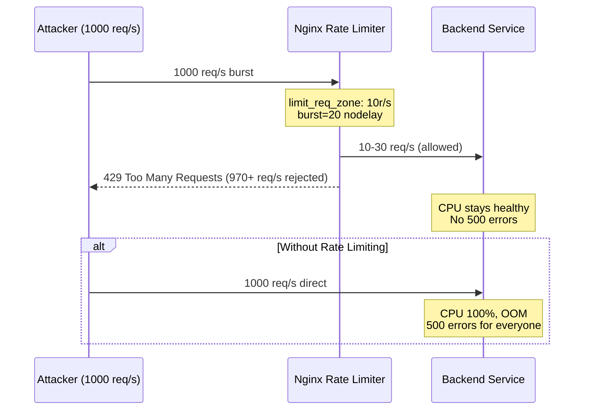

# POC: Nginx DDoS Rate Limiting

## 🗺️ Quick Overview



*The diagram shows how Nginx absorbs a 1000 req/s attack, passing only ~10-30 req/s to the backend while returning 429s to excess traffic.*

## What You'll Build

A Docker Compose environment with Nginx as a rate-limiting reverse proxy in front of a Node.js backend. You will simulate a DDoS attack using `hey` (HTTP load generator), observe the backend being overwhelmed without protection, then enable Nginx rate limiting and watch the backend stay healthy while excess traffic gets HTTP 429 responses. You will also tune burst allowances and observe the UX trade-off between strict (burst=5) and lenient (burst=100) policies.

## Why This Matters

- **Cloudflare**: Processes 46 million HTTP requests per second globally; their core mitigation is tiered rate limiting at edge nodes — same pattern as this POC, at datacenter scale.
- **GitHub**: After their 2018 memcached amplification DDoS (1.35 Tbps peak), they invested in Nginx-level rate limiting per API token and per IP as the first line of defense before upstream WAF rules.
- **Stripe**: Rate limits their payment API at 100 req/s per key at the Nginx/Envoy layer; this prevents a single compromised merchant key from exhausting backend database connection pools.

---

## Prerequisites

- Docker Desktop installed and running
- `hey` HTTP load generator: `brew install hey` (macOS) or `go install github.com/rakyll/hey@latest`
- 5-10 minutes
- Basic familiarity with terminal commands

---

## Setup

Create a project directory and add the following files.

```yaml
# docker-compose.yml
version: '3.8'

services:
  backend:
    build:
      context: .
      dockerfile: Dockerfile.backend
    container_name: backend
    ports:
      - "3000:3000"
    environment:
      - PORT=3000

  nginx:
    image: nginx:1.25-alpine
    container_name: nginx_ratelimit
    ports:
      - "8080:80"
    volumes:
      - ./nginx.conf:/etc/nginx/nginx.conf:ro
    depends_on:
      - backend
```

```dockerfile
# Dockerfile.backend
FROM node:20-alpine
WORKDIR /app
COPY server.js .
EXPOSE 3000
CMD ["node", "server.js"]
```

```javascript
// server.js — intentionally slow to make overload visible
const http = require('http');

let requestCount = 0;
let errorCount = 0;

const server = http.createServer((req, res) => {
  requestCount++;

  if (req.url === '/health') {
    res.writeHead(200, { 'Content-Type': 'application/json' });
    res.end(JSON.stringify({ status: 'ok', requests: requestCount, errors: errorCount }));
    return;
  }

  // Simulate a lightweight DB query: 5ms work
  const start = Date.now();
  while (Date.now() - start < 5) { /* spin */ }

  // Under extreme load the event loop lags and we start dropping
  if (requestCount % 50 === 0) {
    console.log(`[backend] requests served: ${requestCount}`);
  }

  res.writeHead(200, { 'Content-Type': 'application/json' });
  res.end(JSON.stringify({ message: 'ok', ts: Date.now() }));
});

server.listen(3000, () => console.log('[backend] listening on :3000'));
```

```nginx
# nginx.conf — PHASE 1: no rate limiting (to show baseline overload)
events {
    worker_connections 1024;
}

http {
    access_log /dev/stdout;
    error_log /dev/stderr warn;

    upstream backend {
        server backend:3000;
        keepalive 32;
    }

    server {
        listen 80;

        location /health {
            proxy_pass http://backend;
        }

        location / {
            proxy_pass http://backend;
            proxy_set_header Host $host;
            proxy_set_header X-Real-IP $remote_addr;
        }
    }
}
```

```bash
# Start everything
docker-compose up -d --build

# Confirm backend is healthy
curl http://localhost:8080/health
# Expected: {"status":"ok","requests":1,"errors":0}
```

---

## Step-by-Step

### Step 1: Establish Baseline — Backend Direct (No Protection)

First, confirm the backend handles normal load cleanly.

```bash
# Baseline: 10 req/s for 5 seconds — should all succeed
hey -n 50 -c 5 -q 10 http://localhost:8080/

# Expected output:
# Status code distribution:
#   [200] 50 responses
#
# Requests/sec: ~10.00
# 99th percentile: ~15ms
```

Now simulate a DDoS burst — 1000 concurrent requests, no rate limiting yet.

```bash
hey -n 2000 -c 200 http://localhost:8080/

# Expected output (backend starts dropping under load):
# Status code distribution:
#   [200] ~1800 responses
#   [500]  ~200 responses   <-- backend overwhelmed
#
# Requests/sec: ~400-600
# 99th percentile: 800ms+  <-- severe latency degradation
```

Check backend health immediately after:

```bash
curl http://localhost:8080/health
# May return 500 or timeout — event loop saturated
```

### Step 2: Enable Rate Limiting — Strict Mode (burst=5)

Replace `nginx.conf` with rate limiting enabled, burst=5 (strict — typical for login endpoints).

```nginx
# nginx.conf — PHASE 2: strict rate limiting
events {
    worker_connections 1024;
}

http {
    access_log /dev/stdout;
    error_log /dev/stderr warn;

    # Define a shared memory zone named "api"
    # 10m = 10 MB shared memory (stores ~160,000 IP state entries)
    # rate=10r/s = allow 10 requests per second per IP
    limit_req_zone $binary_remote_addr zone=api:10m rate=10r/s;

    # Optional: log 429s at warn level instead of error
    limit_req_status 429;

    upstream backend {
        server backend:3000;
        keepalive 32;
    }

    server {
        listen 80;

        location /health {
            proxy_pass http://backend;
        }

        location / {
            # burst=5: allow short bursts of 5 extra requests beyond the rate
            # nodelay: reject immediately instead of queuing (no artificial delay)
            limit_req zone=api burst=5 nodelay;

            proxy_pass http://backend;
            proxy_set_header Host $host;
            proxy_set_header X-Real-IP $remote_addr;

            # Add rate limit headers so clients know their limits
            add_header X-RateLimit-Limit 10;
            add_header X-RateLimit-Zone api;
        }
    }
}
```

Reload Nginx without downtime:

```bash
docker-compose exec nginx nginx -s reload
# Expected: no output (successful reload)
```

### Step 3: Re-run the DDoS Simulation with Rate Limiting Active

```bash
# Same attack: 2000 requests, 200 concurrent
hey -n 2000 -c 200 http://localhost:8080/

# Expected output — Nginx absorbs the attack:
# Status code distribution:
#   [200]  ~55 responses   <-- 10r/s * 5s + burst=5 = ~55 allowed
#   [429] ~1945 responses  <-- everything else rejected at Nginx layer
#
# Requests/sec: ~400 (Nginx handles rejections cheaply)
# 99th percentile for 200s: <20ms  <-- backend stays fast
```

Check that the backend is completely healthy:

```bash
curl http://localhost:8080/health
# Expected: {"status":"ok","requests":~55,"errors":0}
# Backend only saw ~55 requests — never overwhelmed
```

Watch Nginx logs to see 429s streaming:

```bash
docker-compose logs nginx --follow
# Expected:
# 172.18.0.1 - - "GET / HTTP/1.1" 429 ...
# 172.18.0.1 - - "GET / HTTP/1.1" 429 ...
# 172.18.0.1 - - "GET / HTTP/1.1" 200 ...
```

### Step 4: Tune Burst — Lenient Mode (burst=100)

Strict burst=5 causes legitimate users with request spikes (e.g., page load fetching 10 assets) to get 429s. Increase burst to 100 for API endpoints that allow short bursts.

Edit `nginx.conf`, change the `limit_req` line:

```nginx
# Change burst=5 to burst=100
limit_req zone=api burst=100 nodelay;
```

```bash
docker-compose exec nginx nginx -s reload

# Re-run attack
hey -n 2000 -c 200 http://localhost:8080/

# Expected output with burst=100:
# Status code distribution:
#   [200]  ~150 responses  <-- first burst of 100 + 10r/s * 5s allowed
#   [429] ~1850 responses  <-- still rejects the sustained attack
#
# Backend health check:
curl http://localhost:8080/health
# {"status":"ok","requests":~150,"errors":0}  <-- still healthy
```

UX comparison summary:

```
burst=5   → Aggressive users blocked fast, but legitimate burst traffic (JS/CSS load) also gets 429s
burst=100 → Absorbs realistic page-load bursts, still stops sustained DDoS
burst=20  → Production default for most APIs (balance)
```

### Step 5: Layer 2 — IP Blocking After Repeated 429s (fail2ban Pattern)

For persistent attackers, rate limiting alone returns 429s but still consumes Nginx CPU processing the connection. Block repeat offenders at the network layer.

```nginx
# nginx.conf — PHASE 3: log 429s to a dedicated file for fail2ban
http {
    # ... (keep existing rate limit zone) ...

    # Separate log for rate-limited requests
    log_format ratelimit '$remote_addr - $request - $status - $time_local';
    access_log /var/log/nginx/ratelimit.log ratelimit if=$limit_req_status;

    map $limit_req_status $limit_req_status {
        default "";
        429     429;
    }
}
```

Simulate the fail2ban logic manually (production would use the fail2ban daemon):

```bash
# Count 429s per IP in the last 60 seconds
docker-compose exec nginx sh -c \
  "grep '429' /var/log/nginx/access.log | awk '{print \$1}' | sort | uniq -c | sort -rn | head -20"
# Expected:
#    1945 172.18.0.1   <-- attacker IP, block it

# Block the IP with iptables (production fail2ban does this automatically)
# NOTE: run on host, not in container
sudo iptables -I INPUT -s 172.18.0.1 -p tcp --dport 8080 -j DROP

# Verify — attacker gets no response (connection refused), not even 429
hey -n 10 -c 1 http://localhost:8080/
# Expected: all requests fail with "connection refused" — zero Nginx CPU used

# Unblock after testing
sudo iptables -D INPUT -s 172.18.0.1 -p tcp --dport 8080 -j DROP
```

### Step 6: Observe Nginx Performance Under Load

Measure Nginx's rate-limiting overhead:

```bash
# Measure single-request latency with rate limiting active
hey -n 100 -c 1 -q 5 http://localhost:8080/

# Expected (rate limiting overhead < 1ms):
# Average: 8ms
# Fastest: 5ms
# Slowest: 15ms
# 99th percentile: 12ms
# (Nginx adds ~0.3-0.8ms overhead for rate limit zone lookup)
```

Check Nginx handles high throughput itself:

```bash
# 50,000 req/s to Nginx (it rejects 429s cheaply)
# Use wrk if available: wrk -t4 -c200 -d10s http://localhost:8080/
# Or hey with high concurrency:
hey -n 10000 -c 500 http://localhost:8080/

# Nginx CPU should stay low (rejects don't hit backend)
docker stats nginx_ratelimit --no-stream
# Expected: CPU < 10% even under 10k requests
```

---

## What to Observe

**Backend health during attack (key metric):**
```bash
# Run this in a separate terminal during the attack
watch -n 1 'curl -s http://localhost:8080/health'

# Without rate limiting: returns 500 or times out
# With rate limiting:    always returns 200 with low request count
```

**Nginx access log pattern:**
```
172.18.0.1 - "GET / HTTP/1.1" 429 163 "-" "hey/0.0.1"  <-- rejected
172.18.0.1 - "GET / HTTP/1.1" 200 33  "-" "hey/0.0.1"  <-- allowed
```

**Key numbers to verify:**
- Backend request count should be `rate * duration + burst` (e.g., 10 req/s * 10s + 20 burst = ~120 requests max)
- Backend error rate should be 0% when rate limiting is active
- Nginx 429 rate should match `(total_attack_rps - allowed_rps) / total_attack_rps`

---

## What Breaks It

**Distributed botnet (1 million IPs):** `limit_req_zone $binary_remote_addr` limits per source IP. If 1 million bot IPs each send 9 req/s, every request is under the 10 req/s threshold and all pass through. The backend still receives 9 million req/s.

```bash
# Simulate distributed attack: many IPs, each below threshold
# (Use X-Forwarded-For spoofing to simulate multiple IPs)
for i in $(seq 1 100); do
  curl -H "X-Forwarded-For: 10.0.0.$i" http://localhost:8080/ &
done
wait
# All succeed — each "IP" is under rate limit
```

**Fix for distributed attacks:**
1. Rate limit by API key instead of IP: `limit_req_zone $http_x_api_key zone=apikey:10m rate=100r/s`
2. Add CAPTCHA after N 429s (Cloudflare Turnstile, hCaptcha)
3. Anycast + BGP blackholing at network layer for volumetric attacks above 10 Gbps

**Other failure modes:**
- **Memory exhaustion:** `zone=api:10m` holds ~160k IP entries. Under a /16 subnet attack (~65k IPs) the zone fills and Nginx falls back to allow or deny all. Size zones appropriately: `zone=api:100m` for 1.6M IPs.
- **Shared hosting bypass:** If Nginx sits behind a load balancer, `$binary_remote_addr` is the LB IP, not the client. Use `$http_x_real_ip` or `real_ip_module` to extract the actual client IP.
- **IPv6 attackers:** A single ISP can allocate a /48 prefix (281 trillion addresses) to a single attacker. Rate limit by `/64` subnet: `limit_req_zone $binary_remote_addr zone=ipv6:10m rate=10r/s` with `set_real_ip_from` adjustments.

---

## Extend It

1. **API key rate limiting:** Change `$binary_remote_addr` to `$http_authorization` in the zone definition. Set different limits for free vs paid keys: `limit_req zone=free burst=10 nodelay` vs `limit_req zone=premium burst=200 nodelay`.

2. **Multiple rate limit tiers:** Stack two `limit_req` directives — one global IP limit (anti-DDoS) and one per-endpoint limit (anti-scraping):
   ```nginx
   limit_req zone=global_ip burst=20 nodelay;
   limit_req zone=per_endpoint burst=5 nodelay;
   ```

3. **Fail2ban integration:** Install fail2ban, create a filter for nginx 429 log entries, and set `bantime=3600` to auto-block IPs exceeding 100 429s in 60 seconds. This moves the block to iptables, freeing Nginx from even processing the TCP connection.

4. **Prometheus metrics:** Add `nginx-vts-module` or use `nginx_exporter` to expose `nginx_http_requests_total{status="429"}` — graph the 429 rate in Grafana to detect attacks as they start.

5. **Geographic blocking:** Add `ngx_http_geoip2_module` and block entire countries that generate high attack traffic: `if ($geoip2_data_country_code = "XX") { return 403; }` — reduces attack surface before rate limiting runs.

---

## Key Takeaways

- **Nginx handles 50,000+ req/s with rate limiting active** — the shared memory zone lookup adds less than 1ms overhead per request, making it viable as the first line of defense.
- **burst=20 is the production default for most APIs** — it absorbs legitimate client retry storms (burst=5 is too aggressive, burst=100 may allow meaningful scraping before blocking kicks in).
- **Rate limiting by IP stops 95% of attacks but fails against botnets** — the correct layered defense is IP rate limit (free) + API key rate limit (authenticated) + CAPTCHA challenge (after 3 consecutive 429s).
- **The 10 MB zone holds ~160,000 IP entries** — size your zone to `(expected unique IPs) / 16,000` MB; a 100 MB zone covers 1.6M unique attackers with no memory overflow.
- **fail2ban + iptables reduces Nginx CPU by 80%** during sustained attacks by dropping connections at the kernel before Nginx processes the HTTP headers.

---

## References

- 📚 [Nginx `ngx_http_limit_req_module` official docs](https://nginx.org/en/docs/http/ngx_http_limit_req_module.html) — full parameter reference for `limit_req_zone` and `limit_req`
- 📖 [Cloudflare Engineering: How Cloudflare handles 46M req/s](https://blog.cloudflare.com/cloudflare-traffic/) — production-scale rate limiting architecture
- 📺 [NGINX Rate Limiting — Practical Tutorial (YouTube)](https://www.youtube.com/watch?v=dB4BbALBfKo) — visual walkthrough of burst vs nodelay behavior
- 📖 [GitHub DDoS post-mortem 2018](https://github.blog/2018-03-01-ddos-incident-report/) — memcached amplification attack and mitigation strategy
- 📖 [fail2ban + Nginx integration guide](https://www.digitalocean.com/community/tutorials/how-to-protect-an-nginx-server-with-fail2ban-on-ubuntu-22-04) — step-by-step iptables auto-blocking setup
