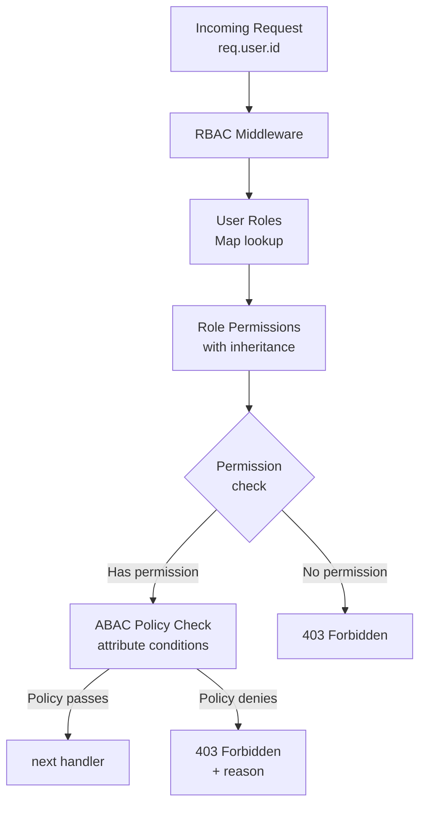

# POC #90: RBAC Implementation

## 🗺️ Quick Overview



*RBAC keeps permission logic out of business code — roles inherit from parent roles, and optional ABAC policies layer on fine-grained attribute checks like "only edit your own posts".*

> **Difficulty:** 🟡 Intermediate
> **Time:** 30 minutes
> **Prerequisites:** Node.js, Database basics

## What You'll Learn

Role-Based Access Control (RBAC) manages user permissions through roles. Users are assigned roles, and roles have permissions. This simplifies permission management at scale.

```
RBAC HIERARCHY:
┌─────────────────────────────────────────────────────────────────┐
│                                                                 │
│  USERS           ROLES              PERMISSIONS                 │
│  ─────           ─────              ───────────                 │
│                                                                 │
│  ┌─────────┐     ┌─────────┐       ┌─────────────────┐         │
│  │  Alice  │────▶│  Admin  │──────▶│ users:read      │         │
│  └─────────┘     └─────────┘       │ users:write     │         │
│                       │            │ users:delete    │         │
│  ┌─────────┐         │            │ posts:read      │         │
│  │   Bob   │────▶────┘            │ posts:write     │         │
│  └─────────┘                      │ settings:manage │         │
│       │                            └─────────────────┘         │
│       │          ┌─────────┐       ┌─────────────────┐         │
│       └─────────▶│  Editor │──────▶│ posts:read      │         │
│                  └─────────┘       │ posts:write     │         │
│  ┌─────────┐          │            └─────────────────┘         │
│  │ Charlie │─────────┘                                         │
│  └─────────┘                                                   │
│       │          ┌─────────┐       ┌─────────────────┐         │
│       └─────────▶│  Viewer │──────▶│ posts:read      │         │
│                  └─────────┘       └─────────────────┘         │
│                                                                 │
└─────────────────────────────────────────────────────────────────┘
```

---

## Implementation

```javascript
// rbac-implementation.js

// ==========================================
// RBAC CORE
// ==========================================

class RBAC {
  constructor() {
    this.roles = new Map();           // roleName -> { permissions, inherits }
    this.userRoles = new Map();       // userId -> Set<roleName>
    this.resourcePermissions = new Map(); // resource:action -> conditions
  }

  // ==========================================
  // ROLE MANAGEMENT
  // ==========================================

  // Define a role with permissions
  defineRole(roleName, permissions = [], inherits = []) {
    this.roles.set(roleName, {
      permissions: new Set(permissions),
      inherits: new Set(inherits)
    });
    console.log(`📋 Defined role: ${roleName} with ${permissions.length} permissions`);
    return this;
  }

  // Get all permissions for a role (including inherited)
  getRolePermissions(roleName, visited = new Set()) {
    if (visited.has(roleName)) return new Set();  // Prevent circular
    visited.add(roleName);

    const role = this.roles.get(roleName);
    if (!role) return new Set();

    const permissions = new Set(role.permissions);

    // Add inherited permissions
    for (const parentRole of role.inherits) {
      const parentPerms = this.getRolePermissions(parentRole, visited);
      parentPerms.forEach(p => permissions.add(p));
    }

    return permissions;
  }

  // ==========================================
  // USER-ROLE ASSIGNMENT
  // ==========================================

  // Assign role to user
  assignRole(userId, roleName) {
    if (!this.roles.has(roleName)) {
      throw new Error(`Role not found: ${roleName}`);
    }

    if (!this.userRoles.has(userId)) {
      this.userRoles.set(userId, new Set());
    }

    this.userRoles.get(userId).add(roleName);
    console.log(`👤 Assigned role ${roleName} to user ${userId}`);
    return this;
  }

  // Remove role from user
  removeRole(userId, roleName) {
    const userRoles = this.userRoles.get(userId);
    if (userRoles) {
      userRoles.delete(roleName);
    }
    return this;
  }

  // Get all roles for a user
  getUserRoles(userId) {
    return Array.from(this.userRoles.get(userId) || []);
  }

  // Get all permissions for a user
  getUserPermissions(userId) {
    const userRoles = this.userRoles.get(userId) || new Set();
    const permissions = new Set();

    for (const roleName of userRoles) {
      const rolePerms = this.getRolePermissions(roleName);
      rolePerms.forEach(p => permissions.add(p));
    }

    return Array.from(permissions);
  }

  // ==========================================
  // PERMISSION CHECKING
  // ==========================================

  // Check if user has permission
  can(userId, permission) {
    const userPermissions = this.getUserPermissions(userId);

    // Direct permission match
    if (userPermissions.includes(permission)) {
      return true;
    }

    // Wildcard matching (e.g., "posts:*" matches "posts:read")
    const [resource, action] = permission.split(':');
    if (userPermissions.includes(`${resource}:*`)) {
      return true;
    }

    // Super admin wildcard
    if (userPermissions.includes('*:*') || userPermissions.includes('*')) {
      return true;
    }

    return false;
  }

  // Check if user has any of the permissions
  canAny(userId, permissions) {
    return permissions.some(p => this.can(userId, p));
  }

  // Check if user has all permissions
  canAll(userId, permissions) {
    return permissions.every(p => this.can(userId, p));
  }

  // Check role directly
  hasRole(userId, roleName) {
    const userRoles = this.userRoles.get(userId) || new Set();
    return userRoles.has(roleName);
  }
}

// ==========================================
// ABAC EXTENSION (Attribute-Based)
// ==========================================

class ABAC extends RBAC {
  constructor() {
    super();
    this.policies = [];  // Attribute-based policies
  }

  // Define attribute-based policy
  definePolicy(policy) {
    this.policies.push({
      name: policy.name,
      resource: policy.resource,
      action: policy.action,
      condition: policy.condition  // Function: (user, resource, context) => boolean
    });
    return this;
  }

  // Check permission with attributes
  canWithContext(userId, permission, resource, context = {}) {
    // First check RBAC
    if (!this.can(userId, permission)) {
      return { allowed: false, reason: 'No RBAC permission' };
    }

    // Then check ABAC policies
    const [resourceType, action] = permission.split(':');

    for (const policy of this.policies) {
      if (policy.resource === resourceType && policy.action === action) {
        const user = { id: userId, roles: this.getUserRoles(userId) };

        if (!policy.condition(user, resource, context)) {
          return { allowed: false, reason: `Policy denied: ${policy.name}` };
        }
      }
    }

    return { allowed: true };
  }
}

// ==========================================
// EXPRESS MIDDLEWARE
// ==========================================

function rbacMiddleware(rbac) {
  return {
    // Require specific permission
    requirePermission: (...permissions) => {
      return (req, res, next) => {
        const userId = req.user?.id;

        if (!userId) {
          return res.status(401).json({ error: 'Not authenticated' });
        }

        const hasPermission = permissions.length === 1
          ? rbac.can(userId, permissions[0])
          : rbac.canAny(userId, permissions);

        if (!hasPermission) {
          return res.status(403).json({
            error: 'Forbidden',
            required: permissions,
            userPermissions: rbac.getUserPermissions(userId)
          });
        }

        next();
      };
    },

    // Require specific role
    requireRole: (...roles) => {
      return (req, res, next) => {
        const userId = req.user?.id;

        if (!userId) {
          return res.status(401).json({ error: 'Not authenticated' });
        }

        const hasRole = roles.some(role => rbac.hasRole(userId, role));

        if (!hasRole) {
          return res.status(403).json({
            error: 'Forbidden',
            requiredRoles: roles,
            userRoles: rbac.getUserRoles(userId)
          });
        }

        next();
      };
    },

    // Load user permissions into request
    loadPermissions: () => {
      return (req, res, next) => {
        if (req.user?.id) {
          req.user.roles = rbac.getUserRoles(req.user.id);
          req.user.permissions = rbac.getUserPermissions(req.user.id);
          req.user.can = (permission) => rbac.can(req.user.id, permission);
        }
        next();
      };
    }
  };
}

// ==========================================
// DEMONSTRATION
// ==========================================

async function demonstrate() {
  console.log('='.repeat(60));
  console.log('RBAC IMPLEMENTATION');
  console.log('='.repeat(60));

  const rbac = new ABAC();

  // Define roles with inheritance
  console.log('\n--- Defining Roles ---');

  rbac
    .defineRole('viewer', ['posts:read', 'comments:read'])
    .defineRole('editor', ['posts:write', 'comments:write'], ['viewer'])
    .defineRole('moderator', ['comments:delete', 'users:ban'], ['editor'])
    .defineRole('admin', ['*:*'])  // Super admin
    .defineRole('billing', ['billing:read', 'billing:write', 'invoices:*']);

  // Define ABAC policies
  console.log('\n--- Defining Policies ---');

  rbac
    .definePolicy({
      name: 'own-posts-only',
      resource: 'posts',
      action: 'write',
      condition: (user, resource, context) => {
        // Users can only edit their own posts (unless admin)
        if (user.roles.includes('admin')) return true;
        return resource.authorId === user.id;
      }
    })
    .definePolicy({
      name: 'business-hours',
      resource: 'billing',
      action: 'write',
      condition: (user, resource, context) => {
        // Billing writes only during business hours
        const hour = new Date().getHours();
        return hour >= 9 && hour < 17;
      }
    });

  // Assign roles to users
  console.log('\n--- Assigning Roles ---');

  rbac
    .assignRole('alice', 'admin')
    .assignRole('bob', 'editor')
    .assignRole('charlie', 'viewer')
    .assignRole('diana', 'billing');

  // Check permissions
  console.log('\n--- Permission Checks ---');

  const checks = [
    { user: 'alice', permission: 'users:delete' },
    { user: 'bob', permission: 'posts:write' },
    { user: 'bob', permission: 'posts:read' },  // Inherited from viewer
    { user: 'charlie', permission: 'posts:write' },
    { user: 'diana', permission: 'invoices:create' },  // Matches invoices:*
  ];

  for (const { user, permission } of checks) {
    const allowed = rbac.can(user, permission);
    console.log(`  ${user} can ${permission}: ${allowed ? '✅' : '❌'}`);
  }

  // ABAC checks
  console.log('\n--- ABAC Checks (Attribute-Based) ---');

  // Bob can edit his own post
  const bobsPost = { id: 'post-1', authorId: 'bob' };
  const bobCanEditOwn = rbac.canWithContext('bob', 'posts:write', bobsPost);
  console.log(`  Bob edit own post: ${bobCanEditOwn.allowed ? '✅' : '❌'}`);

  // Bob cannot edit Alice's post
  const alicesPost = { id: 'post-2', authorId: 'alice' };
  const bobCanEditAlices = rbac.canWithContext('bob', 'posts:write', alicesPost);
  console.log(`  Bob edit Alice's post: ${bobCanEditAlices.allowed ? '✅' : '❌'} (${bobCanEditAlices.reason || ''})`);

  // Admin can edit anyone's post
  const adminCanEdit = rbac.canWithContext('alice', 'posts:write', alicesPost);
  console.log(`  Admin edit any post: ${adminCanEdit.allowed ? '✅' : '❌'}`);

  // List user permissions
  console.log('\n--- User Permissions Summary ---');
  const users = ['alice', 'bob', 'charlie', 'diana'];

  for (const user of users) {
    const roles = rbac.getUserRoles(user);
    const perms = rbac.getUserPermissions(user);
    console.log(`  ${user}:`);
    console.log(`    Roles: ${roles.join(', ')}`);
    console.log(`    Permissions: ${perms.slice(0, 5).join(', ')}${perms.length > 5 ? '...' : ''}`);
  }

  console.log('\n✅ Demo complete!');
}

demonstrate().catch(console.error);
```

---

## RBAC vs ABAC

| Feature | RBAC | ABAC |
|---------|------|------|
| **Based on** | Roles | Attributes |
| **Complexity** | Simple | Complex |
| **Flexibility** | Limited | High |
| **Performance** | Fast | Slower (policy eval) |
| **Use Case** | Most applications | Fine-grained control |

---

## Permission Naming Conventions

```
RESOURCE:ACTION FORMAT:

posts:read          # Read posts
posts:write         # Create/update posts
posts:delete        # Delete posts
posts:*             # All post actions

users:read
users:write
users:delete
users:ban           # Custom action

billing:read
billing:write
invoices:create
invoices:void

*:*                 # Super admin
```

---

## Database Schema

```sql
-- roles table
CREATE TABLE roles (
    id SERIAL PRIMARY KEY,
    name VARCHAR(100) UNIQUE NOT NULL,
    description TEXT,
    created_at TIMESTAMP DEFAULT NOW()
);

-- permissions table
CREATE TABLE permissions (
    id SERIAL PRIMARY KEY,
    name VARCHAR(100) UNIQUE NOT NULL,  -- e.g., "posts:write"
    description TEXT
);

-- role_permissions (many-to-many)
CREATE TABLE role_permissions (
    role_id INT REFERENCES roles(id),
    permission_id INT REFERENCES permissions(id),
    PRIMARY KEY (role_id, permission_id)
);

-- user_roles (many-to-many)
CREATE TABLE user_roles (
    user_id INT REFERENCES users(id),
    role_id INT REFERENCES roles(id),
    granted_at TIMESTAMP DEFAULT NOW(),
    granted_by INT REFERENCES users(id),
    PRIMARY KEY (user_id, role_id)
);

-- role_inheritance
CREATE TABLE role_inheritance (
    role_id INT REFERENCES roles(id),
    parent_role_id INT REFERENCES roles(id),
    PRIMARY KEY (role_id, parent_role_id)
);
```

---

## Best Practices

```
✅ DO:
├── Use least privilege principle
├── Audit role assignments
├── Regular permission reviews
├── Cache permission checks
└── Separate duties (no single admin)

❌ DON'T:
├── Hardcode roles in code
├── Create too many roles
├── Give users direct permissions
├── Skip inheritance for duplicates
└── Forget to revoke on role change
```

---

## Related POCs

- [JWT Authentication](/08-security/hands-on/jwt-authentication)
- [OAuth 2.0 Flows](/08-security/hands-on/oauth-flows)
- [API Key Management](/07-api-design/hands-on/api-key-management)
