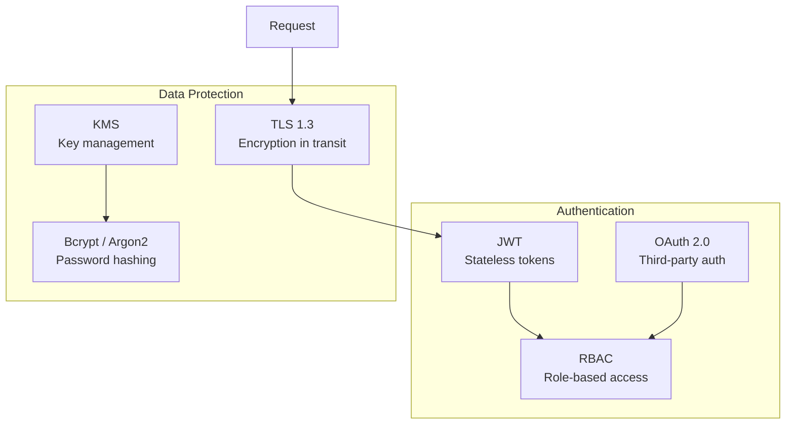

# Security

Security is not optional — it is a requirement. This section covers authentication at scale, zero-trust networks, secret management, DDoS protection, and encryption patterns used in production systems.

## Navigate by Role

| I am... | Start here | Goal |
|---------|-----------|------|
| 🟢 Junior | [Authentication at Scale](concepts/authentication-at-scale) | Understand authentication and basic encryption |
| 🟡 Mid-level | [OAuth2 & OIDC Deep Dive](concepts/oauth2-oidc-deep-dive) | Implement secure auth patterns |
| 🔴 Senior / TL | [Zero-Trust Architecture](concepts/zero-trust-architecture) | Design security architecture at scale |
| 🏆 Interview prepping | [Security Quick Reference](../../12-interview-prep/quick-reference/security) | Security & encryption interview patterns |

## What You'll Learn

- **Concepts**: OAuth2/OIDC, zero-trust, mTLS, secret management, DDoS protection
- **Hands-On**: Implement JWT auth, OAuth flows, and RBAC

## Where to Start

1. [Authentication at Scale](/08-security/concepts/authentication-at-scale) — Sessions, tokens, and SSO
2. [OAuth2 & OIDC Deep Dive](/08-security/concepts/oauth2-oidc-deep-dive) — The industry standard
3. [JWT Authentication](/08-security/hands-on/jwt-authentication) — Implement JWT from scratch
4. [Zero-Trust Architecture](/08-security/concepts/zero-trust-architecture) — Never trust, always verify

## Topic Map

| Topic | 📖 Concept | 🔬 Hands-On | 🎯 Interview |
|-------|-----------|------------|-------------|
| Authentication at scale | [authentication-at-scale](concepts/authentication-at-scale) | [jwt-authentication](hands-on/jwt-authentication), [oauth-flows](hands-on/oauth-flows) | [jwt-vs-session](../../12-interview-prep/quick-reference/security/jwt-vs-session) |
| OAuth2 & OIDC | [oauth2-oidc-deep-dive](concepts/oauth2-oidc-deep-dive) | [oauth-flows](hands-on/oauth-flows) | [jwt-vs-session](../../12-interview-prep/quick-reference/security/jwt-vs-session) |
| Zero-trust architecture | [zero-trust-architecture](concepts/zero-trust-architecture) | — | — |
| RBAC | — | [rbac-implementation](hands-on/rbac-implementation) | — |
| Secret management | [secret-management](concepts/secret-management) | — | — |
| DDoS protection | [ddos-protection](concepts/ddos-protection) | — | — |
| mTLS & certificates | [mtls-certificate-management](concepts/mtls-certificate-management) | — | [mitm-prevention](../../12-interview-prep/quick-reference/security/mitm-prevention), [rsa-vs-aes](../../12-interview-prep/quick-reference/security/rsa-vs-aes) |
| Encryption at rest | [encryption-at-rest](concepts/encryption-at-rest) | — | [hashing-vs-encryption](../../12-interview-prep/quick-reference/security/hashing-vs-encryption) |
| Compliance architecture | [compliance-architecture](concepts/compliance-architecture) | — | — |
