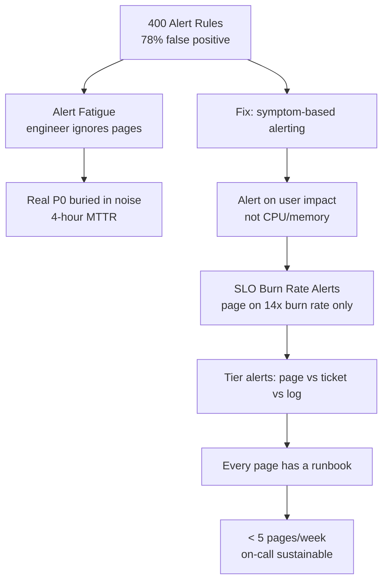
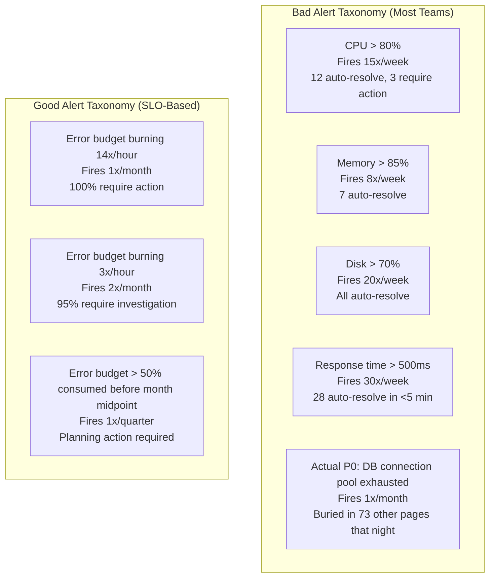
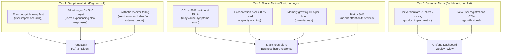
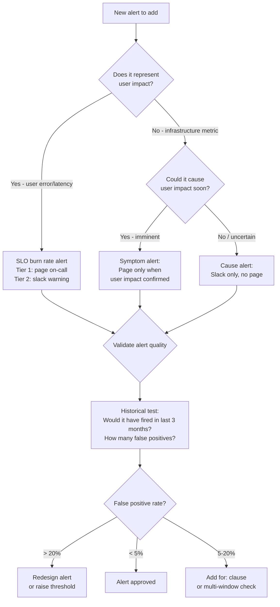

# Alerting Strategy: Alert Fatigue, SLO-Based Alerts, and On-Call Ergonomics

## 🗺️ Quick Overview



*Alert on symptoms (error rate, latency) not causes (CPU) — 400 noisy rules become 5 actionable pages when you flip to burn-rate alerting.*

**The team that built a monitoring system with 400 alert rules had a 78% false positive rate. Engineers stopped reading pages. A real outage lasted 4 hours because the alert was buried in noise.** Alert fatigue is not a people problem — it is a system design failure. The solution is not "tune the thresholds" — it is a fundamental rethink of what you alert on, and why.

---

## The Problem Class `[Mid]`

You have 50 microservices. Each service has 10 alert rules. 40% of them fire weekly with no required action. The on-call rotation has a weekly ticket volume of 300+ pages. Engineers have PagerDuty fatigue — they acknowledge pages without reading them. An actual P0 incident fires at 2am but takes 47 minutes to get human eyes because the on-call engineer is in "noise mode."



**The fundamental rule of alerting**: Every alert must be:
1. **Actionable**: Someone must take a specific action
2. **Urgent**: If you don't act in X minutes, user impact worsens
3. **Accurate**: It fires when there is real user impact, not when a resource hits a threshold

Cause-based alerts (CPU > 80%) fail rules 1 and 3. CPU at 80% may be completely normal. Symptom-based alerts (error rate > 1%) are better but still fail rule 3 — a 1% spike on a 10 RPS service is 0.1 errors/second, probably noise. **SLO-based burn rate alerts** satisfy all three rules.

---

## Why the Obvious Solution Fails `[Senior]`

### Naive Approach: Alert on Every Resource Threshold

"Alert if CPU > 80%, memory > 85%, disk > 70%." This approach assumes resource thresholds predict user impact. They don't:
- CPU at 95% on a batch job: no user impact
- CPU at 60% on a service with a memory leak: about to OOM in 5 minutes
- Disk at 75% on a log volume with 1-year retention policy: fine indefinitely
- Disk at 40% growing at 10GB/day on a 100GB volume: fills in 6 days (should alert)

The signal: **resource thresholds have near-zero correlation with user impact** in modern containerized, auto-scaling environments.

### Naive Approach: Static Threshold on Error Rate

`sum(rate(http_5xx[5m])) > 0.01` — fires when error rate exceeds 1% for 5 minutes. Problems:
- At 100 RPS: 1 error/second triggers the alert. Is 1 error/second from a 100 RPS service an incident? Probably not.
- At 100,000 RPS: 1,000 errors/second is needed to trigger the alert. At 1,000 errors/second you are already in a major incident that started 4 minutes ago.
- Seasonality: error rate naturally spikes at midnight deploys, during traffic ramp-up, and during maintenance windows — all generating false positives.

### The Right Mental Model: Alert on SLO Burn Rate, Not Thresholds

```
If your SLO is 99.9% success rate over 30 days:
- Total error budget = 0.1% × 30 days × 24h × 60min = 43.2 minutes

If errors are burning the budget at 1x rate: "normal burn" — no alert
If errors are burning at 14x rate: "budget gone in 2 days" — ticket
If errors are burning at 720x rate (all requests failing): "budget gone in 1 hour" — page NOW

The burn rate encodes urgency. 14x burn = action needed today. 720x burn = wake someone up.
```

---

## The Solution Landscape `[Senior]`

### Solution 1: Multi-Window Burn Rate Alerts (Google SRE Workbook)

**What it is**

Two pairs of alerts per SLO — a fast burn detector (short window) and a slow burn detector (long window). Each pair uses two time windows to reduce false positives.

**How it actually works at depth**

For a 99.9% SLO over 30 days (43.2 minute error budget):

```
Alert Tier 1: Fast Burn (page immediately)
- Condition: burn_rate_1h > 14 AND burn_rate_5m > 14
- Meaning: Budget will be exhausted in 30d/14 = 2.14 days at this rate
- But more importantly: 1h of 14x burn = 14/720 = 1.94% of monthly budget gone
- Severity: Critical, PagerDuty, wake on-call now
- False positive protection: Requires BOTH 1h and 5m windows to be elevated
  (5m spike alone could be noise; 1h alone misses fast incidents)

Alert Tier 2: Slow Burn (create ticket / notify)
- Condition: burn_rate_6h > 3 AND burn_rate_30m > 3
- Meaning: Budget will be exhausted in 30d/3 = 10 days at this rate
- 6h of 3x burn = 18/720 = 2.5% of monthly budget gone
- Severity: Warning, Slack notification, business hours response

Alert Tier 3: Budget Depletion Warning
- Condition: error_budget_remaining < 10% with 10+ days left in month
- Severity: Warning, weekly review agenda item
```

**Prometheus configuration**:

```yaml
groups:
  - name: slo-burn-rate-checkout
    rules:
      # Pre-compute error ratio for efficiency
      - record: slo:checkout_error_ratio:rate5m
        expr: |
          sum(rate(http_requests_total{service="checkout", status_class="5xx"}[5m]))
          /
          sum(rate(http_requests_total{service="checkout"}[5m]))

      - record: slo:checkout_error_ratio:rate1h
        expr: |
          sum(rate(http_requests_total{service="checkout", status_class="5xx"}[1h]))
          /
          sum(rate(http_requests_total{service="checkout"}[1h]))

      - record: slo:checkout_error_ratio:rate6h
        expr: |
          sum(rate(http_requests_total{service="checkout", status_class="5xx"}[6h]))
          /
          sum(rate(http_requests_total{service="checkout"}[6h]))

      # Tier 1: Fast burn — page immediately
      - alert: CheckoutSLOFastBurn
        expr: |
          (slo:checkout_error_ratio:rate5m > (14 * 0.001))
          AND
          (slo:checkout_error_ratio:rate1h > (14 * 0.001))
        labels:
          severity: critical
          service: checkout
          slo: availability
        annotations:
          summary: "Checkout error budget burning 14x faster than sustainable"
          description: |
            Error rate: {{ $value | humanizePercentage }}
            At this rate, monthly error budget exhausted in 2 days.
            Runbook: https://wiki.company.com/runbooks/checkout-errors

      # Tier 2: Slow burn — ticket
      - alert: CheckoutSLOSlowBurn
        expr: |
          (slo:checkout_error_ratio:rate30m > (3 * 0.001))
          AND
          (slo:checkout_error_ratio:rate6h > (3 * 0.001))
        labels:
          severity: warning
          service: checkout
          slo: availability
        annotations:
          summary: "Checkout error budget burning 3x faster than sustainable"
```

**Sizing guidance** `[Staff+]`

```
Burn rate thresholds by urgency:

Urgency         | Burn Rate | Budget Consumed (1h) | Response Time
----------------|-----------|---------------------|---------------
Emergency Page  | 720x      | 100% in 1h           | < 5 minutes
Critical Page   | 144x      | 20% in 1h            | < 30 minutes
Urgent Page     | 14x       | 2% in 1h             | < 2 hours
Warning Ticket  | 3x        | 0.4% in 1h           | Business hours
Informational   | 1.1x      | 0.15% in 1h          | Weekly review

For a 99.9% SLO, error_budget = 0.001 (0.1%)
14x burn = 14 × 0.001 = 0.014 = 1.4% error rate to trigger critical page

For a 99.5% SLO (lower standard):
14x burn = 14 × 0.005 = 0.07 = 7% error rate to trigger critical page
— meaning you tolerate much more degradation before paging
```

**Failure modes** `[Staff+]`

- **Alert flapping**: Burn rate oscillates around the threshold. Alert fires, auto-resolves, fires again, every 2-3 minutes. On-call gets 20 pages in an hour, all auto-resolving. Fix: Add `for: 2m` on the fast burn alert to require the condition to persist for 2 minutes.
- **Alert amnesia after holiday traffic**: Error budget is 80% consumed on December 24 due to traffic spikes. December 25 the budget renews. January team looks at clean dashboards and doesn't realize the SLO was nearly violated. Fix: Track error budget consumption as a monthly metric, not just current burn rate.
- **Incorrect error budget denominator**: Alert uses `http_requests_total` as denominator, but health check endpoints (1,000 RPS, always 200 OK) dilute the error ratio. A real 10% error rate on checkout (100 RPS) looks like 0.09% error rate when health checks are included. Fix: Exclude health check endpoints from SLO metrics with label filtering.

---

### Solution 2: Symptom vs Cause Alert Hierarchy

**What it is**

A two-tier alerting model: symptom alerts page on-call; cause alerts create tickets or Slack messages for investigation.



---

### Solution 3: Alert Routing and On-Call Ergonomics `[Staff+]`

**On-Call Rotation Design**

```
Bad rotation (common mistake):
- 1 week on-call = 168 hours of potential interruption
- No distinction between P1/P2 and P3/P4 severity
- Engineer sleeps with phone under pillow for 7 nights
- Burnout after 2-3 rotations

Good rotation:
- "Business hours primary" + "Off-hours escalation"
  Primary: Alert goes to Slack (business hours), no interruption
  Off-hours: Only P1/P2 (user impact) pages the on-call phone
- "Follow the sun" for 24h coverage without sleep deprivation:
  Americas team handles 9am-5pm America/New_York
  EMEA team handles 9am-5pm Europe/London
  APAC team handles 9am-5pm Asia/Singapore
  = 24h coverage with 3 teams, each working normal hours

On-call tax calculation:
- Each P1/P2 page that requires > 30 min investigation = 1 "on-call tax" unit
- Target: < 5 units per rotation (engineer can recover)
- > 10 units: rotation is too heavy, needs redesign
- > 20 units: team is in alert fatigue territory, incidents are being missed
```

**PagerDuty escalation policy**:

```yaml
# Escalation policy design
escalation_policy: checkout-service
  level_1:
    notify: checkout-on-call       # Primary on-call
    timeout: 5m                    # If no ack in 5 minutes...
  level_2:
    notify: checkout-team-lead     # Escalate to team lead
    timeout: 10m
  level_3:
    notify: engineering-manager    # Escalate to EM
    timeout: 15m
  level_4:
    notify: director-of-engineering  # Escalate to director

# High vs low urgency routing
P1 (Critical, user impact): Level 1 → level 4 escalation, SMS + phone call
P2 (High, partial user impact): Level 1 → level 2, SMS
P3 (Low, no direct user impact): Slack only, business hours
P4 (Informational): Slack channel, no notification
```

**Alert routing rules in Alertmanager**:

```yaml
# Alertmanager routing
route:
  group_by: [service, alertname]
  group_wait: 30s          # Wait 30s before first page (allow grouping)
  group_interval: 5m       # Resend if still firing after 5m
  repeat_interval: 4h      # Re-page if not resolved after 4h

  routes:
    # Critical: immediate page
    - match:
        severity: critical
      receiver: pagerduty-critical
      group_wait: 0s  # No wait for critical
      repeat_interval: 1h

    # Warning: Slack only during business hours
    - match:
        severity: warning
      receiver: slack-ops
      active_time_intervals:
        - business_hours

    # Warning during off-hours: queue until morning
    - match:
        severity: warning
      receiver: email-digest
```

---

## Trade-off Matrix `[Senior]` → `[Staff+]`

| Dimension | Threshold Alerts | Burn Rate Alerts | Anomaly Detection |
|---|---|---|---|
| False positive rate | High (30-60%) | Low (5-15%) | Medium (15-30%) |
| Alert lag (P1 issues) | Fast (1-5 min) | Moderate (5-60 min per tier) | Slow (requires history) |
| Tuning effort | High (per service) | Medium (per SLO tier) | High (model training) |
| Explainability | High | High | Low ("anomaly detected") |
| Cardinality scaling | Degrades with services | Scales linearly | Scales with data volume |
| 2026 recommendation | Infrastructure only | User-facing services | Supplement, not replace |

---

## Decision Framework `[Senior]` → `[Staff+]`



---

## Production Failure Story `[Staff+]`

**Alert Fatigue Causes 4-Hour Outage — Ride-Sharing Platform 2024**

A ride-sharing platform had 847 alert rules across 60 services. The on-call engineer averaged 47 pages per shift, 80% of which auto-resolved within 10 minutes. Engineers had developed a coping strategy: acknowledge the page, wait 10 minutes, check if it auto-resolved. If yes, go back to sleep.

On a Tuesday night at 2:17am, the PostgreSQL connection pool for their matching service hit 100% utilization. 3 alerts fired:
- `MatchingServiceHighLatency` (p99 > 500ms): auto-resolved 4 minutes later as connections started to queue instead of fail
- `PostgresConnectionPoolHigh` (>80% used): auto-resolved 3 minutes later when old connections timed out
- `MatchingServiceErrorRate` (errors >0.5%): fired, then the error *rate* dropped (connections were being queued, not erroring)

The engineer acknowledged all three, waited, saw them resolve, went back to sleep. But the connection pool was full and requests were queuing behind it. Response times increased from 150ms to 8,000ms. For 4 hours, drivers were unable to accept rides and riders couldn't book.

The real alert that should have fired: `error_budget_burn_rate > 14x`. But it never fired because the error *rate* didn't spike — requests were *slow*, not *failing*. Their SLO only covered error rate, not latency.

**Fix**:
1. Added latency SLO with burn rate alert: `p99_latency_burn_rate > 14x`
2. Added connection pool saturation as **symptom predictor** (alert when pool >90% AND latency p99 >2x SLO)
3. Eliminated 600 of 847 alert rules that had >40% auto-resolve rate
4. Implemented "alert review" process: any alert that auto-resolves 3 times without action gets archived

---

## Observability Playbook `[Staff+]`

### Alert Quality Metrics

```promql
# Alert noise ratio (higher = more noise)
# Count alerts that resolve without human action
rate(alertmanager_notifications_total{status="resolved"}[7d])
/
rate(alertmanager_notifications_total{status="firing"}[7d])
# Target: > 0.8 (80%+ of fired alerts should be manually resolved, not auto-resolved)

# Alert-to-incident ratio
# Count PagerDuty incidents vs total alerts
# Target: < 10 alerts per incident
# > 50 alerts per incident = alert fatigue territory

# Time from alert fire to incident declaration
# Alert fires → engineer creates incident ticket
# Target: < 5 minutes for P1
# > 15 minutes = alert is being ignored

# On-call load per rotation
# PagerDuty: sum incidents per user per week
# Target: < 5 significant incidents per week
# > 10: engineer is in burnout territory
```

### Weekly Alert Review Ritual

```
EACH MONDAY (or equivalent team ritual):

1. Review auto-resolved alerts from the past week
   - Any alert that auto-resolved > 3x without action → candidate for deletion

2. Review missed incidents (post-mortems)
   - Was there an alert that should have fired but didn't?

3. Review false positives
   - Alert that fired → engineer investigated → no action taken
   - Add suppression rules or raise threshold

4. Calculate on-call tax per engineer
   - Aim for < 5 significant interruptions per rotation
   - Adjust thresholds or rotation length if exceeded
```

---

## Architectural Evolution `[Staff+]`

```
Phase 1 (< 10 services): Simple threshold alerts
- Prometheus Alertmanager with threshold rules
- PagerDuty for on-call
- Accept 40% false positive rate — volume is low enough
- Target: have alerts for Four Golden Signals on each service

Phase 2 (10-50 services): SLO-based burn rate alerts
- Replace threshold alerts with burn rate tiers
- Separate Slack routing for warnings vs pages
- On-call rotation formalized (not ad-hoc)
- Target: < 20% false positive rate

Phase 3 (50+ services): Unified alerting platform
- Sloth / nobl9 for SLO management as code
- Alertmanager routing based on service ownership (team labels)
- Alert quality dashboard tracking false positive rate per team
- Follow-the-sun rotation for 24h coverage
- Annual on-call review to eliminate alerts with > 50% false positive

Phase 4 (2026): AI-assisted alert correlation
- Incident Intelligence (PagerDuty AIOps) to group related alerts
- Anomaly detection as supplementary layer (not replacement)
- eBPF-based continuous profiling to explain WHY an alert fired
```

---

## Decision Framework Checklist `[All Levels]`

- [ ] Does every alert have a defined runbook with specific actions?
- [ ] Have you implemented multi-window burn rate alerts for all user-facing SLOs?
- [ ] Are cause-based alerts (CPU, memory, disk) routing to Slack, not PagerDuty?
- [ ] Do you have a weekly alert review process to prune false positives?
- [ ] Is your on-call rotation designed to ensure < 5 significant interruptions per week per engineer?
- [ ] Does every P1 alert fire within 5 minutes of user impact starting?
- [ ] Have you validated alert thresholds against historical data (would they have fired correctly)?
- [ ] Do your SLO alerts cover both error rate AND latency?
- [ ] Have you excluded health check endpoints from error rate calculations?
- [ ] Is your false positive rate tracked as a team metric with improvement targets?

*Written by Gaurav Porwal — 10+ Year Engineer | Tech Lead | Product Owner | Business-Minded Builder*
*Last updated: 2026-03-18*
