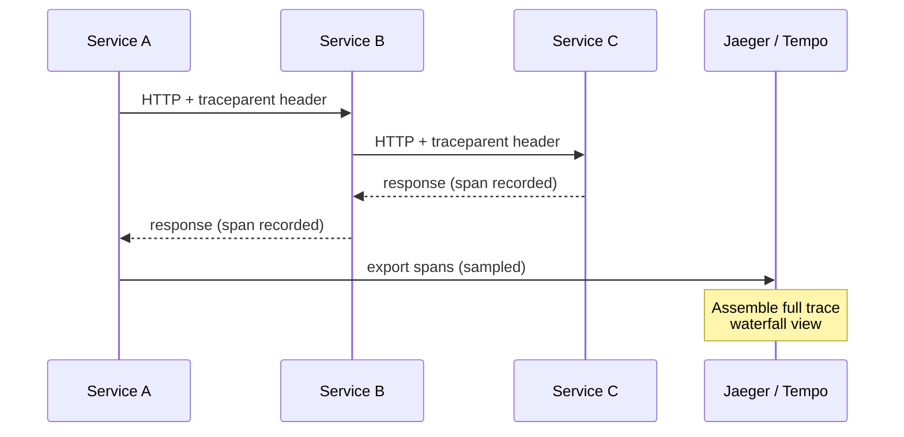
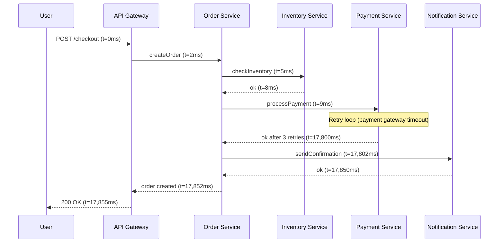
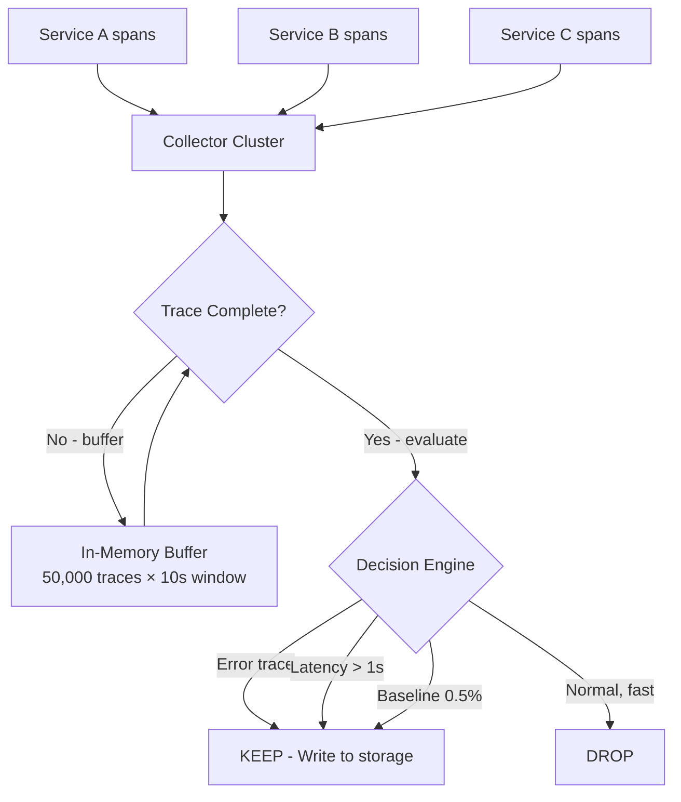
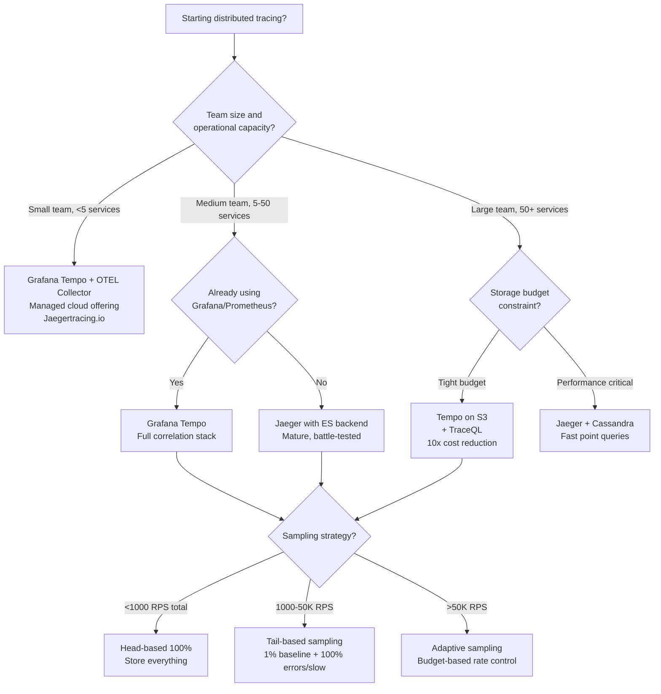

# Distributed Tracing: OpenTelemetry, Sampling Strategies, and Trace Context

## 🗺️ Quick Overview



*Every hop propagates the same trace_id via W3C traceparent — Jaeger assembles spans into a waterfall that shows exactly where your 18-second checkout spent its time.*

**A 200ms checkout fails. Your logs say everything succeeded. Your metrics show p99 is fine. Without distributed tracing, you are debugging a ghost.** Distributed tracing gives you the execution timeline of a single request as it fans out across dozens of services — and the ability to ask "why was *this specific request* slow?" rather than "why is the system slow on average?"

The challenge is scale: 10,000 RPS across 50 services generates 500,000 spans per second. Storing them all costs $400K/year. Dropping the wrong ones means the one trace that would have explained your production incident is gone.

---

## The Problem Class `[Mid]`

You have a checkout flow: API Gateway → Order Service → Inventory Service → Payment Service → Notification Service. A user reports their checkout took 18 seconds. Your p99 metric shows 180ms. What happened?



Without tracing, you see: metrics show payment service p99 = 150ms (the retried requests are a tiny fraction of traffic, averaging out). Logs show "payment processed successfully" — the retries happened internally. You have no visibility into *this request's* journey.

With distributed tracing, you see a waterfall: payment service took 17,791ms due to 3 retries against a degraded payment gateway, each retry waiting 5,000ms before firing. You fix the retry timeout. Done in 10 minutes instead of 3 hours of log-grep archaeology.

### Scale Reality Check

```
10,000 RPS × 50 services = 500,000 spans/second
Average span size = 2KB (attributes, events, logs)
Storage at 100% sampling = 500,000 × 2KB × 86,400s = 86TB/day

At $0.023/GB (S3): $86,000 × 0.023 = ~$2,000/day = $730,000/year

At 1% sampling: $7,300/year — but you miss 99% of traces
At tail-based 1%: $7,300/year — and you keep ALL slow/error traces
```

This is why sampling strategy is not an afterthought. It is the central design decision.

---

## Why the Obvious Solution Fails `[Senior]`

### Naive Approach: Log correlation IDs

Teams start with adding `request_id` to logs and joining them after the fact. This fails because:

1. **Async boundaries break correlation**: A Kafka consumer processing a message has no HTTP context. Your `request_id` dies at the queue boundary.
2. **No causality**: Logs tell you what happened, not why. You cannot see that Service B was slow *because* Service C held a lock.
3. **No timing**: Log timestamps have millisecond granularity at best, and clock skew between services makes ordering unreliable.
4. **No fan-out visibility**: When Order Service calls Inventory and Payment in parallel, logs interleave. Reconstructing which log line belongs to which parallel branch is manual archaeology.

### Naive Approach: Store every span

At 100% sampling you get complete data but:
- Storage costs are prohibitive (see math above)
- Query performance degrades with volume
- Ingest pipelines become bottlenecks
- You spend engineering time managing trace infrastructure instead of using it

### The Real Challenge: You Don't Know Which Requests Matter at Ingestion Time

This is the fundamental tension. Head-based sampling (decide at the start of the trace) is cheap but blind — you drop a 17-second request because it *looked* normal at the API gateway. Tail-based sampling (decide after the trace completes) is accurate but expensive — you must buffer all spans until the trace is complete.

---

## The Solution Landscape `[Senior]`

### Solution 1: Head-Based Sampling with W3C TraceContext

**What it is**

The sampling decision is made at the first service (the head) and propagated to all downstream services via HTTP headers. W3C TraceContext is the IETF standard for this propagation.

**How it actually works at depth**

The W3C TraceContext spec defines two headers:

```
traceparent: 00-4bf92f3577b34da6a3ce929d0e0e4736-00f067aa0ba902b7-01
              ^  ^                                ^                ^
              |  trace-id (128-bit)              span-id (64-bit) flags
              version                                             (sampled=1)
```

The `flags` byte's lowest bit is the sampling flag. When this is `01`, all downstream services MUST record spans. When `00`, they MAY skip recording (but should still propagate context for future trace reconstruction).

```javascript
// OpenTelemetry SDK sets this automatically, but understanding the mechanics:
const { W3CTraceContextPropagator } = require('@opentelemetry/core');

// On ingress (API Gateway):
const propagator = new W3CTraceContextPropagator();
const ctx = propagator.extract(ROOT_CONTEXT, req.headers, defaultTextMapGetter);

// The span is created with the extracted context:
const span = tracer.startSpan('handle-request', {}, ctx);

// The sampling decision from the head is encoded in the span context
const { traceFlags } = span.spanContext();
// traceFlags === TraceFlags.SAMPLED (1) or TraceFlags.NONE (0)
```

**Sampling Rates and Math**

```
Scenario: 10,000 RPS, 50 services, 2KB/span
Target: Keep 1% of traces

Storage: 10,000 × 0.01 × 50 × 2KB × 86,400 = 864GB/day
At $0.023/GB: ~$7,300/year ✓ Acceptable

Problem: At 10,000 RPS, errors occur at 0.1% = 10 errors/second
With 1% sampling: Expected error traces captured = 10 × 0.01 = 0.1/second
= ~8,640 error traces/day — statistically valid but misses individual error context

At 0.01% (1-in-10,000): You might miss an error entirely if it happens once
```

**Sizing guidance** `[Staff+]`

- Set base sampling rate to capture at least 1 trace/minute per endpoint for baseline coverage
- For a service with 100 endpoints at 10 RPS each: 100 endpoints × 10 RPS × sampling_rate ≥ 1/60
- Minimum sampling rate = 1/(10 × 60) = 0.17% per endpoint
- Use per-endpoint/per-service rate limits, not global rates: high-traffic health check endpoints at 0.001%, critical payment paths at 10%

**Configuration decisions that matter** `[Staff+]`

```yaml
# OpenTelemetry Collector sampling configuration
processors:
  probabilistic_sampler:
    sampling_percentage: 1.0  # Global baseline

  # Better: Per-service rate limiting
  tail_sampling:
    decision_wait: 10s
    num_traces: 50000  # Buffer size — must fit peak TPS × decision_wait
    policies:
      - name: error-policy
        type: status_code
        status_code: {status_codes: [ERROR]}
      - name: slow-traces
        type: latency
        latency: {threshold_ms: 1000}
      - name: baseline
        type: probabilistic
        probabilistic: {sampling_percentage: 0.5}
```

**Failure modes** `[Staff+]`

- **Clock skew causes span ordering corruption**: NTP drift of 50ms on one service makes spans appear to complete before they start. Use monotonic clocks for duration, wall clocks only for start time display.
- **Context propagation breaks at async boundaries**: gRPC calls auto-propagate; Kafka/SQS/database async calls do not unless you explicitly serialize the trace context into the message payload.
- **Head-based sampling creates silent coverage gaps**: A services team enables 0.1% sampling during a load test. The bug they introduced manifests in only 0.05% of requests. Zero traces captured. Ship to production confidently. Incident on Monday.

**Observability** `[Staff+]`

```promql
# Sampling effectiveness: error trace capture rate
rate(traces_sampled_total{policy="error-policy"}[5m])
/
rate(errors_total[5m])
# Target: > 0.99 (capture >99% of error traces)

# Tail sampler buffer pressure
otelcol_processor_tail_sampling_sampling_decision_timer_latency_bucket{le="5"}
# Alert if p95 decision latency > 5s (means buffer is full, sampling degrades)

# Context propagation health
rate(spans_with_invalid_parent_total[5m]) / rate(spans_total[5m])
# Alert if > 1% (means context propagation is breaking somewhere)
```

---

### Solution 2: Tail-Based Sampling

**What it is**

All spans are buffered at a central collector until the entire trace is complete. The sampling decision is made retrospectively based on the full trace characteristics.

**How it actually works at depth**



The critical constraint: spans from the same trace can arrive at different collector instances. You must either:
1. Route all spans from the same `trace_id` to the same collector (consistent hashing on trace_id at the load balancer)
2. Implement collector-to-collector gossip to aggregate distributed trace pieces

**Sizing guidance** `[Staff+]`

```
Buffer sizing formula:
Buffer = peak_TPS × decision_wait_seconds × avg_spans_per_trace × avg_span_size

Example: 10,000 TPS × 10s × 50 spans × 2KB = 10GB RAM per collector node

With 3 collector nodes for HA: 30GB RAM dedicated to trace buffering
Plus 20% headroom: 36GB RAM

If peak TPS spikes 3x: buffer overflows, oldest traces dropped (not the ones you want to keep)
Solution: Pre-provision for 2x expected peak, alert at 60% buffer utilization
```

**Failure modes** `[Staff+]`

- **Buffer overflow under load**: When ingest rate exceeds buffer capacity, the collector must drop spans. It drops the *oldest* spans (LRU eviction), which are the most complete traces. You lose exactly the traces you want to analyze.
- **Network partition between services and collector**: Spans buffer in the SDK's local queue. SDK default queue size is 2048 spans. At 500 spans/second per service, buffer fills in 4 seconds. After that, spans are dropped at the SDK without any collector visibility.
- **Trace incompleteness at decision time**: Service D has a 15-second timeout. Collector waits 10 seconds, declares trace complete, makes sampling decision without Service D's spans. Service D's spans arrive late and are orphaned.

---

### Solution 3: Adaptive Sampling (2026 Standard)

**What it is**

Sampling rates adjust dynamically based on current traffic volume, error rates, and storage budget. The OpenTelemetry Collector's `adaptive_sampler` processor implements this.

**How it actually works at depth**

```
Target: 1000 traces/second stored (regardless of incoming volume)

At 10,000 TPS incoming → sample 10%
At 100,000 TPS incoming → sample 1%
At 1,000 TPS incoming → sample 100%

Error traces: always 100% regardless of rate
Latency outliers (p99): always 100%
Baseline: adaptive rate to hit target storage budget
```

The algorithm uses a token bucket per trace class (error, slow, normal) with automatic rate adjustment every 60 seconds based on observed throughput vs storage budget consumption.

---

## Jaeger vs Zipkin vs Grafana Tempo `[Senior]` → `[Staff+]`

### Architecture Comparison

```mermaid
graph TD
    subgraph Jaeger
        J1[jaeger-agent\nsidecar UDP] --> J2[jaeger-collector\nHTTP/gRPC]
        J2 --> J3[Cassandra / Elasticsearch\nspan storage]
        J3 --> J4[jaeger-query UI]
    end

    subgraph Zipkin
        Z1[Zipkin Reporter\nHTTP POST] --> Z2[Zipkin Server\nall-in-one]
        Z2 --> Z3[MySQL / Elasticsearch\nstorage]
    end

    subgraph Tempo
        T1[OTLP / Zipkin / Jaeger\ningest - any format] --> T2[Tempo\nobject storage backend]
        T2 --> T3[S3 / GCS / Azure Blob\n$0.023/GB vs $0.12/GB SSD]
        T3 --> T4[Grafana UI\ncorrelated with Loki/Prometheus]
    end
```



### Trade-off Matrix `[Senior]` → `[Staff+]`

| Dimension | Jaeger | Zipkin | Grafana Tempo |
|---|---|---|---|
| Storage backend | Cassandra / ES | MySQL / ES | Object storage (S3) |
| Storage cost/TB/month | $120-240 (ES) | $120-240 (ES) | $23 (S3) |
| Query performance | Fast (ES index) | Moderate | Slower (no index by default) |
| Native OTLP support | Via collector | Via bridge | Native |
| Grafana integration | Plugin | Plugin | Native, correlated |
| Operational complexity | High (Cassandra/ES) | Medium | Low |
| Trace search (no trace ID) | Full ES query | Limited | Tempo + TraceQL |
| 2026 recommendation | Legacy | Legacy | **Preferred** |

**The non-obvious Tempo trade-off**: Tempo stores traces in object storage with no inverted index by default. Finding a trace by trace ID is O(1) (direct object path). Finding all traces for `service=payment AND duration>5s` requires Tempo to scan all trace objects — expensive. The solution is to emit trace exemplars from Prometheus metrics: `http_request_duration_seconds{...}` histograms store a sample `trace_id` in each bucket. You find slow traces via Prometheus query, then jump to Tempo with the trace ID. This is the Grafana "correlation" story.

---

## Decision Framework `[Senior]` → `[Staff+]`



---

## Production Failure Story `[Staff+]`

**The Invisible Retry Storm — E-Commerce Platform, Black Friday 2024**

A retail platform processed 45,000 RPS at peak. They used head-based sampling at 0.1% with Jaeger. Their p99 latency metric showed 280ms — within SLO. But conversion rate dropped 23% over 90 minutes.

The investigation after the fact revealed: the payment service was retrying against a degraded card processor. Each retry added 3-8 seconds. The affected requests were 2% of traffic — not enough to move p99 significantly, but enough to kill conversion. With 0.1% sampling, they captured approximately 900 traces per minute at 45,000 RPS. Of the 900 affected-per-minute requests, expected captures = 0.9. They had essentially zero traces of the failure scenario.

**The fix** implemented after:
1. Tail-based sampling with error/latency policy capturing 100% of requests >2s
2. Metric `http_request_duration_seconds_bucket` with exemplars linking to Tempo traces
3. Alert on `rate(http_requests_total{status="5xx"}[1m]) / rate(http_requests_total[1m]) > 0.005` (0.5% error rate) — this would have fired within 3 minutes of the degradation starting
4. Sampling budget policy: payment service endpoints always at 5% minimum, 100% if upstream retry count > 1

**Cost of the fix**: Storage increased from 200GB/day to 340GB/day (+$3,200/year). Prevented revenue loss was estimated at $180,000 for that Black Friday.

---

## Observability Playbook `[Staff+]`

### Key Metrics for Tracing Infrastructure Health

```promql
# 1. Span ingest rate vs sampling output rate
rate(otelcol_receiver_accepted_spans_total[5m])  # Incoming
rate(otelcol_exporter_sent_spans_total[5m])       # Outgoing to storage
# Ratio = effective sampling rate. Alert if drops below expected baseline.

# 2. Tail sampler buffer fullness (most critical alert)
otelcol_processor_tail_sampling_sampling_decision_timer_latency_sum
/
otelcol_processor_tail_sampling_sampling_decision_timer_latency_count
# Alert if avg decision latency > 8s (10s window means buffer is near full)

# 3. Trace completeness ratio
rate(traces_with_all_services_total[5m]) / rate(traces_started_total[5m])
# Alert if < 0.85 (15% of traces missing spans from some services)

# 4. Context propagation breaks
sum(rate(spans_total{parent_span_id="",service!="frontend"}[5m]))
# Orphaned spans with no parent — means context propagation broken at some boundary
```

### Runbook: Trace Collection Degradation

```
SYMPTOMS: Trace volume drops >50% from baseline
STEP 1: Check collector buffer metrics (above)
STEP 2: Check network connectivity collector → storage
STEP 3: Check SDK queue drops in service metrics
  rate(otelcol_exporter_queue_size[5m]) approaching otelcol_exporter_queue_capacity
STEP 4: If buffer full → temporarily reduce sampling rate (head-based override)
  kubectl set env deployment/otel-collector SAMPLING_PERCENTAGE=0.1
STEP 5: If storage unreachable → enable local disk fallback
  File exporter as secondary output while primary recovers
```

---

## Architectural Evolution `[Staff+]`

```
Phase 1 (0-6 months): Manual instrumentation
- OpenTelemetry SDK in each service
- Head-based 1% sampling
- Jaeger all-in-one (single container, memory storage)
- Covers: basic waterfall visualization, manual correlation

Phase 2 (6-18 months): Collector pipeline + tail sampling
- OTEL Collector as sidecar per node
- Tail-based sampling with error/latency policies
- Grafana Tempo on S3 for cost-efficient storage
- TraceQL for ad-hoc queries
- Prometheus exemplars linking metrics to traces

Phase 3 (18-36 months): eBPF auto-instrumentation
- Pixie / Cilium Hubble captures spans at kernel level
- Zero code changes for new services — automatic coverage
- Service mesh (Istio/Linkerd) provides L7 trace context propagation
- Adaptive sampling with ML-based anomaly detection
- Cost: $0 additional per new service for basic tracing
```

---

## Decision Framework Checklist `[All Levels]`

- [ ] Have you defined what a "complete trace" means? (Which services must be represented?)
- [ ] Have you calculated storage costs at your target sampling rate?
- [ ] Does your sampling strategy guarantee 100% capture of error traces?
- [ ] Does your sampling strategy guarantee 100% capture of high-latency traces?
- [ ] Are async boundaries (queues, batch jobs) handled with explicit context propagation?
- [ ] Do you have alerting on trace infrastructure health (buffer fullness, ingest rate)?
- [ ] Can you find traces from a metric (exemplars) without knowing the trace ID?
- [ ] Have you tested context propagation through every inter-service communication path?
- [ ] Do you have a tail-based sampling buffer sized for 2x your expected peak TPS?
- [ ] Is your trace retention policy aligned with your incident investigation SLA?

*Written by Gaurav Porwal — 10+ Year Engineer | Tech Lead | Product Owner | Business-Minded Builder*
*Last updated: 2026-03-18*
