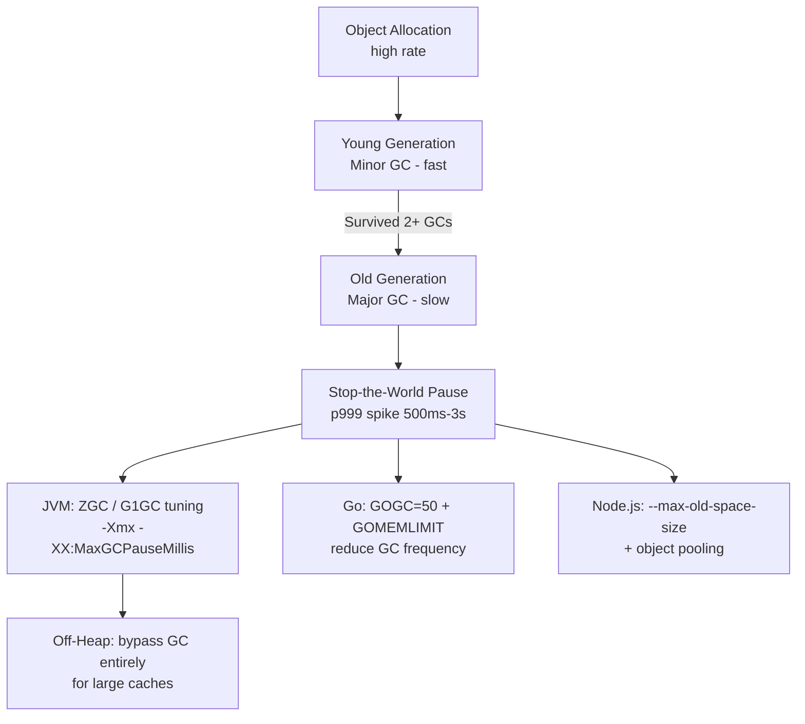
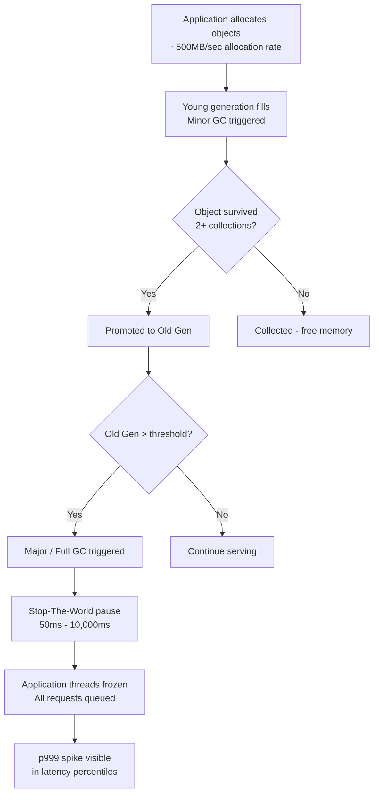
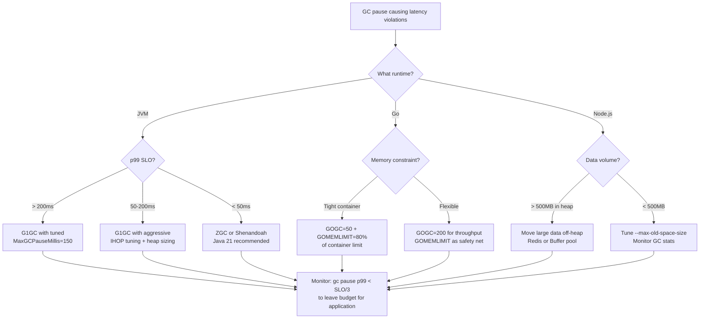

# GC Pressure and Heap Tuning: JVM, Go, and Node.js Memory Management

## 🗺️ Quick Overview



*GC pause storms are invisible in averages but show up as p999 spikes — profile heap allocation before tuning JVM flags.*

**Your service has perfect p99 latency in load tests. Then it runs for 45 minutes in production and suddenly p999 spikes to 3 seconds every few minutes, correlating with nothing in your application logs.** You're looking at GC pause storms — and they're one of the most misdiagnosed latency killers in production systems.

---

## The Problem Class `[Mid]`

Garbage collection is the runtime reclaiming memory that the application no longer references. The problem: GC must identify live objects, which means it needs to examine the heap. Depending on the GC algorithm, this examination may require stopping all application threads ("stop-the-world" pauses) or running concurrently at the cost of throughput.



**The cache warm-up trap** (the most non-obvious failure): When a service starts up, caches are cold. The application rapidly allocates and populates in-memory caches — potentially gigabytes in minutes. This creates a massive allocation burst that fills Old Gen before steady-state GC tuning is effective. The result: a Major GC event within the first 10 minutes of startup, causing a 2-10 second pause that triggers load balancer health check failures and pod restarts — which restart the cycle.

---

## Why the Obvious Solution Fails `[Senior]`

**Increasing heap size** is the first instinct. It works temporarily: more heap means more space before GC triggers. But it fails because:

1. **Larger heaps = longer GC pauses**: Stop-the-world GC time scales with live object count, not heap size. A 32GB heap with 8GB live data takes longer to collect than a 4GB heap with 2GB live data.

2. **GC frequency vs. GC duration trade-off**: Increasing heap reduces frequency but increases duration per collection. For latency-sensitive workloads, infrequent 5-second pauses are worse than frequent 50ms pauses.

3. **Container memory limits**: In Kubernetes, setting JVM `-Xmx` to equal the container memory limit causes OOMKilled when the JVM needs memory for non-heap purposes (Metaspace, thread stacks, code cache, off-heap buffers). The JVM total RSS always exceeds `-Xmx`.

**The default GC settings problem**: JVM defaults (G1GC since Java 9) are tuned for throughput, not latency. Go's GC defaults (GOGC=100) double memory usage to reduce pause frequency. Node.js V8 defaults are tuned for interactive browser workloads, not long-lived server processes with large heaps.

---

## The Solution Landscape `[Senior]`

### Solution 1: JVM — G1GC vs ZGC vs Shenandoah

**What it is**

The JVM has three primary production GC algorithms in 2026: G1GC (the default since Java 9), ZGC (low-latency, available since Java 11, production-ready Java 15+), and Shenandoah (ultra-low latency, available via OpenJDK builds). Java 21 LTS is the dominant production JVM in 2026.

**How it actually works at depth**

*G1GC* divides the heap into equal-sized regions (1MB to 32MB). Collection selects the regions with the most garbage ("garbage-first"). Pause target is configurable via `-XX:MaxGCPauseMillis`. G1 pauses scale with live object count and region count.

*ZGC* (Java 15+ production, Java 21 significantly improved) performs all heavy lifting concurrently with application threads. Only a tiny initial pause (< 1ms typically) and a final pause (< 1ms) are stop-the-world. ZGC uses colored pointers (load barriers) to track object state during concurrent marking. Throughput cost: ~5-15% compared to G1GC.

*Shenandoah* (similar latency profile to ZGC, different implementation approach) uses Brooks forwarding pointers. Available in OpenJDK and GraalVM builds.

```
G1GC pause profile:     [====pause 50-200ms====] ... [====pause 50-200ms====]
ZGC pause profile:      [<1ms] concurrent work [<1ms] ... [<1ms] concurrent work [<1ms]
Shenandoah:             [<1ms] concurrent work [<1ms] ... similar to ZGC
```

**Sizing guidance** `[Staff+]`

For a Java microservice with the following profile:
- Heap: 4GB (`-Xms4g -Xmx4g` — always set equal to avoid resize pauses)
- Allocation rate: 200MB/sec (high-throughput API)
- Live data: 1.2GB

*G1GC configuration*:
```bash
-XX:+UseG1GC
-Xms4g -Xmx4g
-XX:MaxGCPauseMillis=100      # Target pause time (not guaranteed)
-XX:G1HeapRegionSize=16m      # Larger regions = fewer regions = faster marking
-XX:InitiatingHeapOccupancyPercent=35  # Start concurrent marking earlier
-XX:G1ReservePercent=20       # Reserve 20% for promotion buffer
-XX:+ParallelRefProcEnabled   # Parallel reference processing
-XX:+G1UseAdaptiveIHOP        # Adaptive IHOP (Java 9+)
```

*ZGC configuration*:
```bash
-XX:+UseZGC
-Xms4g -Xmx4g
-XX:SoftMaxHeapSize=3500m     # Soft limit — ZGC tries to keep below this
-XX:ZCollectionInterval=60    # Minimum seconds between collections
-XX:ConcGCThreads=4           # Concurrent GC threads (default: ~1/4 of total)
```

*When to choose ZGC over G1GC*:
- p99 latency SLO < 100ms — G1GC's 50-200ms pauses will violate it
- Heap > 8GB — G1GC pause times grow with heap; ZGC stays flat
- Pod restart loop caused by health check failures during GC — ZGC eliminates this

**Container-aware JVM sizing**:

```bash
# Java 11+: JVM respects cgroup memory limits
-XX:MaxRAMPercentage=75.0    # Use 75% of container memory for heap
# For a 4Gi container: heap = 3GB, leaving 1GB for non-heap + OS

# Non-heap breakdown for a typical microservice:
# Metaspace: 256-512MB (class metadata, grows with libraries loaded)
# Thread stacks: 100 threads × 512KB = 50MB
# Code cache: 256MB (JIT-compiled code)
# Direct buffers: varies (Netty, NIO — often 256MB-1GB)
# Total non-heap: ~1-2GB for typical Spring Boot microservice
```

**Failure modes** `[Staff+]`

- **Promotion failure (G1GC)**: Old Gen fills faster than concurrent marking can free it. Results in a Full GC (stop-the-world for entire heap). Symptom: sporadic 2-10 second pauses. Fix: lower `InitiatingHeapOccupancyPercent` or increase heap.
- **GC thrashing**: GC runs continuously but frees insufficient memory. JVM throws `OutOfMemoryError` after spending > 98% of time in GC. Fix: find memory leak or reduce allocation rate.
- **Humongous allocations (G1GC)**: Objects > 50% of region size bypass young gen and go directly to Old Gen. Can trigger immediate GC if Old Gen is full. Fix: increase `G1HeapRegionSize` or switch to ZGC.
- **ZGC heap expansion pauses**: ZGC may expand heap under load, requiring OS memory allocation. This OS call can pause for 10-100ms. Fix: `-Xms == -Xmx` to pre-allocate full heap.

**Observability** `[Staff+]`

```bash
# Enable GC logging (Java 11+)
-Xlog:gc*:file=/var/log/gc.log:time,uptime,level,tags:filecount=5,filesize=20m

# Key metrics to scrape (via JMX or Micrometer):
# jvm_gc_pause_seconds_bucket - pause duration distribution
# jvm_gc_memory_promoted_bytes_total - old gen promotion rate
# jvm_gc_live_data_size_bytes - live data after full GC (baseline for sizing)
# jvm_gc_max_data_size_bytes - max old gen size
# jvm_memory_used_bytes{area="heap"} - current heap usage
```

```promql
# Alert: GC pause > 200ms more than 5 times in 5 minutes
increase(jvm_gc_pause_seconds_count{cause!="No GC"}[5m]) > 5
AND
histogram_quantile(0.95, rate(jvm_gc_pause_seconds_bucket[5m])) > 0.2
```

---

### Solution 2: Go GC — GOGC and GOMEMLIMIT

**What it is**

Go uses a concurrent, tri-color mark-and-sweep GC. Since Go 1.18+, `GOMEMLIMIT` (a soft memory limit) complements `GOGC` (the heap growth ratio). Go 1.21 improved GC efficiency significantly; Go 1.22+ (current in 2026) has further latency improvements.

**How it actually works at depth**

Go GC is triggered when the heap size reaches `GOGC%` of the heap size after the previous collection. Default `GOGC=100` means: if live data after last GC was 100MB, next GC triggers when heap reaches 200MB. This doubles memory usage to halve GC frequency.

The `GOMEMLIMIT` (Go 1.19+) caps total Go runtime memory. When memory approaches the limit, GC becomes more aggressive regardless of GOGC. This prevents OOM without needing to set `GOGC=off`.

```
GOGC=100 (default):
  Live data: 100MB → Next GC at: 200MB → Memory overhead: 100MB (100%)

GOGC=200:
  Live data: 100MB → Next GC at: 300MB → Memory overhead: 200MB (200%)
  Benefit: 2x fewer GC cycles, ~30% throughput improvement
  Cost: 2x memory overhead

GOGC=off + GOMEMLIMIT=500MiB:
  GC only triggers when approaching 500MB
  Benefit: maximum throughput
  Risk: OOM if live data grows beyond 500MB
```

**Sizing guidance** `[Staff+]`

For a Go service in a 512MB container:

```bash
# Conservative (latency-sensitive API)
GOGC=50        # GC more aggressively, lower memory overhead
GOMEMLIMIT=400MiB  # Soft limit, leaves ~110MB for OS + goroutine stacks

# Throughput-optimized (batch processing)
GOGC=200
GOMEMLIMIT=450MiB

# Batch job (single-use, max throughput)
GOGC=off
GOMEMLIMIT=480MiB
```

**Goroutine stack growth**: Each goroutine starts with a 2-8KB stack that grows dynamically. At 100,000 goroutines × 8KB average = 800MB just for stacks — not counted in heap. This is a common source of unexpected OOM in Go services with high goroutine counts.

**Configuration decisions that matter** `[Staff+]`

- **Ballast allocation pattern** (pre-GOMEMLIMIT workaround, still seen in codebases):
  ```go
  // Trick: allocate a large byte slice to raise the GC trigger point
  // DEPRECATED: Use GOMEMLIMIT instead
  ballast := make([]byte, 10<<30) // 10GB ballast
  runtime.KeepAlive(ballast)
  ```
  Do not use this in 2026. Use `GOMEMLIMIT` instead.

- **`debug.SetMemoryLimit`** for programmatic control:
  ```go
  import "runtime/debug"
  // Set soft memory limit to 80% of container limit
  debug.SetMemoryLimit(int64(0.8 * float64(containerMemoryLimit)))
  ```

**Failure modes** `[Staff+]`

- **GC thrashing with GOMEMLIMIT**: If live data exceeds GOMEMLIMIT, Go enters a GC loop trying to free memory that cannot be freed. CPU goes to 100% on GC, application latency becomes unbounded. Fix: ensure GOMEMLIMIT > peak live data × 1.2.
- **Off-heap allocations not tracked**: CGO allocations, syscall mmap, and some third-party libraries allocate memory outside Go's heap. GOMEMLIMIT does not protect against these. Monitor total RSS in Kubernetes, not just Go heap.
- **Pointer-heavy workloads**: Each pointer in the heap requires GC scanning. A map with 1M string keys has 1M pointer pairs to scan. Use flat data structures (slices of structs, not slices of pointers to structs) to reduce GC scan time.

---

### Solution 3: Node.js V8 Heap — Old Space, Large Object Space

**What it is**

Node.js uses V8's generational garbage collector. In 2026, Node.js 22 LTS is standard in production. V8's heap is divided into: New Space (young generation, small 1-8MB), Old Space (tenured objects), Large Object Space (> 512KB objects), Code Space (JIT-compiled functions), and Map Space (hidden classes/shapes).

**How it actually works at depth**

V8 uses Scavenger (Cheney's algorithm) for young generation — extremely fast (1-10ms) semi-space copying. Old generation uses Mark-Compact or Mark-Sweep-Compact. The Major GC can stop-the-world, but V8 has incrementally moved towards concurrent and incremental marking (Orinoco project).

```
Default heap limits:
  Node.js 22 on 4GB machine: Old Space = ~1.5GB
  Node.js 22 with --max-old-space-size=4096: Old Space = 4GB

Worker thread separate heap limits:
  Each worker thread has its own heap (V8 isolate)
  SharedArrayBuffer for cross-worker shared memory (no GC overhead)
```

**Sizing guidance** `[Staff+]`

```bash
# Production Node.js server
node \
  --max-old-space-size=2048 \    # Old space limit in MB
  --max-semi-space-size=64 \     # New space semi-space size (each half)
  --gc-interval=100 \            # Hint for minor GC interval
  server.js

# Container-aware (for 3Gi container):
# Total Node.js memory = old space + 2× semi-space + code space + OS/node overhead
# Safe: --max-old-space-size=2048 leaves ~1GB for rest
```

**Off-heap strategies to avoid GC**: For caches holding large amounts of data, avoid the V8 heap entirely:

```javascript
// Option 1: Buffer (off-heap, managed by Node.js, not V8 GC)
// Buffers are allocated outside V8 heap but still tracked by Node
const cache = Buffer.allocUnsafe(100 * 1024 * 1024); // 100MB off-heap

// Option 2: External process (Redis, Memcached)
// Zero GC pressure for cached data
const cached = await redis.get(key); // Data never enters V8 heap long-term

// Option 3: SharedArrayBuffer for worker thread caches
// Shared memory, single copy, no GC per-thread
const sharedBuffer = new SharedArrayBuffer(50 * 1024 * 1024);

// Option 4: LevelDB / RocksDB via native bindings
// On-disk cache with OS page cache, no V8 heap involvement
```

**Failure modes** `[Staff+]`

- **Large object space fragmentation**: Objects > 512KB go to Large Object Space, which is never compacted. Repeated allocation/deallocation of large objects causes fragmentation and effective memory growth. Fix: pool large objects or use Buffer.
- **Closure retention**: Callbacks and closures in event emitters retain references to large objects. Classic memory leak pattern. Use `WeakMap` for caches keyed on objects.
- **Worker threads and heap isolation**: Each worker thread has its own V8 heap. 10 worker threads × 2GB old space limit = 20GB potential memory. Set `--max-old-space-size` per worker and monitor aggregate RSS.

---

## Trade-off Matrix `[Senior]` → `[Staff+]`

| Dimension | G1GC | ZGC | Go Default GC | Node.js V8 |
|---|---|---|---|---|
| Max pause duration | 50-500ms | < 1ms | 0.5-5ms | 10-200ms |
| Throughput overhead | Baseline | 5-15% | Baseline | Baseline |
| Heap size scalability | Good to 16GB | Excellent (TB-scale) | Good to 8GB | Limited (< 4GB practical) |
| Memory overhead | Low | 10-15% extra | 100% (GOGC=100) | Low |
| p99 SLO suitability | < 200ms OK | < 10ms OK | < 10ms OK | < 100ms OK |
| Configuration complexity | High | Medium | Low-Medium | Low |

---

## Decision Framework `[Senior]` → `[Staff+]`



---

## Production Failure Story `[Staff+]`

**The Cache Warm-Up GC Loop — Financial Services API, 2023**

A trading platform's Java service used a local Caffeine cache for instrument reference data (800K instruments × ~2KB each ≈ 1.6GB warm cache). On startup, the service populated the cache from PostgreSQL in a background thread at ~50,000 inserts/second. Cache warm-up took ~16 seconds.

During warm-up:
- Allocation rate: 800MB/sec (reading, deserializing, storing objects)
- Old Gen filled in ~2 seconds at this rate
- G1GC triggered concurrent marking but couldn't keep up
- At second 8: Promotion failure → Full GC → 6.4 second stop-the-world pause
- Kubernetes liveness probe: 5 second timeout → pod killed
- New pod started → warm-up began again → cycle repeated

**Fix**: Three changes were required:
1. `GOGC` parallel — switched to ZGC (eliminated the full GC problem)
2. Added `-XX:InitiatingHeapOccupancyPercent=20` to start concurrent marking earlier
3. Rate-limited warm-up to 5,000 inserts/second — extended warm-up to 160 seconds but eliminated GC pressure during that window
4. Added cache pre-warming endpoint hit by load balancer before traffic routing (readiness gate)

---

## Observability Playbook `[Staff+]`

**JVM GC Dashboard — Minimum Required Panels**:

```
Panel 1: GC Pause Duration (histogram) — p50, p99, p999
Panel 2: GC Frequency (rate) — minor and major collections per minute
Panel 3: Heap Utilization — used/max with GC event annotations
Panel 4: Allocation Rate — jvm_gc_memory_allocated_bytes_total rate
Panel 5: Promotion Rate — jvm_gc_memory_promoted_bytes_total rate
Panel 6: Live Data Size — jvm_gc_live_data_size_bytes (grows → leak)
```

**Go GC Metrics (runtime/metrics package, Go 1.16+)**:

```go
// Export via Prometheus with collector
import "github.com/prometheus/client_golang/prometheus/collectors"
reg.MustRegister(collectors.NewGoCollector(
    collectors.WithGoCollections(collectors.GoRuntimeMetricsCollection),
))

// Key metrics:
// go_gc_duration_seconds — pause duration (use p999)
// go_memstats_heap_inuse_bytes — active heap
// go_memstats_gc_cpu_fraction — fraction of CPU used by GC (alert > 0.1)
```

**Node.js V8 Heap via `--expose-gc` + `v8.getHeapStatistics()`**:

```javascript
const v8 = require('v8');
setInterval(() => {
    const stats = v8.getHeapStatistics();
    metrics.gauge('nodejs.heap.used', stats.used_heap_size);
    metrics.gauge('nodejs.heap.total', stats.total_heap_size);
    metrics.gauge('nodejs.heap.external', stats.external_memory);
    // Alert: used_heap_size / heap_size_limit > 0.85
}, 15000);
```

---

## Architectural Evolution `[Staff+]`

**Stage 1: Default GC + Monitoring**
- Enable GC logging, add heap metrics to dashboards
- Set appropriate heap size based on container memory (use `MaxRAMPercentage` for JVM)

**Stage 2: Latency-Driven Tuning**
- Profile GC pause duration percentiles against latency SLO
- For JVM: tune IHOP and MaxGCPauseMillis based on observed live data size
- For Go: set GOMEMLIMIT to container limit × 0.8

**Stage 3: GC Algorithm Selection**
- If p99 SLO < 100ms and JVM: migrate to ZGC
- If Go services show GC > 5% CPU: tune GOGC upward (trade memory for throughput)

**Stage 4: Off-Heap Architecture**
- Move large caches to Redis or external store — eliminates GC pressure from cached data
- Use Buffer pools for binary data in Node.js
- Consider Rust-based sidecar for memory-intensive transformations (zero GC, deterministic performance)

---

## Decision Framework Checklist `[All Levels]`

- [ ] GC pause duration measured as percentiles in production (p50, p99, p999)
- [ ] GC pause budget defined: GC pauses should not exceed SLO/3 at p999
- [ ] JVM heap set equally for min and max (`-Xms == -Xmx`) to avoid resize pauses
- [ ] Java containers use `MaxRAMPercentage` instead of hardcoded `-Xmx`
- [ ] For p99 SLO < 100ms on JVM: ZGC evaluated and benchmarked
- [ ] Go services set GOMEMLIMIT to 75-80% of container memory limit
- [ ] Node.js services with > 1GB heap data evaluated for off-heap migration
- [ ] Cache warm-up rate-limited to prevent GC pressure at startup
- [ ] Readiness probe blocks traffic until cache is warm (prevent cold-start p999 spikes)
- [ ] GC allocation rate monitored (rising rate indicates object churn or leak)
- [ ] Live data size trend monitored (growing live data = memory leak)
- [ ] Off-heap strategy documented for services handling > 2GB of cached data

*Written by Gaurav Porwal — 10+ Year Engineer | Tech Lead | Product Owner | Business-Minded Builder*
*Last updated: 2026-03-18*
