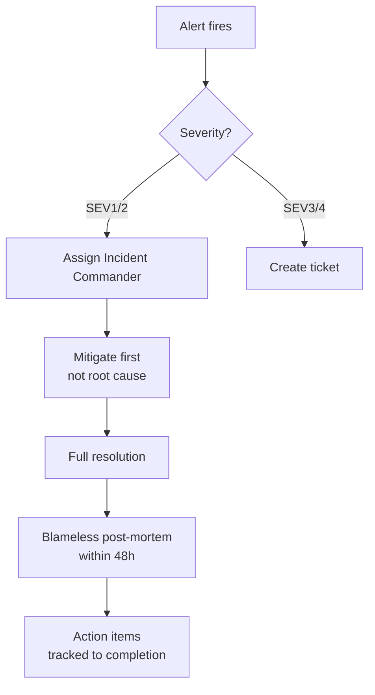
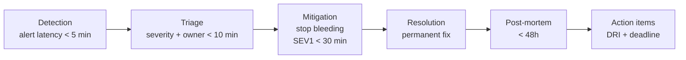

# Incident Management and Blameless Post-Mortems

## Level 1 — Surface (2-minute read)

**What it is**: A structured process to detect, respond to, mitigate, and learn from production failures — without assigning personal blame.

**When you need this**: Once your service has an SLO and real users. Any team handling more than 1 production incident per month needs a defined incident process. At 10+ engineers, unstructured incident response becomes the leading cause of avoidable MTTR inflation.

### Core concepts

- **Severity classification** determines who gets woken up, how fast you must respond, and what communication is required
- **Single incident commander (IC)** — one person owns the incident end-to-end. Everyone else executes tasks they are assigned by the IC. No committees.
- **Mitigate first, root-cause second** — your first job is to stop the bleeding, not to understand why it happened
- **Blameless culture** — systems fail, not people. Post-mortems find systemic fixes, not scapegoats
- **5-minute detection rule** — if you cannot detect a SEV1 within 5 minutes via alerting, your observability is broken

### Severity Classification Table

| Severity | Impact | Example | Response SLA | Communication |
|----------|--------|---------|-------------|---------------|
| **SEV1** | Total outage — 100% of users affected or revenue blocked | Payment service down, auth returning 503 for all users | IC assigned < 10 min, mitigation < 30 min | Status page update every 15 min |
| **SEV2** | Major degradation — > 20% of users affected or core feature broken | Checkout slow (P99 > 10s), image uploads failing for 30% of users | IC assigned < 20 min, mitigation < 2h | Status page update every 30 min |
| **SEV3** | Minor degradation — small percentage of users affected, workaround exists | PDF export fails for 5% of users, non-critical dashboard slow | Create ticket, fix within 1 business day | Internal Slack only |
| **SEV4** | Cosmetic issue or very minor impact | Wrong icon displayed, minor copy error, non-production alert noise | Create ticket, fix in next sprint | None required |

### Incident Lifecycle — Happy Path



### Use this when / Don't use this when

| Use incident management when | Skip the full process when |
|------------------------------|---------------------------|
| Production users are affected | Issue is isolated to staging/dev |
| SLO burn rate alert fires | It is a known flaky test |
| Revenue or data integrity at risk | Non-customer-facing batch job fails |
| SEV1 or SEV2 classification | SEV4 cosmetic issue |
| Multiple teams need coordination | Single engineer can fix in < 15 min |

---

## Level 2 — Deep Dive

### Incident Lifecycle with Timing Targets

A production incident passes through five phases. Missing timing targets at any phase compounds downstream delay — every minute a SEV1 is unmitigated costs user trust and SLO budget.



#### Phase 1: Detection (target: < 5 minutes)

Detection latency is the time from failure occurrence to first alert firing. This is determined entirely by your alerting strategy, not your engineers' response speed.

Common causes of detection latency > 5 minutes:
- Alert thresholds set too conservatively (P99 must exceed 2s for 10 consecutive minutes before firing — too slow)
- Evaluating on 5-minute Prometheus scrape windows instead of 1-minute
- No synthetic probes hitting critical user journeys from outside the cluster
- Alerting only on infrastructure metrics (CPU, memory) instead of SLI metrics (request success rate, latency)

**Fix**: Alert on SLI degradation with a 1-minute evaluation window. For SEV1-class conditions (error rate > 5%), fire immediately on the first bad window, not after sustained duration.

#### Phase 2: Triage (target: < 10 minutes)

The on-call engineer receives the alert and must answer three questions:
1. What is the blast radius? (how many users, which regions, which features)
2. What severity does this warrant?
3. Who else needs to be paged?

At the end of triage, an Incident Commander is assigned for SEV1/2. The IC should be a senior engineer who knows the system — not necessarily the one who is currently on-call. On-call is the first responder; IC is the decision-maker.

**Triage checklist (< 10 minutes)**:
```
[ ] Check status dashboard — confirm the alert is real, not a monitoring fluke
[ ] Identify affected services (use distributed traces or dependency map)
[ ] Estimate user impact: N users affected, which geographies
[ ] Assign severity: SEV1/2/3/4
[ ] If SEV1/2: open war room (dedicated Slack channel #incident-YYYY-MM-DD-short-desc)
[ ] If SEV1/2: page IC and comms lead
[ ] Post initial message to #incidents channel and status page draft
```

#### Phase 3: Mitigation (target: SEV1 < 30 minutes, SEV2 < 2 hours)

Mitigation means stopping further user impact. It does not mean fixing the root cause. Common mitigation actions:

- **Rollback** the last deployment (feature flag off or binary rollback)
- **Increase capacity** (scale out pods, raise connection pool limits)
- **Disable a feature** (kill switch / feature flag)
- **Reroute traffic** (shift to backup region, failover to read replica)
- **Shed load** (enable rate limiting, drop non-critical background jobs)

The IC calls the mitigation strategy. They do not implement it themselves — they assign a task to a tech lead and wait for a status update. This separation of command and execution is critical for SEV1 incidents with > 3 people in the war room.

**Anti-pattern**: Everyone in the war room simultaneously trying different fixes. The IC must enforce one change at a time, with a clear owner and timeout. Parallel uncoordinated changes make it impossible to determine which action resolved the issue.

#### Phase 4: Resolution

Resolution is the permanent fix. It may happen during the incident (if the root cause is simple: a bad config was deployed and rolled back) or days later (if the root cause requires a code change, schema migration, or vendor coordination).

Resolution criteria:
- All SLIs have returned to normal for at least 15 minutes
- No anomalies in dependent services
- Status page marked as resolved
- War room channel archived with summary pinned

#### Phase 5: Post-mortem (target: within 48 hours)

The post-mortem must happen while the incident is fresh. Waiting more than 48 hours causes memory decay in contributors and reduces the quality of the timeline. The IC is responsible for scheduling and leading the post-mortem.

---

### On-Call Runbook Structure

Every alert that can wake someone up at 3am must have a runbook. A runbook is the difference between a 15-minute MTTR and a 2-hour MTTR.

**Google DORA data**: Teams with documented runbooks for > 80% of their alerts report 40% lower MTTR compared to teams without runbooks.

#### Runbook Template

```markdown
# Alert: [AlertName]

## Why this alert fires
[One paragraph: what metric crosses what threshold, what it means for users]

## P90 cause
[The most common root cause — what to check first. Be specific: 
"Usually caused by a slow downstream SQL query — check pg_stat_activity"]

## Immediate steps

### Step 1: Confirm the alert is real
```bash
# Confirm elevated error rate in Grafana or via CLI
kubectl get pods -n production | grep -v Running
# Check recent deployments
kubectl rollout history deployment/api-server -n production
```

### Step 2: Check recent changes
```bash
# What deployed in the last 2 hours?
git log --since="2 hours ago" --oneline
# Check feature flag state
curl -H "Authorization: Bearer $TOKEN" https://flags.internal/api/flags | jq '.[] | select(.key=="new-checkout")'
```

### Step 3: Mitigation options (choose one)

**Option A — Rollback last deployment (fastest)**
```bash
kubectl rollout undo deployment/api-server -n production
# Verify rollback is live
kubectl rollout status deployment/api-server -n production
```

**Option B — Disable feature flag**
```bash
curl -X PATCH -H "Authorization: Bearer $TOKEN" \
  https://flags.internal/api/flags/new-checkout \
  -d '{"enabled": false}'
```

**Option C — Scale out (if it's a load issue)**
```bash
kubectl scale deployment/api-server --replicas=20 -n production
```

## Escalation path
1. Page tech lead: @alice (primary)
2. If no response in 5 minutes: page @bob (secondary)
3. If database-related: page DBA on-call via PagerDuty escalation policy "database-oncall"
4. If vendor dependency (Stripe, Twilio): use vendor status contact in 1Password vault "incident-contacts"

## How to verify it is fixed
- Error rate on `api_request_errors_total` drops below 0.1% for 5 consecutive minutes
- P99 latency on `/api/checkout` returns below 500ms
- Status page: update to "Monitoring" then "Resolved" after 15 minutes clean
```

---

### Incident Communication Templates

Communication quality is as important as technical response. Poor communication inflates perceived severity, erodes user trust, and burns on-call engineers with irrelevant questions.

#### War Room Channel — Opening Message

```
**INCIDENT OPENED** — SEV[1/2]
Time: [HH:MM UTC]
IC: @name
Comms Lead: @name
Tech Lead: @name

**Impact**: [N users affected / which features broken / which regions]
**Symptoms**: [What is failing and how users experience it]
**Current hypothesis**: [What we think is causing this]
**Next update**: [HH:MM UTC — in 15 minutes for SEV1, 30 min for SEV2]

Thread: all technical discussion below this message. Keep top-level for IC updates only.
```

#### Status Page Language Rules

1. **Never promise an ETA you cannot keep.** "We expect resolution by 14:00 UTC" is worse than no ETA if you miss it. Use "We are actively investigating and will provide the next update by [time]."
2. **Write for users, not engineers.** "Kinesis internal API throttling caused downstream Lambda timeouts" → "Some users may experience delays when processing orders. Our team is actively working to resolve this."
3. **Acknowledge before you understand.** Post "We are aware of and investigating reports of [feature] issues" within 5 minutes of a SEV1, even if you have no diagnosis yet.
4. **Update on schedule, not on discovery.** Post the update at the promised time even if it is "We are still investigating — no new information at this time."

#### SEV1 Update Template (every 15 minutes)

```
**UPDATE [HH:MM UTC]**
Status: Investigating / Identified / Mitigating / Monitoring / Resolved

What we know: [2-3 sentences on current state]
What we are doing: [1-2 sentences on active mitigation]
Impact: [Updated estimate]
Next update: [HH:MM UTC]
```

---

### Blameless Post-Mortem Template

The post-mortem is not a blame session. It is a structured review of a complex system failure with the goal of producing action items that make the system more resilient. When engineers fear post-mortems, they hide incidents — which is far more dangerous than the incident itself.

**Blameless principle**: Ask "what allowed this to happen?" not "who caused this?" Systems that fail have latent conditions (tight coupling, missing circuit breakers, no runbooks) that were present long before the incident. The engineer who triggered it was the last link in a chain — not the cause.

#### Full Post-Mortem Document Template

```markdown
# Post-Mortem: [Short description]
**Date**: YYYY-MM-DD
**Severity**: SEV[1/2]
**Duration**: [HH:MM] (from first user impact to resolution)
**Authors**: [IC name, tech lead name]
**Status**: Draft / In Review / Final

---

## Incident Summary
[One paragraph: what failed, how many users were affected, for how long, what was the 
business impact (revenue, error budget consumed), and what fixed it. 
Example: "On 2024-03-15 at 14:32 UTC, a misconfigured Nginx rate limit rule deployed 
to production caused 100% of API requests to return HTTP 429. 
Approximately 45,000 users were unable to use the service for 22 minutes. 
The issue was resolved by rolling back the Nginx config. 
Estimated revenue impact: $18,000. Error budget consumed: 3.2% of monthly SLO budget."]

---

## Timeline
All times in UTC. 5-minute resolution minimum.

| Time | Event |
|------|-------|
| 14:28 | Nginx config change deployed to production via automated pipeline |
| 14:32 | First HTTP 429 errors observed in logs (not yet alerting) |
| 14:35 | SLO burn rate alert fires: error rate 100%, page sent to on-call |
| 14:37 | On-call engineer @alice acknowledges page |
| 14:40 | @alice opens war room #incident-2024-03-15-api-429 |
| 14:41 | Initial triage: all API endpoints returning 429, traces show Nginx as origin |
| 14:43 | @alice pages IC @bob |
| 14:45 | @bob joins war room, confirms SEV1, assigns @charlie to investigate Nginx config |
| 14:50 | @charlie identifies rate limit rule misconfiguration in recent deploy |
| 14:52 | IC @bob approves Nginx config rollback |
| 14:54 | @charlie executes rollback: `kubectl rollout undo deployment/nginx-ingress` |
| 14:55 | Error rate drops from 100% to 0.1% |
| 15:05 | Error rate stable at < 0.1% for 10 minutes, incident declared resolved |
| 15:07 | Status page updated to Resolved |

---

## Contributing Factors (5 Whys — not blame)

**Why did users get 429 errors?**
→ Nginx rate limit was set to 0 requests/second (should be 1000/s)

**Why was rate limit set to 0?**
→ Config template had a bug: empty string `""` in `rate_limit` field parsed as `0` instead of using default

**Why did the empty string reach production?**
→ CI pipeline linted YAML syntax but did not validate semantic values (rate_limit > 0)

**Why was there no semantic validation?**
→ Nginx config validation was added to the pipeline 6 months ago but only covers required fields, not value ranges

**Why was this not caught in staging?**
→ Staging environment uses a different Nginx config path; the misconfigured file was in a path only applied to production

**Root causes**:
1. Missing semantic validation in CI pipeline for Nginx config values
2. Staging and production Nginx config paths diverged — staging no longer tests all production configs
3. No canary deployment for infrastructure config changes (applied to all pods simultaneously)

---

## What Went Well

- Alert fired within 3 minutes of first user impact (MTTD: 3 min — within target)
- On-call engineer acknowledged within 2 minutes
- IC was assigned within 8 minutes of alert
- Rollback was executed cleanly and worked on first attempt
- Status page was updated within 5 minutes of incident opening
- War room communication was clear — IC maintained discipline on update cadence

---

## What Could Have Gone Better

- Mitigation took 19 minutes (target: < 30 min, but 10+ minutes were spent confirming the root cause before rolling back — IC should have approved rollback earlier based on "last change" principle)
- Staging/production config drift was a known issue from a TODO in the repo but had no owner or deadline
- No canary for Nginx config deploys — entire fleet affected simultaneously

---

## Action Items

| Action | Owner | Priority | Due Date | Status |
|--------|-------|----------|----------|--------|
| Add semantic validation for Nginx rate_limit field in CI pipeline | @charlie | P1 | 2024-03-22 | Open |
| Align staging and production Nginx config paths | @dave | P1 | 2024-03-29 | Open |
| Implement canary rollout for infrastructure config changes (10% → 50% → 100%) | @alice | P2 | 2024-04-12 | Open |
| Add integration test: deploy config with rate_limit=0, verify CI rejects it | @charlie | P2 | 2024-03-29 | Open |
| Update runbook for Nginx alerts to include "check recent config deploys" as P90 cause | @bob | P3 | 2024-03-20 | Open |

---

## Metrics

| Metric | Value | Target | Pass? |
|--------|-------|--------|-------|
| MTTD (alert to page) | 3 min | < 5 min | ✅ |
| Time to IC assigned | 8 min | < 10 min | ✅ |
| MTTR (first impact to resolved) | 22 min | < 30 min | ✅ |
| Status page first update | 5 min | < 10 min | ✅ |
| Post-mortem completed | Within 48h | < 48h | ✅ |
| Action items with DRI + deadline | 5/5 | 100% | ✅ |
```

---

### SLO Burn Rate Alerts for Incident Triggering

SLO burn rate alerts are the most reliable trigger for incident response because they measure actual user impact, not infrastructure health. An alert that fires when CPU hits 80% may not indicate user impact at all. An alert that fires when 2% of your monthly SLO budget is consumed in 1 hour always indicates user impact.

#### Alert Design: Fast Burn and Slow Burn

```
Monthly error budget = (1 - SLO_target) × total_requests_per_month
For 99.9% SLO: budget = 0.1% of requests = ~43.8 minutes of complete outage per month
```

**Fast burn alert** — SEV1/2 page:
- Trigger: 2% of monthly budget consumed in 1 hour
- Burn rate multiple: 2% × (720 hours/month / 1 hour) = 14.4x normal
- This means: error rate is 14.4x the allowable rate for your SLO

**Slow burn alert** — SEV3 ticket:
- Trigger: 5% of monthly budget consumed in 6 hours
- Burn rate multiple: 5% × (720/6) = 6x normal
- This means: sustained degradation that is not an emergency but will exhaust budget

#### Prometheus Alerting Rules

```yaml
# Fast burn: SEV1/2 page — 2% budget in 1 hour
groups:
  - name: slo_burn_rate
    rules:
      - alert: SloBurnRateHigh
        expr: |
          (
            sum(rate(http_requests_total{status=~"5.."}[1h]))
            /
            sum(rate(http_requests_total[1h]))
          ) > (14.4 * 0.001)
        for: 2m
        labels:
          severity: critical
          team: "{{ $labels.team }}"
        annotations:
          summary: "SLO burn rate critical — fast burn detected"
          description: >
            Error rate is {{ $value | humanizePercentage }} over the last 1h.
            This is a 14.4x burn rate (2% of monthly budget in 1 hour).
            Service: {{ $labels.service }}. Page on-call immediately.
          runbook: "https://runbooks.internal/slo-burn-rate-high"

      # Slow burn: SEV3 ticket — 5% budget in 6 hours
      - alert: SloBurnRateMedium
        expr: |
          (
            sum(rate(http_requests_total{status=~"5.."}[6h]))
            /
            sum(rate(http_requests_total[6h]))
          ) > (6 * 0.001)
        for: 15m
        labels:
          severity: warning
          team: "{{ $labels.team }}"
        annotations:
          summary: "SLO burn rate elevated — slow burn detected"
          description: >
            Error rate is {{ $value | humanizePercentage }} over the last 6h.
            This is a 6x burn rate (5% of monthly budget in 6 hours).
            Service: {{ $labels.service }}. Create a ticket and investigate.
          runbook: "https://runbooks.internal/slo-burn-rate-medium"

      # Near-zero budget: imminent SLO breach
      - alert: SloErrorBudgetNearlyExhausted
        expr: |
          (
            1 - (
              sum(rate(http_requests_total{status!~"5.."}[30d]))
              /
              sum(rate(http_requests_total[30d]))
            )
          ) > 0.0009
        labels:
          severity: warning
        annotations:
          summary: "Error budget nearly exhausted (> 90% consumed)"
          description: >
            The 30-day error budget for {{ $labels.service }} is > 90% consumed.
            Any further incidents this month will breach the SLO.
```

#### Multi-Window, Multi-Burn-Rate (Google Recommended)

Google recommends combining fast and slow burn windows to reduce false positives:

```yaml
# Page only when BOTH 1h AND 5m windows show high burn rate
- alert: SloBurnRatePageNow
  expr: |
    (
      sum(rate(http_requests_total{status=~"5.."}[1h]))
      / sum(rate(http_requests_total[1h]))
    ) > 0.0144
    AND
    (
      sum(rate(http_requests_total{status=~"5.."}[5m]))
      / sum(rate(http_requests_total[5m]))
    ) > 0.0144
  for: 0m
  labels:
    severity: critical
```

The 5-minute window catches the current spike; the 1-hour window confirms it is sustained. Requiring both reduces pager noise from transient spikes that self-resolve.

---

### MTTR Reduction Playbook

MTTR (Mean Time to Repair) is the most actionable reliability metric for an engineering team because it is almost entirely within your control — unlike MTTF (Mean Time to Failure), which depends on the complexity of your system and external vendors.

#### 1. Feature Flags for Instant Rollback (target MTTR: < 5 minutes)

A feature flag is a binary kill switch for any code path. When a new feature causes a production incident, the flag can be toggled off without a deployment.

```python
# Example: LaunchDarkly SDK in Python
import ldclient

def process_payment(order):
    client = ldclient.get()
    
    # If new payment processor is causing errors, flag goes off
    use_new_processor = client.variation(
        "new-payment-processor",
        {"key": order.user_id},
        default=False  # Default to old processor if flag service is unreachable
    )
    
    if use_new_processor:
        return new_payment_processor.charge(order)
    else:
        return legacy_payment_processor.charge(order)
```

Requirements for flags to be an effective MTTR tool:
- Flag evaluation must be synchronous and < 1ms (cache flags locally, sync asynchronously)
- Flag service must have a safe default (fail open or fail closed depending on the feature)
- On-call engineers must have write access to toggle flags without a deployment
- Every SEV1-class feature must have a flag at launch

#### 2. Canary Deployments (limit blast radius)

A canary deployment routes a small percentage of traffic to the new version before full rollout. If the canary shows elevated errors, it is automatically rolled back before most users are affected.

```yaml
# Argo Rollouts canary strategy
apiVersion: argoproj.io/v1alpha1
kind: Rollout
spec:
  strategy:
    canary:
      steps:
        - setWeight: 1    # 1% of traffic
        - pause: {duration: 5m}
        - analysis:       # Auto-rollback if error rate > 1%
            templates:
              - templateName: error-rate
        - setWeight: 10   # 10% of traffic
        - pause: {duration: 10m}
        - analysis:
            templates:
              - templateName: error-rate
        - setWeight: 50
        - pause: {duration: 10m}
        - setWeight: 100
---
apiVersion: argoproj.io/v1alpha1
kind: AnalysisTemplate
metadata:
  name: error-rate
spec:
  metrics:
    - name: error-rate
      interval: 1m
      failureLimit: 3
      provider:
        prometheus:
          address: http://prometheus:9090
          query: |
            sum(rate(http_requests_total{status=~"5..",canary="true"}[2m]))
            /
            sum(rate(http_requests_total{canary="true"}[2m]))
      successCondition: result[0] < 0.01
```

With a canary strategy, a bad deployment that would have caused a SEV1 for 100% of users instead causes a SEV3 for 1% of users and auto-rolls back.

#### 3. Pre-Built Runbooks (MTTR reduction: 40%)

Per Google DORA research (2023), teams with documented, maintained runbooks for > 80% of their alerts achieve 40% lower MTTR than teams without runbooks. The MTTR reduction comes from:
- Eliminating the "what do I check first?" delay (saves 5-10 min on average)
- Providing copy-paste commands (eliminates typos and knowledge gaps under stress)
- Clear escalation paths (eliminates "should I page someone else?" hesitation)

Runbook maintenance discipline:
- After every incident, the IC is responsible for updating the runbook with any new P90 cause discovered
- Runbooks are reviewed in post-mortems — if the runbook did not help, it gets rewritten
- Every new alert deployed to production must have a runbook written before it can page

#### 4. War Room Setup

For SEV1 incidents with > 2 engineers, a structured war room prevents communication chaos.

```
War room structure:
#incident-YYYY-MM-DD-description (Slack channel)

Roles:
- Incident Commander (IC): owns decisions, sets next update time, calls the strategy
- Comms Lead: writes status page updates, answers questions in #general so IC is not distracted
- Tech Lead(s): implement fixes assigned by IC, report status back with timestamps
- Scribe: maintains the incident timeline document in real-time

Rules:
1. All technical discussion in the thread, not the top level
2. IC posts top-level updates only (every 15 min for SEV1)
3. One change at a time — IC must approve each mitigation step before execution
4. No side conversations during active mitigation
5. War room is archived (not deleted) after resolution
```

---

### Real Incidents: 3 Case Studies

#### Case Study 1: AWS us-east-1 Outage, December 2021

**Duration**: ~9 hours of partial outage affecting many AWS services in us-east-1
**Root cause**: AWS Kinesis had an internal scaling event that caused a cascade to over a dozen dependent services including IAM, Route53, Lambda, and the AWS Console.

**What happened**: Kinesis added additional capacity to its front-end fleet. This triggered an operating system issue where the new nodes tried to re-establish all peer connections simultaneously. The resulting connection storm exhausted thread pools, causing Kinesis to fail. Because Kinesis is used internally by many AWS services for control plane operations, the failure cascaded to IAM, Lambda, ECS, and others. IAM failures were particularly severe because many services use IAM to authenticate API calls.

**Why it was hard to detect**: The AWS internal monitoring infrastructure itself uses some of the services that went down (including IAM). This created a situation where monitoring alerts could not be delivered because the alerting pipeline was degraded. AWS engineers were partially blind to the scope of the outage during the incident.

**What AWS changed**:
- Decomposed Kinesis internal dependencies to reduce blast radius of capacity events
- Added more aggressive connection rate limiting on startup
- Separated monitoring infrastructure from production control planes so monitoring cannot be affected by the same failure mode
- Added explicit circuit breakers on Kinesis-dependent control plane operations

**Lesson**: Internal monitoring infrastructure must be isolated from the systems it monitors. When your monitoring stack shares dependencies with production, you lose visibility exactly when you need it most.

#### Case Study 2: Cloudflare BGP Leak, June 2019

**Duration**: 20 minutes
**Root cause**: A third-party ISP (DQE Communications / Voxility) propagated a misconfigured BGP route that caused a large portion of global internet traffic to route through a small Pennsylvania ISP, saturating their links and dropping traffic intended for Cloudflare and many other major services.

**How Cloudflare recovered in 20 minutes**:
- Cloudflare had pre-built runbooks for BGP-related incidents from previous exercises
- On-call network engineers recognized the BGP anomaly pattern within minutes from routing table alerts
- The fix (withdrawing and re-advertising the affected BGP routes) was a documented, practiced procedure
- Cloudflare's network is designed with multiple anycast PoPs — engineers could selectively drop the affected paths without taking down the entire network

**MTTR comparison**: The 2019 Cloudflare BGP incident resolved in 20 minutes. The 2022 Cloudflare routing incident (caused by an internal change) took 6 hours. The difference: the 2019 incident matched a known runbook pattern; the 2022 incident was a novel failure mode with no runbook.

**Lesson**: Practiced runbooks for known failure modes are the single highest-leverage investment for MTTR reduction. Novel failure modes always take longer — which is why post-mortem action items must include runbook creation for every new failure mode discovered.

#### Case Study 3: GitHub Database Incident, October 2018

**Duration**: 24 hours of partial service degradation
**Root cause**: A network partition between the US East Coast and US West Coast data centers triggered a master failover during a routine maintenance window. The automatic failover promoted a replica that was 9 seconds behind the master. When network connectivity was restored, GitHub had two masters in conflict — a classic split-brain scenario.

**Timeline of the crisis**:
- 22:52 UTC: Routine network maintenance begins in US East Coast DC
- 22:54 UTC: Network connectivity drops for 43 seconds between DCs
- 22:54 UTC: Orchestration system triggers automated failover — promotes US West replica to master
- 22:57 UTC: Network connectivity restored — now two masters exist simultaneously
- 22:58 UTC: Writes began being accepted on both masters (data divergence begins)
- 23:06 UTC: GitHub engineers detect the split-brain and halt all writes to prevent further divergence
- +24h: 24-hour period of data reconciliation and service restoration

**Why it took 24 hours**: The 9 seconds of replication lag between the two masters meant ~9 seconds of transaction history had diverged. GitHub chose data correctness over availability — they would not restore full service until every diverged write was reconciled. This was the right decision. The alternative (picking one master and discarding the other) would have meant silent data loss.

**What GitHub changed**:
- Disabled automatic failover for the primary database — all failovers now require human approval
- Added explicit fencing (STONITH) to prevent split-brain: the old master is forcibly shut down before the replica is promoted
- Added replication lag monitoring as a pre-condition for failover: if replica lag > 1 second, failover is blocked
- Implemented a pre-maintenance checklist that includes verifying failover behavior before any network maintenance

**Lesson**: Automated failover is dangerous without split-brain protection. The safest pattern is: detect failure automatically, alert humans, require manual approval for promotion, and fence the old master before promoting the replica.

---

### Key Numbers Reference Table

| Metric | Target | Industry Benchmark | Notes |
|--------|--------|--------------------|-------|
| MTTD (Mean Time to Detect) | < 5 min | 5-15 min (Gartner 2023) | Requires SLI-based alerting, not infrastructure-only |
| MTTR SEV1 | < 30 min | < 1 hour (industry avg) | Requires runbooks + canary + feature flags |
| MTTR SEV2 | < 2 hours | 2-4 hours (industry avg) | |
| Time to IC assigned | < 10 min | 10-20 min (industry avg) | |
| Post-mortem completion | < 48 hours | < 72 hours (Google SRE) | Freshness of memory degrades rapidly after 48h |
| On-call rotation length | 1 week max | 1-2 weeks (Google SRE) | Longer than 1 week causes burnout |
| Runbook coverage | > 80% of pages | 40-60% (typical) | 80% coverage → 40% MTTR reduction (DORA 2023) |
| SLO fast burn threshold | 14.4x (2% budget/1h) | — | Google SRE recommended |
| SLO slow burn threshold | 6x (5% budget/6h) | — | Google SRE recommended |
| Max on-call pages per shift | < 2 actionable pages/night | — | More than 2/night → alert quality problem |

---

### Common Mistakes

#### Mistake 1: Root Cause Hunting During Active Mitigation

**Symptom**: IC and tech leads spend 30+ minutes diagnosing the root cause while users are still experiencing errors.

**Root cause**: Engineers want to understand what happened before they act. This is correct behavior for development — not for incident response.

**Fix**: Apply the "last change" principle immediately. What changed in the last 2 hours? Rollback that change first. If that does not resolve the issue in 5 minutes, then investigate. You can always re-apply the change after the incident if it was not the cause. The cost of an unnecessary rollback is a 10-minute delay for engineers; the cost of prolonged investigation during active downtime is ongoing user impact and revenue loss.

#### Mistake 2: Multiple Uncoordinated Changes During a SEV1

**Symptom**: Three engineers each independently try a different fix simultaneously. Error rate drops — but no one knows which fix worked. Or error rate fluctuates unpredictably because multiple changes are interacting.

**Root cause**: Lack of IC command authority. Everyone is "helping" but no one is coordinating.

**Fix**: The IC must enforce a strict serialization of mitigation attempts. One change at a time. After each change, wait 3 minutes and observe metrics before making the next change. If you have multiple theories, rank them by confidence and execute in order.

#### Mistake 3: Post-Mortem Action Items Without DRIs or Deadlines

**Symptom**: Post-mortem ends with 8 action items on a document. 6 weeks later, 0 of 8 are complete. Same incident recurs.

**Root cause**: "We should" is not an action item. Without a named DRI (Directly Responsible Individual) and a specific deadline, the item will not be completed.

**Fix**: Every action item must have three fields before the post-mortem ends: what (specific, testable deliverable), who (single named DRI — not a team), by when (specific date). The IC is responsible for tracking these to completion, not for implementing them. Review open action items in the next post-mortem if they are overdue.

---

## Key Takeaways / TL;DR

- **Detect within 5 minutes**: SLI-based burn rate alerts catch real user impact faster than infrastructure metrics. Fast-burn alert at 14.4x rate (2% monthly budget in 1 hour) is the Google SRE standard.
- **Single IC owns the incident**: Command-and-execute separation prevents the coordination chaos that doubles MTTR in war rooms with > 3 people.
- **Mitigate before you diagnose**: The last-change rollback principle gets most SEV1s resolved in < 30 minutes. Spending 20 minutes on diagnosis while users are down is the most common avoidable MTTR driver.
- **Runbooks reduce MTTR by 40%** (Google DORA 2023): Every alert that can page an engineer at 3am must have a documented, maintained runbook with copy-paste commands and escalation paths.
- **Blameless post-mortems within 48 hours**: Memory decays rapidly. Post-mortems that find systemic fixes — not scapegoats — are the only mechanism for long-term reliability improvement. Without them, incidents recur.
- **Action items without DRIs and deadlines are not action items**: The GitHub 2018 database incident had 7 follow-up items; 6 of 7 were closed within 90 days. The Cloudflare 2019 BGP incident resolved in 20 minutes specifically because runbooks from a previous post-mortem had been acted on.

---

## References

- 📖 [Google SRE Book — Chapter 14: Managing Incidents](https://sre.google/sre-book/managing-incidents/)
- 📖 [AWS us-east-1 outage post-mortem 2021](https://aws.amazon.com/message/12721/)
- 📖 [Cloudflare BGP leak incident 2019](https://blog.cloudflare.com/cloudflare-outage/)
- 📖 [GitHub October 2018 Incident](https://github.blog/2018-10-30-oct21-post-incident-analysis/)
- 📖 [Google SRE Workbook — Alerting on SLOs](https://sre.google/workbook/alerting-on-slos/)
- 📖 [DORA 2023 State of DevOps Report](https://dora.dev/research/2023/dora-report/)
- 📺 [Increment: On-Call](https://increment.com/on-call/)
