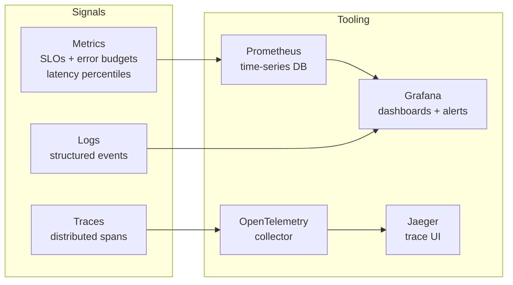

# Observability Concepts

Metrics, logs, traces, SLOs, and performance profiling — the tools to understand your system.

```mermaid
graph LR
    subgraph "Signals"
        M[Metrics\nSLOs + error budgets\nlatency percentiles]
        L[Logs\nstructured events]
        T[Traces\ndistributed spans]
    end
    subgraph "Tooling"
        P[Prometheus\ntime-series DB]
        G[Grafana\ndashboards + alerts]
        OT[OpenTelemetry\ncollector]
        J[Jaeger\ntrace UI]
    end
    M --> P --> G
    T --> OT --> J
    L --> G
```
