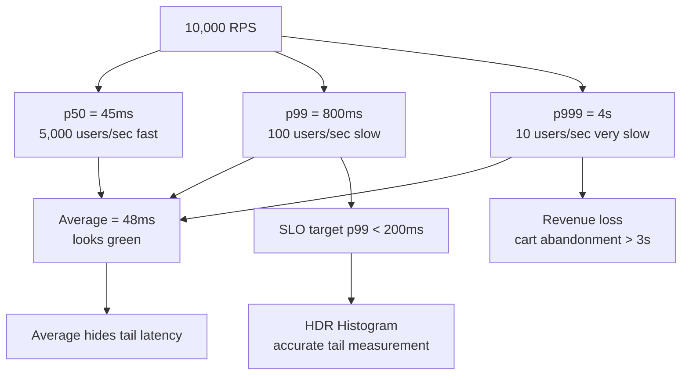
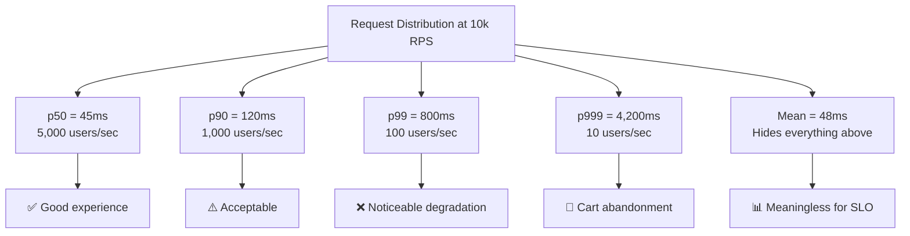
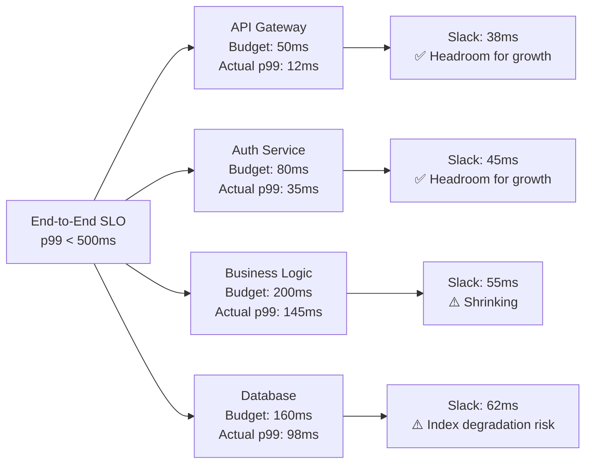
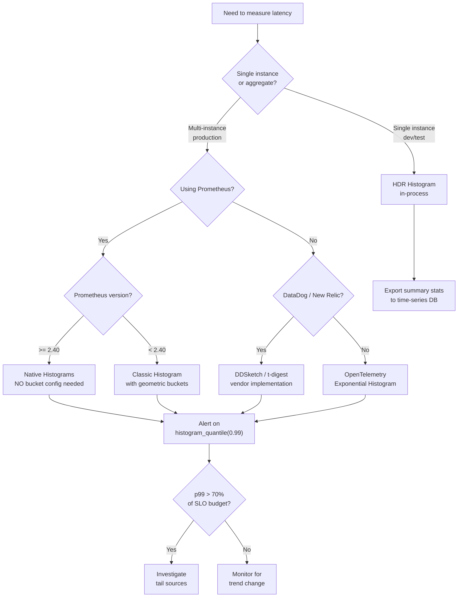

# Latency Percentiles: p50, p99, p999 and Why Averages Lie

## 🗺️ Quick Overview



*At 10,000 RPS, a p999 of 4 seconds means 10 users per second hitting a wall your average dashboard never shows.*

**Your average latency is 45ms. Your users are furious. Both facts are true simultaneously — and that's the problem.** Averages are a lossy compression of a distribution. Percentiles are the compression that preserves what actually matters: the tail.

---

## The Problem Class `[Mid]`

Consider an e-commerce checkout API. You instrument it and report: **average response time = 48ms**. Engineering feels good. But 1 in 1000 requests takes 4 seconds. At 10,000 requests per second, that's 10 users per second hitting a 4-second wall. At cart-abandonment rates correlated with 3+ second waits, you're losing revenue while your dashboard shows green.

The core issue: **arithmetic mean is dominated by the bulk of fast requests and masks the tail**.



**Why this is a systems problem, not just a monitoring problem:**

In an N-tier service chain, tail latency compounds. If service A has p99=100ms and calls service B with p99=80ms, the composed p99 is not 180ms — it is roughly `1 - (1-0.01)^2 = ~2%` of requests experience one or both hitting their p99. The *effective* p99 of the composed call approaches p99_A + p99_B, but the *effective p999* of the composed system approaches the individual p99s. This is why microservices amplify tail latency problems.

---

## Why the Obvious Solution Fails `[Senior]`

**Measuring average latency** is the obvious solution — it's simple, fits in a gauge metric, and is easy to alert on. It fails because:

1. **Averages are not additive in the right way**: avg(A+B) = avg(A) + avg(B) only if the same requests hit high latency in both, which is often false.

2. **Averages hide bimodal distributions**: A service with 95% of requests at 10ms and 5% at 1,000ms has an average of ~59ms. Neither fast users nor slow users experience 59ms. Nobody experiences the average.

3. **Prometheus `summary` type is pre-computed at the client** — you cannot re-aggregate summaries across instances or time windows. `histogram_quantile` over a Prometheus histogram is the correct approach, but it requires proper bucket configuration.

**The HDR Histogram problem**: Standard histograms with fixed buckets lose precision at the tails. A bucket defined as `[500ms, 1000ms)` cannot tell you if you have a p999 of 501ms or 999ms. HDR (High Dynamic Range) Histogram solves this with logarithmic bucket spacing — it tracks values across many orders of magnitude with a configurable precision.

**The Coordinated Omission problem** (Gil Tene, 2015, still relevant in 2026): Load generators that send the next request only after the previous one completes will under-report latency under load. If the server is slow, the generator naturally throttles. This hides the latency experienced when the server is overloaded. Tools like `wrk2`, `hey` with constant rate, and `k6` with arrival-rate executors avoid this.

---

## The Solution Landscape `[Senior]`

### Solution 1: Prometheus Histograms with `histogram_quantile`

**What it is**

Prometheus histograms record counts of observations in pre-defined buckets. `histogram_quantile(0.99, rate(http_request_duration_seconds_bucket[5m]))` computes the approximate p99 over a rolling 5-minute window, aggregatable across all instances.

**How it actually works at depth**

Prometheus histograms are a set of counters: one per bucket boundary, plus `_count` and `_sum`. The `histogram_quantile` function interpolates within the bucket that contains the target quantile rank. Accuracy depends entirely on bucket placement.

```
# Prometheus histogram bucket configuration (Go client example)
prometheus.NewHistogramVec(prometheus.HistogramOpts{
    Name: "http_request_duration_seconds",
    Help: "HTTP request latency",
    Buckets: []float64{
        0.001, 0.005, 0.01, 0.025, 0.05,
        0.1, 0.25, 0.5, 1.0, 2.5, 5.0, 10.0,
    },
}, []string{"handler", "status_code"})
```

**Sizing guidance** `[Staff+]`

Bucket selection is not arbitrary. Use this heuristic:

- Place bucket boundaries at your SLO thresholds: if SLO is p99 < 200ms, ensure buckets at 100ms, 150ms, 200ms, 250ms.
- Use geometric spacing for wide ranges: `0.001 * 10^(i/4)` for i=0..N gives evenly-spaced buckets in log space.
- Native histograms (Prometheus 2.40+, 2026 default in most deployments): Use `NativeHistogramBucketFactor: 1.1` for automatic sub-10% relative error across any observed range without pre-configured buckets. This eliminates the bucket placement problem entirely.

**Memory cost**: Each unique label combination creates a histogram. With 10 buckets + _count + _sum = 12 time series per label set. At 100 handlers × 5 status codes = 6,000 time series. Native histograms reduce this significantly.

**Configuration decisions that matter** `[Staff+]`

- **Scrape interval vs. rate window**: `rate(metric[5m])` requires the scrape interval to be less than `5m/2`. At 15s scrape interval, use at minimum `[1m]` windows.
- **Recording rules**: Pre-compute `histogram_quantile` at Prometheus evaluation interval (15s) rather than at query time. Reduces Grafana dashboard load dramatically.
- **Histogram vs. Summary**: Never use Summary for latency if you need cross-instance aggregation. Always use Histogram.

**Failure modes** `[Staff+]`

- **Bucket saturation**: All observations fall in the highest bucket. `histogram_quantile` returns the upper bound of the last bucket, not the true value. Symptom: p99 is flat at exactly your highest bucket value. Fix: extend bucket range or use native histograms.
- **Stale data during rollout**: New pods start with empty histograms. `histogram_quantile` over a short window will show artificially low latency during canary deploys. Use `min_over_time` on error rates to guard canary promotions, not latency alone.
- **Clock skew**: If Prometheus scrapes a pod after it restarts, counter reset detection can cause negative rates. `increase()` is safer than `rate()` for very short counters.

**Observability** `[Staff+]`

```promql
# SLO burn rate - fraction of requests violating 200ms budget
sum(rate(http_request_duration_seconds_bucket{le="0.2"}[5m]))
/
sum(rate(http_request_duration_seconds_count[5m]))

# Tail latency ratio - p99/p50, should stay below 10x under healthy conditions
histogram_quantile(0.99, rate(http_request_duration_seconds_bucket[5m]))
/
histogram_quantile(0.50, rate(http_request_duration_seconds_bucket[5m]))
```

---

### Solution 2: HDR Histogram for In-Process Measurement

**What it is**

HDR Histogram (available in Java, Go, Rust, C, Python) records latency with sub-microsecond precision across a 3600-second range with less than 1% error at any percentile.

**How it actually works at depth**

HDR uses a two-dimensional array: significant bits (rows) and sub-bucket index (columns). Values are stored in the bucket corresponding to `floor(log2(value))` with sub-bucket precision of configurable significant digits (2-5). Memory footprint: ~185KB for a 3600s range at 3 significant digits.

```java
// Java HdrHistogram usage
Histogram histogram = new Histogram(3600000000L, 3); // 1hr range, 3 sig digits
histogram.recordValue(responseTimeNanos);

// Periodic reporting
long p99 = histogram.getValueAtPercentile(99.0);
long p999 = histogram.getValueAtPercentile(99.9);
long p9999 = histogram.getValueAtPercentile(99.99);
histogram.reset(); // or use interval histograms
```

**Sizing guidance** `[Staff+]`

For a service handling 10,000 RPS over a 60-second reporting interval:
- 600,000 observations per interval
- HDR memory: ~185KB fixed (independent of observation count)
- Prometheus histogram memory: 12 series × 8 bytes × (600,000 / scrape_interval) ≈ negligible per scrape, but non-trivial at high cardinality

Use HDR internally when you need sub-millisecond precision and export summary statistics to Prometheus for alerting.

**Failure modes** `[Staff+]`

- **Histogram recycling under load**: If you call `reset()` while another thread is recording, you lose observations. Use `ConcurrentHistogram` or `AtomicHistogram` variants.
- **Max trackable value exceeded**: Values above max are discarded. Set max to your timeout value, not your expected p99.

---

### Solution 3: Latency Budget Allocation Across N-Tier Services

**What it is**

A latency budget is a time allocation per tier in a service call chain, defined to ensure the end-to-end SLO is met.

**How it actually works at depth**

For an end-to-end SLO of p99 < 500ms across a 4-tier system:

```
User → API Gateway → Auth Service → Business Logic → Database
  10ms      50ms          80ms             200ms         160ms = 500ms total
```

The budget must account for:
1. **Network overhead**: Each hop adds 1-5ms LAN, 10-50ms cross-AZ, 50-150ms cross-region
2. **Serialization**: JSON marshal/unmarshal at 10MB/s ≈ 0.1ms for 1KB payload
3. **Queue depth**: Under load, requests queue before execution. Budget must include wait time.

**Percentile propagation formula** `[Staff+]`

For independent services A and B with p99 latencies LA and LB:
- p99 of composed call ≈ LA_p99 + LB_p99 (pessimistic, assumes worst-case correlation)
- True p99 of composed call = LA + LB where both are at their 99th percentile simultaneously

At 10,000 RPS, probability both A and B simultaneously hit p99 = 0.01 × 0.01 = 0.0001 = 0.01% of requests. So true tail is worse than p99_A + p99_B for p9999 of composed system.



**Configuration decisions that matter** `[Staff+]`

- Set **timeouts per downstream call** at budget × 1.5 to allow for variance
- Use **deadline propagation** (gRPC deadlines, HTTP `X-Request-Deadline` header) so every tier can abort when the top-level deadline is exceeded — prevents wasted work
- Alert when actual p99 exceeds 70% of budget — not when it exceeds the budget

---

## Trade-off Matrix `[Senior]` → `[Staff+]`

| Dimension | Arithmetic Mean | Prometheus Histogram | HDR Histogram | Percentile Summary |
|---|---|---|---|---|
| Aggregation across instances | ✅ Additive | ✅ Via histogram_quantile | ❌ Not aggregatable | ❌ Not aggregatable |
| Memory cost | Minimal | Low-Medium (bucket count) | ~185KB fixed | Minimal |
| Precision at tails | ❌ None | ⚠️ Depends on buckets | ✅ Sub-1% error | ✅ At client |
| Time-range flexibility | ✅ Any window | ✅ Any window | ❌ Fixed interval | ❌ Fixed interval |
| 2026 best practice | ❌ Avoid for SLO | ✅ Default choice | ✅ Internal perf loops | ⚠️ Legacy only |
| Coordinated omission protection | N/A | N/A | Manual (use wrk2) | Manual |

---

## Decision Framework `[Senior]` → `[Staff+]`



---

## Production Failure Story `[Staff+]`

**The Black Friday p999 Spike — Retail Platform, 2024**

A major retail platform had SLO: p99 < 300ms for checkout. Monitoring showed p99 = 180ms on Black Friday morning. At 11:00 AM EST (peak traffic), error rate spiked to 8%. Investigation found:

1. **Mean latency**: 62ms — dashboard showed green
2. **p99 latency**: 180ms — well within SLO
3. **p999 latency**: 12,400ms — not monitored

The p999 latency had been growing for weeks undetected. The root cause: a Redis sorted set used for product ranking had grown to 2.8M members. `ZRANGE` on this set for cold products had O(log N + M) time that was 12ms on warm keys but 8,400ms on cold keys. At normal traffic, cold key requests were rare. At Black Friday traffic, the request fan-out meant cold keys were hit at ~0.1% rate — invisible in p99, catastrophic at p999.

**Lesson**: Instrument p999 separately. Add a Prometheus histogram bucket at your timeout value. Alert when p999 > 10% of your timeout.

---

## Observability Playbook `[Staff+]`

**Minimum required metrics for any production service:**

```promql
# 1. SLO compliance rate (5-min burn)
sum(rate(http_request_duration_bucket{le="0.3"}[5m])) by (service)
/ sum(rate(http_request_duration_count[5m])) by (service)

# 2. Tail latency across all percentiles
histogram_quantile(0.50, ...) # p50 - median user
histogram_quantile(0.95, ...) # p95 - most users
histogram_quantile(0.99, ...) # p99 - SLO target
histogram_quantile(0.999, ...) # p999 - worst tail

# 3. Latency under load - does p99 grow with RPS?
# Alert: correlation(rps, p99_latency) > 0.8 over 10 min

# 4. Per-downstream latency (for root cause isolation)
histogram_quantile(0.99, rate(downstream_call_duration_bucket[5m])) by (target_service)
```

**eBPF-based latency profiling (2026)**: Tools like `bpftrace`, Cilium's Hubble, and Parca (continuous profiling) can measure kernel-level TCP latency without application instrumentation. Use when:
- Application metrics show high p99 but application traces show normal durations (indicates network/kernel issue)
- You suspect OS scheduling jitter (common on shared cloud VMs)

```bash
# eBPF: measure TCP RTT distribution for a given service port
bpftrace -e 'kprobe:tcp_rcv_established { @rtt = hist(args->sk->sk_srtt_us >> 3); }'
```

---

## Architectural Evolution `[Staff+]`

**Stage 1: Startup (< 100 RPS)**
- Measure mean + p99 with Prometheus classic histograms
- Alert on p99 > SLO threshold

**Stage 2: Growth (100–10,000 RPS)**
- Add p999 monitoring
- Implement latency budgets per downstream service
- Add coordinated omission-aware load testing (k6 arrival-rate mode)

**Stage 3: Scale (10,000–100,000 RPS)**
- Move to Prometheus native histograms or OpenTelemetry exponential histograms
- Implement deadline propagation across all service calls
- Add per-region latency SLOs (global p99 masks regional degradation)
- Continuous profiling (Parca, Pyroscope) to attribute tail latency to code paths

**Stage 4: Hyperscale (> 100,000 RPS)**
- HDR histograms in critical hot paths for sub-microsecond precision
- eBPF network latency monitoring for kernel/NIC attribution
- Adaptive timeout adjustment based on real-time p99 (not static values)

---

## Decision Framework Checklist `[All Levels]`

- [ ] SLO defined as a percentile (not mean): "p99 of checkout latency < 300ms"
- [ ] p999 monitored separately from p99
- [ ] Prometheus histograms used (not summaries) for all latency metrics
- [ ] Bucket boundaries placed at SLO thresholds
- [ ] Native histograms or OpenTelemetry exponential histograms adopted if Prometheus >= 2.40
- [ ] Load tests use arrival-rate mode (not concurrency mode) to avoid coordinated omission
- [ ] Latency budgets defined per downstream service tier
- [ ] Deadline propagation implemented across service boundaries (gRPC deadlines or custom header)
- [ ] Alert fires when p99 exceeds 70% of budget (not when it exceeds budget — too late)
- [ ] p999 alert threshold set at 10% of configured timeout value
- [ ] eBPF-based network latency profiling available for production debugging
- [ ] Per-region latency SLOs defined for multi-region deployments

*Written by Gaurav Porwal — 10+ Year Engineer | Tech Lead | Product Owner | Business-Minded Builder*
*Last updated: 2026-03-18*
