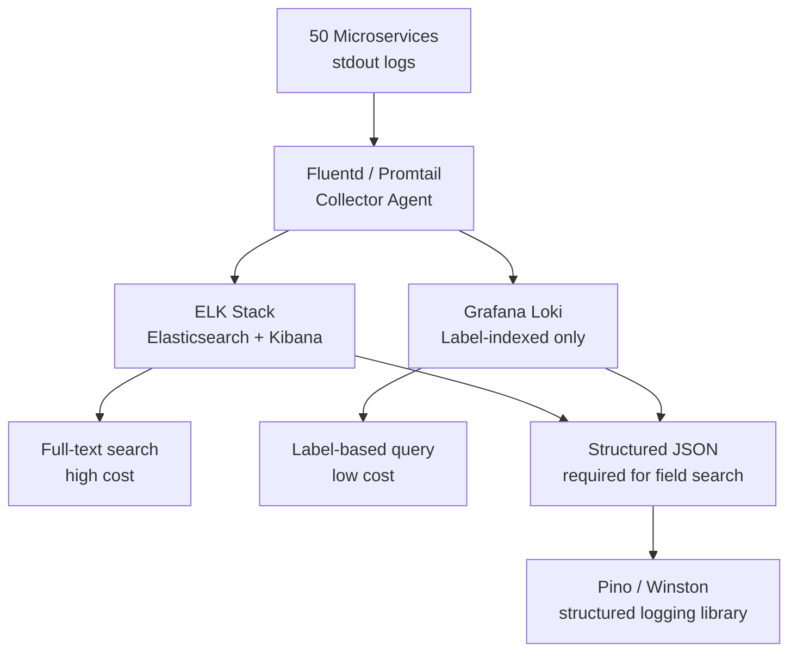
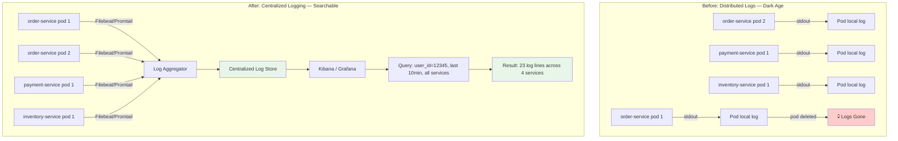
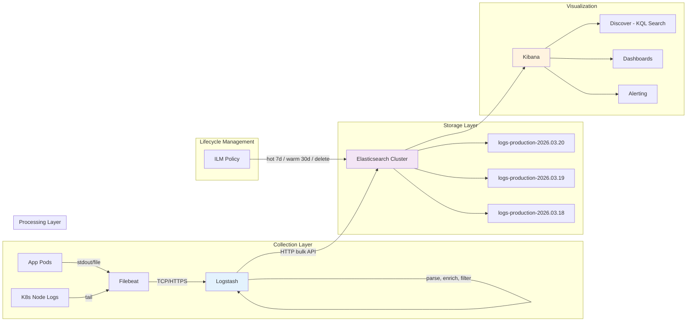
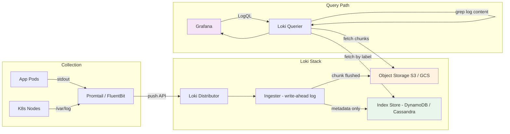

# Log Aggregation: ELK Stack vs Loki vs CloudWatch

## 🗺️ Quick Overview



*ELK gives full-text search at higher cost; Loki stores only label indices at lower cost — choose based on query patterns, not hype.*

**Production incident at 2 AM. You need to find all requests from user 12345 in the last 10 minutes across 50 microservices. Each service has logs on its own pod. SSH-ing into 50 pods and grepping is not an option. You need centralized logging — and you needed it before the incident, not during it. The engineers who built it at 9 AM on a Tuesday look like heroes. The ones who skipped it because "we can always add it later" are the ones still typing `kubectl exec` at 3 AM.**

---

## The Problem Class `[Senior]`

Logs are the most information-dense observability signal. A trace tells you timing. A metric tells you aggregates. A log tells you exactly what happened, with full context, for a specific request at a specific moment.

The problem: in a microservices environment, logs are physically distributed across hundreds of pods, ephemeral by nature (pod dies → logs gone), and unqueryable without aggregation infrastructure.



---

## Structured Logging: The Foundation

Before choosing ELK vs Loki, your logs need to be structured. Plain text logs are the original sin of observability.

### Plaintext vs Structured

**Bad (plaintext):**
```
[2026-03-20 14:23:45] INFO: Request processed for user John in 234ms
[2026-03-20 14:23:46] ERROR: Payment failed for order 12345: card declined
```

These logs are readable by humans but unmachined. You cannot filter by `user_id` because "John" is buried in an unstructured sentence. You cannot aggregate latency because "234ms" is part of a string.

**Good (structured JSON):**
```json
{
  "level": "info",
  "timestamp": "2026-03-20T14:23:45.123Z",
  "service": "order-service",
  "version": "1.4.2",
  "env": "production",
  "trace_id": "3626764117854341595",
  "span_id": "573445723742234371",
  "request_id": "req_01HX4K2VNPZ8QRST",
  "user_id": "usr_12345",
  "msg": "Request processed",
  "http": {
    "method": "POST",
    "path": "/orders",
    "status_code": 201,
    "duration_ms": 234
  }
}
```

Every field is individually filterable, aggregatable, and sortable.

### What to Always Include

```
trace_id       — links log lines to the distributed trace
request_id     — links all log lines within a single request
user_id        — critical for user-facing incident investigation
service        — which service generated this log
version        — which deployment (for regression correlation)
env            — production vs staging
level          — error/warn/info/debug
timestamp      — ISO 8601, UTC, millisecond precision
```

### What to Never Log

- Passwords, API keys, tokens, secrets (even partial — no last-4 of credit cards)
- PII beyond what is operationally necessary (GDPR: minimize what you store)
- Full HTTP request bodies if they contain sensitive data
- Database query results that contain user data

### Log Levels: When to Use What

```
ERROR  — something broke, requires investigation, likely user-impacting
         Example: payment gateway returned 500, could not write to database

WARN   — something unusual but handled, may require investigation
         Example: retry succeeded on 2nd attempt, cache miss rate >50%

INFO   — normal operational events worth recording
         Example: order created, user authenticated, job completed

DEBUG  — detailed diagnostic information, only enable when debugging
         Example: cache key computed, SQL query parameters, function entry/exit
```

In production: run at INFO level. DEBUG logs should never run in production by default — they are 10-100x more verbose and create significant storage cost.

### Pino vs Winston

Pino is 5x faster than Winston because it uses a lock-free asynchronous write pattern and avoids unnecessary object serialization. For high-throughput services (1000+ req/s), the difference matters:

```
Benchmark: 10,000 log lines
Winston:  ~8ms
Pino:     ~1.5ms

At 10,000 req/s: Winston uses ~80ms/s of CPU just on logging
                 Pino uses ~15ms/s
```

### Pino Setup with Trace Injection

```javascript
// logger.js
const pino = require('pino');
const { trace, context } = require('@opentelemetry/api');

const logger = pino({
  level: process.env.LOG_LEVEL || 'info',

  // Use ECS (Elastic Common Schema) format for ELK compatibility
  // Or standard JSON for Loki
  formatters: {
    level(label) {
      return { level: label };
    },
  },

  // Base fields on every log line
  base: {
    service: process.env.SERVICE_NAME || 'unknown-service',
    version: process.env.APP_VERSION || 'unknown',
    env: process.env.NODE_ENV || 'development',
    pid: process.pid,
  },

  // Inject trace context from OpenTelemetry (or dd-trace, or manual)
  mixin() {
    const activeSpan = trace.getActiveSpan();
    if (activeSpan) {
      const spanContext = activeSpan.spanContext();
      return {
        trace_id: spanContext.traceId,
        span_id: spanContext.spanId,
      };
    }
    return {};
  },

  timestamp: pino.stdTimeFunctions.isoTime,
});

module.exports = logger;
```

Usage:
```javascript
const logger = require('./logger');

// Simple log
logger.info({ user_id: userId, order_id: orderId }, 'Order created');

// Error log with full context
logger.error({
  user_id: userId,
  order_id: orderId,
  error_code: err.code,
  error_type: err.constructor.name,
  http_status: 500,
}, 'Payment processing failed');
```

---

## ELK Stack Architecture

ELK = Elasticsearch + Logstash + Kibana. The industry standard for log aggregation for 10+ years.



### How Elasticsearch Works

Elasticsearch stores logs in an inverted index — the same data structure as a search engine. When you log `"payment failed for card declined"`, Elasticsearch tokenizes it into `["payment", "failed", "for", "card", "declined"]` and indexes each token pointing to the document.

This is why full-text search in Kibana is instant on billions of logs: it is not scanning documents, it is looking up pre-built term lists.

The cost: inverted indexes are expensive to build and store. A log shard with 1 billion documents requires significant memory for the index data structures. This is the fundamental cost of ELK at scale.

### Logstash Pipeline Configuration

```ruby
# /etc/logstash/pipeline/main.conf

input {
  beats {
    port => 5044
    ssl => true
    ssl_certificate => "/etc/certs/logstash.crt"
    ssl_key => "/etc/certs/logstash.key"
  }
}

filter {
  # Parse JSON logs from structured logging apps
  if [message] =~ /^\{/ {
    json {
      source => "message"
      target => "parsed"
    }
    # Promote fields from parsed object to top level
    mutate {
      rename => {
        "[parsed][level]"      => "level"
        "[parsed][trace_id]"   => "trace_id"
        "[parsed][user_id]"    => "user_id"
        "[parsed][service]"    => "service"
        "[parsed][msg]"        => "message"
        "[parsed][timestamp]"  => "@timestamp"
      }
    }
  }

  # Add GeoIP enrichment for client IPs (GDPR: ensure IP is hashed or anonymized)
  if [client_ip] {
    geoip {
      source => "client_ip"
      target => "geoip"
      fields => ["country_name", "city_name", "location"]
    }
  }

  # Route errors to separate index for faster error querying
  if [level] == "error" {
    mutate { add_field => { "[@metadata][index_type]" => "errors" } }
  } else {
    mutate { add_field => { "[@metadata][index_type]" => "logs" } }
  }

  # Drop noisy health check logs (don't pay to store them)
  if [http][path] == "/health" or [http][path] == "/metrics" {
    drop {}
  }
}

output {
  elasticsearch {
    hosts => ["https://elasticsearch:9200"]
    user => "${ES_USER}"
    password => "${ES_PASSWORD}"

    # Daily index rotation — manageable shard sizes
    index => "logs-%{[@metadata][index_type]}-%{+YYYY.MM.dd}"

    # Bulk API for throughput
    bulk_size => 1000
    flush_size => 1000
    idle_flush_time => 1
  }
}
```

### Kibana KQL Queries

KQL (Kibana Query Language) is the search syntax in Kibana Discover:

```kql
# Find all log lines for a specific user in the last 10 minutes
user_id: "usr_12345" and @timestamp > now-10m

# Find all errors across services in the last hour
level: "error" and @timestamp > now-1h

# Find slow requests (>1s) in the payment service
service: "payment-service" and http.duration_ms > 1000

# Find all 5xx errors with the specific error code
http.status_code >= 500 and error_code: "PAYMENT_GATEWAY_TIMEOUT"

# Find requests by trace_id (jump from APM trace to all related logs)
trace_id: "3626764117854341595"

# Find all failed logins for a user (security investigation)
user_id: "usr_12345" and msg: "authentication failed"

# Wildcard: find all DB-related errors
error_type: *Database* and level: "error"
```

### Index Lifecycle Management (ILM)

Without ILM, your Elasticsearch cluster fills up and dies. ILM automates shard management:

```json
// PUT /_ilm/policy/logs-policy
{
  "policy": {
    "phases": {
      "hot": {
        "min_age": "0ms",
        "actions": {
          "rollover": {
            "max_primary_shard_size": "50gb",
            "max_age": "1d"
          },
          "set_priority": { "priority": 100 }
        }
      },
      "warm": {
        "min_age": "7d",
        "actions": {
          "shrink": { "number_of_shards": 1 },
          "forcemerge": { "max_num_segments": 1 },
          "allocate": { "number_of_replicas": 0 },
          "set_priority": { "priority": 50 }
        }
      },
      "cold": {
        "min_age": "30d",
        "actions": {
          "freeze": {},
          "allocate": {
            "require": { "data": "cold" }
          }
        }
      },
      "delete": {
        "min_age": "90d",
        "actions": {
          "delete": {}
        }
      }
    }
  }
}
```

### ELK Pitfalls

**Mapping explosion**: Elasticsearch infers field types on first document. If you log dynamic keys (like `metadata.user_custom_field_abc123`), Elasticsearch creates a new mapping entry per unique key. At 10M unique field names, the cluster becomes unstable. Solution: use a fixed schema, put dynamic data in a `labels` map with string values only.

**Disk cost at scale**: Elasticsearch stores raw logs + inverted index. Index overhead is typically 30-50% of raw log size. At 10TB/day of logs, your ES cluster needs 13-15TB/day of storage. At $0.10/GB-month (EBS), that is $1,300-$1,500/month just for one day's worth. Retention policy + ILM is non-negotiable.

**Shard over-allocation**: Many teams create daily indices with the default 5 shards each. After 30 days = 150 shards. Elasticsearch performance degrades significantly above ~20 shards per GB of heap. Size your shards properly: aim for 10-50GB per shard, use ILM rollover on size rather than just time.

---

## Loki Architecture

Loki is "Prometheus, but for logs." Instead of building an inverted index like Elasticsearch, Loki indexes only labels (metadata) and stores log chunks in object storage (S3, GCS). Log content is not indexed — it is queried with grep-like regex.



### Why Loki Is 10x Cheaper than ELK

ELK: stores logs + full inverted index. Index is 30-50% overhead. Needs SSD-backed instances for low-latency index operations. Elasticsearch nodes need significant RAM (heap = ~50% of index size in RAM for performance).

Loki: stores compressed log chunks in S3. Only indexes labels (service, env, level, pod — small fixed set). Object storage is 10-30x cheaper than block storage. No index RAM requirements.

A real-world comparison at 1TB/day of logs:
- ELK on EC2: ~$8,000-15,000/month (SSD storage + EC2 instances with RAM for heap)
- Loki on S3: ~$300-600/month (S3 + small querier/ingester instances)

The trade-off: Loki cannot do arbitrary full-text search efficiently. If you need to search log *content* without knowing the label, Loki scans compressed chunks. For small label-selected ranges (e.g., one service, last 1 hour), it is fast. For "search across all services, all time, for this string" — ELK wins.

### LogQL: Loki's Query Language

LogQL is like PromQL with string operations added:

```logql
# Stream selector (required) — always start with labels
{service="order-service", env="production"}

# Filter by content (grep-style)
{service="order-service"} |= "payment failed"

# Filter by JSON field
{service="order-service"} | json | user_id="usr_12345"

# Regex filter
{service="order-service"} |~ "error.*timeout"

# Metric query: error rate per service (Prometheus-like)
sum by (service) (
  rate({env="production"} | json | level="error" [5m])
)

# P99 latency from logs
quantile_over_time(0.99,
  {service="order-service"} | json | unwrap duration_ms [5m]
)

# Count errors by user in last 10 minutes
sum by (user_id) (
  count_over_time(
    {service=~".*"} | json | level="error" | user_id != "" [10m]
  )
)
```

### When to Choose Loki vs ELK

**Choose Loki when:**
- Kubernetes environment (Promtail + Loki is the canonical K8s logging stack)
- You already use Grafana (unified logs + metrics + traces in one UI)
- Cost-sensitive and your queries are primarily label-based (find logs for service X, pod Y)
- You don't need complex full-text aggregations
- Startup to mid-scale (up to ~10TB/day — Loki handles it well)

**Choose ELK when:**
- Full-text search across log *content* is critical (security investigation, compliance search)
- Complex log aggregations (group-by, nested aggregations, histograms on arbitrary fields)
- Existing ELK investment (Kibana, team familiarity)
- Compliance requirements for log analytics (Kibana has robust RBAC and audit logging)
- Your log analysis team lives in Kibana and loves it

---

## Platform Comparison

| Feature | ELK Stack | Loki + Grafana | CloudWatch Logs | Splunk |
|---------|-----------|----------------|-----------------|--------|
| Full-text search | Excellent | Slow (scan) | Slow (scan) | Excellent |
| Label/field filter | Excellent | Excellent | Good | Excellent |
| Storage cost (1TB/day) | $$$$ | $ | $$$ | $$$$$ |
| Setup complexity | High | Medium | Low (managed) | Very High |
| Kubernetes native | Good (Filebeat) | Excellent (Promtail) | Requires agent | Good |
| Grafana integration | Plugin | Native | Plugin | No |
| Retention flexibility | High (ILM) | High (S3 lifecycle) | Limited | High |
| Real-time tail | Yes | Yes | Yes | Yes |
| Alerting | Yes (Kibana) | Yes (Grafana) | Yes (CloudWatch) | Yes |
| Scale (logs/day) | 100TB+ | 100TB+ | 1PB+ | 100TB+ |
| AWS integration | Good | Good | Native | Poor |
| Self-hosted | Yes | Yes | No | Yes |
| Managed cloud option | Elastic Cloud | Grafana Cloud | Native | Splunk Cloud |
| Compliance features | Strong | Basic | Good | Very Strong |

---

## Log Sampling

Not all log lines are equal. At 100K req/s, logging every INFO line means 8.6 billion log lines/day. Sample intelligently:

```javascript
const logger = require('./logger');

// Head-based sampling: decide at request start
function shouldSampleRequest(req) {
  // Always log: errors, auth events, payments, admin actions
  if (req.path.startsWith('/payments') || req.path.startsWith('/admin')) {
    return true;
  }

  // Sample 10% of regular requests
  return Math.random() < 0.1;
}

// Middleware
app.use((req, res, next) => {
  req._shouldLog = shouldSampleRequest(req);

  const originalEnd = res.end;
  res.end = function(...args) {
    if (req._shouldLog || res.statusCode >= 500) {
      // Always log errors regardless of sampling decision
      logger.info({
        method: req.method,
        path: req.path,
        status: res.statusCode,
        duration_ms: Date.now() - req._startTime,
        user_id: req.user?.id,
        sampled: req._shouldLog,
      }, 'Request completed');
    }
    return originalEnd.apply(this, args);
  };

  req._startTime = Date.now();
  next();
});
```

---

## Log Retention Architecture

Three tiers — balance cost vs queryability:

```
Hot (7 days)    — Elasticsearch primary shards on SSD
                  Full query performance, all fields indexed
                  Use case: active incident investigation, daily debugging

Warm (90 days)  — Elasticsearch frozen indices on HDD, or Loki on S3 Standard
                  Slower queries but still queryable
                  Use case: SLO review, audit queries, pattern analysis

Cold (1 year)   — S3 + Glacier, or S3 Standard IA
                  Not directly queryable — need to restore or use Athena
                  Use case: compliance, annual review, security forensics
```

For cold storage querying, use AWS Athena with a schema defined in Glue:

```sql
-- Athena: query cold S3 logs without restoring them
SELECT user_id, COUNT(*) as event_count
FROM logs_cold_s3
WHERE year = '2025' AND month = '12'
  AND level = 'error'
  AND service = 'payment-service'
GROUP BY user_id
ORDER BY event_count DESC
LIMIT 100;
```

---

## Trace-to-Log Correlation

The full observability loop: trace → logs → trace:

```javascript
// In your APM instrumentation (Datadog, OTel, etc.)
// trace_id is injected into every log line via the mixin

// In Kibana/Grafana: when you see a slow trace in Jaeger/Tempo,
// copy the trace_id and paste into Kibana:
// trace_id: "3626764117854341595"
// → instantly see all log lines from all services for that exact request

// In Datadog: click "View Related Logs" from any trace — automatic
// In Grafana: TraceQL → "Open in Explore" → LogQL with trace_id filter
```

---

## Real-World Context

**Shopify** migrated from a self-hosted ELK cluster to a hybrid model with Loki for high-volume application logs and retained ELK for security and compliance logs requiring full-text search. The migration reduced their logging infrastructure cost by ~70% while maintaining query performance for their common operations (label-based service debugging).

**GitHub** (pre-Microsoft acquisition) ran a large ELK cluster for centralized logging across their monolith and microservices. They wrote extensively about the challenges of mapping explosions and shard management at scale — the same problems every large ELK user hits. Their solution was strict schema enforcement at the Logstash layer and aggressive ILM policies.

The lesson from both: **the schema matters more than the platform**. Structured, consistent logs with a fixed set of well-defined fields makes either ELK or Loki work well. Unstructured, inconsistent logs make both painful.

---

## Common Mistakes

**Mistake 1: Not structuring logs from day one**
Migrating from plaintext to structured JSON on 50 microservices later is a painful multi-quarter project. Add Pino/Winston with JSON output from the first line of code.

**Mistake 2: Mapping explosions in Elasticsearch**
Dynamic field names (user-defined metadata, feature flags with arbitrary names) will eventually destroy your Elasticsearch cluster. Enforce schema at ingest time. Use a `labels` string map for dynamic data.

**Mistake 3: No log level discipline**
If everything is INFO, nothing is INFO. Engineers who log DEBUG-level data at INFO level on high-throughput services create 10x storage cost with no benefit. Enforce log level standards in code review.

**Mistake 4: Logging PII without governance**
GDPR: you need a legal basis for processing personal data in logs, retention limits, and the ability to delete on request. Log user_id (an opaque identifier), not email, name, or address.

**Mistake 5: No sampling on high-volume noise**
Health check endpoints, metrics scrapes, and static asset requests that generate millions of log lines daily with zero operational value. Drop them at the Logstash/Promtail layer before they reach storage.

**Mistake 6: Missing log-to-trace correlation**
The most powerful debugging workflow is: see error in logs → jump to trace → see full request waterfall. This requires trace_id in every log line. Set it up before you need it.

---

## Key Takeaways

- **Structured JSON logs are the prerequisite.** Without them, no aggregation platform can save you.
- **ELK for full-text search power, Loki for cost efficiency in Kubernetes.** The cost difference at scale (10x) is real.
- **Always include trace_id, user_id, service, and version** in every log line — these are the fields you will filter on at 2 AM.
- **Never log PII.** Log opaque identifiers only. GDPR compliance must be designed in, not added later.
- **ILM/lifecycle policies are mandatory.** Without them, your logging infrastructure fills up and becomes the next incident.
- **Log sampling at high volume is not optional.** At 100K req/s, unsampled INFO logs cost more than your entire compute budget.
- **The schema is more important than the platform.** Consistent, well-defined fields with Loki will outperform inconsistent fields with ELK every time.
