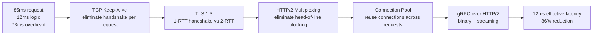
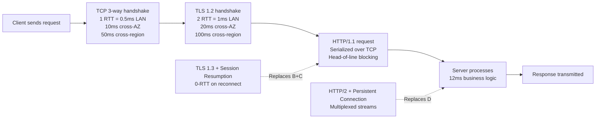
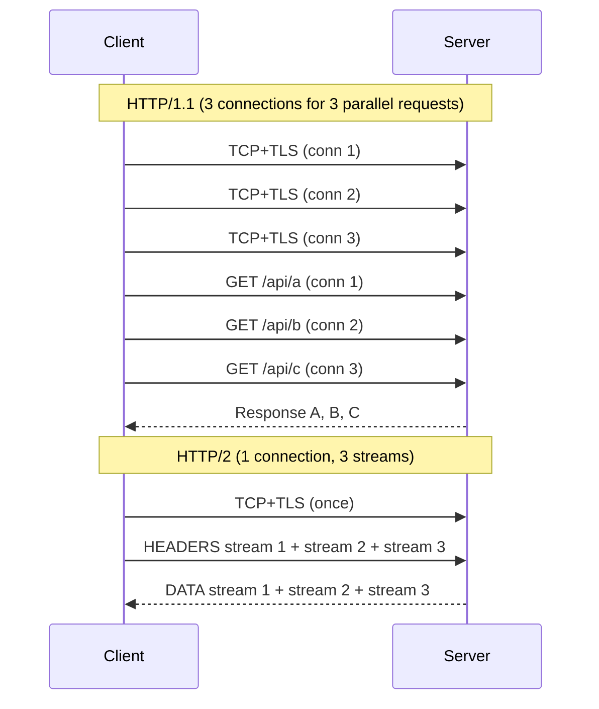
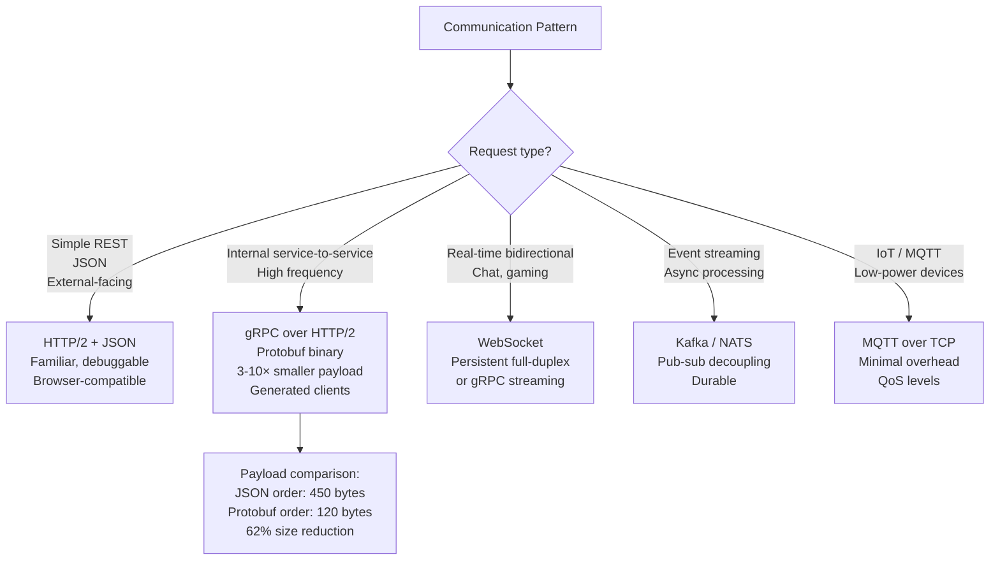
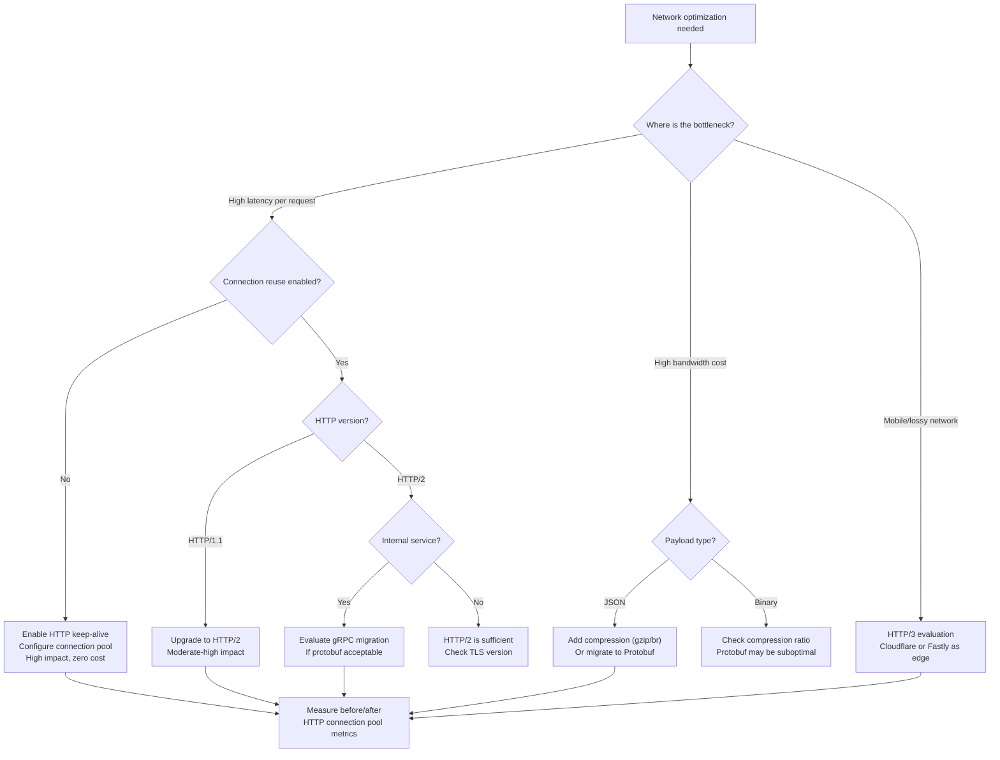

# Network Optimization: TCP Tuning, HTTP/2, and Protocol Selection at Scale

## 🗺️ Quick Overview



*73ms of "unavoidable" network overhead is actually fully recoverable — TCP reuse, TLS 1.3, and HTTP/2 eliminate it layer by layer.*

**Your service-to-service calls average 85ms. Your actual business logic takes 12ms. The other 73ms is network overhead you've accepted as "just how it works."** TCP handshakes, TLS negotiation, and HTTP/1.1 request serialization are eating the majority of your latency budget — and all of it is recoverable.

---

## The Problem Class `[Mid]`

Every network request carries overhead independent of payload size or business logic complexity. This overhead compounds across service hops in a microservices architecture.



The diagram shows two distinct optimization opportunities: connection establishment cost (TCP + TLS) and per-request cost (HTTP version, request pipelining). Eliminating connection establishment via connection reuse alone can reduce 60-120ms of overhead per request down to near-zero.

> 💡 **What this means in practice:** Every time your code calls `http.get("https://service-b/api/data")` without a persistent connection, you're paying the full connection cost. If service-b takes 5ms to respond but establishing the connection takes 15ms, 75% of your latency is pure overhead. Connection pooling and HTTP/2 fix this.

**The math at scale**:

```
Service-to-service call cost breakdown (same AWS region, different AZ):
  TCP handshake: 1 RTT × 2ms = 2ms
  TLS 1.2 handshake: 2 RTT × 2ms = 4ms
  HTTP request: 1ms
  Business logic: 12ms
  Total: 19ms

With HTTP/2 + TLS 1.3 + persistent connection:
  Amortized connection cost: ~0.1ms (once per pool slot)
  HTTP/2 stream creation: 0ms (reuses connection)
  Business logic: 12ms
  Total: 12.1ms

Improvement: 36% latency reduction for free with better protocol config
```

---

## Why the Obvious Solution Fails `[Senior]`

**Increasing request timeout** is the reflex response to slow service calls. It masks the problem and increases P99 latency rather than fixing it. The network overhead is real and must be directly addressed.

**Just adding more instances** increases throughput but not per-request latency. If each request wastes 7ms on connection establishment, 100 instances each waste 7ms — you've scaled the waste, not eliminated it.

**Enabling HTTPS and calling it done**: TLS 1.2 adds 2 RTT to every new connection. With short-lived HTTP/1.1 connections (the default in most frameworks), every request pays this tax. TLS 1.3 reduces this to 1 RTT, and 0-RTT session resumption (with security trade-offs) can eliminate it entirely for reconnects.

---

## The Solution Landscape `[Senior]`

### Solution 1: TCP Connection Management — Keep-Alive and Buffer Tuning

**What it is**

TCP keep-alive maintains established connections between requests rather than creating a new connection per request. Kernel buffer tuning optimizes how data moves through the TCP stack.

**How it actually works at depth**

```
Without keep-alive (HTTP/1.0 behavior):
  Request 1: [TCP SYN] [SYN-ACK] [ACK] [TLS] [Request] [Response] [FIN]
  Request 2: [TCP SYN] [SYN-ACK] [ACK] [TLS] [Request] [Response] [FIN]
  Each request pays full connection cost

With keep-alive (HTTP/1.1 default):
  Request 1: [TCP SYN] [SYN-ACK] [ACK] [TLS] [Request] [Response]
             Connection stays open
  Request 2: [Request] [Response]
             Connection stays open
  Subsequent requests: [Request] [Response] — zero connection overhead
```

**TCP_NODELAY** disables Nagle's algorithm, which batches small packets to reduce overhead. For latency-sensitive RPC calls, Nagle's adds up to 200ms latency by waiting for more data before sending. Always enable `TCP_NODELAY` for service-to-service calls:

```python
# Python: socket-level TCP_NODELAY
import socket
sock = socket.socket(socket.AF_INET, socket.SOCK_STREAM)
sock.setsockopt(socket.IPPROTO_TCP, socket.TCP_NODELAY, 1)

# In requests library: set via Session adapters
# In aiohttp: tcp_connector with enable_cleanup_closed=True
import aiohttp
connector = aiohttp.TCPConnector(
    limit=100,           # Max concurrent connections
    keepalive_timeout=30,  # Keep idle connections for 30s
    enable_cleanup_closed=True,
    tcp_nodelay=True,    # Disable Nagle
)
```

**Kernel buffer sizing** (Linux sysctl):

```bash
# View current settings
sysctl net.core.rmem_max net.core.wmem_max net.ipv4.tcp_rmem net.ipv4.tcp_wmem

# Tune for high-throughput services (persistent across reboots via /etc/sysctl.conf)
# TCP receive buffer: max 16MB
net.core.rmem_max = 16777216
net.core.wmem_max = 16777216
# Auto-tuning range: min 4KB, default 256KB, max 16MB
net.ipv4.tcp_rmem = 4096 262144 16777216
net.ipv4.tcp_wmem = 4096 262144 16777216
# Backlog for incoming connections
net.core.somaxconn = 65535
net.ipv4.tcp_max_syn_backlog = 65535
```

> 💡 **What this means in practice:** The TCP send buffer size determines how much data can be "in flight" in the network. With a 1Gbps link and 10ms RTT, the bandwidth-delay product is 1.25MB. If your buffer is smaller than this, the sender stalls waiting for ACKs. Buffer tuning matters for bulk data transfers but minimal for small RPC calls.

**Sizing guidance** `[Staff+]`

Connection pool sizing formula:

```
Connections needed = requests_per_second × avg_request_duration_seconds

For 2,000 RPS to a downstream service with 8ms average response:
  Connections = 2000 × 0.008 = 16 connections

With 20% safety margin: 20 connections

Connection pool configuration:
  min_connections: 5     (warm connections for burst readiness)
  max_connections: 20    (from formula above)
  idle_timeout: 90s      (close idle connections > 90s)
  connection_lifetime: 300s  (rotate connections to prevent stale state)
  acquire_timeout: 100ms (fail fast rather than queue indefinitely)
```

**Failure modes** `[Staff+]`

- **CLOSE_WAIT accumulation**: Server closes connections but application doesn't read FIN. Connections pile up in CLOSE_WAIT state, exhausting file descriptors. Monitor `ss -s | grep CLOSE-WAIT`. Fix: set `SO_LINGER` or ensure application reads all data before close.
- **TIME_WAIT port exhaustion**: With many short-lived connections to the same destination, ports wait 60s in TIME_WAIT. At 30,000 new connections/sec, all 28,000 ephemeral ports exhaust. Fix: enable `tcp_tw_reuse = 1` (safe for client-side) and connection pooling.
- **Keepalive timeout mismatch**: Load balancer kills idle connections after 60s, but application pool keepalive timeout is 120s. Application tries to use a dead connection, fails, retries. Fix: set pool keepalive timeout < load balancer idle timeout × 0.8.

---

### Solution 2: HTTP/2 Multiplexing vs HTTP/1.1 Head-of-Line Blocking

**What it is**

HTTP/1.1 serializes requests over a connection — only one request can be in-flight per connection. HTTP/2 multiplexes multiple requests over a single connection using streams. HTTP/3 (QUIC) eliminates TCP-level head-of-line blocking by using UDP.

**How it actually works at depth**

```
HTTP/1.1 with 3 parallel requests (6 connections browser limit):
  Conn 1: [Request A] -------- [Response A (50ms)]
  Conn 2: [Request B] -------- [Response B (50ms)]
  Conn 3: [Request C] -------- [Response C (50ms)]
  Total time: 50ms (parallel) but 3 TCP+TLS handshakes = 3 × 20ms = 60ms overhead

HTTP/2 with 3 parallel requests (1 connection):
  Stream 1: [Request A] -------- [Response A (50ms)]
  Stream 2: [Request B] -------- [Response B (50ms)]  — all simultaneous
  Stream 3: [Request C] -------- [Response C (50ms)]
  Total time: 50ms (parallel) + 1 TCP+TLS handshake = 20ms, one time
  Net result: 70ms vs 110ms — 36% faster for parallel requests
```



This diagram shows the core difference: HTTP/1.1 requires a separate connection (and full handshake) per parallel request, while HTTP/2 multiplexes all streams over one connection established once.

**HTTP/2 for service-to-service (gRPC)**:

gRPC runs over HTTP/2 and provides:
- Protocol Buffers serialization (3-10× smaller than JSON)
- Bidirectional streaming
- Built-in deadline propagation
- Generated client/server code

```python
# gRPC server (Python) — HTTP/2 automatically
import grpc
from concurrent import futures

server = grpc.server(
    futures.ThreadPoolExecutor(max_workers=10),
    options=[
        ('grpc.max_receive_message_length', 10 * 1024 * 1024),  # 10MB
        ('grpc.keepalive_time_ms', 10000),    # Send keepalive every 10s
        ('grpc.keepalive_timeout_ms', 5000),   # Timeout if no response in 5s
        ('grpc.keepalive_permit_without_calls', True),
    ]
)
```

**HTTP/3 (QUIC) — when to adopt in 2026**:

HTTP/3 uses QUIC (UDP-based) to eliminate TCP head-of-line blocking at the transport layer. In HTTP/2, a dropped TCP packet stalls ALL streams until retransmit. QUIC's independent streams aren't affected by other streams' packet loss.

HTTP/3 is production-ready in 2026 for:
- Browser-to-server (Cloudflare, Google, Fastly all support it)
- Latency improvement on lossy networks (mobile, intercontinental): 10-30%
- Not yet mainstream for service-to-service within a datacenter (low packet loss environment)

```nginx
# Nginx: enable HTTP/3 (2026 standard in Nginx 1.25+)
server {
    listen 443 ssl;
    listen 443 quic reuseport;   # HTTP/3
    http2 on;                    # HTTP/2
    http3 on;
    add_header Alt-Svc 'h3=":443"; ma=86400';  # Advertise HTTP/3

    ssl_certificate /etc/nginx/ssl/cert.pem;
    ssl_certificate_key /etc/nginx/ssl/key.pem;
    ssl_protocols TLSv1.3;       # TLS 1.3 required for HTTP/3
}
```

**Sizing guidance** `[Staff+]`

HTTP/2 server push and stream limits:

```
# Per-connection stream limits
http2_max_concurrent_streams = 128  (NGINX default)
grpc max_concurrent_streams = 100   (gRPC default)

# With 128 streams per connection and 10ms avg request:
# Throughput per connection = 128 / 0.010 = 12,800 RPS
# For 100,000 RPS: need only 8 HTTP/2 connections vs 100,000 HTTP/1.1 connections
```

**Configuration decisions that matter** `[Staff+]`

```nginx
# Nginx HTTP/2 tuning
http2_max_concurrent_streams 128;
http2_recv_buffer_size 256k;
http2_chunk_size 16k;

# TLS session resumption (reduces handshake for reconnecting clients)
ssl_session_cache shared:SSL:50m;    # 50MB cache = ~200K sessions
ssl_session_timeout 4h;
ssl_session_tickets on;
```

**Failure modes** `[Staff+]`

- **HTTP/2 reset attack (CVE-2023-44487)**: Rapid stream creation/cancellation exhausts server. NGINX 1.25.3+, Go 1.21.3+, and all major frameworks patched in late 2023. Ensure all infrastructure is on patched versions.
- **Server push overhead**: HTTP/2 server push can harm performance if the client already has the resource cached. Modern approach: use `103 Early Hints` instead of push.
- **Load balancer HTTP/2 termination**: Many load balancers terminate HTTP/2 and forward to backends as HTTP/1.1. Check your LB configuration — you may be losing multiplexing benefits in the backend hop.

---

### Solution 3: TLS Optimization — TLS 1.3 and Session Resumption

**What it is**

TLS 1.3 (RFC 8446) reduces handshake latency from 2 RTT (TLS 1.2) to 1 RTT, with optional 0-RTT resumption for reconnecting clients.

**How it actually works at depth**

```
TLS 1.2 handshake (2 RTT):
  Client → Server: ClientHello
  Server → Client: ServerHello, Certificate, ServerHelloDone  [1 RTT]
  Client → Server: ClientKeyExchange, Finished
  Server → Client: ChangeCipherSpec, Finished                 [2 RTT]
  Total: 2 RTT = 4ms LAN, 40ms cross-AZ

TLS 1.3 handshake (1 RTT):
  Client → Server: ClientHello + key_share
  Server → Client: ServerHello + key_share + Certificate + Finished  [1 RTT]
  Client → Server: Finished (application data can be sent here)
  Total: 1 RTT = 2ms LAN, 20ms cross-AZ

TLS 1.3 0-RTT resumption:
  Client → Server: ClientHello + early_data (PSK from previous session)
  Server → Client: ServerHello + Finished
  Application data sent in first flight — 0 RTT overhead
  Trade-off: 0-RTT data is not forward-secret and can be replayed
             Only safe for idempotent operations (GET, not POST)
```

**Pseudocode: TLS configuration with session caching**

```python
# Python: TLS context with session resumption
import ssl
import socket

context = ssl.SSLContext(ssl.PROTOCOL_TLS_CLIENT)
context.minimum_version = ssl.TLSVersion.TLSv1_3  # Force TLS 1.3
context.set_ciphers('TLS_AES_256_GCM_SHA384:TLS_CHACHA20_POLY1305_SHA256')
context.options |= ssl.OP_NO_TICKET  # Disable session tickets (use session IDs)
                                      # or enable for session resumption:
# context.options &= ~ssl.OP_NO_TICKET  # Enable session tickets

# Connection reuse (session resumption happens automatically if server supports it)
with socket.create_connection(('service-b', 443)) as sock:
    with context.wrap_socket(sock, server_hostname='service-b') as ssock:
        # First connection: full TLS handshake
        session = ssock.session  # Save for resumption

# Later connection with session resumption:
with socket.create_connection(('service-b', 443)) as sock:
    with context.wrap_socket(sock, server_hostname='service-b',
                              session=session) as ssock:
        # Resumption: 0-1 RTT depending on server support
        pass
```

**Sizing guidance** `[Staff+]`

TLS session cache sizing:
```
Session cache size = expected_concurrent_clients × session_size_bytes
Average TLS session: ~256 bytes
For 100,000 concurrent clients: 25.6MB
SSL session timeout: 4 hours (balance between resumption benefit and rotation security)

Memory vs. security trade-off:
  Large cache + long timeout: high resumption rate, larger attack window
  Small cache + short timeout: lower resumption rate, better security
  Recommendation: 10-50MB cache, 4-hour timeout for internal services
```

---

### Solution 4: Protocol Selection by Use Case

**What it is**

Different protocols have different performance characteristics. Choosing the right protocol for each communication pattern is as important as configuration tuning.

**How it actually works at depth**



This decision tree maps communication patterns to protocols based on their characteristics. Internal microservice calls benefit most from gRPC's binary encoding and HTTP/2 multiplexing, while external-facing APIs typically stay on HTTP/2+JSON for compatibility.

> 💡 **What this means in practice:** If you have 10 microservices calling each other 50,000 times per second, switching from HTTP/1.1+JSON to gRPC+Protobuf can reduce cross-service bandwidth by 60% and latency by 25%. At scale, this directly translates to fewer AWS data transfer charges and smaller instance sizes needed.

**Protocol benchmark (same hardware, same business logic)** `[Staff+]`:

```
Benchmark: 1000 RPS, 1KB payload, same AZ, p99 latency

HTTP/1.1 + JSON (no keep-alive): 45ms
HTTP/1.1 + JSON (keep-alive):    18ms
HTTP/2 + JSON:                   12ms
gRPC + Protobuf:                  8ms
gRPC + Protobuf + compression:    9ms  (compression adds CPU, worth it at >5KB)
```

**Failure modes** `[Staff+]`

- **gRPC and load balancers**: HTTP/2 long-lived connections circumvent round-robin load balancing — all traffic goes to the first backend that establishes the connection. Use gRPC-aware load balancing (Envoy, NGINX with grpc_pass, or client-side load balancing via gRPC's built-in resolver).
- **Protocol buffer versioning**: Adding required fields (proto2) or removing fields breaks backward compatibility. Always use `optional` fields and never reuse field numbers.
- **Protobuf encoding overhead for small messages**: Protobuf has 2-3 byte overhead per field. For messages with many fields but small values (e.g., status enums), JSON can be smaller. Profile your actual message sizes before assuming protobuf wins.

---

## Trade-off Matrix `[Senior]` → `[Staff+]`

| Dimension | HTTP/1.1 | HTTP/2 | gRPC/HTTP/2 | HTTP/3/QUIC |
|---|---|---|---|---|
| Connection establishment | Per-request (new conn) | Once per pool slot | Once per pool slot | Once (faster on loss) |
| Multiplexing | ❌ (6 conns max) | ✅ 128 streams/conn | ✅ 100 streams/conn | ✅ no HOL blocking |
| Browser support | ✅ Universal | ✅ Modern browsers | ⚠️ Needs grpc-web | ✅ Modern browsers |
| Payload size | JSON: baseline | JSON: baseline | Protobuf: 3-10× smaller | Same as payload type |
| Debugging | ✅ curl, browser devtools | ⚠️ Needs http2 tools | ⚠️ Needs protobuf decoders | ⚠️ Limited tooling |
| Internal services | ⚠️ Acceptable | ✅ Good | ✅ Best | N/A (datacenter) |
| Lossy network (mobile) | ❌ Poor | ❌ HOL blocking | ❌ HOL blocking | ✅ Excellent |

---

## Decision Framework `[Senior]` → `[Staff+]`



---

## Production Failure Story `[Staff+]`

**The gRPC Load Balancer Bypass — FinTech Startup, 2024**

A payment processing service migrated from HTTP/1.1 REST to gRPC for internal services, expecting to cut latency and improve throughput. After the migration, one of three backend pods received 95% of traffic. The other two were nearly idle. Latency for the overloaded pod spiked to 4x normal.

Root cause: HTTP/2 connections are persistent and long-lived. The load balancer (AWS ALB, configured for round-robin at the connection level) distributed the three initial connections (one from each client pod) to three backend pods. But as the application pool grew to 10 connections per client, all 10 went to the same backend (the first connection's backend was preferred by HTTP/2 connection reuse).

The fix: Switched from ALB to Envoy as the internal load balancer for gRPC traffic. Envoy performs L7 gRPC-aware load balancing — it balances individual RPC calls across backends, not TCP connections. Traffic distribution normalized to 33% per backend within 60 seconds.

**Pseudocode: gRPC load balancing configuration**

```python
# Bad: single channel to a single endpoint (no LB)
channel = grpc.insecure_channel('payment-service:50051')

# Good: round-robin over multiple endpoints (client-side LB)
channel = grpc.insecure_channel(
    'payment-service:50051',
    options=[('grpc.lb_policy_name', 'round_robin'),
             ('grpc.service_config', '{"loadBalancingConfig": [{"round_robin":{}}]}')]
)

# Best: use Envoy as sidecar — backend handles LB, not application
# Configure Envoy cluster with gRPC health checking and per-RPC LB
```

---

## Observability Playbook `[Staff+]`

**eBPF-based network latency profiling (2026)**:

```bash
# Measure TCP RTT distribution without application-level instrumentation
# Useful when app metrics show high latency but spans look normal
bpftrace -e '
kprobe:tcp_rcv_established {
    $sock = (struct sock *)arg0;
    $rtt = $sock->sk_srtt_us >> 3;
    @rtt_us = hist($rtt);
}
interval:s:5 { print(@rtt_us); clear(@rtt_us); }'

# Trace TLS handshake duration (identify certificate/cipher overhead)
# Use: openssl s_time -connect service:443 -new -time 10
```

**Prometheus metrics for network layer**:

```promql
# Connection pool utilization
http_client_connections_active / http_client_connections_max > 0.8

# Request duration broken out by protocol (if instrumented)
histogram_quantile(0.99, rate(http_client_request_duration_seconds_bucket[5m]))
  by (protocol, target_service)

# TLS handshake rate (high rate = connection pool too small, connections not being reused)
rate(tls_handshakes_total[1m]) / rate(http_requests_total[1m])
# Alert: > 0.1 (more than 10% of requests require new TLS handshake)
```

---

## Architectural Evolution `[Staff+]`

**Stage 1: Quick Wins (week 1)**
- Enable HTTP keep-alive on all service-to-service clients
- Enable `TCP_NODELAY` on all service-to-service connections
- Upgrade TLS 1.2 → TLS 1.3

**Stage 2: Protocol Upgrade (month 1)**
- HTTP/1.1 → HTTP/2 for all internal services
- Tune connection pool sizes based on Little's Law
- Enable TLS session resumption

**Stage 3: gRPC Migration (quarter 1)**
- Identify top 5 highest-traffic internal service pairs
- Migrate those pairs to gRPC + Protobuf
- Deploy Envoy or NGINX as gRPC-aware load balancer

**Stage 4: Edge and Mobile (ongoing)**
- HTTP/3 at CDN/edge layer for mobile clients
- eBPF-based continuous network latency monitoring
- Rust-based proxy (Envoy) for ultra-high-throughput service mesh

---

## Decision Framework Checklist `[All Levels]`

- [ ] HTTP keep-alive enabled for all service-to-service HTTP clients
- [ ] `TCP_NODELAY` enabled for latency-sensitive service calls
- [ ] Connection pool sized: RPS × avg_latency_seconds with 20% headroom
- [ ] Pool keepalive timeout < load balancer idle timeout × 0.8
- [ ] TLS 1.3 deployed for all internal and external HTTPS traffic
- [ ] TLS session resumption configured (session cache size > 10MB for >1000 clients)
- [ ] HTTP/2 enabled for all new service-to-service communication
- [ ] HTTP/3 evaluated for external-facing endpoints serving mobile clients
- [ ] gRPC migration roadmap defined for top 5 highest-traffic internal routes
- [ ] gRPC load balancing uses L7-aware balancer (Envoy, NGINX), not connection-level
- [ ] `net.ipv4.tcp_tw_reuse = 1` and `net.core.somaxconn = 65535` in OS config
- [ ] TLS handshake rate monitored: alert if > 10% of requests need new handshake
- [ ] eBPF TCP RTT monitoring available for production network debugging

*Written by Gaurav Porwal — 10+ Year Engineer | Tech Lead | Product Owner | Business-Minded Builder*
*Last updated: 2026-03-18*
