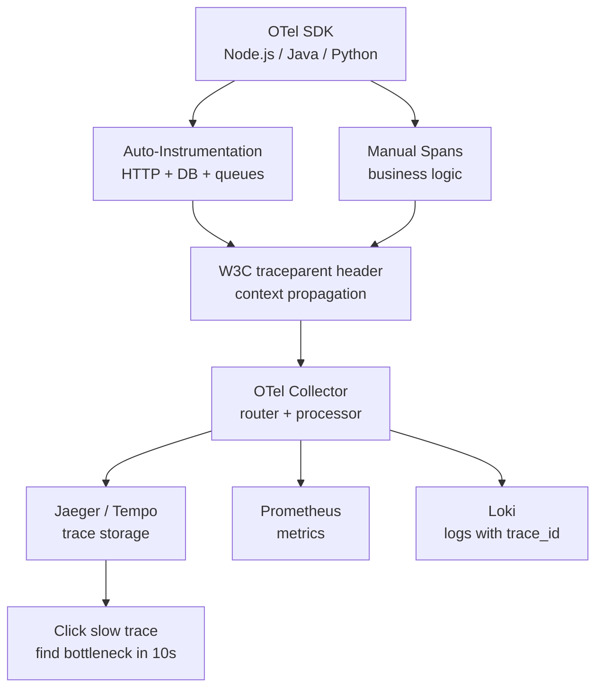
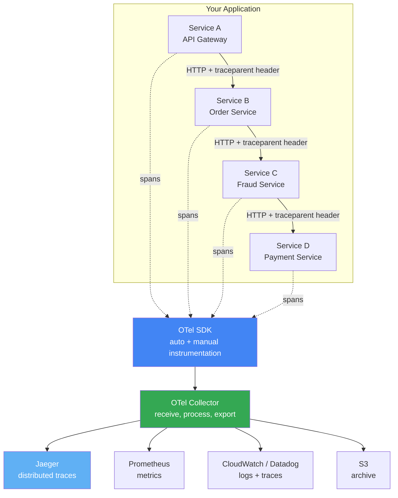
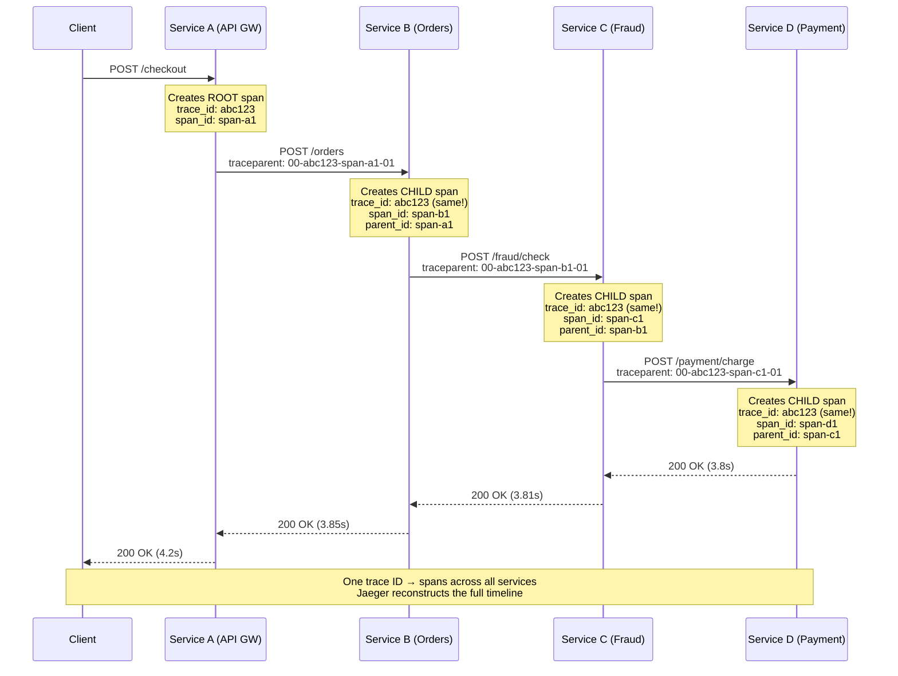
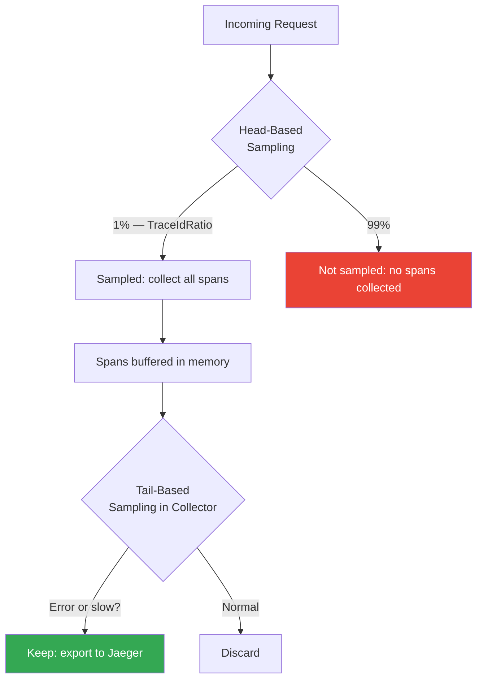

# OpenTelemetry: Unified Instrumentation for Traces, Metrics, and Logs

## 🗺️ Quick Overview



*OTel's W3C traceparent header threads a single trace_id across all services — one click from symptom to root cause in Jaeger.*

**A checkout request takes 4.2 seconds. You have logs from 6 services.** Each log entry has a timestamp. You spend 3 hours manually correlating timestamps across services, trying to find where the 4.2 seconds went. You sort grep results. You compare epoch milliseconds. You build a mental model of the call chain. Then you find it: the fraud service took 3.8 seconds, and here's why — it was doing a synchronous call to an external API that was having a slow day. Distributed tracing would have told you this in 10 seconds: click the slow trace, expand the fraud service span, see the external API call, see the 3.8s duration, see the HTTP status code. Done.

This is not a tutorial on what OpenTelemetry is. This is how to wire it through a real Node.js microservices app — SDK setup, context propagation, sampling configuration, and the trace-to-logs correlation that makes it actually useful.

---

## The Problem Class `[Senior]`

Distributed systems fail in distributed ways. A 4-second request spans 6 services. The slow part could be:
- Database query in service 3
- External API call in service 5
- Retry storm between services 2 and 4
- Serialization cost in service 1
- Network latency between datacenter zones

Without distributed tracing, debugging is log archaeology. With it, you have a flame graph of the request. One click to find the 3.8-second span. One click to see every attribute (user_id, order_id, fraud_score) attached to that span. One click to jump to the logs for that specific request.



---

## The 3 Signals and How OTel Unifies Them `[Senior]`

Before OpenTelemetry, you had three separate systems with separate SDKs, separate configs, separate backends:

| Signal | What it is | Before OTel | With OTel |
|--------|-----------|-------------|-----------|
| **Traces** | Request flow through services | Jaeger SDK or Zipkin SDK | OTel SDK → any backend |
| **Metrics** | Aggregated numbers over time | prom-client or StatsD | OTel SDK → Prometheus or OTLP |
| **Logs** | Discrete events with context | winston/bunyan with no trace link | OTel SDK → auto-inject trace_id |

OTel's value is correlation. When a trace has a trace_id of `4bf92f3577b34da6a3ce929d0e0e4736`, every log line from that request also has `trace_id=4bf92f3577b34da6a3ce929d0e0e4736`. You can click a span in Jaeger and jump directly to the logs for that exact request — across all services, for that exact trace.

---

## Trace Context Propagation `[Senior]`

The magic is the `traceparent` header (W3C Trace Context standard). Every HTTP request carries it. Every service reads it, creates a child span, and passes it forward.



The `traceparent` format: `00-{trace_id}-{parent_span_id}-{flags}`
- `00` — version
- `trace_id` — 16-byte hex, same for all spans in one request
- `parent_span_id` — 8-byte hex, ID of the calling span
- `flags` — `01` = sampled, `00` = not sampled

**If a service drops or corrupts the header, you lose trace continuity.** This is the most common instrumentation bug in polyglot microservices environments. The OTel Collector can validate and repair headers.

---

## Node.js SDK Setup `[Senior]`

### Install

```bash
npm install \
  @opentelemetry/sdk-node \
  @opentelemetry/auto-instrumentations-node \
  @opentelemetry/exporter-otlp-grpc \
  @opentelemetry/semantic-conventions \
  @opentelemetry/api
```

### SDK Initialization (must load BEFORE application code)

```javascript
// tracing.js — load this first, before any other require()
// Start with: node -r ./tracing.js app.js
// Or: require('./tracing') as the first line of app.js

const { NodeSDK } = require('@opentelemetry/sdk-node');
const { getNodeAutoInstrumentations } = require('@opentelemetry/auto-instrumentations-node');
const { OTLPTraceExporter } = require('@opentelemetry/exporter-otlp-grpc');
const { Resource } = require('@opentelemetry/resources');
const { SemanticResourceAttributes } = require('@opentelemetry/semantic-conventions');
const { ParentBasedSampler, TraceIdRatioBased } = require('@opentelemetry/sdk-trace-node');

const exporter = new OTLPTraceExporter({
  url: process.env.OTEL_EXPORTER_OTLP_ENDPOINT || 'http://otel-collector:4317',
});

const sdk = new NodeSDK({
  resource: new Resource({
    [SemanticResourceAttributes.SERVICE_NAME]: process.env.SERVICE_NAME || 'order-service',
    [SemanticResourceAttributes.SERVICE_VERSION]: process.env.SERVICE_VERSION || '1.0.0',
    [SemanticResourceAttributes.DEPLOYMENT_ENVIRONMENT]: process.env.NODE_ENV || 'production',
  }),

  traceExporter: exporter,

  // Auto-instrumentation: HTTP, Express, pg, redis, mongoose, gRPC — all automatic
  instrumentations: [
    getNodeAutoInstrumentations({
      '@opentelemetry/instrumentation-http': {
        // Don't trace health check endpoints — noisy and useless
        ignoreIncomingRequestHook: (req) => {
          return req.url === '/health' || req.url === '/metrics' || req.url === '/ready';
        },
      },
      '@opentelemetry/instrumentation-pg': {
        // Add full DB query text to spans (disable if queries contain PII)
        addSqlCommenterCommentToQueries: true,
        dbStatementSerializer: (operation, queryConfig) => {
          // Truncate long queries; exclude sensitive values
          return queryConfig?.text?.substring(0, 500) || operation;
        },
      },
    }),
  ],

  // Sampling: 10% of traces in production
  // ParentBased: respect parent's sampling decision (if parent is sampled, we are too)
  sampler: new ParentBasedSampler({
    root: new TraceIdRatioBased(
      parseFloat(process.env.OTEL_TRACE_SAMPLE_RATE || '0.1')
    ),
  }),
});

sdk.start();

// Graceful shutdown — flush buffered spans before exit
process.on('SIGTERM', () => {
  sdk.shutdown()
    .then(() => console.log('Tracing shut down successfully'))
    .catch((error) => console.error('Error shutting down tracing', error))
    .finally(() => process.exit(0));
});

module.exports = sdk;
```

---

## Manual Spans: Instrumenting Business Logic `[Senior]`

Auto-instrumentation covers HTTP, DB, and cache automatically. Manual spans cover business logic — fraud checks, payment processing, inventory reservation.

```javascript
// services/orderService.js
const { trace, SpanStatusCode, context, propagation } = require('@opentelemetry/api');

const tracer = trace.getTracer('order-service');

async function processOrder(orderData, requestContext) {
  // Create a span for the entire order processing operation
  return tracer.startActiveSpan('order.process', async (orderSpan) => {
    try {
      // Add business context as span attributes — searchable in Jaeger
      orderSpan.setAttributes({
        'order.id': orderData.orderId,
        'order.tenant_id': orderData.tenantId,
        'order.item_count': orderData.items.length,
        'order.total_amount_cents': orderData.totalCents,
        'order.payment_method': orderData.paymentMethod,
        'user.id': orderData.userId,
        'user.tier': orderData.userTier,
      });

      // --- Fraud check — nested child span ---
      const fraudResult = await tracer.startActiveSpan('fraud.check', async (fraudSpan) => {
        fraudSpan.setAttributes({
          'fraud.model_version': '3.2.1',
          'fraud.user_risk_tier': orderData.userRiskTier,
        });

        try {
          const result = await fraudService.check(orderData);
          fraudSpan.setAttributes({
            'fraud.score': result.score,
            'fraud.decision': result.decision,
            'fraud.rules_triggered': result.triggeredRules.join(','),
          });
          return result;
        } catch (err) {
          fraudSpan.recordException(err);
          fraudSpan.setStatus({ code: SpanStatusCode.ERROR, message: err.message });
          throw err;
        } finally {
          fraudSpan.end();
        }
      });

      if (fraudResult.decision === 'block') {
        orderSpan.setAttributes({ 'order.blocked_reason': 'fraud_score' });
        orderSpan.setStatus({ code: SpanStatusCode.OK });
        return { status: 'blocked', reason: 'fraud' };
      }

      // --- Payment processing — nested child span ---
      const paymentResult = await tracer.startActiveSpan('payment.charge', async (paySpan) => {
        paySpan.setAttributes({
          'payment.provider': orderData.paymentMethod,
          'payment.amount_cents': orderData.totalCents,
          'payment.currency': orderData.currency,
        });

        try {
          const result = await paymentService.charge(orderData);
          paySpan.setAttributes({
            'payment.transaction_id': result.transactionId,
            'payment.provider_response_code': result.responseCode,
          });
          return result;
        } catch (err) {
          paySpan.recordException(err);
          paySpan.setStatus({ code: SpanStatusCode.ERROR, message: err.message });
          throw err;
        } finally {
          paySpan.end();
        }
      });

      orderSpan.setAttributes({ 'payment.transaction_id': paymentResult.transactionId });
      orderSpan.setStatus({ code: SpanStatusCode.OK });

      return { status: 'success', orderId: orderData.orderId };

    } catch (err) {
      // Record exception on the root span so it's visible at the top level
      orderSpan.recordException(err);
      orderSpan.setStatus({ code: SpanStatusCode.ERROR, message: err.message });
      throw err;
    } finally {
      orderSpan.end();
    }
  });
}
```

### Key span attribute rules:
- Use `snake_case` for attribute names
- Follow OTel semantic conventions where they exist (`http.method`, `db.system`, `net.peer.name`)
- Add business IDs (`order.id`, `user.id`) — this is what you search for in Jaeger
- Never add high-cardinality raw values as attributes if you're also using them as metric labels

---

## Sampling Strategies `[Senior]`

At 100K RPS, storing 100% of traces = ~100K spans/second × 5 services × ~1KB each = 500MB/second of trace data. That's 43TB/day. You need sampling.



### Head-Based Sampling (Simple, Predictable Cost)

Decision made at request start. Cheap. Predictable storage. Problem: you can't retroactively keep interesting traces.

```javascript
// In tracing.js SDK setup:
const { TraceIdRatioBased, ParentBasedSampler } = require('@opentelemetry/sdk-trace-node');

// Keep 1% of traces
new ParentBasedSampler({ root: new TraceIdRatioBased(0.01) })

// Keep 100% — for debugging only, never in production at scale
new AlwaysOnSampler()

// Keep 0% — useful for metrics-only instrumentation
new AlwaysOffSampler()
```

### Tail-Based Sampling (Smart, Keep What Matters)

Decision made AFTER the request completes — the collector sees the full trace and can decide:
- Keep if any span has an error
- Keep if total duration > 1 second
- Keep if span has attribute `user.tier=enterprise`
- Keep 0.1% of everything else

```yaml
# otel-collector-config.yaml
processors:
  tail_sampling:
    decision_wait: 10s         # wait up to 10s for all spans to arrive
    num_traces: 100000         # hold up to 100K traces in memory
    expected_new_traces_per_sec: 10
    policies:
      # Always keep error traces
      - name: errors-policy
        type: status_code
        status_code: { status_codes: [ERROR] }

      # Always keep slow traces (> 1 second)
      - name: slow-traces-policy
        type: latency
        latency: { threshold_ms: 1000 }

      # Always keep enterprise user traces
      - name: enterprise-user-policy
        type: string_attribute
        string_attribute:
          key: user.tier
          values: [enterprise]

      # Keep 1% of everything else
      - name: default-policy
        type: probabilistic
        probabilistic: { sampling_percentage: 1 }
```

### Priority Sampling — The Middle Ground

OTel supports a `sampling.priority` baggage key. Your code can mark a trace as "always sample" without changing the SDK config:

```javascript
const { context, propagation } = require('@opentelemetry/api');

// Mark this trace as high priority — tail sampler will always keep it
function processEnterpriseOrder(orderData) {
  const baggage = propagation.getBaggage(context.active()) || propagation.createBaggage();
  const newBaggage = baggage.setEntry('sampling.priority', { value: '1' });
  return context.with(
    propagation.setBaggage(context.active(), newBaggage),
    () => processOrder(orderData)
  );
}
```

---

## Baggage: Passing Context Across Service Boundaries `[Senior]`

Baggage is key-value data attached to the trace context and propagated via HTTP headers. It lets you pass information like user tier, A/B test group, or feature flag state through the entire call chain without adding it to every span manually.

```javascript
// Service A — set baggage at the entry point
const { context, propagation } = require('@opentelemetry/api');

function handleRequest(req, res) {
  const baggage = propagation.createBaggage({
    'user.tier': { value: req.user.tier },         // 'free', 'pro', 'enterprise'
    'ab.group': { value: req.headers['x-ab-group'] || 'control' },
    'tenant.region': { value: req.user.region },
  });

  const ctx = propagation.setBaggage(context.active(), baggage);

  context.with(ctx, () => {
    // All HTTP calls made from here carry baggage in headers
    // All spans created here have access to baggage
    processRequest(req, res);
  });
}

// Service C — read baggage (automatically propagated via W3C baggage header)
const { propagation, context } = require('@opentelemetry/api');

function fraudCheck(orderData) {
  const baggage = propagation.getBaggage(context.active());
  const userTier = baggage?.getEntry('user.tier')?.value || 'unknown';
  const abGroup = baggage?.getEntry('ab.group')?.value || 'control';

  // Use baggage values in business logic
  const fraudThreshold = userTier === 'enterprise' ? 0.9 : 0.7;

  return tracer.startActiveSpan('fraud.check', (span) => {
    span.setAttributes({ 'user.tier': userTier, 'ab.group': abGroup });
    // ...
  });
}
```

**Baggage warning**: Baggage is sent in clear text in HTTP headers. Never put PII, tokens, or secrets in baggage. Limit to non-sensitive metadata. Baggage that gets very large (> 4KB) can be rejected by HTTP proxies.

---

## OTel Collector: Why You Need It `[Senior]`

Direct export from SDK to backend works for dev. Production needs the Collector for:

1. **Fan-out**: Export same traces to Jaeger AND CloudWatch AND your data warehouse
2. **Buffering**: If Jaeger is down, collector queues spans; SDK is non-blocking
3. **Transformation**: Add attributes, redact PII from spans before export
4. **Sampling**: Tail-based sampling in the collector (can't do in SDK)
5. **Protocol translation**: SDK sends OTLP; collector translates to Jaeger's Thrift format

```yaml
# otel-collector-config.yaml
receivers:
  otlp:
    protocols:
      grpc:
        endpoint: 0.0.0.0:4317
      http:
        endpoint: 0.0.0.0:4318

processors:
  batch:
    timeout: 1s
    send_batch_size: 1024

  # Add environment metadata to every span
  resource:
    attributes:
      - action: insert
        key: deployment.environment
        value: production

  # Redact PII from span attributes before export
  transform:
    trace_statements:
      - context: span
        statements:
          # Replace email addresses with [REDACTED]
          - replace_pattern(attributes["user.email"], "^.*@.*$", "[REDACTED]")
          # Mask credit card numbers in attributes
          - replace_pattern(attributes["payment.card_number"], "\\d{12}(\\d{4})", "****-****-****-$1")

exporters:
  otlp/jaeger:
    endpoint: jaeger:4317
    tls:
      insecure: true

  prometheusremotewrite:
    endpoint: "http://prometheus:9090/api/v1/write"

  logging:
    loglevel: warn

service:
  pipelines:
    traces:
      receivers: [otlp]
      processors: [batch, resource, transform, tail_sampling]
      exporters: [otlp/jaeger, logging]
    metrics:
      receivers: [otlp]
      processors: [batch]
      exporters: [prometheusremotewrite]
```

---

## Trace-to-Logs Correlation `[Senior]`

The payoff: click a span in Jaeger → jump directly to the logs for that exact request. This requires injecting `trace_id` and `span_id` into every log line.

```javascript
// logger.js — inject trace context into every log entry
const winston = require('winston');
const { trace, context } = require('@opentelemetry/api');

const logger = winston.createLogger({
  format: winston.format.combine(
    // Custom format that injects OTel trace context
    winston.format((info) => {
      const span = trace.getActiveSpan();
      if (span) {
        const spanContext = span.spanContext();
        info.trace_id = spanContext.traceId;
        info.span_id = spanContext.spanId;
        info.trace_flags = spanContext.traceFlags;
      }
      return info;
    })(),
    winston.format.json()
  ),
  transports: [
    new winston.transports.Console(),
  ],
});

module.exports = logger;
```

Every log line now looks like:
```json
{
  "level": "info",
  "message": "Fraud check completed",
  "fraud_score": 0.23,
  "decision": "approve",
  "trace_id": "4bf92f3577b34da6a3ce929d0e0e4736",
  "span_id": "00f067aa0ba902b7",
  "timestamp": "2026-03-20T03:42:17.123Z"
}
```

In Grafana, configure a Jaeger data source with the "Trace to logs" feature: when you click a trace span, Grafana automatically runs a Loki/Elasticsearch query for `trace_id="4bf92f3577b34da6a3ce929d0e0e4736"` and shows you all logs for that request.

---

## Production Patterns `[Staff]`

### Pattern 1: Span Events Instead of Logs

For high-frequency events within a span (iterations, retries), span events are more efficient than log lines:

```javascript
orderSpan.addEvent('inventory.reserved', {
  'sku': productSku,
  'warehouse': warehouseId,
  'quantity': quantity,
  'timestamp': Date.now(),
});

orderSpan.addEvent('retry.attempt', {
  'attempt_number': retryCount,
  'retry_reason': lastError.code,
  'next_retry_delay_ms': nextDelay,
});
```

### Pattern 2: Async/Background Job Tracing

Tracing across a message queue (Kafka, SQS) requires manual context propagation via message headers:

```javascript
// Producer — serialize trace context into message headers
const { propagation, context } = require('@opentelemetry/api');

async function publishOrderEvent(order) {
  const headers = {};
  propagation.inject(context.active(), headers);

  await kafka.producer.send({
    topic: 'order.created',
    messages: [{
      key: order.id,
      value: JSON.stringify(order),
      headers: headers,  // trace context travels with the message
    }],
  });
}

// Consumer — restore trace context from message headers
async function processOrderEvent(message) {
  const parentContext = propagation.extract(context.active(), message.headers);

  return context.with(parentContext, () => {
    return tracer.startActiveSpan('order.process.async', (span) => {
      span.setAttributes({ 'messaging.kafka.partition': message.partition });
      // ... process the order
      span.end();
    });
  });
}
```

### Pattern 3: Service Graph from Traces

Jaeger's Service Graph (and Tempo's Service Graph in Grafana) automatically builds a dependency graph from trace data. Every span that calls another service creates an edge in the graph. You get an auto-generated architecture diagram of your actual runtime behavior — not your theoretical architecture diagram.

---

## Common Mistakes `[Senior]`

**Mistake 1: Not loading the SDK first**
`require('./tracing')` must be the absolute first line. If Express or pg loads before the OTel SDK, auto-instrumentation patches don't apply. You get no HTTP or DB spans.

**Mistake 2: Forgetting graceful shutdown**
On SIGTERM, buffered spans are lost. Always call `sdk.shutdown()` and wait for the promise. Without this, your last N seconds of traces before a deployment are missing — exactly when you want them.

**Mistake 3: High-cardinality span attributes**
Unlike metrics, adding `user_id` to span attributes is fine — spans are individual, not aggregated. But adding a span attribute that you're also trying to use as a metric label creates confusion. Keep metrics at service level, spans at request level.

**Mistake 4: Not propagating context through async code**
`context.with()` sets the active context synchronously. If you use `setTimeout`, `setImmediate`, or `.then()` chains, context can be lost. Use `context.bind()` to bind async callbacks:

```javascript
// Context lost — setTimeout callback has no active span
setTimeout(() => { doSomething(); }, 100);

// Context preserved
setTimeout(context.bind(context.active(), () => { doSomething(); }), 100);
```

**Mistake 5: Sampling too aggressively in development**
Set `OTEL_TRACE_SAMPLE_RATE=1.0` in development and staging. You want to see every trace when debugging. 10% sampling in dev means you have to retry a request 10 times to reliably get a trace.

**Mistake 6: Ignoring the semantic conventions**
OTel has published [semantic conventions](https://opentelemetry.io/docs/concepts/semantic-conventions/) for HTTP, databases, messaging, RPC. Use them. `http.method` not `httpMethod` not `HTTP_METHOD`. Consistent naming means Jaeger's built-in search filters work, and teams across the org can share dashboards.

---

## Real-World Context

**Uber built Jaeger** in 2016 because they had 2,000+ microservices and no way to debug cross-service latency issues. They open-sourced it and donated it to CNCF. Their key insight: the trace ID needs to be in every log line and every metric label — otherwise you can't correlate the three signals during an incident.

**Google's Dapper** (2010) was the original distributed tracing paper. It introduced the concepts of spans, traces, and trace context propagation that OpenTelemetry still uses today. Dapper's sampling decision: always sample the first request from a user session, sample 1% of everything else. The insight was that you needed enough traces to debug, but not so many that the tracer itself became a performance bottleneck.

**OpenTelemetry itself** was formed by merging OpenCensus (Google) and OpenTracing (CNCF) in 2019. The goal: one standard SDK that any vendor can export to. Before OTel, switching from Jaeger to Datadog tracing required rewriting all your instrumentation. Now it's a config change in the Collector.

---

## Key Takeaways

1. **Auto-instrumentation is a starting point**: HTTP, DB, and cache spans are free. Business logic needs manual spans.
2. **Span attributes are searchable**: Put `order.id`, `user.id`, `fraud.score` on spans — this is how you find specific traces in Jaeger
3. **traceparent header is the glue**: Every service must read it in and write it out — one service that drops the header breaks the chain
4. **Tail sampling beats head sampling**: Keep errors and slow traces; discard 99% of normal traces
5. **Trace ID in every log line**: This is what enables click-through from Jaeger to logs — implement it from day one
6. **OTel Collector for production**: Direct SDK-to-backend works in dev; Collector adds buffering, fan-out, and tail sampling
7. **Graceful shutdown matters**: Flush buffered spans on SIGTERM or your last traces are lost at every deployment
8. **Baggage for cross-service context**: Pass A/B group, user tier, feature flags via baggage — not by adding them to every function signature
