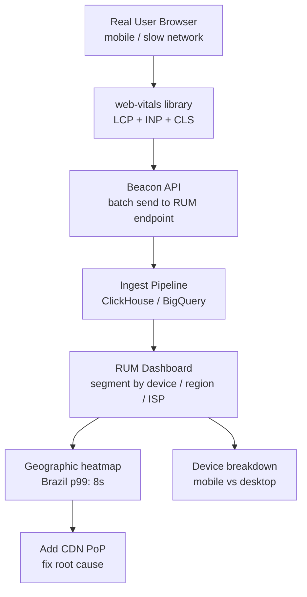
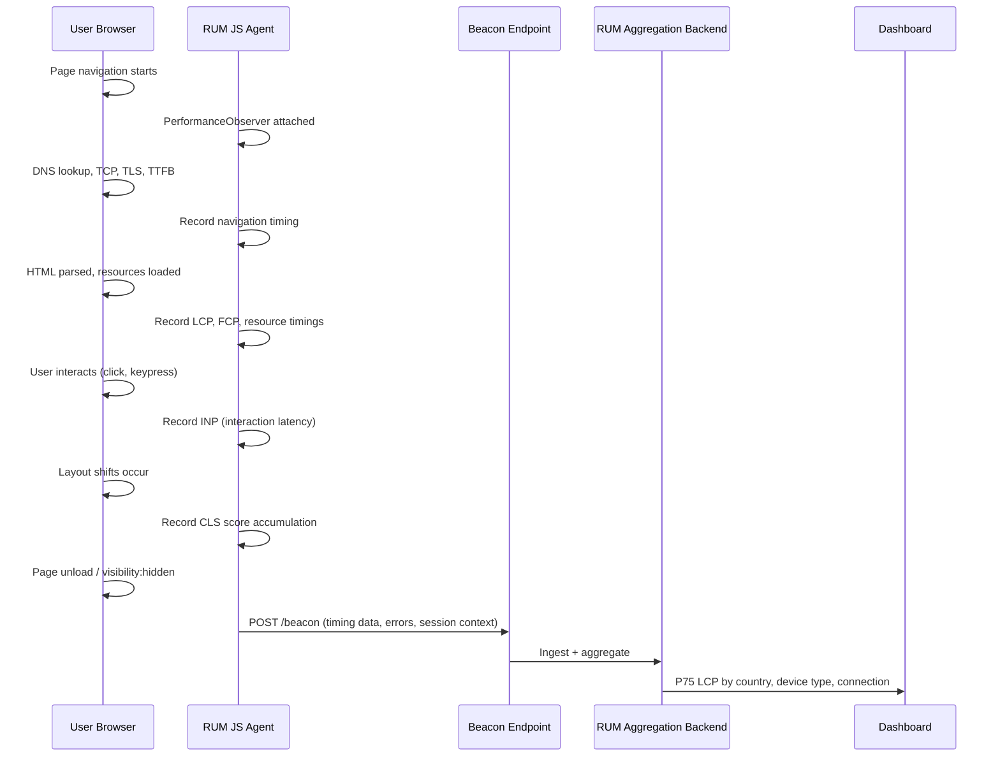

# Real User Monitoring (RUM): Measuring Actual User Experience

## 🗺️ Quick Overview



*Synthetic tests run from datacenters; RUM captures real Brazilian users on mobile — only RUM reveals the 8-second load time that synthetic monitoring misses.*

**Your synthetic tests show 200ms load time. Your P99 server latency is 80ms. But users are complaining the app is "slow." You look at Real User Monitoring data: actual users in Brazil take 8 seconds to load the page. Your servers are in us-east-1. The 200ms test ran from the same datacenter as your server. Your CDN has no edge node in South America. The content is traveling 9,000 miles over ocean cables for every single Brazilian user. RUM is the only way to know what real users actually experience — and it would have caught this before your Brazil launch instead of after your support tickets.**

---

## The Problem Class `[Senior]`

Server-side observability is complete, but it covers only half the picture. The other half — what happens in the browser, on real devices, over real networks, from real geographic locations — is invisible without RUM.

The gap between synthetic/server metrics and real user experience is consistently underestimated:

```
What your monitoring says:        What Brazilian users experience:
- API response time: 80ms         - Time to first byte: 2,300ms
- Synthetic test: 200ms           - LCP: 8,400ms
- CDN cache hit rate: 95%         - CDN: no PoP in region, hit us-east-1 origin
- Server CPU: 30%                 - JavaScript bundle: 3MB, 4s to parse on mobile
- Error rate: 0.1%                - Checkout button unresponsive for 6 seconds
```

Every gap is a user experience problem invisible to server-side observability.



---

## Core Web Vitals

Core Web Vitals are the metrics Google uses to measure page experience for search ranking. More importantly, they map to real user experience signals that actually matter.

### LCP — Largest Contentful Paint

**What it measures**: How long until the largest visible content element (hero image, h1 headline) is rendered. Correlates strongly with perceived load time.

**Target**: < 2.5s (Good), 2.5-4s (Needs Improvement), > 4s (Poor)

**Common causes of bad LCP**:
- Large unoptimized images (no WebP, no responsive sizes)
- Render-blocking JavaScript (synchronous scripts in `<head>`)
- Slow server response (TTFB > 600ms before LCP can start)
- No CDN (all assets served from origin)
- Images not preloaded (browser discovers them late)

### INP — Interaction to Next Paint

**What it measures**: The responsiveness of the page to user interactions (clicks, key presses, taps). Replaced FID in March 2024. Measures the worst interaction latency during the entire page lifetime.

**Target**: < 200ms (Good), 200-500ms (Needs Improvement), > 500ms (Poor)

**Common causes of bad INP**:
- Long JavaScript tasks blocking the main thread (>50ms)
- Large React re-renders on user action
- Synchronous fetch calls on click handlers
- Third-party scripts (ads, analytics, chat widgets) consuming main thread

### CLS — Cumulative Layout Shift

**What it measures**: Visual stability — how much content unexpectedly moves around during page load. That moment when you're about to click a button and an ad loads above it, pushing the button down and you click the wrong thing. That's CLS.

**Target**: < 0.1 (Good), 0.1-0.25 (Needs Improvement), > 0.25 (Poor)

**Common causes of bad CLS**:
- Images and videos without explicit width/height attributes
- Ads, embeds, iframes without reserved space
- Dynamically injected content above existing content
- Web fonts causing FOUT (flash of unstyled text) that changes layout

### Measuring with the web-vitals Library

```javascript
// Install: npm install web-vitals

import { onCLS, onINP, onLCP, onFCP, onTTFB } from 'web-vitals';

// Configuration
const RUM_ENDPOINT = 'https://analytics.example.com/rum';
const SAMPLE_RATE = 0.1; // Sample 10% of sessions (cost control)

// Should this session be measured?
const shouldSample = Math.random() < SAMPLE_RATE;

// Session context — capture once, send with every metric
const sessionContext = {
  session_id: generateSessionId(),
  user_id: window.__USER_ID__ || null,    // From app global
  app_version: window.__APP_VERSION__,
  page: window.location.pathname,
  referrer: document.referrer,
  connection: navigator.connection?.effectiveType || 'unknown', // '4g', '3g', etc.
  device_memory: navigator.deviceMemory || null,   // GB of RAM
  device_type: getDeviceType(),  // 'mobile', 'tablet', 'desktop'
};

function sendMetric(metric) {
  if (!shouldSample) return;

  const payload = {
    ...sessionContext,
    metric_name: metric.name,
    metric_value: metric.value,
    metric_rating: metric.rating,  // 'good', 'needs-improvement', 'poor'
    delta: metric.delta,
    id: metric.id,
    timestamp: Date.now(),
  };

  // Use sendBeacon for reliability: fires even on page unload
  if (navigator.sendBeacon) {
    navigator.sendBeacon(RUM_ENDPOINT, JSON.stringify(payload));
  } else {
    fetch(RUM_ENDPOINT, {
      method: 'POST',
      body: JSON.stringify(payload),
      keepalive: true,  // Survives page unload
    });
  }
}

// Register all Core Web Vitals
onCLS(sendMetric);
onINP(sendMetric);
onLCP(sendMetric);
onFCP(sendMetric);
onTTFB(sendMetric);
```

### Custom Performance Marks

For business-critical timings beyond Core Web Vitals:

```javascript
// Measure time to interactive checkout
performance.mark('checkout-start');

async function initializeCheckout() {
  await loadPaymentWidget();
  await fetchCartItems();
  renderCheckoutForm();

  performance.mark('checkout-ready');
  performance.measure('checkout-init', 'checkout-start', 'checkout-ready');

  const measure = performance.getEntriesByName('checkout-init')[0];
  sendMetric({
    name: 'checkout_init',
    value: measure.duration,
    rating: measure.duration < 500 ? 'good'
          : measure.duration < 2000 ? 'needs-improvement'
          : 'poor',
  });
}

// Measure time-to-first-product-visible (e-commerce critical metric)
const productObserver = new PerformanceObserver((entries) => {
  const productEntry = entries.getEntriesByName('product-image-visible')[0];
  if (productEntry) {
    sendMetric({
      name: 'product_first_visible',
      value: productEntry.startTime,
      rating: productEntry.startTime < 1500 ? 'good'
            : productEntry.startTime < 3000 ? 'needs-improvement'
            : 'poor',
    });
    productObserver.disconnect();
  }
});
productObserver.observe({ type: 'mark', buffered: true });

// In your product list rendering component:
performance.mark('product-image-visible');
```

---

## JavaScript Error Tracking

Every unhandled JavaScript error is a user experiencing a broken feature. Track them all.

```javascript
// error-tracking.js — load this early in your HTML, before other scripts

const ErrorTracker = {
  endpoint: 'https://analytics.example.com/errors',
  context: {
    app_version: window.__APP_VERSION__,
    user_id: window.__USER_ID__ || null,
    session_id: window.__SESSION_ID__,
    page: window.location.pathname,
    browser: navigator.userAgent,
  },

  send(errorData) {
    const payload = {
      ...this.context,
      ...errorData,
      timestamp: new Date().toISOString(),
      url: window.location.href,
    };

    navigator.sendBeacon(this.endpoint, JSON.stringify(payload));
  },

  // Group errors by pattern to avoid flooding (same error from 1000 users = 1 issue)
  getFingerprint(message, filename, line) {
    // Normalize: strip dynamic values from message
    const normalized = message
      .replace(/\d+/g, 'N')          // Replace numbers
      .replace(/"[^"]+"/g, '"S"')    // Replace string literals
      .replace(/`[^`]+`/g, '`S`');  // Replace template literals
    return btoa(`${normalized}:${filename}:${line}`).slice(0, 16);
  },
};

// Synchronous errors
window.onerror = function(message, filename, lineno, colno, error) {
  ErrorTracker.send({
    type: 'uncaught_error',
    message,
    filename,
    lineno,
    colno,
    stack: error?.stack || null,
    fingerprint: ErrorTracker.getFingerprint(message, filename, lineno),
  });

  // Return false to let browser still show the error in console
  return false;
};

// Promise rejections (fetch failures, async errors)
window.addEventListener('unhandledrejection', (event) => {
  const error = event.reason;
  const message = error instanceof Error ? error.message : String(error);

  ErrorTracker.send({
    type: 'unhandled_promise_rejection',
    message,
    stack: error instanceof Error ? error.stack : null,
    fingerprint: ErrorTracker.getFingerprint(message, 'promise', 0),
  });
});

// Resource load failures (images, scripts, stylesheets)
window.addEventListener('error', (event) => {
  if (event.target && event.target !== window) {
    const target = event.target;
    ErrorTracker.send({
      type: 'resource_load_error',
      message: `Failed to load ${target.tagName}: ${target.src || target.href}`,
      resource_type: target.tagName.toLowerCase(),
      resource_url: target.src || target.href || null,
      fingerprint: ErrorTracker.getFingerprint(
        `resource_load_${target.tagName}`,
        target.src || target.href,
        0
      ),
    });
  }
}, true); // Capture phase — resource errors don't bubble
```

---

## Session Replay

Session replay records DOM mutations and user interactions, allowing you to replay exactly what a user experienced when an error occurred. It is the most powerful debugging tool for UX issues.

How it works: instead of recording a video (huge), replay SDKs record a sequence of DOM mutation events (insertions, attribute changes, text changes) plus user events (mouse, keyboard, scroll). Playback re-applies these mutations to a blank DOM.

### Privacy Requirements

Session replay on production has serious privacy implications. Configuration is non-negotiable:

```javascript
// Example Datadog RUM session replay configuration
import { datadogRum } from '@datadog/browser-rum';

datadogRum.init({
  applicationId: 'your-application-id',
  clientToken: 'your-client-token',
  site: 'datadoghq.com',
  service: 'checkout-frontend',
  env: 'production',
  version: '1.4.2',

  sessionReplaySampleRate: 5,   // Only record 5% of sessions (storage cost)
  trackUserInteractions: true,
  defaultPrivacyLevel: 'mask',  // Default: mask ALL text content
});

// Override: allow specific non-sensitive elements
// Add data-dd-privacy="allow" to HTML elements that are safe to record
// Add data-dd-privacy="mask" to elements with PII (auto-applied to inputs)
// Add data-dd-privacy="hidden" to elements that should be completely hidden
```

In your HTML:
```html
<!-- Safe to record: product names, prices, UI elements -->
<div class="product-card" data-dd-privacy="allow">
  <span class="product-name">Running Shoes Pro</span>
  <span class="price">$129.99</span>
</div>

<!-- Always mask: any input field (auto-masked by default, but explicit is better) -->
<input type="text" name="card_number" data-dd-privacy="mask" />
<input type="email" name="email" data-dd-privacy="mask" />

<!-- Hidden: sensitive sections that should never be recorded -->
<div class="billing-address-full" data-dd-privacy="hidden">...</div>
```

### Session Replay Use Cases

1. **Error context**: user reported "checkout broke." Pull their session replay → watch exactly what happened: they clicked "Apply Coupon," JavaScript error fires, button disappears, user refreshes and loses cart.

2. **UX debugging**: conversion rate on checkout dropped 3%. Watch 10 session replays of users who did not complete checkout → 8/10 get confused by the same unclear error message on the shipping form.

3. **Rage clicks**: RUM platforms detect when a user repeatedly clicks the same element rapidly (a sign that UI is unresponsive). Session replay shows what they were trying to do.

---

## RUM vs Synthetic Monitoring

They are complementary, not alternatives:

| Dimension | RUM | Synthetic |
|-----------|-----|-----------|
| Who generates traffic | Real users | Scripted bots |
| Runs when | Users visit | On schedule (continuous) |
| Geographic coverage | Wherever users are | Where you configure runners |
| Detects issues before users | No (reactive) | Yes (proactive) |
| Measures real device/network | Yes | No (controlled environment) |
| Volume of data | High (many users) | Low (few checks) |
| Long-tail conditions | Yes | No |
| New feature regressions | After launch | Before launch (if scripted) |

Production strategy: run synthetic checks for early warning and continuous validation of critical flows. Use RUM for understanding real user experience, geographic performance distribution, and post-launch regression detection.

---

## RUM Platforms

| Platform | Best For | Pricing Model | Session Replay | Source Maps |
|----------|----------|---------------|----------------|-------------|
| Datadog RUM | Full stack teams (APM + RUM unified) | Per session | Yes | Yes |
| New Relic Browser | New Relic shops, NRQL power users | Per GB ingest | Yes | Yes |
| Sentry | Error tracking primary, RUM secondary | Per error/replay | Yes | Yes |
| LogRocket | UX teams, session replay focus | Per sessions | Excellent | Yes |
| web-vitals + custom | Full data ownership, cost control | Infra only | No (DIY) | DIY |

### Custom RUM Endpoint

If you want to own your data and avoid vendor costs:

```javascript
// server/rum-endpoint.js (Node.js + Express)
const express = require('express');
const router = express.Router();

// In-memory aggregation (use Redis or ClickHouse for production)
const metricsBuffer = [];
const FLUSH_INTERVAL = 10_000; // 10 seconds
const BUFFER_MAX = 1000;

router.post('/beacon', express.text({ type: '*/*' }), async (req, res) => {
  try {
    const data = JSON.parse(req.body);

    // Validate required fields
    if (!data.metric_name || data.metric_value === undefined) {
      return res.sendStatus(400);
    }

    // Enrich with server-side context
    const enriched = {
      ...data,
      received_at: new Date().toISOString(),
      client_ip_country: req.headers['cf-ipcountry'] || 'unknown', // Cloudflare
      client_ip_asn: req.headers['cf-ipasn'] || null,
    };

    metricsBuffer.push(enriched);

    if (metricsBuffer.length >= BUFFER_MAX) {
      await flushMetrics();
    }

    res.sendStatus(204); // No content — beacon responses are ignored anyway
  } catch (err) {
    res.sendStatus(400);
  }
});

async function flushMetrics() {
  if (metricsBuffer.length === 0) return;
  const batch = metricsBuffer.splice(0, metricsBuffer.length);

  // Write to ClickHouse, TimescaleDB, or BigQuery
  // Example: ClickHouse bulk insert for P99 queries
  await clickhouse.insert({
    table: 'rum_metrics',
    values: batch,
    format: 'JSONEachRow',
  });
}

setInterval(flushMetrics, FLUSH_INTERVAL);
```

---

## Real-World Context

**Shopify** has written about using RUM to optimize their checkout flow, which is their highest-value page. They found that mobile users on 3G connections in Southeast Asia had 12-second checkout load times. Their server metrics showed everything healthy. The fix required a combination of reduced JavaScript bundle size, deferred non-critical scripts, and a regional CDN expansion. RUM surfaced the problem; the server never would have.

**Airbnb** uses RUM extensively for their mobile web experience. Their engineering team described A/B testing render strategies (server-side vs client-side rendering for specific page sections) directly with RUM LCP data — comparing real user LCP scores across treatment groups rather than synthetic benchmarks.

The consistent finding: **synthetic monitoring protects SLAs, RUM protects user experience**. Companies that skip RUM find out about geographic, device, or network-class performance problems from support tickets and social media, not from their monitoring systems.

---

## Common Mistakes

**Mistake 1: Only measuring TTFB and ignoring the rest**
TTFB (Time to First Byte) is what your server sends. LCP is what the user sees. The gap between them is often larger than TTFB itself — caused by render-blocking resources, large JavaScript bundles, and layout thrashing.

**Mistake 2: Sampling too aggressively**
At 10% sampling, you need 10x more users for statistical significance on a specific segment (e.g., "mobile users in Brazil"). Start with higher sampling and reduce based on volume, not intuition.

**Mistake 3: Not segmenting by device and connection**
P75 LCP across all users hides the bimodal distribution: desktop+WiFi users see 800ms, mobile+3G users see 6 seconds. Always segment RUM data by device type and connection class.

**Mistake 4: Session replay without privacy configuration**
Shipping session replay that records credit card fields, passwords, or personal information is a compliance and legal risk. Default to masking all inputs. Opt-in specific non-sensitive areas.

**Mistake 5: Ignoring JavaScript error tracking**
JavaScript errors are silent by default. If you do not instrument `window.onerror` and `unhandledrejection`, you will never know how many users are hitting broken features. Add error tracking before you add any other RUM signal.

**Mistake 6: Not correlating RUM with server traces**
A slow LCP might be caused by a slow API call. The debugging chain is: RUM shows slow LCP → check resource timing → identify slow API call → look up that trace_id in APM. This requires passing a `trace_id` from your server responses into the RUM context.

---

## Key Takeaways

- **RUM measures what users experience, not what your servers experience.** The gap between these two is real and often large.
- **Core Web Vitals are the language of user experience performance.** LCP < 2.5s, INP < 200ms, CLS < 0.1 — memorize these thresholds.
- **Always segment by geography, device type, and connection class.** Global averages hide the users with the worst experience.
- **JavaScript error tracking with `window.onerror` + `unhandledrejection` is table stakes.** If you have none today, add it tomorrow.
- **Session replay is the most powerful UX debugging tool available**, but requires explicit privacy configuration. Default to masking everything sensitive.
- **RUM and synthetic are complementary**: synthetic catches issues proactively, RUM captures the long tail of real-world conditions.
