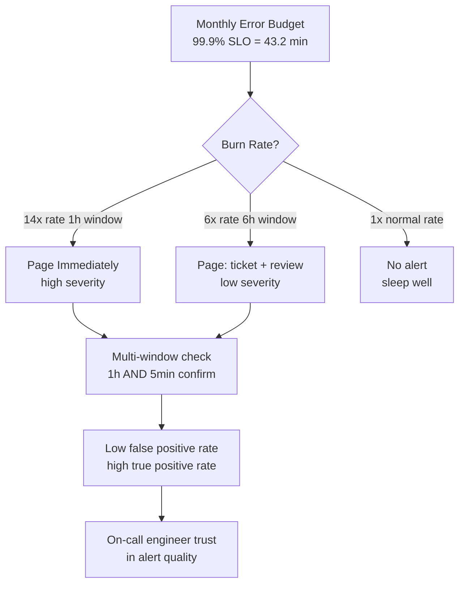
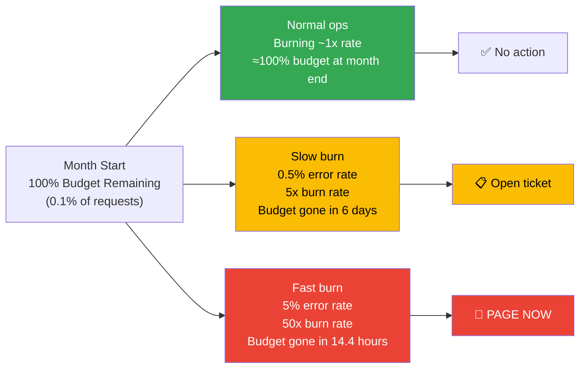
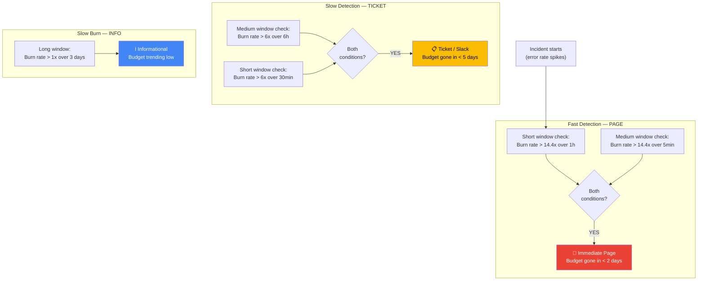
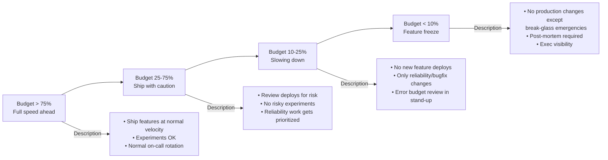
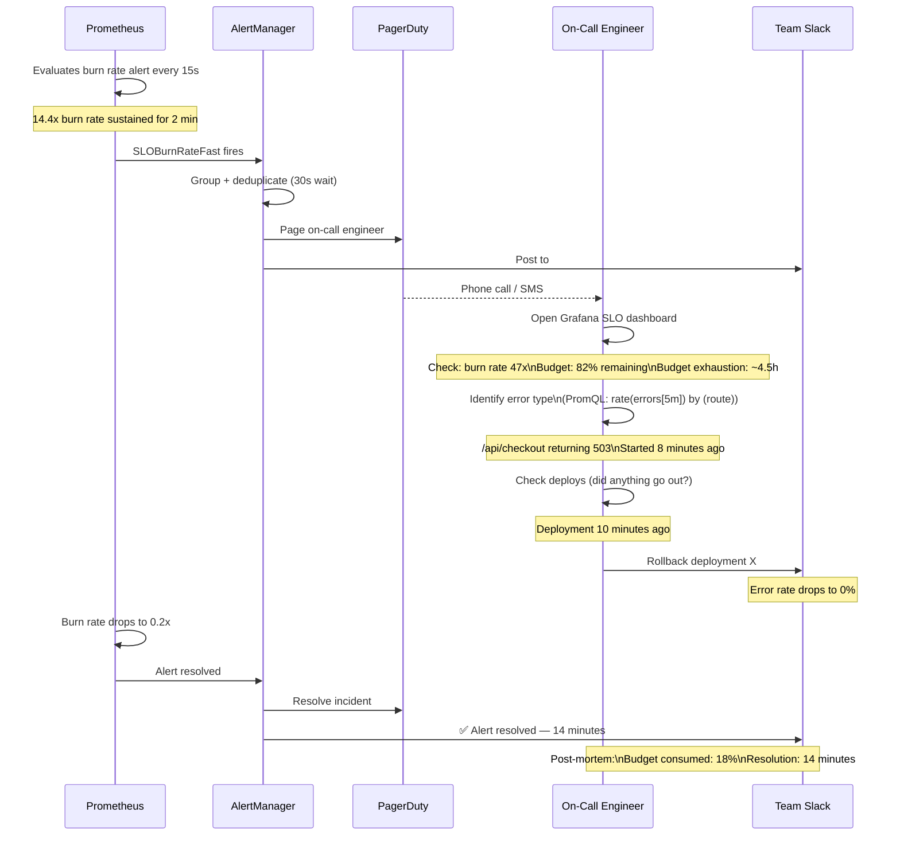

# SLO Burn Rate Alerts: Page When It Matters, Sleep When It Doesn't

## 🗺️ Quick Overview



*Burn rate alerts answer "will we exhaust the budget before month end?" — a 1% error rate for 5 minutes is noise; 5% for 30 minutes is a page.*

**Your SLO says 99.9% uptime. Your alert fires when error rate > 1%.** But a 1% error rate for 5 minutes burns only 0.003% of your monthly error budget. You don't need to wake anyone up — the user impact is 18 seconds of downtime across a month. Meanwhile, on a Tuesday afternoon, a 5% error rate runs for 30 minutes. That burns 36% of your error budget in one incident. You're still sleeping. By the time you notice, your SLO is already breached for the month. Your error budget is gone. Product is asking why you can't ship features. The problem is not that your system is unreliable. The problem is that your alerts were measuring the wrong thing.

---

## The Problem Class `[Senior]`

Threshold-based alerts ask: "is this metric above X right now?" SLO burn rate alerts ask: "at this rate of burning, will I run out of error budget before the month ends?"

These are fundamentally different questions with fundamentally different urgency signals.



**The core insight**: the same error rate means different things depending on how long it has been sustained. A 5% error rate for 1 minute is noise. A 5% error rate for 2 hours is a catastrophe. Burn rate alerts measure the rate at which you're consuming your budget — which captures both the severity (error rate) and the duration (how long it's been happening).

---

## The Math Behind Burn Rate `[Senior]`

### Error Budget Basics

If your SLO is 99.9% availability:
- Your **error rate budget** = 1 - 0.999 = 0.001 = 0.1% of requests
- In a 30-day month with 1M requests/day = 30M requests total
- You can afford 30,000 bad requests before breaching the SLO

### Burn Rate Formula

```
burn_rate = actual_error_rate / error_budget_rate
          = actual_error_rate / (1 - SLO)

# SLO = 99.9%, error_rate = 0.1%:
burn_rate = 0.001 / 0.001 = 1.0x    (burning exactly at budget rate — fine)

# SLO = 99.9%, error_rate = 0.5%:
burn_rate = 0.005 / 0.001 = 5x      (burning 5x faster than budget allows)

# SLO = 99.9%, error_rate = 5%:
burn_rate = 0.05 / 0.001 = 50x      (burning 50x faster — emergency)
```

### How Long Until Budget Exhaustion?

```
time_to_exhaustion = 30 days / burn_rate

burn_rate = 1x   → 30 days   (exact budget rate — fine)
burn_rate = 5x   → 6 days    (budget gone in a week — ticket)
burn_rate = 14.4x → 2 days   (budget gone in 2 days — warning page)
burn_rate = 50x  → 14.4 hours (budget gone in < 1 day — immediate page)
```

```
Real example:
SLO = 99.9% (30-day month)
Current error rate = 5%
Burn rate = 0.05 / 0.001 = 50x

Time to exhaust budget = 30 days × 24 hours / 50 = 14.4 hours

You will breach your monthly SLO in 14.4 hours unless this is resolved.
That is an emergency. That should wake someone up.
```

---

## Google's Multi-Window Multi-Burn-Rate Approach `[Senior]`

From the [Google SRE Workbook](https://sre.google/workbook/alerting-on-slos/), the recommended alert design uses multiple windows and multiple burn rates to balance:
- **Precision**: Not paging for non-issues (noisy alerts burn out on-call engineers)
- **Recall**: Not missing real issues (silent alerts mean SLO breaches go undetected)
- **Reset time**: Knowing when the problem is resolved



The key technique: **require two windows to agree**. A 1-hour window catches sustained issues. A 5-minute window confirms the issue is still happening now (not resolved). This prevents:
- Stale alerts that fire because an hour ago was bad, but right now is fine
- Single-spike alerts from transient issues that self-resolved

### The Alert Matrix

| Burn Rate | Short Window | Long Window | Response | Budget Remaining When Alert Fires |
|-----------|-------------|-------------|----------|-----------------------------------|
| > 14.4x | 5 min | 1 hour | Immediate page | ~98% remaining |
| > 6x | 30 min | 6 hours | Ticket / Slack | ~85% remaining |
| > 3x | 2 hours | 1 day | Informational | ~66% remaining |
| > 1x | 3 days | — | Trend alert | SLO tracking |

---

## PromQL for Burn Rate Alerts `[Senior]`

### The Core Query

```promql
# Burn rate over a window
(
  rate(http_requests_errors_total[window])
  /
  rate(http_requests_total[window])
) / (1 - 0.999)
```

Replace `window` and `0.999` with your actual values.

### Complete AlertManager-Compatible Alert Rules

```yaml
# slo-alerts.yml
groups:
  - name: slo_burn_rate
    rules:
      # === TIER 1: IMMEDIATE PAGE ===
      # Fast burn — budget gone in < 2 days
      # Both 1-hour and 5-minute windows must show > 14.4x burn rate
      - alert: SLOBurnRateFast
        expr: |
          # 1-hour window — sustained issue
          (
            rate(http_requests_errors_total{service="order-service"}[1h])
            /
            rate(http_requests_total{service="order-service"}[1h])
          ) / (1 - 0.999) > 14.4
          and
          # 5-minute window — issue is current
          (
            rate(http_requests_errors_total{service="order-service"}[5m])
            /
            rate(http_requests_total{service="order-service"}[5m])
          ) / (1 - 0.999) > 14.4
        for: 2m
        labels:
          severity: page
          team: platform
          slo: "order-service-availability"
        annotations:
          summary: "SLO burn rate {{ $value | printf \"%.1f\" }}x — budget exhausted in {{ 720 | div $value | printf \"%.1f\" }}h"
          description: |
            Order service is burning error budget at {{ $value | printf \"%.1f\" }}x the sustainable rate.
            At this rate, the 30-day error budget will be exhausted in {{ 720 | div $value | printf \"%.1f\" }} hours.
            Immediate investigation required.
          runbook: "https://runbooks.internal/slo-fast-burn"
          dashboard: "https://grafana.internal/d/slo-error-budget"

      # === TIER 2: TICKET / SLACK ===
      # Slow burn — budget gone in < 5 days
      # Both 6-hour and 30-minute windows must show > 6x burn rate
      - alert: SLOBurnRateSlow
        expr: |
          (
            rate(http_requests_errors_total{service="order-service"}[6h])
            /
            rate(http_requests_total{service="order-service"}[6h])
          ) / (1 - 0.999) > 6
          and
          (
            rate(http_requests_errors_total{service="order-service"}[30m])
            /
            rate(http_requests_total{service="order-service"}[30m])
          ) / (1 - 0.999) > 6
        for: 15m
        labels:
          severity: warning
          team: platform
          slo: "order-service-availability"
        annotations:
          summary: "SLO burn rate {{ $value | printf \"%.1f\" }}x — budget trending low"
          description: |
            Order service is burning error budget at {{ $value | printf \"%.1f\" }}x the sustainable rate.
            No immediate page, but investigate before end of day.
          runbook: "https://runbooks.internal/slo-slow-burn"

      # === LATENCY SLO: P99 burn rate ===
      # Separate SLO for latency: 99% of requests < 500ms
      # "Errors" here = requests that exceeded the latency budget
      - alert: LatencySLOBurnRateFast
        expr: |
          (
            # Requests that violated the 500ms SLO: count - (count at the 500ms bucket)
            (
              rate(http_request_duration_seconds_count{service="order-service"}[1h])
              -
              rate(http_request_duration_seconds_bucket{service="order-service",le="0.5"}[1h])
            )
            /
            rate(http_request_duration_seconds_count{service="order-service"}[1h])
          ) / (1 - 0.99) > 14.4
          and
          (
            (
              rate(http_request_duration_seconds_count{service="order-service"}[5m])
              -
              rate(http_request_duration_seconds_bucket{service="order-service",le="0.5"}[5m])
            )
            /
            rate(http_request_duration_seconds_count{service="order-service"}[5m])
          ) / (1 - 0.99) > 14.4
        for: 2m
        labels:
          severity: page
          team: platform
          slo: "order-service-latency"
        annotations:
          summary: "Latency SLO burn rate {{ $value | printf \"%.1f\" }}x — P99 > 500ms sustained"
```

---

## Node.js: Exposing SLI Metrics `[Senior]`

Burn rate alerts are only as good as the underlying SLI measurements. Here is how to expose clean SLI metrics from Node.js:

```javascript
// sli-metrics.js
const client = require('prom-client');

const register = new client.Registry();

// SLI metric: HTTP requests broken into good/bad
// "good" = 2xx + 3xx, "bad" = 4xx + 5xx (or just 5xx, depending on your SLO definition)
const httpRequestsTotal = new client.Counter({
  name: 'http_requests_total',
  help: 'Total HTTP requests',
  labelNames: ['service', 'method', 'route', 'status_class'],
  registers: [register],
});

// Explicit error counter — for cleaner SLI calculation
const httpRequestErrorsTotal = new client.Counter({
  name: 'http_requests_errors_total',
  help: 'HTTP requests that are SLI errors (5xx)',
  labelNames: ['service', 'method', 'route'],
  registers: [register],
});

// Latency histogram with SLO threshold as a bucket boundary
// If SLO is 99% < 500ms, include 0.5 as a bucket boundary
const httpRequestDuration = new client.Histogram({
  name: 'http_request_duration_seconds',
  help: 'HTTP request duration',
  labelNames: ['service', 'method', 'route'],
  // SLO threshold (0.5 = 500ms) must be an exact bucket boundary
  buckets: [0.005, 0.01, 0.025, 0.05, 0.1, 0.25, 0.5, 1.0, 2.5, 5.0],
  registers: [register],
});

const SERVICE_NAME = process.env.SERVICE_NAME || 'order-service';

function sliMiddleware(req, res, next) {
  const startTime = process.hrtime.bigint();

  res.on('finish', () => {
    const durationSec = Number(process.hrtime.bigint() - startTime) / 1e9;
    const route = req.route?.path || 'unknown';
    const statusClass = `${Math.floor(res.statusCode / 100)}xx`;

    // Total requests (good + bad)
    httpRequestsTotal.inc({
      service: SERVICE_NAME,
      method: req.method,
      route,
      status_class: statusClass,
    });

    // Error requests (SLI errors = 5xx only, or 4xx+5xx depending on SLO definition)
    if (res.statusCode >= 500) {
      httpRequestErrorsTotal.inc({
        service: SERVICE_NAME,
        method: req.method,
        route,
      });
    }

    // Latency (all requests, including errored ones)
    httpRequestDuration.observe({
      service: SERVICE_NAME,
      method: req.method,
      route,
    }, durationSec);
  });

  next();
}

module.exports = { register, sliMiddleware };
```

---

## Error Budget Policy `[Staff]`

Burn rate alerts are useless without a policy for what to do when they fire. The error budget is the contract between product (wants to ship features) and reliability (wants system stability). The policy must be pre-agreed, not negotiated during an incident.



```javascript
// error-budget-policy.js — automated policy enforcement
// Called by CI/CD pipeline before deployment

const { Prometheus } = require('./prometheus-client');

async function checkDeploymentPolicy(serviceName) {
  const burnRate30d = await Prometheus.query(
    `avg_over_time(
      (rate(http_requests_errors_total{service="${serviceName}"}[1h])
       / rate(http_requests_total{service="${serviceName}"}[1h])
      ) / (1 - 0.999)
    [30d:1h])`
  );

  const budgetConsumed = Math.min(burnRate30d / 30, 1.0); // fraction of 30-day budget consumed
  const budgetRemaining = 1.0 - budgetConsumed;

  if (budgetRemaining > 0.75) {
    return { allowed: true, reason: 'Budget healthy (> 75% remaining)' };
  }

  if (budgetRemaining > 0.25) {
    // Allowed but require explicit confirmation
    return {
      allowed: true,
      warning: true,
      reason: `Budget at ${(budgetRemaining * 100).toFixed(1)}% — review deployment risk`,
    };
  }

  if (budgetRemaining > 0.10) {
    return {
      allowed: false,
      reason: `Budget critical (${(budgetRemaining * 100).toFixed(1)}% remaining) — no feature deploys`,
      exception: 'reliability-fixes-only',
    };
  }

  return {
    allowed: false,
    reason: `Budget exhausted (${(budgetRemaining * 100).toFixed(1)}% remaining) — all deploys blocked`,
    exception: 'exec-approval-required',
  };
}
```

---

## Sequence: From Alert to Resolution `[Senior]`



---

## Common Mistakes `[Senior]`

**Mistake 1: Using a single window**
A single-window burn rate alert (just 1-hour) fires for historical issues that have already resolved. The second window (5-minute) confirms the problem is current. Without it, on-call gets woken up for incidents that resolved 50 minutes ago.

**Mistake 2: Setting SLO too high "to be safe"**
99.99% SLO = 4.3 minutes downtime/month budget. That's your entire error budget for one bad deploy. Teams that set 99.99% SLOs end up with feature freezes every other week because no system is that reliable without heroic effort.

**Mistake 3: Counting 4xx as SLI errors**
4xx responses (400 Bad Request, 404 Not Found) are usually client errors, not server errors. If a client sends malformed requests, your error rate spikes but your service is healthy. SLI should count 5xx (server errors) unless your SLO specifically says otherwise.

**Mistake 4: Not aligning SLO with user journey**
An SLO on `/api/health` is meaningless. The SLO should be on the user-facing critical path: checkout, authentication, core business transactions. Users don't care about health checks.

**Mistake 5: Treating all errors equally**
A 500 error on `/api/recommendations` is less severe than on `/api/checkout`. Consider separate SLOs for critical vs non-critical endpoints, or a weighted error rate (checkout errors count 10x).

**Mistake 6: Not having an error budget policy**
The error budget is only valuable if there's a policy around it. Without a policy, it's just a metric. The policy ("< 10% budget = no deploys") is what creates the alignment between reliability and product velocity.

---

## Real-World Context

**Google Search** runs at 99.99% SLO. That's 4.3 minutes downtime per month. Their burn rate alerts fire when they're on track to breach that in less than 2 hours. The on-call engineer for Google Search gets approximately 1-2 pages per month — not hundreds of threshold alerts. That's what well-designed alerting looks like.

**Atlassian** publishes their SLO approach: they define SLOs per service and expose them on a public status page. When an SLO is breached, it's a public incident. This creates the organizational pressure to take error budgets seriously.

**Spotify** hit a 3 AM moment in 2022 where a bad deploy burned their entire monthly error budget in 45 minutes. Their burn rate alert fired at minute 3. On-call rolled back at minute 12. Incident closed at minute 45. Without the burn rate alert, it would have been a user-reported incident.

---

## Key Takeaways

1. **Burn rate = error_rate / (1 - SLO)**: A 5% error rate with a 99.9% SLO = 50x burn rate = budget gone in 14.4 hours
2. **Two windows, one alert**: Short window (5m/1h) confirms problem is current; long window (1h/6h) confirms it's sustained
3. **Three tiers**: Immediate page (>14.4x), ticket (>6x), informational (>1x)
4. **Error budget policy is required**: The alert without the policy is noise. Policy = what changes when budget reaches 50%, 25%, 10%, 0%
5. **SLO definition matters**: 99.9% vs 99.99% is not a rounding error — it's 10x less error budget. Be deliberate.
6. **Count the right errors**: 5xx for availability SLO, latency bucket overflow for latency SLO. 4xx is usually client error, not SLI error.
7. **Test with a known budget burn**: Before launch, simulate a 5% error rate and watch your alerts fire. Verify the math matches expectations.
