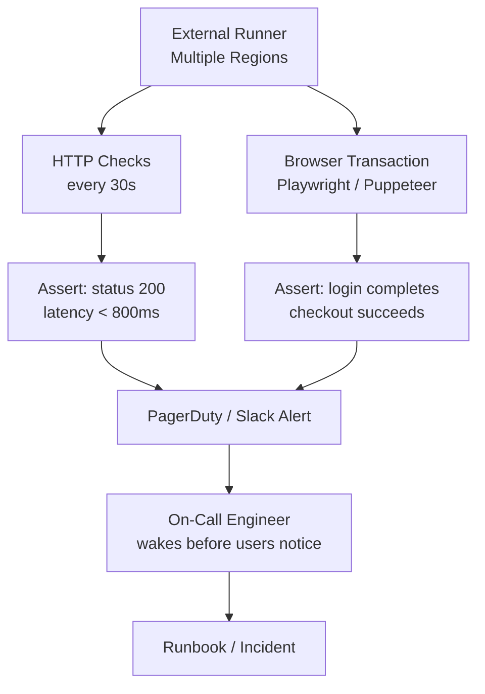
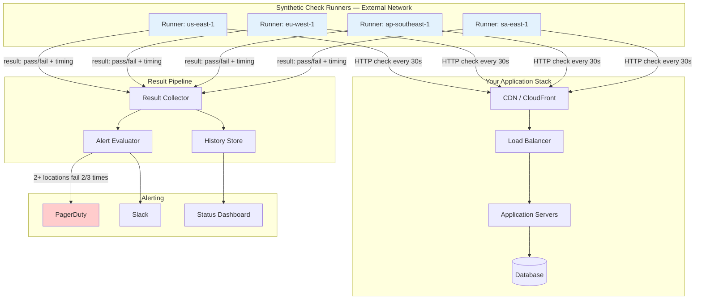
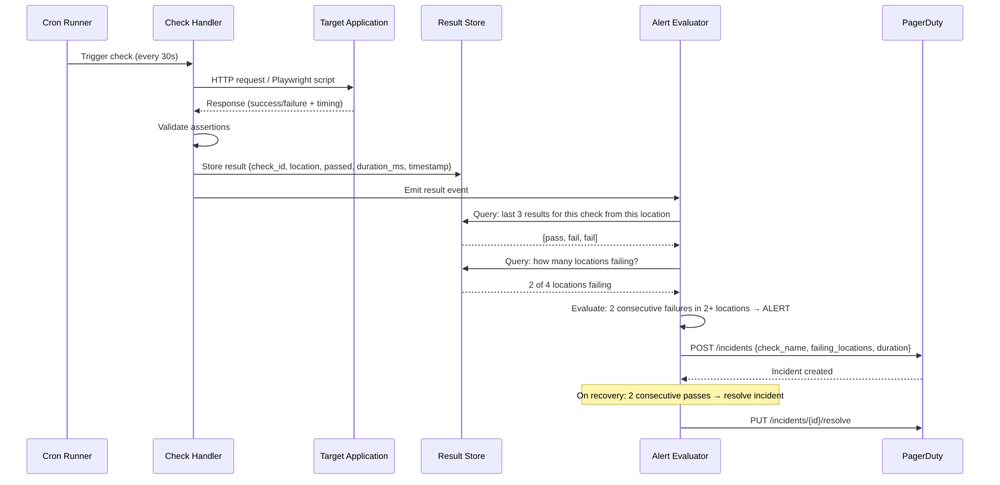

# Synthetic Monitoring: Proactive Checks Before Users Hit Problems

## 🗺️ Quick Overview



*Synthetic monitoring fires within 30 seconds of CDN-cached errors, SSL expiry, or broken flows — before a single real user is affected.*

**Your app has been down for 22 minutes. Your monitoring system hasn't fired a single alert. Why? Because your monitoring checks server health — not user experience. The server was healthy. The CDN was serving a cached 500 error. To your users: 22 minutes of broken checkout. To your monitoring: all green. A synthetic check running every 30 seconds from an external network would have fired within 30 seconds of the CDN caching that error. Twenty-one and a half minutes of user impact avoided. That is why you build synthetic monitoring.**

---

## The Problem Class `[Senior]`

Infrastructure monitoring tells you about the health of your infrastructure. It cannot tell you whether a user can actually complete a checkout, log in, or load the home page. These are different questions.

Classic synthetic monitoring gaps:
1. CDN serves stale cached error pages — servers healthy, users broken
2. Third-party payment widget script fails to load — your service healthy, checkout broken
3. SSL certificate expired at 3 AM — everything "up", every HTTPS request fails
4. DNS misconfiguration after a zone file edit — servers healthy, domain unreachable
5. Load balancer health check misconfigured — backends healthy, LB routes all traffic to dead node
6. Feature flag deployment breaks login for 10% of users — error rate metric not yet at alert threshold

Synthetic monitoring catches all of these. Server monitoring catches none of them.



---

## Types of Synthetic Checks

### 1. Availability Check (Ping / HTTP)

The simplest check: is the endpoint returning the expected HTTP status?

```javascript
// Not just "200 OK" — verify the response is correct
async function availabilityCheck(config) {
  const start = Date.now();

  const response = await fetch(config.url, {
    method: config.method || 'GET',
    headers: config.headers || {},
    signal: AbortSignal.timeout(config.timeout_ms || 5000),
  });

  const duration = Date.now() - start;
  const body = await response.text();

  const result = {
    check_type: 'availability',
    url: config.url,
    duration_ms: duration,
    status_code: response.status,
    passed: true,
    failures: [],
  };

  // Status code assertion
  const expectedStatus = config.expected_status || 200;
  if (response.status !== expectedStatus) {
    result.passed = false;
    result.failures.push(`Expected status ${expectedStatus}, got ${response.status}`);
  }

  // Response time assertion
  if (config.max_duration_ms && duration > config.max_duration_ms) {
    result.passed = false;
    result.failures.push(`Response time ${duration}ms exceeded limit ${config.max_duration_ms}ms`);
  }

  // Body content assertion — don't just check 200, check the response makes sense
  if (config.contains && !body.includes(config.contains)) {
    result.passed = false;
    result.failures.push(`Response body does not contain: "${config.contains}"`);
  }

  if (config.not_contains && body.includes(config.not_contains)) {
    result.passed = false;
    result.failures.push(`Response body unexpectedly contains: "${config.not_contains}"`);
  }

  return result;
}

// Example: CDN-served home page
await availabilityCheck({
  url: 'https://example.com',
  expected_status: 200,
  max_duration_ms: 2000,
  contains: '<title>Example App</title>',         // Verify content is real
  not_contains: 'Error 500',                       // Verify no cached error
  not_contains_2: 'maintenance mode',
});

// Example: API health endpoint
await availabilityCheck({
  url: 'https://api.example.com/health',
  expected_status: 200,
  max_duration_ms: 500,
  contains: '"status":"ok"',                       // Verify health response is correct
});
```

### 2. API Correctness Check

Verify that the API returns semantically correct responses, not just HTTP 200:

```javascript
async function apiCorrectnessCheck() {
  // Step 1: Login
  const loginResponse = await fetch('https://api.example.com/auth/login', {
    method: 'POST',
    headers: { 'Content-Type': 'application/json' },
    body: JSON.stringify({
      email: process.env.SYNTHETIC_TEST_USER_EMAIL,
      password: process.env.SYNTHETIC_TEST_USER_PASSWORD,
    }),
    signal: AbortSignal.timeout(5000),
  });

  if (loginResponse.status !== 200) {
    return { passed: false, failure: `Login failed: HTTP ${loginResponse.status}` };
  }

  const loginData = await loginResponse.json();

  // Validate response structure, not just status
  if (!loginData.token || typeof loginData.token !== 'string') {
    return { passed: false, failure: 'Login response missing token field' };
  }

  if (!loginData.user?.id) {
    return { passed: false, failure: 'Login response missing user.id' };
  }

  if (loginData.token.length < 20) {
    return { passed: false, failure: 'Token appears malformed (too short)' };
  }

  // Step 2: Verify token works — fetch protected resource
  const profileResponse = await fetch('https://api.example.com/me', {
    headers: { Authorization: `Bearer ${loginData.token}` },
    signal: AbortSignal.timeout(3000),
  });

  if (profileResponse.status !== 200) {
    return { passed: false, failure: `Profile fetch with valid token failed: HTTP ${profileResponse.status}` };
  }

  const profileData = await profileResponse.json();
  if (profileData.id !== loginData.user.id) {
    return { passed: false, failure: 'Profile user_id does not match login user_id' };
  }

  return { passed: true };
}
```

### 3. SSL Certificate Check

```javascript
const tls = require('tls');

async function sslCertificateCheck(hostname, alertDaysBeforeExpiry = 30) {
  return new Promise((resolve) => {
    const socket = tls.connect(443, hostname, { servername: hostname }, () => {
      const cert = socket.getPeerCertificate();
      socket.end();

      const expiryDate = new Date(cert.valid_to);
      const now = new Date();
      const daysUntilExpiry = Math.floor((expiryDate - now) / (1000 * 60 * 60 * 24));

      resolve({
        passed: daysUntilExpiry > alertDaysBeforeExpiry,
        days_until_expiry: daysUntilExpiry,
        expiry_date: expiryDate.toISOString(),
        issuer: cert.issuer?.O,
        subject: cert.subject?.CN,
        failure: daysUntilExpiry <= alertDaysBeforeExpiry
          ? `SSL certificate expires in ${daysUntilExpiry} days (threshold: ${alertDaysBeforeExpiry})`
          : null,
      });
    });

    socket.on('error', (err) => {
      resolve({ passed: false, failure: `SSL connection failed: ${err.message}` });
    });

    socket.setTimeout(5000, () => {
      socket.destroy();
      resolve({ passed: false, failure: 'SSL check timed out' });
    });
  });
}

// Run daily, alert 30 days before expiry
await sslCertificateCheck('example.com', 30);
```

### 4. Multi-Step Browser Transaction (Playwright)

The most powerful check type: simulate an actual user flowing through a critical path:

```javascript
const { chromium } = require('playwright');

async function checkoutTransactionCheck() {
  const browser = await chromium.launch({
    args: ['--no-sandbox', '--disable-setuid-sandbox'],
  });

  const context = await browser.newContext({
    // Simulate a real user's device
    viewport: { width: 1280, height: 800 },
    userAgent: 'Mozilla/5.0 (synthetic-monitor)',
  });

  const page = await context.newPage();
  const errors = [];
  const timings = {};

  // Capture JavaScript console errors
  page.on('console', msg => {
    if (msg.type() === 'error') {
      errors.push(`Console error: ${msg.text()}`);
    }
  });

  // Capture network failures
  page.on('requestfailed', request => {
    errors.push(`Network failure: ${request.url()} — ${request.failure()?.errorText}`);
  });

  try {
    // Step 1: Load home page
    const step1Start = Date.now();
    await page.goto('https://example.com', { waitUntil: 'networkidle', timeout: 15000 });
    timings.home_page_ms = Date.now() - step1Start;

    // Assert home page rendered correctly
    await page.waitForSelector('[data-testid="hero-headline"]', { timeout: 5000 });

    // Step 2: Navigate to product
    const step2Start = Date.now();
    await page.click('[data-testid="featured-product-link"]');
    await page.waitForSelector('[data-testid="add-to-cart-button"]', { timeout: 10000 });
    timings.product_page_ms = Date.now() - step2Start;

    // Step 3: Add to cart
    const step3Start = Date.now();
    await page.click('[data-testid="add-to-cart-button"]');
    await page.waitForSelector('[data-testid="cart-count"]', { timeout: 5000 });
    const cartCount = await page.textContent('[data-testid="cart-count"]');
    if (cartCount !== '1') {
      throw new Error(`Expected cart count 1, got "${cartCount}"`);
    }
    timings.add_to_cart_ms = Date.now() - step3Start;

    // Step 4: Go to checkout
    const step4Start = Date.now();
    await page.click('[data-testid="checkout-button"]');
    await page.waitForURL('**/checkout', { timeout: 10000 });
    await page.waitForSelector('[data-testid="checkout-form"]', { timeout: 10000 });
    timings.checkout_page_ms = Date.now() - step4Start;

    // Assert checkout form is functional
    const submitButton = await page.$('[data-testid="submit-order-button"]');
    if (!submitButton) {
      throw new Error('Submit order button not found on checkout page');
    }

    const isDisabled = await submitButton.isDisabled();
    // Button should be enabled (form is not broken)
    if (isDisabled) {
      throw new Error('Submit order button is unexpectedly disabled');
    }

    return {
      passed: true,
      timings,
      javascript_errors: errors,
    };

  } catch (err) {
    // Take screenshot on failure — invaluable for debugging
    await page.screenshot({
      path: `/tmp/synthetic-failure-${Date.now()}.png`,
      fullPage: true,
    });

    return {
      passed: false,
      failure: err.message,
      timings,
      javascript_errors: errors,
      screenshot_captured: true,
    };
  } finally {
    await browser.close();
  }
}
```

---

## Sequence Diagram: Full Check Lifecycle



---

## Multi-Location Monitoring

Running checks from a single location is almost as dangerous as not running checks at all.

Real incident: E-commerce site. US-East check: 200ms, all passing. EU-West check: timing out. Root cause: BGP routing change pushed EU traffic through an overloaded transit provider. EU users could not load the site. US monitoring showed everything healthy for 2.5 hours before a European customer tweeted about it.

**Run checks from at least 5 regions** for a global service:
- us-east-1 (US East Coast)
- us-west-2 (US West Coast)
- eu-west-1 (Western Europe)
- ap-southeast-1 (Southeast Asia / Australia)
- sa-east-1 (South America)

Alert when 2+ locations report failure — single-location failure is likely a transient network blip in the checker's region, not your app.

```javascript
// Alert threshold logic
function evaluateAlertThreshold(recentResults, allLocationResults) {
  // Rule 1: 2 consecutive failures from the same location
  const consecutiveFailures = recentResults
    .slice(-3)  // Last 3 checks
    .filter(r => !r.passed).length;

  if (consecutiveFailures < 2) {
    return { should_alert: false, reason: 'Less than 2 consecutive failures' };
  }

  // Rule 2: Failure confirmed from 2+ locations (not a regional blip)
  const failingLocations = new Set(
    allLocationResults
      .filter(r => !r.passed && r.timestamp > Date.now() - 120_000)  // Last 2 min
      .map(r => r.location)
  );

  if (failingLocations.size < 2) {
    return {
      should_alert: false,
      reason: `Only 1 location (${[...failingLocations][0]}) reporting failure — possible regional blip`,
    };
  }

  return {
    should_alert: true,
    reason: `${consecutiveFailures} consecutive failures from ${failingLocations.size} locations: ${[...failingLocations].join(', ')}`,
    failing_locations: [...failingLocations],
  };
}
```

---

## Alert Strategy

Bad alert strategy for synthetic monitoring: alert on first failure. You will get paged for network blips, DNS hiccups, and transient timeouts constantly. Your on-call rotation will ignore alerts within a week.

Good alert strategy:

```
Single check fails once     → Log it. No alert. Retry in 30s.
Same check fails 2/3 times  → Soft alert (Slack channel, no page).
Same check fails 3/3 times  → Hard alert. Evaluate location spread.
2+ locations failing 2/3    → PAGE on-call immediately.
Critical path (payment)     → Lower threshold: 2/3 from 1 location pages on-call.
```

Resolution:
```
Check recovers (2 consecutive passes) → Auto-resolve incident, notify Slack.
Duration >5 minutes → Escalate to secondary on-call.
Duration >15 minutes → Escalate to engineering manager.
```

---

## Platform Comparison

| Platform | Best For | Check Types | Pricing | Self-Hosted |
|----------|----------|-------------|---------|-------------|
| Datadog Synthetics | Datadog shops (unified observability) | API, Browser, Multi-step | Per check | No |
| New Relic Synthetics | New Relic shops | Ping, Browser, Scripted | Per check | No |
| Checkly | Developer-friendly, Playwright-native | API, Browser (Playwright) | Per check | No |
| Pingdom | Simple availability monitoring | HTTP, Browser | Per check | No |
| Playwright + cron + PagerDuty | Full data ownership, custom logic | Anything Playwright can do | Infra only | Yes |
| Grafana Synthetic Monitoring | Grafana stack | HTTP, DNS, TCP, Ping | Per check | Yes (k6) |

**Checkly** is worth calling out: it is purpose-built for Playwright-based synthetic monitoring with a developer-first workflow (checks as code in your git repo, CI/CD integration). For teams that want the power of Playwright transactions with managed infrastructure, it is the best option.

---

## Production Patterns

### Pattern 1: Dedicated Synthetic Test Accounts

Never run synthetic checks with real user accounts. Create dedicated test accounts:

```
synthetic-monitor@example.com
- Permanent test account, cannot be deleted by users or admins
- Flagged in database: is_synthetic = true
- Excluded from marketing emails, analytics funnels, billing
- Pre-seeded with test data (orders, products in cart, etc.)
- Password rotated monthly, stored in secrets manager
- All activity logged separately — don't contaminate real user analytics
```

### Pattern 2: Canary Check After Deploy

Run synthetic checks immediately after every deployment, before routing traffic:

```yaml
# .github/workflows/deploy.yml
- name: Deploy to production
  run: ./deploy.sh

- name: Wait for deployment propagation
  run: sleep 30

- name: Run synthetic smoke tests
  run: |
    node synthetic-checks/smoke-test.js \
      --target https://example.com \
      --timeout 60 \
      --required-pass-rate 100
  # Fail the pipeline if smoke tests don't pass — auto-rollback trigger

- name: Notify on failure
  if: failure()
  run: ./scripts/trigger-rollback.sh
```

### Pattern 3: Geographic Coverage Maps

Build a status page that shows check results per region in real time:

```javascript
// GET /synthetic/status — returns current state for all checks, all locations
app.get('/synthetic/status', async (req, res) => {
  const checks = await db.query(`
    SELECT
      check_name,
      location,
      passed,
      duration_ms,
      failure_message,
      checked_at
    FROM synthetic_results
    WHERE checked_at > NOW() - INTERVAL '5 minutes'
    ORDER BY checked_at DESC
  `);

  // Group by check, then by location
  const grouped = {};
  for (const result of checks.rows) {
    if (!grouped[result.check_name]) grouped[result.check_name] = {};
    if (!grouped[result.check_name][result.location]) {
      grouped[result.check_name][result.location] = result;
    }
  }

  res.json({ checks: grouped, generated_at: new Date().toISOString() });
});
```

---

## Real-World Context

**Netflix** runs synthetic checks from every CDN PoP they use (190+ countries) to validate that content is being served correctly. A CDN PoP serving stale content, returning 500 errors, or timing out is caught within the check interval. Their synthetic check infrastructure is described as a continuous validation system for their content delivery network — not just for Netflix-owned servers but for every third-party CDN edge.

**Cloudflare** monitors their 200+ Points of Presence with synthetic checks that validate DNS resolution, HTTP response times, certificate validity, and full-stack response correctness. They use the synthetic check results as first-line signal for their own incident detection before their metrics-based alerting fires — because synthetic checks see the problem from the user's perspective immediately.

The pattern: **synthetic monitoring is the first thing your incident response process looks at, not the last**. When something breaks, the synthetic check already failed. Your metrics and logs are for root cause analysis after you know there's an incident.

---

## Common Mistakes

**Mistake 1: Only checking status codes**
A CDN serving a cached 500 page returns 500. But a CDN serving a cached stale page from last week returns 200. Check the response content, not just the status code. `contains: "Welcome back, {{user}}"` is much better than `status: 200`.

**Mistake 2: No multi-location checking**
Single-location synthetic monitoring has a meaningful false-positive rate from transient network issues in the checker region. Multi-location is the only way to distinguish "your app is down" from "the checker's ISP has a problem."

**Mistake 3: Using real user accounts**
Real user accounts in synthetic checks contaminate your analytics, create compliance risks, and can be deleted/locked by accident. Always use dedicated synthetic accounts.

**Mistake 4: Not testing the full critical path**
Checking `GET /health` on your application server does not validate that users can check out. The checkout flow involves your CDN, your application, your payment provider, your email service, and your database. Only a multi-step transaction check validates the full path.

**Mistake 5: Alerting on first failure**
Single-failure alerting generates noise, and on-call teams learn to ignore noisy alerts. The `2/3 times from 2+ locations` threshold is the industry standard minimum. Tune upward if you still see false positives.

**Mistake 6: Running checks from inside your own network**
Running synthetic checks from the same VPC as your application means they share the same failure domain. A network partition that takes out your application also takes out your checkers. Run checks from external networks (different cloud providers, different regions).

---

## Key Takeaways

- **Synthetic monitoring sees what your users see, not what your servers report.** CDN failures, JavaScript errors, certificate expiry, and third-party breakages are invisible to server-side monitoring.
- **Multi-step Playwright transactions are the gold standard** for validating critical user flows (login, checkout, onboarding). HTTP pings are table stakes.
- **Multi-location checking with a `2+ locations, 2/3 failures` threshold** is the minimum viable alerting configuration to avoid false-positive fatigue.
- **Run checks from outside your network.** Your checker must not share a failure domain with your application.
- **Use dedicated synthetic test accounts.** Real accounts contaminate analytics and create compliance risks.
- **Deploy → smoke test → route traffic** is the production deployment pattern. Never route traffic before synthetic checks pass.
- **Synthetic monitoring is your first incident detection signal.** Configure it to fire before your metrics-based alerting does — the check interval (30s) is faster than most metric aggregation windows (1-5 minutes).
