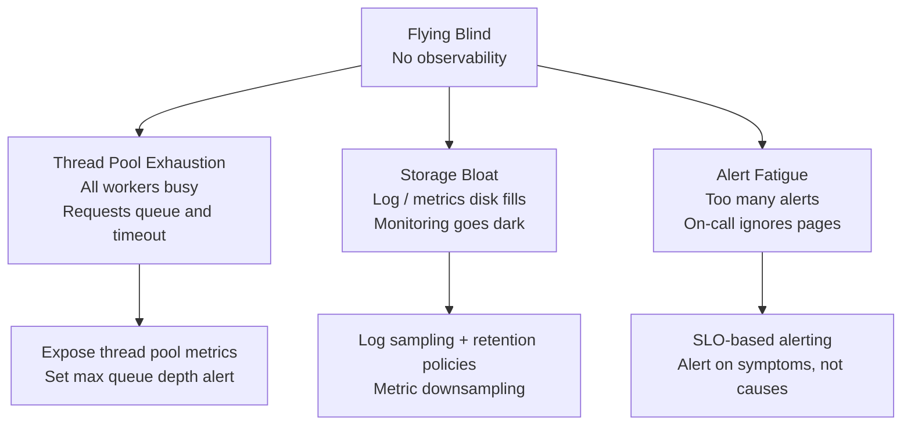

# Observability Failure Modes

Thread pool exhaustion, storage bloat — what happens when you can't see inside your system.

```mermaid
graph TD
    BLIND[Flying Blind\nNo observability]
    BLIND --> F1[Thread Pool Exhaustion\nAll workers busy\nRequests queue and timeout]
    BLIND --> F2[Storage Bloat\nLog / metrics disk fills\nMonitoring goes dark]
    BLIND --> F3[Alert Fatigue\nToo many alerts\nOn-call ignores pages]
    F1 --> FIX1[Expose thread pool metrics\nSet max queue depth alert]
    F2 --> FIX2[Log sampling + retention policies\nMetric downsampling]
    F3 --> FIX3[SLO-based alerting\nAlert on symptoms, not causes]
```
