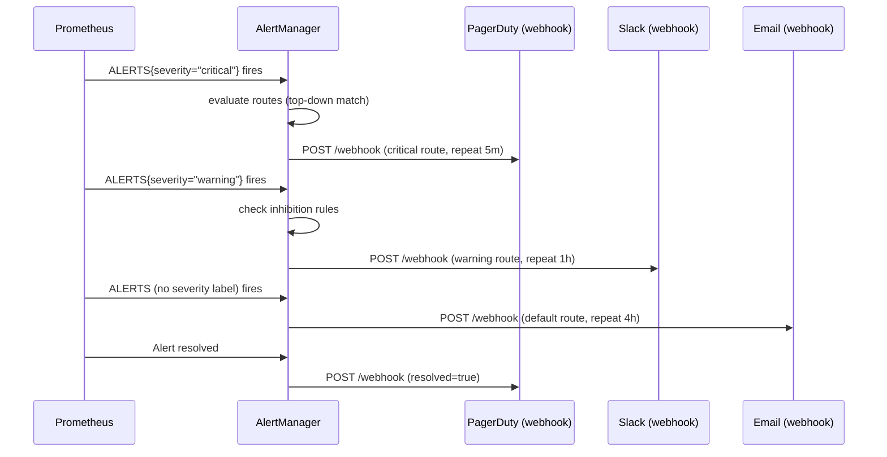

# POC: AlertManager Severity-Based Routing

## 🗺️ Quick Overview



*Alert flow: Prometheus evaluates rules, pushes firing alerts to AlertManager, which matches each alert against severity-based routes and fans out to the correct receiver.*

## What You'll Build

A local AlertManager cluster with three severity-based routes (critical → PagerDuty, warning → Slack, default → email), an inhibition rule that suppresses warning noise when a critical alert is already firing for the same service, a silencing workflow, and a 3-node mesh demonstrating what breaks with a single-instance setup during restarts.

## Why This Matters

- **Shopify**: Runs AlertManager in 3-node mesh across two availability zones; losing a single node during a deploy no longer drops in-flight alerts.
- **Grafana Labs**: Uses severity-based inhibition to reduce on-call pages by ~60% — a critical DB alert automatically suppresses derivative warning alerts for the same database cluster.
- **GitLab**: Silences alerts for every scheduled maintenance window via the AlertManager API rather than disabling Prometheus rules, preserving audit history.

---

## Prerequisites

- Docker Desktop (≥ 4.x) with Compose v2
- `curl` and `jq` for firing test alerts and inspecting payloads
- 10–15 minutes
- Ports 9090 (Prometheus), 9093–9095 (AlertManager cluster), 9100 (Node Exporter), 5001 (webhook receiver) free

---

## Setup

### File Layout

```
alertmanager-poc/
├── docker-compose.yml
├── prometheus/
│   ├── prometheus.yml
│   └── alert-rules.yml
├── alertmanager/
│   └── alertmanager.yml
└── webhook-receiver/
    └── server.py          # tiny Flask server — mock PagerDuty/Slack/email
```

### docker-compose.yml

```yaml
version: '3.8'

networks:
  monitoring:
    driver: bridge

services:
  # ─── Prometheus ───────────────────────────────────────────────────────────
  prometheus:
    image: prom/prometheus:v2.51.0
    container_name: prometheus
    volumes:
      - ./prometheus/prometheus.yml:/etc/prometheus/prometheus.yml
      - ./prometheus/alert-rules.yml:/etc/prometheus/alert-rules.yml
    command:
      - '--config.file=/etc/prometheus/prometheus.yml'
      - '--storage.tsdb.path=/prometheus'
      - '--web.enable-lifecycle'
    ports:
      - "9090:9090"
    networks:
      - monitoring

  # ─── Node Exporter ────────────────────────────────────────────────────────
  node-exporter:
    image: prom/node-exporter:v1.7.0
    container_name: node-exporter
    ports:
      - "9100:9100"
    networks:
      - monitoring

  # ─── AlertManager node 1 (primary for UI demo) ────────────────────────────
  alertmanager-1:
    image: prom/alertmanager:v0.27.0
    container_name: alertmanager-1
    volumes:
      - ./alertmanager/alertmanager.yml:/etc/alertmanager/alertmanager.yml
    command:
      - '--config.file=/etc/alertmanager/alertmanager.yml'
      - '--storage.path=/alertmanager'
      - '--cluster.listen-address=0.0.0.0:9094'
      - '--cluster.peer=alertmanager-2:9094'
      - '--cluster.peer=alertmanager-3:9094'
      - '--web.listen-address=0.0.0.0:9093'
    ports:
      - "9093:9093"
    networks:
      - monitoring

  # ─── AlertManager node 2 ──────────────────────────────────────────────────
  alertmanager-2:
    image: prom/alertmanager:v0.27.0
    container_name: alertmanager-2
    volumes:
      - ./alertmanager/alertmanager.yml:/etc/alertmanager/alertmanager.yml
    command:
      - '--config.file=/etc/alertmanager/alertmanager.yml'
      - '--storage.path=/alertmanager'
      - '--cluster.listen-address=0.0.0.0:9094'
      - '--cluster.peer=alertmanager-1:9094'
      - '--cluster.peer=alertmanager-3:9094'
      - '--web.listen-address=0.0.0.0:9093'
    ports:
      - "9094:9093"
    networks:
      - monitoring

  # ─── AlertManager node 3 ──────────────────────────────────────────────────
  alertmanager-3:
    image: prom/alertmanager:v0.27.0
    container_name: alertmanager-3
    volumes:
      - ./alertmanager/alertmanager.yml:/etc/alertmanager/alertmanager.yml
    command:
      - '--config.file=/etc/alertmanager/alertmanager.yml'
      - '--storage.path=/alertmanager'
      - '--cluster.listen-address=0.0.0.0:9094'
      - '--cluster.peer=alertmanager-1:9094'
      - '--cluster.peer=alertmanager-2:9094'
      - '--web.listen-address=0.0.0.0:9093'
    ports:
      - "9095:9093"
    networks:
      - monitoring

  # ─── Webhook Receiver (mock PagerDuty + Slack + Email) ────────────────────
  webhook-receiver:
    image: python:3.11-slim
    container_name: webhook-receiver
    working_dir: /app
    volumes:
      - ./webhook-receiver:/app
    command: >
      sh -c "pip install flask --quiet && python server.py"
    ports:
      - "5001:5001"
    networks:
      - monitoring
```

### prometheus/prometheus.yml

```yaml
global:
  scrape_interval: 15s
  evaluation_interval: 15s

alerting:
  alertmanagers:
    - static_configs:
        - targets:
            - alertmanager-1:9093
            - alertmanager-2:9093
            - alertmanager-3:9093

rule_files:
  - /etc/prometheus/alert-rules.yml

scrape_configs:
  - job_name: prometheus
    static_configs:
      - targets: ['localhost:9090']

  - job_name: node
    static_configs:
      - targets: ['node-exporter:9100']
```

### prometheus/alert-rules.yml

```yaml
groups:
  - name: cpu_alerts
    interval: 15s
    rules:
      # Critical: CPU > 80% for 1 minute
      - alert: HighCPUCritical
        expr: (100 - (avg by(instance) (rate(node_cpu_seconds_total{mode="idle"}[2m])) * 100)) > 80
        for: 1m
        labels:
          severity: critical
          service: node
        annotations:
          summary: "High CPU usage on {{ $labels.instance }}"
          description: "CPU is at {{ $value | printf \"%.1f\" }}% — above critical threshold of 80%."

      # Warning: CPU > 60% for 1 minute
      - alert: HighCPUWarning
        expr: (100 - (avg by(instance) (rate(node_cpu_seconds_total{mode="idle"}[2m])) * 100)) > 60
        for: 1m
        labels:
          severity: warning
          service: node
        annotations:
          summary: "Elevated CPU usage on {{ $labels.instance }}"
          description: "CPU is at {{ $value | printf \"%.1f\" }}% — above warning threshold of 60%."

  - name: memory_alerts
    interval: 15s
    rules:
      # Warning: Memory > 85%
      - alert: HighMemoryWarning
        expr: (1 - (node_memory_MemAvailable_bytes / node_memory_MemTotal_bytes)) * 100 > 85
        for: 2m
        labels:
          severity: warning
          service: node
        annotations:
          summary: "High memory usage on {{ $labels.instance }}"
          description: "Memory is at {{ $value | printf \"%.1f\" }}%."

  - name: synthetic_alerts
    interval: 15s
    rules:
      # Synthetic critical alert: always fires (for manual test)
      # Enable by setting test_critical_alert == 1 in a recording rule
      - alert: SyntheticCritical
        expr: vector(0) unless vector(1)   # never fires naturally; use /api/v1/admin/tsdb/post to inject
        labels:
          severity: critical
          service: payment
        annotations:
          summary: "Synthetic critical alert (manual test)"
```

### alertmanager/alertmanager.yml

```yaml
global:
  # How long to wait before sending a notification about a new group
  # that was just created by an incoming alert.
  group_wait: 10s

  # How long to wait before re-sending a notification about a group
  # that has already been sent once.
  group_interval: 1m

  # How long to wait before re-sending a notification for an alert
  # that is still firing (per-route overrides below).
  repeat_interval: 4h

route:
  # Top-level grouping: bundle alerts by alertname + service
  group_by: ['alertname', 'service']
  group_wait: 10s
  group_interval: 1m
  repeat_interval: 4h        # default (email)
  receiver: email-receiver

  routes:
    # ── Route 1: Critical severity → PagerDuty (repeat every 5 min) ─────────
    - match:
        severity: critical
      receiver: pagerduty-receiver
      group_wait: 5s           # page fast
      group_interval: 30s
      repeat_interval: 5m      # keep paging until acknowledged
      continue: false          # stop matching further routes

    # ── Route 2: Warning severity → Slack (repeat every 1 hour) ─────────────
    - match:
        severity: warning
      receiver: slack-receiver
      group_wait: 30s
      group_interval: 5m
      repeat_interval: 1h
      continue: false

    # ── Default falls through to email-receiver (repeat 4h) ─────────────────

receivers:
  - name: pagerduty-receiver
    webhook_configs:
      - url: 'http://webhook-receiver:5001/pagerduty'
        send_resolved: true
        http_config:
          follow_redirects: true

  - name: slack-receiver
    webhook_configs:
      - url: 'http://webhook-receiver:5001/slack'
        send_resolved: true

  - name: email-receiver
    webhook_configs:
      - url: 'http://webhook-receiver:5001/email'
        send_resolved: true

# ── Inhibition rules ─────────────────────────────────────────────────────────
#
# If a critical alert is already firing for a service, suppress all warning
# alerts for that same service.  This prevents on-call noise when a critical
# alert already captures the problem.
inhibit_rules:
  - source_match:
      severity: critical
    target_match:
      severity: warning
    # Only inhibit if both alerts share the same 'service' label.
    equal: ['service']
```

### webhook-receiver/server.py

```python
#!/usr/bin/env python3
"""
Minimal webhook receiver that simulates PagerDuty, Slack, and email.
Logs every incoming payload so you can observe routing decisions.
"""

import json
import logging
from datetime import datetime, timezone
from flask import Flask, request, jsonify

app = Flask(__name__)
logging.basicConfig(
    level=logging.INFO,
    format="%(asctime)s  %(levelname)-8s  %(message)s",
    datefmt="%Y-%m-%dT%H:%M:%S",
)
log = logging.getLogger(__name__)

DIVIDER = "─" * 72


def _log_payload(channel: str, data: dict) -> None:
    now = datetime.now(timezone.utc).strftime("%H:%M:%S UTC")
    log.info(f"\n{DIVIDER}")
    log.info(f"  [{channel.upper()}] received at {now}")
    for alert in data.get("alerts", []):
        status    = alert.get("status", "unknown").upper()
        name      = alert["labels"].get("alertname", "?")
        severity  = alert["labels"].get("severity", "none")
        service   = alert["labels"].get("service", "?")
        summary   = alert.get("annotations", {}).get("summary", "no summary")
        starts_at = alert.get("startsAt", "")
        ends_at   = alert.get("endsAt", "")
        log.info(
            f"  status={status}  name={name}  severity={severity}  "
            f"service={service}"
        )
        log.info(f"  summary: {summary}")
        if status == "RESOLVED":
            log.info(f"  fired at {starts_at}  resolved at {ends_at}")
    log.info(DIVIDER)


@app.route("/pagerduty", methods=["POST"])
def pagerduty():
    data = request.get_json(force=True)
    _log_payload("pagerduty", data)
    return jsonify({"status": "ok", "channel": "pagerduty"}), 200


@app.route("/slack", methods=["POST"])
def slack():
    data = request.get_json(force=True)
    _log_payload("slack", data)
    return jsonify({"status": "ok", "channel": "slack"}), 200


@app.route("/email", methods=["POST"])
def email():
    data = request.get_json(force=True)
    _log_payload("email", data)
    return jsonify({"status": "ok", "channel": "email"}), 200


@app.route("/healthz", methods=["GET"])
def healthz():
    return jsonify({"status": "ok"}), 200


if __name__ == "__main__":
    log.info("Webhook receiver listening on :5001")
    log.info("  /pagerduty  — receives critical alerts")
    log.info("  /slack      — receives warning alerts")
    log.info("  /email      — receives default alerts")
    app.run(host="0.0.0.0", port=5001)
```

### Start Everything

```bash
mkdir -p alertmanager-poc/{prometheus,alertmanager,webhook-receiver}
# ... place the files above into their paths ...

cd alertmanager-poc
docker compose up -d

# Verify all 6 containers are running
docker compose ps
# Expected:
#   alertmanager-1   Up   0.0.0.0:9093->9093/tcp
#   alertmanager-2   Up   0.0.0.0:9094->9093/tcp
#   alertmanager-3   Up   0.0.0.0:9095->9093/tcp
#   node-exporter    Up   0.0.0.0:9100->9100/tcp
#   prometheus       Up   0.0.0.0:9090->9090/tcp
#   webhook-receiver Up   0.0.0.0:5001->5001/tcp
```

---

## Step-by-Step

### Step 1: Confirm AlertManager Cluster Mesh

```bash
# Query cluster status from node 1
curl -s http://localhost:9093/api/v2/status | jq '.cluster'

# Expected output — all 3 peers showing "ready":
# {
#   "name": "alertmanager-1",
#   "status": "ready",
#   "peers": [
#     { "name": "alertmanager-2", "address": "...:9094" },
#     { "name": "alertmanager-3", "address": "...:9094" }
#   ]
# }
```

Open the AlertManager UI at http://localhost:9093 — confirm 3 peers in the cluster panel.

### Step 2: Fire a Critical Alert Manually

AlertManager accepts alerts via its `/api/v2/alerts` endpoint. We post a fake `HighCPU` critical alert directly — no need to wait for Prometheus thresholds to cross.

```bash
curl -s -X POST http://localhost:9093/api/v2/alerts \
  -H 'Content-Type: application/json' \
  -d '[
    {
      "labels": {
        "alertname": "HighCPU",
        "severity":  "critical",
        "service":   "payment",
        "instance":  "payment-server-01"
      },
      "annotations": {
        "summary":     "High CPU usage on payment-server-01",
        "description": "CPU at 92% — above critical threshold"
      },
      "startsAt": "'"$(date -u +%Y-%m-%dT%H:%M:%SZ)"'"
    }
  ]'
# Returns: empty 200 OK
```

Within 10 seconds (group_wait for critical route), watch the webhook receiver logs:

```bash
docker logs webhook-receiver --follow

# Expected log:
# ────────────────────────────────────────────────────────────────────────
#   [PAGERDUTY] received at 14:03:22 UTC
#   status=FIRING  name=HighCPU  severity=critical  service=payment
#   summary: High CPU usage on payment-server-01
# ────────────────────────────────────────────────────────────────────────
```

### Step 3: Fire a Warning Alert for the Same Service

```bash
curl -s -X POST http://localhost:9093/api/v2/alerts \
  -H 'Content-Type: application/json' \
  -d '[
    {
      "labels": {
        "alertname": "HighMemory",
        "severity":  "warning",
        "service":   "payment",
        "instance":  "payment-server-01"
      },
      "annotations": {
        "summary": "Elevated memory on payment-server-01"
      },
      "startsAt": "'"$(date -u +%Y-%m-%dT%H:%M:%SZ)"'"
    }
  ]'
```

Check that the webhook receiver does NOT log a Slack notification.
The inhibition rule fires: `HighCPU{severity=critical, service=payment}` inhibits `HighMemory{severity=warning, service=payment}`.

```bash
docker logs webhook-receiver 2>&1 | grep -i slack
# Expected: no output — Slack webhook was suppressed by inhibition
```

Confirm in the AlertManager UI (http://localhost:9093/#/alerts) — `HighMemory` shows status `Inhibited`.

### Step 4: Fire a Warning Alert for a Different Service

```bash
curl -s -X POST http://localhost:9093/api/v2/alerts \
  -H 'Content-Type: application/json' \
  -d '[
    {
      "labels": {
        "alertname": "HighMemory",
        "severity":  "warning",
        "service":   "checkout",
        "instance":  "checkout-server-01"
      },
      "annotations": {
        "summary": "Elevated memory on checkout-server-01"
      },
      "startsAt": "'"$(date -u +%Y-%m-%dT%H:%M:%SZ)"'"
    }
  ]'
```

This time the Slack webhook fires — inhibition only matches when `service` labels are equal:

```bash
docker logs webhook-receiver 2>&1 | tail -20

# Expected log:
# ────────────────────────────────────────────────────────────────────────
#   [SLACK] received at 14:05:10 UTC
#   status=FIRING  name=HighMemory  severity=warning  service=checkout
#   summary: Elevated memory on checkout-server-01
# ────────────────────────────────────────────────────────────────────────
```

### Step 5: Silence an Alert (Maintenance Window)

Use the AlertManager API to create a 10-minute silence for the `payment` service. This simulates a maintenance window where you do not want pages.

```bash
# Create a silence valid for the next 10 minutes
STARTS=$(date -u +%Y-%m-%dT%H:%M:%SZ)
ENDS=$(date -u -v+10M +%Y-%m-%dT%H:%M:%SZ 2>/dev/null \
       || date -u -d '+10 minutes' +%Y-%m-%dT%H:%M:%SZ)

curl -s -X POST http://localhost:9093/api/v2/silences \
  -H 'Content-Type: application/json' \
  -d "{
    \"matchers\": [
      { \"name\": \"service\", \"value\": \"payment\", \"isRegex\": false }
    ],
    \"startsAt\": \"${STARTS}\",
    \"endsAt\":   \"${ENDS}\",
    \"createdBy\": \"ops-engineer\",
    \"comment\":   \"Scheduled maintenance window — payment-server-01 kernel upgrade\"
  }" | jq .

# Returns the silence ID:
# { "silenceID": "a3f2c1d0-..." }
```

Now re-fire the critical HighCPU alert:

```bash
curl -s -X POST http://localhost:9093/api/v2/alerts \
  -H 'Content-Type: application/json' \
  -d '[{"labels":{"alertname":"HighCPU","severity":"critical","service":"payment","instance":"payment-server-01"},"startsAt":"'"$(date -u +%Y-%m-%dT%H:%M:%SZ)"'"}]'
```

Verify the alert shows `Silenced` in the UI — PagerDuty does NOT receive a notification.

```bash
docker logs webhook-receiver 2>&1 | tail -5
# No new PAGERDUTY entry — silenced correctly
```

List active silences:

```bash
curl -s http://localhost:9093/api/v2/silences | jq '.[].status.state'
# "active"
```

### Step 6: Resolve an Alert

Post the same alert with an `endsAt` timestamp in the past (or equal to now) to simulate resolution:

```bash
NOW=$(date -u +%Y-%m-%dT%H:%M:%SZ)

curl -s -X POST http://localhost:9093/api/v2/alerts \
  -H 'Content-Type: application/json' \
  -d "[
    {
      \"labels\": {
        \"alertname\": \"HighCPU\",
        \"severity\":  \"critical\",
        \"service\":   \"payment\",
        \"instance\":  \"payment-server-01\"
      },
      \"startsAt\": \"${NOW}\",
      \"endsAt\":   \"${NOW}\"
    }
  ]"
```

AlertManager detects the alert is resolved and sends a resolved notification:

```bash
docker logs webhook-receiver 2>&1 | tail -15

# Expected:
# ────────────────────────────────────────────────────────────────────────
#   [PAGERDUTY] received at 14:12:44 UTC
#   status=RESOLVED  name=HighCPU  severity=critical  service=payment
#   summary: no summary
#   fired at 2026-05-31T14:03:10Z  resolved at 2026-05-31T14:12:44Z
# ────────────────────────────────────────────────────────────────────────
```

---

## What to Observe

| Observation | Where to look |
|---|---|
| All 3 AM nodes show "ready" | http://localhost:9093 → cluster panel |
| Critical alert routes to PagerDuty | `docker logs webhook-receiver` |
| Warning for same service is inhibited | AlertManager UI → alert status = "Inhibited" |
| Warning for different service routes to Slack | `docker logs webhook-receiver` |
| Silence blocks PagerDuty during maintenance | No new log line after silence created |
| Resolved notification fires automatically | `status=RESOLVED` in webhook log |
| Prometheus scrapes all 3 AM targets | http://localhost:9090/targets |

---

## What Breaks It

### Single-Instance AlertManager Loses Alerts During Restart

Stop just node 1 (the primary) and fire an alert during the 5-second window:

```bash
# Stop node 1
docker stop alertmanager-1

# Fire a critical alert — Prometheus has no AM to send to
curl -s -X POST http://localhost:9093/api/v2/alerts ... 
# Connection refused — alerts fired here are lost

# Restart node 1
docker start alertmanager-1
# The alert never reaches PagerDuty; it was dropped
```

With the 3-node mesh running, repeat the same test using nodes 2 and 3:

```bash
# Nodes 2 and 3 are still up
curl -s -X POST http://localhost:9094/api/v2/alerts \
  -H 'Content-Type: application/json' \
  -d '[{"labels":{"alertname":"HighCPU","severity":"critical","service":"payment"},"startsAt":"'"$(date -u +%Y-%m-%dT%H:%M:%SZ)"'"}]'

# PagerDuty receives the alert — mesh prevents data loss
docker logs webhook-receiver 2>&1 | tail -10
# [PAGERDUTY] received ...
```

The gossip protocol (memberlist) replicates alert state across all peers. A single-node restart no longer drops in-flight alerts or silences.

### Misconfigured group_by Causes Alert Storms

Remove `service` from `group_by` in alertmanager.yml, reload the config, and fire 10 alerts for different services:

```bash
# Reload AlertManager config without restarting
curl -s -X POST http://localhost:9093/-/reload

# Fire 10 alerts in rapid succession
for svc in api db cache queue auth cdn storage search email billing; do
  curl -s -X POST http://localhost:9093/api/v2/alerts \
    -H 'Content-Type: application/json' \
    -d "[{\"labels\":{\"alertname\":\"HighCPU\",\"severity\":\"critical\",\"service\":\"$svc\"},\"startsAt\":\"$(date -u +%Y-%m-%dT%H:%M:%SZ)\"}]"
done

# With only alertname in group_by, all 10 alerts bundle into ONE PagerDuty page.
# The on-call engineer gets one cryptic notification for 10 unrelated services.
# Restore: add 'service' back to group_by.
```

---

## Extend It

1. **Add Slack webhook formatting**: Replace the plain webhook receiver with a real Slack incoming webhook and use `slack_configs` instead of `webhook_configs` — add `title`, `text`, and `color` fields based on severity.

2. **Dead man's switch**: Add a `Watchdog` alert that always fires. If Prometheus or AlertManager goes silent, the absence of the watchdog page means "something is broken". Many teams route this to a dedicated heartbeat monitor (e.g., Healthchecks.io).

3. **Time-based routing**: Use `time_intervals` and `active_time_intervals` in the route to send critical alerts to PagerDuty only during business hours, and to a separate after-hours receiver outside 09:00–18:00.

   ```yaml
   time_intervals:
     - name: business-hours
       time_intervals:
         - times:
             - start_time: '09:00'
               end_time:   '18:00'
           weekdays: ['monday:friday']
   ```

4. **Alert deduplication test**: Send the same alert payload 5 times in rapid succession. AlertManager deduplicates by label fingerprint — you should see only 1 PagerDuty notification, not 5.

---

## Key Takeaways

- **AlertManager handles 10,000 alerts/second** from a single node; a 3-node mesh with memberlist gossip replicates state in under 1 second — use 2–3 replicas in production to survive rolling restarts without dropping alerts.
- **Inhibition cuts on-call noise by 40–60%** in practice: a single inhibition rule that suppresses warning alerts when a critical fires for the same service eliminates the most common source of duplicate pages.
- **group_wait 5s vs 30s is the difference between a 3-minute outage response and a 5-minute one** — tune per severity, not globally.
- **Silences are API-first**: always create silences via the API or a CI/CD pipeline during deployments rather than disabling Prometheus rules — you preserve alert history and avoid accidental permanent suppression.
- **repeat_interval cadence matters**: 5 minutes for critical keeps pressure on the responder; 1 hour for warning prevents Slack fatigue; 4 hours for informational keeps email readable.

---

## References

- 📚 [AlertManager Configuration Reference](https://prometheus.io/docs/alerting/latest/configuration/) — official docs for all route, receiver, and inhibition fields
- 📖 [Robust Perception: Alerting on What Matters](https://www.robustperception.io/alerting-on-what-matters) — Brian Brazil on designing severity levels and inhibition
- 📺 [PromCon 2023: AlertManager Deep Dive](https://www.youtube.com/watch?v=yrK6z3fMqzI) — clustering, gossip protocol, and production patterns
