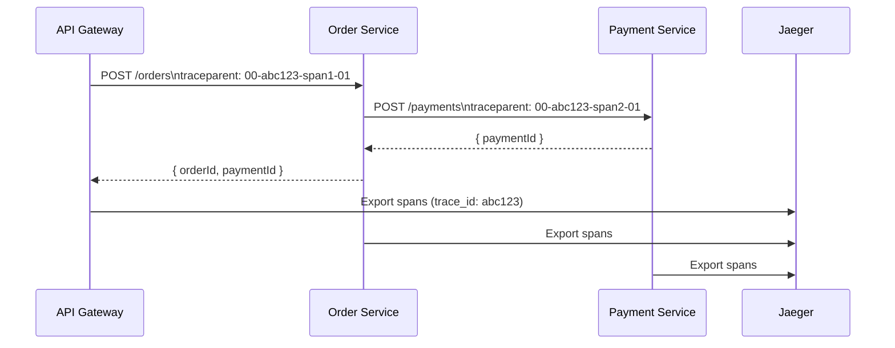

# POC #79: Distributed Tracing Setup

## 🗺️ Quick Overview



*Every service propagates the same `trace_id` via the W3C `traceparent` header, so Jaeger can stitch all spans into one flame graph showing exactly where the 450ms went.*

> **Difficulty:** 🟡 Intermediate
> **Time:** 30 minutes
> **Prerequisites:** Docker, Node.js, Microservices concepts

## What You'll Learn

Distributed tracing follows a request across multiple services, showing latency breakdown and error propagation.

```
DISTRIBUTED TRACE:
┌─────────────────────────────────────────────────────────────────┐
│  Trace ID: abc123                                               │
│  Total Duration: 450ms                                          │
├─────────────────────────────────────────────────────────────────┤
│                                                                 │
│  API Gateway        ████████████████████████████████ 450ms     │
│    │                                                            │
│    └─▶ Auth Service   ████ 50ms                                │
│    │                                                            │
│    └─▶ Order Service    ████████████████████ 300ms             │
│          │                                                      │
│          └─▶ Inventory    ████ 80ms                            │
│          │                                                      │
│          └─▶ Payment        ████████ 150ms                     │
│                │                                                │
│                └─▶ Stripe API  ████ 100ms                      │
│                                                                 │
└─────────────────────────────────────────────────────────────────┘
```

---

## Docker Compose Setup

```yaml
# docker-compose.yml
version: '3.8'
services:
  jaeger:
    image: jaegertracing/all-in-one:latest
    ports:
      - "16686:16686"  # UI
      - "6831:6831/udp"  # Thrift
      - "4318:4318"  # OTLP HTTP
    environment:
      - COLLECTOR_OTLP_ENABLED=true

  api-gateway:
    build: ./services/gateway
    ports:
      - "3000:3000"
    environment:
      - JAEGER_ENDPOINT=http://jaeger:4318/v1/traces
      - ORDER_SERVICE=http://order-service:3001
    depends_on:
      - jaeger

  order-service:
    build: ./services/order
    ports:
      - "3001:3001"
    environment:
      - JAEGER_ENDPOINT=http://jaeger:4318/v1/traces
      - PAYMENT_SERVICE=http://payment-service:3002
    depends_on:
      - jaeger

  payment-service:
    build: ./services/payment
    ports:
      - "3002:3002"
    environment:
      - JAEGER_ENDPOINT=http://jaeger:4318/v1/traces
    depends_on:
      - jaeger
```

---

## Implementation

```javascript
// tracing.js - Shared tracing setup
const { NodeTracerProvider } = require('@opentelemetry/sdk-trace-node');
const { SimpleSpanProcessor } = require('@opentelemetry/sdk-trace-base');
const { OTLPTraceExporter } = require('@opentelemetry/exporter-trace-otlp-http');
const { Resource } = require('@opentelemetry/resources');
const { SemanticResourceAttributes } = require('@opentelemetry/semantic-conventions');
const { trace, context, SpanStatusCode } = require('@opentelemetry/api');
const { W3CTraceContextPropagator } = require('@opentelemetry/core');

function initTracing(serviceName) {
  const provider = new NodeTracerProvider({
    resource: new Resource({
      [SemanticResourceAttributes.SERVICE_NAME]: serviceName
    })
  });

  const exporter = new OTLPTraceExporter({
    url: process.env.JAEGER_ENDPOINT || 'http://localhost:4318/v1/traces'
  });

  provider.addSpanProcessor(new SimpleSpanProcessor(exporter));
  provider.register({
    propagator: new W3CTraceContextPropagator()
  });

  return trace.getTracer(serviceName);
}

// Middleware to extract trace context from incoming requests
function tracingMiddleware(tracer, serviceName) {
  return (req, res, next) => {
    const parentContext = trace.setSpan(
      context.active(),
      trace.getSpan(context.active())
    );

    const span = tracer.startSpan(`${req.method} ${req.path}`, {
      attributes: {
        'http.method': req.method,
        'http.url': req.url,
        'http.route': req.path
      }
    }, parentContext);

    // Store span in request for child spans
    req.span = span;
    req.tracer = tracer;

    res.on('finish', () => {
      span.setAttribute('http.status_code', res.statusCode);
      if (res.statusCode >= 400) {
        span.setStatus({ code: SpanStatusCode.ERROR });
      }
      span.end();
    });

    context.with(trace.setSpan(context.active(), span), () => {
      next();
    });
  };
}

// Helper to propagate trace context to outgoing requests
function createTracedFetch(tracer) {
  return async (url, options = {}) => {
    const span = tracer.startSpan(`HTTP ${options.method || 'GET'} ${new URL(url).pathname}`);

    try {
      // Inject trace context into headers
      const headers = { ...options.headers };
      const carrier = {};
      trace.setSpan(context.active(), span);

      // Add traceparent header
      headers['traceparent'] = `00-${span.spanContext().traceId}-${span.spanContext().spanId}-01`;

      const response = await fetch(url, { ...options, headers });

      span.setAttribute('http.status_code', response.status);
      if (!response.ok) {
        span.setStatus({ code: SpanStatusCode.ERROR });
      }

      return response;
    } catch (error) {
      span.setStatus({ code: SpanStatusCode.ERROR, message: error.message });
      throw error;
    } finally {
      span.end();
    }
  };
}

module.exports = { initTracing, tracingMiddleware, createTracedFetch };
```

```javascript
// gateway.js - API Gateway Service
const express = require('express');
const { initTracing, tracingMiddleware, createTracedFetch } = require('./tracing');

const tracer = initTracing('api-gateway');
const tracedFetch = createTracedFetch(tracer);
const app = express();

app.use(express.json());
app.use(tracingMiddleware(tracer, 'api-gateway'));

app.post('/api/orders', async (req, res) => {
  const span = req.span;

  try {
    span.addEvent('Processing order request');

    // Call order service
    const response = await tracedFetch(
      `${process.env.ORDER_SERVICE}/orders`,
      {
        method: 'POST',
        headers: { 'Content-Type': 'application/json' },
        body: JSON.stringify(req.body)
      }
    );

    const result = await response.json();
    span.addEvent('Order created', { orderId: result.orderId });

    res.json(result);
  } catch (error) {
    span.recordException(error);
    res.status(500).json({ error: error.message });
  }
});

app.listen(3000, () => console.log('Gateway on :3000'));
```

```javascript
// order-service.js
const express = require('express');
const { initTracing, tracingMiddleware, createTracedFetch } = require('./tracing');

const tracer = initTracing('order-service');
const tracedFetch = createTracedFetch(tracer);
const app = express();

app.use(express.json());
app.use(tracingMiddleware(tracer, 'order-service'));

app.post('/orders', async (req, res) => {
  const span = req.span;

  try {
    // Simulate order processing
    span.addEvent('Validating order');
    await new Promise(r => setTimeout(r, 50));

    // Call payment service
    span.addEvent('Initiating payment');
    const paymentResponse = await tracedFetch(
      `${process.env.PAYMENT_SERVICE}/payments`,
      {
        method: 'POST',
        headers: { 'Content-Type': 'application/json' },
        body: JSON.stringify({ amount: req.body.total })
      }
    );

    const payment = await paymentResponse.json();
    span.addEvent('Payment completed', { paymentId: payment.paymentId });

    // Create order
    const order = {
      orderId: 'ord_' + Date.now(),
      status: 'completed',
      paymentId: payment.paymentId
    };

    res.json(order);
  } catch (error) {
    span.recordException(error);
    res.status(500).json({ error: error.message });
  }
});

app.listen(3001, () => console.log('Order Service on :3001'));
```

```javascript
// payment-service.js
const express = require('express');
const { initTracing, tracingMiddleware } = require('./tracing');

const tracer = initTracing('payment-service');
const app = express();

app.use(express.json());
app.use(tracingMiddleware(tracer, 'payment-service'));

app.post('/payments', async (req, res) => {
  const span = req.span;

  try {
    span.addEvent('Processing payment', { amount: req.body.amount });

    // Simulate payment processing
    await new Promise(r => setTimeout(r, 100));

    // Simulate external API call
    const externalSpan = tracer.startSpan('stripe-api-call');
    await new Promise(r => setTimeout(r, 80));
    externalSpan.end();

    const payment = {
      paymentId: 'pay_' + Date.now(),
      status: 'succeeded',
      amount: req.body.amount
    };

    span.addEvent('Payment succeeded');
    res.json(payment);
  } catch (error) {
    span.recordException(error);
    res.status(500).json({ error: error.message });
  }
});

app.listen(3002, () => console.log('Payment Service on :3002'));
```

---

## Run and Test

```bash
# Start services
docker-compose up -d

# Wait for services
sleep 5

# Make a test request
curl -X POST http://localhost:3000/api/orders \
  -H "Content-Type: application/json" \
  -d '{"items": ["item1"], "total": 99.99}'

# View traces in Jaeger UI
open http://localhost:16686
```

---

## What You'll See in Jaeger

```
Service: api-gateway
Operation: POST /api/orders

Trace Timeline:
├── api-gateway: POST /api/orders (450ms)
│   ├── HTTP POST /orders (350ms)
│   │   └── order-service: POST /orders (300ms)
│   │       ├── Event: Validating order
│   │       ├── HTTP POST /payments (200ms)
│   │       │   └── payment-service: POST /payments (180ms)
│   │       │       ├── Event: Processing payment
│   │       │       ├── stripe-api-call (80ms)
│   │       │       └── Event: Payment succeeded
│   │       └── Event: Payment completed
│   └── Event: Order created
```

---

## Key Concepts

| Concept | Description |
|---------|-------------|
| **Trace** | End-to-end journey of a request |
| **Span** | Single operation within a trace |
| **Context Propagation** | Passing trace ID between services |
| **Events** | Annotations within a span |
| **Tags** | Key-value metadata on spans |

---

## Related POCs

- [Observability & SLOs](/system-design/monitoring/observability-slos)
- [Microservices Communication](/system-design/patterns/microservices-communication)
