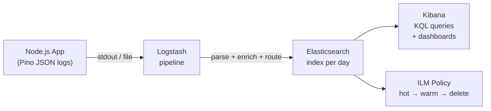

# ELK Stack POC: Ship Node.js Logs to Elasticsearch + Kibana

## 🗺️ Quick Overview



*Pino writes ECS-compatible JSON to stdout; Logstash parses and enriches it; Elasticsearch indexes it for sub-second full-text search; Kibana lets you build dashboards and set retention policies.*

This POC builds a complete log aggregation pipeline from scratch:
- Elasticsearch + Logstash + Kibana via Docker Compose
- A Node.js sample app logging with Pino in ECS-compatible JSON
- Logstash pipeline to parse, enrich, and route logs
- Kibana index pattern, KQL queries, and a live dashboard
- Index Lifecycle Management (ILM) for cost-controlled retention

By the end, you can query `user_id: "usr_12345" and level: "error"` across your entire application log history in under a second.

---

## Prerequisites

```bash
docker --version    # >= 20.10
docker compose version  # >= 2.0
node --version      # >= 18
```

Set Docker resource limits: ELK needs at least 4GB RAM. In Docker Desktop: Settings → Resources → Memory → 4GB minimum.

---

## Project Structure

```
elk-poc/
├── docker-compose.yml
├── logstash/
│   ├── pipeline/
│   │   └── main.conf
│   └── config/
│       └── logstash.yml
├── app/
│   ├── package.json
│   ├── logger.js
│   ├── server.js
│   └── simulate-traffic.js
└── kibana/
    └── dashboards/
        └── app-overview.ndjson
```

---

## Step 1: Docker Compose

```yaml
# docker-compose.yml
version: '3.8'

services:
  elasticsearch:
    image: docker.elastic.co/elasticsearch/elasticsearch:8.12.0
    container_name: elasticsearch
    environment:
      - discovery.type=single-node
      - xpack.security.enabled=false       # Disabled for dev — enable in production
      - xpack.security.http.ssl.enabled=false
      - ES_JAVA_OPTS=-Xms1g -Xmx1g        # 1GB heap — adjust for your machine
      - bootstrap.memory_lock=true
    ulimits:
      memlock:
        soft: -1
        hard: -1
    volumes:
      - es_data:/usr/share/elasticsearch/data
    ports:
      - "9200:9200"
    healthcheck:
      test: ["CMD", "curl", "-f", "http://localhost:9200/_cluster/health"]
      interval: 10s
      timeout: 5s
      retries: 10
    networks:
      - elk

  logstash:
    image: docker.elastic.co/logstash/logstash:8.12.0
    container_name: logstash
    volumes:
      - ./logstash/pipeline:/usr/share/logstash/pipeline
      - ./logstash/config/logstash.yml:/usr/share/logstash/config/logstash.yml
    ports:
      - "5044:5044"   # Beats input (Filebeat)
      - "5000:5000"   # TCP input (direct from app)
    environment:
      - LS_JAVA_OPTS=-Xmx512m -Xms512m
    depends_on:
      elasticsearch:
        condition: service_healthy
    networks:
      - elk

  kibana:
    image: docker.elastic.co/kibana/kibana:8.12.0
    container_name: kibana
    ports:
      - "5601:5601"
    environment:
      - ELASTICSEARCH_HOSTS=http://elasticsearch:9200
    depends_on:
      elasticsearch:
        condition: service_healthy
    healthcheck:
      test: ["CMD", "curl", "-f", "http://localhost:5601/api/status"]
      interval: 15s
      timeout: 10s
      retries: 10
    networks:
      - elk

  app:
    build: ./app
    container_name: sample-app
    environment:
      - NODE_ENV=production
      - APP_VERSION=1.0.0
      - SERVICE_NAME=order-service
      - LOGSTASH_HOST=logstash
      - LOGSTASH_PORT=5000
      - PORT=3000
    ports:
      - "3000:3000"
    depends_on:
      - logstash
    networks:
      - elk

volumes:
  es_data:

networks:
  elk:
    driver: bridge
```

---

## Step 2: Logstash Pipeline

```ruby
# logstash/pipeline/main.conf

input {
  # Receive logs from app via TCP (JSON lines)
  tcp {
    port => 5000
    codec => json_lines
  }

  # Also accept from Filebeat if you have it
  beats {
    port => 5044
  }
}

filter {
  # Add ingestion timestamp (different from app timestamp)
  ruby {
    code => "event.set('[@metadata][ingest_time]', Time.now.utc.iso8601(3))"
  }

  # Ensure @timestamp comes from the app log, not ingestion time
  if [timestamp] {
    date {
      match => ["timestamp", "ISO8601"]
      target => "@timestamp"
    }
    mutate { remove_field => ["timestamp"] }
  }

  # Add geo IP enrichment if client_ip is present
  # Useful for geographic error analysis
  if [client_ip] and [client_ip] != "" {
    geoip {
      source => "client_ip"
      target => "geoip"
      fields => ["country_name", "country_code2", "city_name", "location"]
    }
  }

  # Parse HTTP status codes into numeric for range queries
  if [http][status_code] {
    mutate {
      convert => { "[http][status_code]" => "integer" }
    }
  }

  # Parse duration_ms to float for percentile aggregations
  if [http][duration_ms] {
    mutate {
      convert => { "[http][duration_ms]" => "float" }
    }
  }

  # Tag errors for separate index routing
  if [level] == "error" {
    mutate { add_tag => ["error"] }
  }

  # Drop health check and metrics endpoint noise
  if [http][path] == "/health" or [http][path] == "/metrics" or [http][path] == "/favicon.ico" {
    drop {}
  }

  # Add environment tag for multi-env Kibana queries
  if ![env] {
    mutate { add_field => { "env" => "unknown" } }
  }
}

output {
  # Route all logs to daily indices
  elasticsearch {
    hosts => ["http://elasticsearch:9200"]

    # Daily index rotation with service-specific prefix
    # logs-order-service-2026.03.20
    index => "logs-%{[service]}-%{+YYYY.MM.dd}"

    # Error logs also go to a dedicated errors index for fast error queries
    # This is optional but speeds up error dashboards significantly
  }

  # Also write errors to dedicated index for fast error dashboards
  if "error" in [tags] {
    elasticsearch {
      hosts => ["http://elasticsearch:9200"]
      index => "errors-%{+YYYY.MM.dd}"
    }
  }

  # Debug: print to stdout during development
  # stdout { codec => rubydebug }
}
```

```yaml
# logstash/config/logstash.yml
http.host: "0.0.0.0"
xpack.monitoring.enabled: false
pipeline.workers: 2
pipeline.batch.size: 500
pipeline.batch.delay: 50
```

---

## Step 3: Node.js App

```json
// app/package.json
{
  "name": "elk-poc-app",
  "version": "1.0.0",
  "main": "server.js",
  "dependencies": {
    "express": "^4.18.2",
    "pino": "^8.19.0",
    "pino-multi-stream": "^6.0.0",
    "net": "*",
    "uuid": "^9.0.0"
  }
}
```

```javascript
// app/logger.js
const pino = require('pino');
const net = require('net');

// TCP transport: sends JSON lines to Logstash
function createLogstashTransport() {
  let socket = null;
  let buffer = [];
  let connected = false;

  function connect() {
    socket = new net.Socket();

    socket.connect(
      parseInt(process.env.LOGSTASH_PORT) || 5000,
      process.env.LOGSTASH_HOST || 'localhost'
    );

    socket.on('connect', () => {
      connected = true;
      // Flush buffered logs from before connection
      while (buffer.length > 0) {
        socket.write(buffer.shift());
      }
    });

    socket.on('error', () => {
      connected = false;
      setTimeout(connect, 3000);  // Reconnect after 3s
    });

    socket.on('close', () => {
      connected = false;
      setTimeout(connect, 3000);
    });
  }

  connect();

  return {
    write(chunk) {
      if (connected && socket.writable) {
        socket.write(chunk);
      } else {
        // Buffer up to 1000 lines while disconnected
        if (buffer.length < 1000) {
          buffer.push(chunk);
        }
      }
    },
  };
}

const logstashTransport = createLogstashTransport();

const logger = pino(
  {
    level: process.env.LOG_LEVEL || 'info',

    // Base fields on every log line
    base: {
      service: process.env.SERVICE_NAME || 'unknown-service',
      version: process.env.APP_VERSION || 'unknown',
      env: process.env.NODE_ENV || 'development',
      pid: process.pid,
      hostname: require('os').hostname(),
    },

    formatters: {
      level(label) {
        return { level: label };
      },
    },

    timestamp: () => `,"timestamp":"${new Date().toISOString()}"`,
  },
  logstashTransport
);

module.exports = logger;
```

```javascript
// app/server.js
const express = require('express');
const { v4: uuidv4 } = require('uuid');
const logger = require('./logger');

const app = express();
app.use(express.json());

// Request ID middleware — every request gets a unique ID
app.use((req, res, next) => {
  req.id = req.headers['x-request-id'] || uuidv4();
  req.startTime = Date.now();
  next();
});

// Request logging middleware
app.use((req, res, next) => {
  const originalEnd = res.end;

  res.end = function(...args) {
    const duration = Date.now() - req.startTime;

    // Log all requests (except health/metrics — dropped by Logstash anyway)
    const logLevel = res.statusCode >= 500 ? 'error'
                   : res.statusCode >= 400 ? 'warn'
                   : 'info';

    logger[logLevel]({
      request_id: req.id,
      user_id: req.user?.id || null,
      http: {
        method: req.method,
        path: req.path,
        status_code: res.statusCode,
        duration_ms: duration,
        user_agent: req.headers['user-agent'],
      },
      client_ip: req.ip,
    }, `${req.method} ${req.path} ${res.statusCode}`);

    return originalEnd.apply(this, args);
  };

  next();
});

// Sample routes that generate interesting logs

// Successful order creation
app.post('/orders', (req, res) => {
  const orderId = `ord_${uuidv4().slice(0, 8)}`;
  const userId = req.body.user_id || `usr_${Math.floor(Math.random() * 1000)}`;

  logger.info({
    request_id: req.id,
    user_id: userId,
    order_id: orderId,
    amount_cents: req.body.amount_cents || Math.floor(Math.random() * 10000),
    payment_method: req.body.payment_method || 'card',
    items_count: req.body.items?.length || Math.floor(Math.random() * 5) + 1,
  }, 'Order created successfully');

  res.status(201).json({ order_id: orderId, status: 'created' });
});

// Simulated payment failures
app.post('/payments/charge', (req, res) => {
  const userId = req.body.user_id || `usr_${Math.floor(Math.random() * 1000)}`;

  if (Math.random() < 0.1) {  // 10% failure rate for demo
    logger.error({
      request_id: req.id,
      user_id: userId,
      order_id: req.body.order_id,
      error_code: 'CARD_DECLINED',
      error_type: 'PaymentError',
      payment_provider: 'stripe',
      amount_cents: req.body.amount_cents,
    }, 'Payment failed: card declined');

    return res.status(402).json({ error: 'Card declined' });
  }

  logger.info({
    request_id: req.id,
    user_id: userId,
    order_id: req.body.order_id,
    amount_cents: req.body.amount_cents,
    payment_provider: 'stripe',
  }, 'Payment charged successfully');

  res.json({ status: 'charged' });
});

// Health check (will be dropped by Logstash)
app.get('/health', (req, res) => {
  res.json({ status: 'ok', uptime: process.uptime() });
});

// Simulated slow endpoint
app.get('/reports/:type', async (req, res) => {
  const delay = Math.floor(Math.random() * 2000) + 100;
  await new Promise(resolve => setTimeout(resolve, delay));

  logger.info({
    request_id: req.id,
    report_type: req.params.type,
    generation_ms: delay,
  }, 'Report generated');

  res.json({ report_type: req.params.type, rows: Math.floor(Math.random() * 10000) });
});

const PORT = process.env.PORT || 3000;
app.listen(PORT, () => {
  logger.info({ port: PORT }, 'Server started');
});
```

```javascript
// app/simulate-traffic.js — run this to generate sample logs for Kibana
const http = require('http');

const USERS = ['usr_001', 'usr_002', 'usr_003', 'usr_004', 'usr_005', 'usr_12345'];
const ITEMS = [
  { amount_cents: 2999, payment_method: 'card' },
  { amount_cents: 14999, payment_method: 'paypal' },
  { amount_cents: 4999, payment_method: 'card' },
];

function post(path, body) {
  return new Promise((resolve) => {
    const data = JSON.stringify(body);
    const req = http.request({
      hostname: 'localhost',
      port: 3000,
      path,
      method: 'POST',
      headers: {
        'Content-Type': 'application/json',
        'Content-Length': Buffer.byteLength(data),
      },
    }, resolve);
    req.on('error', () => {});  // Ignore connection errors
    req.write(data);
    req.end();
  });
}

async function simulateOrder() {
  const userId = USERS[Math.floor(Math.random() * USERS.length)];
  const item = ITEMS[Math.floor(Math.random() * ITEMS.length)];

  // Create order
  const orderRes = await post('/orders', {
    user_id: userId,
    ...item,
    items: [{ sku: 'SKU-001', qty: 1 }],
  });

  // Charge payment
  await post('/payments/charge', {
    user_id: userId,
    order_id: 'ord_simulated',
    amount_cents: item.amount_cents,
  });
}

// Generate traffic continuously
async function run() {
  console.log('Simulating traffic... (Ctrl+C to stop)');

  while (true) {
    const batchSize = Math.floor(Math.random() * 5) + 1;
    await Promise.all(Array.from({ length: batchSize }, simulateOrder));
    await new Promise(resolve => setTimeout(resolve, 500));  // 2 req/sec average
  }
}

run().catch(console.error);
```

```dockerfile
# app/Dockerfile
FROM node:18-alpine
WORKDIR /app
COPY package.json .
RUN npm install
COPY . .
CMD ["node", "server.js"]
```

---

## Step 4: Start the Stack

```bash
# Clone or create the directory structure
mkdir elk-poc && cd elk-poc

# Create all files above, then:
docker compose up -d

# Watch startup (takes ~2 minutes)
docker compose logs -f

# Wait until Kibana is healthy
until curl -s http://localhost:5601/api/status | grep -q '"overall":{"level":"available"'; do
  echo "Waiting for Kibana..."
  sleep 5
done
echo "Kibana is ready!"

# Generate sample logs
cd app && npm install && node simulate-traffic.js
```

---

## Step 5: Kibana Setup

### Create Index Pattern

1. Open `http://localhost:5601`
2. Stack Management → Index Patterns → Create index pattern
3. Pattern: `logs-*` (matches all service indices)
4. Time field: `@timestamp`
5. Save

### Essential KQL Queries

Open Discover tab, use these queries:

```kql
# 1. Find all logs for a specific user in the last 10 minutes
user_id: "usr_12345" and @timestamp > now-10m

# 2. Find all payment errors in the last hour
level: "error" and error_code: "CARD_DECLINED" and @timestamp > now-1h

# 3. Find slow requests (>500ms)
http.duration_ms > 500

# 4. Find all 5xx errors from any service
http.status_code >= 500

# 5. Find all errors for a specific order (trace an incident)
order_id: "ord_abc12345"

# 6. Find authentication-related events for a user
user_id: "usr_001" and (msg: "login" or msg: "auth*")

# 7. Find all requests from a specific IP (security investigation)
client_ip: "203.0.113.42" and @timestamp > now-24h

# 8. Find all errors grouped (view in aggregation)
level: "error" | stats count by error_code

# 9. Payment provider errors for SLA reporting
error_code: * and payment_provider: "stripe" and @timestamp > now-7d

# 10. High-latency requests for performance analysis
http.duration_ms > 1000 and http.method: "POST"
```

### Build a Dashboard

In Kibana, create these visualizations and group them into a dashboard called "Order Service Overview":

1. **Error Rate Over Time** (Line chart): count of `level: "error"` per 5-minute bucket
2. **Request Volume** (Area chart): count of all requests per minute
3. **Top Error Codes** (Pie chart): count by `error_code`
4. **P99 Latency** (Metric): 99th percentile of `http.duration_ms`
5. **Errors by User** (Table): top 10 users by error count, last hour
6. **HTTP Status Distribution** (Bar chart): count by `http.status_code`

---

## Step 6: Index Lifecycle Management

Without ILM, your Elasticsearch disk fills up in days. Set up ILM to automatically manage index age:

```bash
# Create ILM policy
curl -X PUT "http://localhost:9200/_ilm/policy/logs-policy" \
  -H "Content-Type: application/json" \
  -d '{
  "policy": {
    "phases": {
      "hot": {
        "min_age": "0ms",
        "actions": {
          "rollover": {
            "max_primary_shard_size": "30gb",
            "max_age": "1d"
          },
          "set_priority": { "priority": 100 }
        }
      },
      "warm": {
        "min_age": "7d",
        "actions": {
          "shrink": { "number_of_shards": 1 },
          "forcemerge": { "max_num_segments": 1 },
          "allocate": { "number_of_replicas": 0 },
          "set_priority": { "priority": 50 }
        }
      },
      "cold": {
        "min_age": "30d",
        "actions": {
          "freeze": {},
          "set_priority": { "priority": 0 }
        }
      },
      "delete": {
        "min_age": "90d",
        "actions": {
          "delete": {}
        }
      }
    }
  }
}'

# Create index template that applies the ILM policy to logs-* indices
curl -X PUT "http://localhost:9200/_index_template/logs-template" \
  -H "Content-Type: application/json" \
  -d '{
  "index_patterns": ["logs-*"],
  "template": {
    "settings": {
      "number_of_shards": 2,
      "number_of_replicas": 0,
      "index.lifecycle.name": "logs-policy"
    },
    "mappings": {
      "properties": {
        "@timestamp": { "type": "date" },
        "level": { "type": "keyword" },
        "service": { "type": "keyword" },
        "version": { "type": "keyword" },
        "env": { "type": "keyword" },
        "user_id": { "type": "keyword" },
        "request_id": { "type": "keyword" },
        "trace_id": { "type": "keyword" },
        "order_id": { "type": "keyword" },
        "error_code": { "type": "keyword" },
        "error_type": { "type": "keyword" },
        "msg": { "type": "text" },
        "http": {
          "properties": {
            "method": { "type": "keyword" },
            "path": { "type": "keyword" },
            "status_code": { "type": "integer" },
            "duration_ms": { "type": "float" }
          }
        },
        "geoip": {
          "properties": {
            "country_name": { "type": "keyword" },
            "country_code2": { "type": "keyword" },
            "city_name": { "type": "keyword" },
            "location": { "type": "geo_point" }
          }
        }
      }
    }
  }
}'
```

---

## Verify Everything Works

```bash
# Check Elasticsearch cluster health
curl http://localhost:9200/_cluster/health?pretty

# Check indices created by your app
curl http://localhost:9200/_cat/indices/logs-*?v

# Check ILM policy is applied
curl http://localhost:9200/logs-*/_ilm/explain?pretty | head -50

# Query logs directly from Elasticsearch API
curl -X GET "http://localhost:9200/logs-*/_search?pretty" \
  -H "Content-Type: application/json" \
  -d '{
  "query": {
    "bool": {
      "filter": [
        { "term": { "level": "error" } },
        { "range": { "@timestamp": { "gte": "now-1h" } } }
      ]
    }
  },
  "sort": [{ "@timestamp": { "order": "desc" } }],
  "size": 10
}'
```

---

## Teardown

```bash
# Stop and remove containers + volumes
docker compose down -v

# Or just stop (keep data)
docker compose stop
```

---

## Key Takeaways

- **Schema first**: define your Elasticsearch index mapping before ingesting data. Undefined fields get auto-mapped, often incorrectly (strings mapped as text when keyword is needed for aggregations).
- **ILM is not optional**: without it, your cluster fills up. Set it up on day one.
- **Drop noisy logs at the Logstash layer**: health checks, metrics endpoints, and debug logs from dependencies should not enter Elasticsearch — they waste storage and pollute queries.
- **Explicit field types matter**: `status_code` as integer vs keyword changes what queries you can run. Integer enables range queries (`>= 500`). Keyword enables exact match only.
- **The Logstash pipeline is your schema enforcement layer**: use it to validate, enrich, and normalize before data reaches Elasticsearch.
