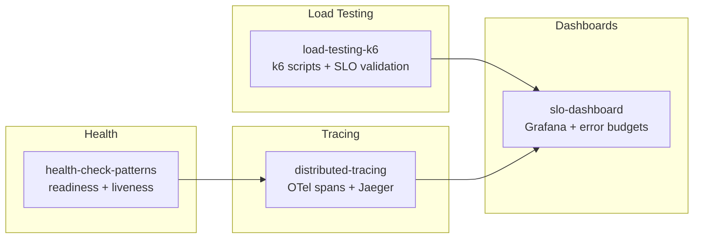

# Observability Hands-On

Implement distributed tracing, build SLO dashboards, and run load tests.

```mermaid
graph LR
    subgraph "Tracing"
        DT[distributed-tracing\nOTel spans + Jaeger]
    end
    subgraph "Dashboards"
        SLO[slo-dashboard\nGrafana + error budgets]
    end
    subgraph "Load Testing"
        K6[load-testing-k6\nk6 scripts + SLO validation]
    end
    subgraph "Health"
        HC[health-check-patterns\nreadiness + liveness]
    end
    K6 --> SLO
    DT --> SLO
    HC --> DT
```
