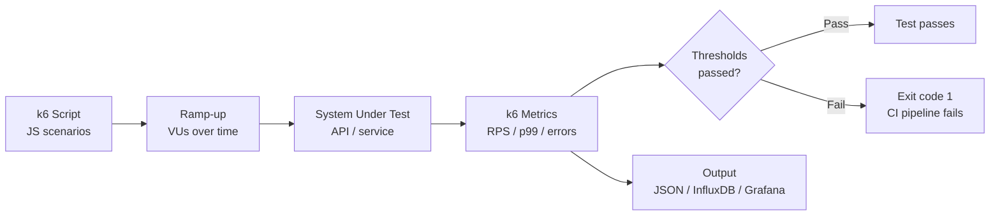

# POC #91: Load Testing with k6

## 🗺️ Quick Overview



*k6 runs JavaScript scenarios that ramp virtual users up and down; threshold checks on p99 latency and error rate make load tests a gate in your CI pipeline.*

> **Difficulty:** 🟡 Intermediate
> **Time:** 25 minutes
> **Prerequisites:** JavaScript basics, HTTP concepts

## What You'll Learn

Load testing validates system performance under expected and peak loads. k6 is a modern load testing tool that uses JavaScript for test scripts.

```
LOAD TESTING PATTERNS:
┌─────────────────────────────────────────────────────────────────┐
│                                                                 │
│  SMOKE TEST          LOAD TEST           STRESS TEST            │
│  ──────────          ─────────           ───────────            │
│  VUs │               VUs │               VUs │                  │
│   5  │▀▀▀▀▀          100 │    ▄▄▄▄▄       500│      ▲           │
│      │               50  │▄▄▄▀    ▀▄▄▄       │    ▄▀ ▀▄         │
│      └────────           └───────────        └──▄▀     ▀▄───    │
│      Time                Time                 Time               │
│  Verify basics       Normal load          Find breaking point   │
│                                                                 │
│  SPIKE TEST          SOAK TEST                                  │
│  ──────────          ─────────                                  │
│  VUs │     ▲         VUs │                                      │
│  500 │    █ █        100 │▀▀▀▀▀▀▀▀▀▀▀▀▀▀▀▀▀▀                   │
│   50 │▀▀▀▀ ▀▀▀▀          └──────────────────                   │
│      └─────────          Time (hours)                           │
│      Sudden traffic  Memory leaks, degradation                  │
│                                                                 │
└─────────────────────────────────────────────────────────────────┘
```

---

## Implementation

```javascript
// load-test.js (k6 script)
import http from 'k6/http';
import { check, sleep, group } from 'k6';
import { Rate, Trend, Counter } from 'k6/metrics';

// ==========================================
// CUSTOM METRICS
// ==========================================

const errorRate = new Rate('errors');
const apiLatency = new Trend('api_latency');
const requestCount = new Counter('requests');

// ==========================================
// TEST CONFIGURATION
// ==========================================

export const options = {
  // Stages define load pattern
  stages: [
    { duration: '30s', target: 10 },   // Ramp up to 10 users
    { duration: '1m', target: 10 },    // Stay at 10 users
    { duration: '30s', target: 50 },   // Ramp up to 50 users
    { duration: '2m', target: 50 },    // Stay at 50 users
    { duration: '30s', target: 100 },  // Ramp up to 100 users
    { duration: '1m', target: 100 },   // Stay at 100 users
    { duration: '30s', target: 0 },    // Ramp down
  ],

  // Thresholds define pass/fail criteria
  thresholds: {
    http_req_duration: ['p(95)<500', 'p(99)<1000'],  // 95% under 500ms
    http_req_failed: ['rate<0.01'],                  // Less than 1% errors
    errors: ['rate<0.05'],                           // Custom error rate
  },
};

// ==========================================
// TEST DATA
// ==========================================

const BASE_URL = __ENV.BASE_URL || 'http://localhost:3000';

const testUsers = [
  { email: 'user1@test.com', password: 'password1' },
  { email: 'user2@test.com', password: 'password2' },
  { email: 'user3@test.com', password: 'password3' },
];

// ==========================================
// HELPER FUNCTIONS
// ==========================================

function getRandomUser() {
  return testUsers[Math.floor(Math.random() * testUsers.length)];
}

function authenticate(user) {
  const response = http.post(`${BASE_URL}/api/auth/login`, JSON.stringify({
    email: user.email,
    password: user.password,
  }), {
    headers: { 'Content-Type': 'application/json' },
  });

  check(response, {
    'login successful': (r) => r.status === 200,
    'has token': (r) => r.json('token') !== undefined,
  });

  return response.json('token');
}

// ==========================================
// MAIN TEST SCENARIOS
// ==========================================

export default function () {
  const user = getRandomUser();

  group('Authentication', () => {
    const loginStart = Date.now();
    const token = authenticate(user);
    apiLatency.add(Date.now() - loginStart);
    requestCount.add(1);

    if (!token) {
      errorRate.add(1);
      return;
    }

    const headers = {
      'Authorization': `Bearer ${token}`,
      'Content-Type': 'application/json',
    };

    group('API Operations', () => {
      // GET - List items
      const listStart = Date.now();
      const listResponse = http.get(`${BASE_URL}/api/items`, { headers });
      apiLatency.add(Date.now() - listStart);
      requestCount.add(1);

      const listOk = check(listResponse, {
        'list status 200': (r) => r.status === 200,
        'list has items': (r) => r.json('items') !== undefined,
        'list response time OK': (r) => r.timings.duration < 500,
      });
      errorRate.add(!listOk);

      // POST - Create item
      const createStart = Date.now();
      const createResponse = http.post(`${BASE_URL}/api/items`, JSON.stringify({
        name: `Item ${Date.now()}`,
        description: 'Load test item',
      }), { headers });
      apiLatency.add(Date.now() - createStart);
      requestCount.add(1);

      const createOk = check(createResponse, {
        'create status 201': (r) => r.status === 201,
        'create has id': (r) => r.json('id') !== undefined,
      });
      errorRate.add(!createOk);

      if (createResponse.status === 201) {
        const itemId = createResponse.json('id');

        // GET - Get single item
        const getResponse = http.get(`${BASE_URL}/api/items/${itemId}`, { headers });
        requestCount.add(1);

        check(getResponse, {
          'get status 200': (r) => r.status === 200,
        });

        // DELETE - Cleanup
        http.del(`${BASE_URL}/api/items/${itemId}`, null, { headers });
        requestCount.add(1);
      }
    });
  });

  // Think time between iterations
  sleep(Math.random() * 3 + 1);  // 1-4 seconds
}

// ==========================================
// LIFECYCLE HOOKS
// ==========================================

export function setup() {
  // Run once before test starts
  console.log('Starting load test...');

  // Verify API is available
  const healthCheck = http.get(`${BASE_URL}/health`);
  if (healthCheck.status !== 200) {
    throw new Error('API not available');
  }

  return { startTime: Date.now() };
}

export function teardown(data) {
  // Run once after test ends
  const duration = (Date.now() - data.startTime) / 1000;
  console.log(`Test completed in ${duration} seconds`);
}
```

---

## Test Scenarios

```javascript
// scenarios.js - Different load patterns

// Smoke Test - Minimal load to verify system works
export const smokeTest = {
  stages: [
    { duration: '1m', target: 5 },
    { duration: '1m', target: 5 },
    { duration: '30s', target: 0 },
  ],
  thresholds: {
    http_req_failed: ['rate<0.01'],
    http_req_duration: ['p(95)<200'],
  },
};

// Load Test - Expected normal load
export const loadTest = {
  stages: [
    { duration: '5m', target: 100 },
    { duration: '10m', target: 100 },
    { duration: '5m', target: 0 },
  ],
  thresholds: {
    http_req_failed: ['rate<0.01'],
    http_req_duration: ['p(95)<500'],
  },
};

// Stress Test - Beyond normal capacity
export const stressTest = {
  stages: [
    { duration: '2m', target: 100 },
    { duration: '5m', target: 200 },
    { duration: '5m', target: 300 },
    { duration: '5m', target: 400 },
    { duration: '2m', target: 0 },
  ],
  thresholds: {
    http_req_failed: ['rate<0.10'],  // Allow higher error rate
  },
};

// Spike Test - Sudden traffic surge
export const spikeTest = {
  stages: [
    { duration: '1m', target: 50 },
    { duration: '10s', target: 500 },  // Sudden spike!
    { duration: '2m', target: 500 },
    { duration: '10s', target: 50 },   // Back to normal
    { duration: '2m', target: 50 },
    { duration: '1m', target: 0 },
  ],
};

// Soak Test - Extended duration for leak detection
export const soakTest = {
  stages: [
    { duration: '5m', target: 100 },
    { duration: '4h', target: 100 },  // Run for 4 hours
    { duration: '5m', target: 0 },
  ],
  thresholds: {
    http_req_failed: ['rate<0.01'],
    http_req_duration: ['p(99)<1000'],
  },
};

// Breakpoint Test - Find maximum capacity
export const breakpointTest = {
  executor: 'ramping-arrival-rate',
  startRate: 10,
  timeUnit: '1s',
  preAllocatedVUs: 500,
  maxVUs: 1000,
  stages: [
    { duration: '2m', target: 50 },
    { duration: '2m', target: 100 },
    { duration: '2m', target: 200 },
    { duration: '2m', target: 300 },
    { duration: '2m', target: 400 },
    { duration: '2m', target: 500 },
  ],
};
```

---

## Running Tests

```bash
# Install k6
brew install k6  # macOS
# or: apt install k6  # Linux
# or: choco install k6  # Windows

# Run basic test
k6 run load-test.js

# Run with environment variables
k6 run -e BASE_URL=https://api.example.com load-test.js

# Run specific scenario
k6 run --config scenarios.js load-test.js

# Run with output to InfluxDB
k6 run --out influxdb=http://localhost:8086/k6 load-test.js

# Run distributed test (k6 Cloud)
k6 cloud load-test.js
```

---

## Key Metrics to Monitor

| Metric | Description | Good Value |
|--------|-------------|------------|
| **http_req_duration** | Request latency | p95 < 500ms |
| **http_req_failed** | Failed requests | < 1% |
| **http_reqs** | Requests per second | Depends on system |
| **vus** | Virtual users | As configured |
| **iterations** | Completed test iterations | High = good |

---

## Results Analysis

```
     ✓ list status 200
     ✓ create status 201
     ✗ response time OK
      ↳  93% — ✓ 14521 / ✗ 1089

     checks.........................: 96.23% ✓ 43563  ✗ 1357
     data_received..................: 125 MB 2.1 MB/s
     data_sent......................: 15 MB  258 kB/s
     http_req_blocked...............: avg=2.12ms  p(95)=8.23ms
     http_req_duration..............: avg=123ms   p(95)=456ms   p(99)=892ms
       { expected_response:true }...: avg=118ms   p(95)=432ms
     http_req_failed................: 0.87%  ✓ 1357   ✗ 154231
     http_reqs......................: 155588 2593/s
     iteration_duration.............: avg=2.34s   p(95)=4.12s
     iterations.....................: 38897  648/s
     vus............................: 100    min=10   max=100
     vus_max........................: 100    min=100  max=100
```

---

## Related POCs

- [Chaos Engineering](/12-interview-prep/practice-pocs/chaos-engineering)
- [SLO Dashboard](/12-interview-prep/practice-pocs/slo-dashboard)
- [Circuit Breaker](/12-interview-prep/practice-pocs/circuit-breaker)
