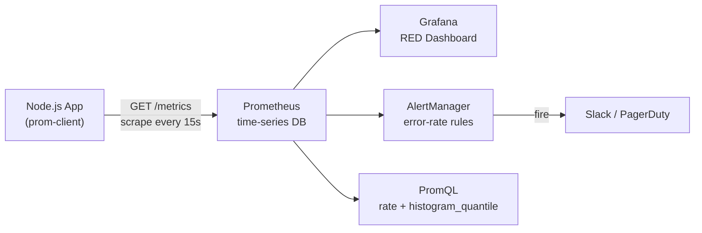

# POC: Prometheus + Grafana with Node.js — Full Stack Metrics

## 🗺️ Quick Overview



*Node.js exposes a `/metrics` endpoint; Prometheus scrapes it on a schedule, stores all four metric types, and feeds AlertManager thresholds and Grafana's RED method panels.*

This is the complete implementation. By the end, you will have:
- A Node.js Express app instrumented with all 4 Prometheus metric types
- A local Prometheus + Grafana + AlertManager stack via Docker Compose
- 5 PromQL queries that show your service health
- A RED method dashboard (Rate, Errors, Duration)
- An AlertManager rule that fires on high error rate
- The ability to trigger a spike and watch the dashboard react in real time

No theory. Just code.

---

## Prerequisites

```bash
# Required
node >= 18
docker >= 20
docker-compose >= 2.0

# Verify
node --version
docker compose version
```

---

## Project Structure

```
prometheus-grafana-poc/
├── app/
│   ├── package.json
│   ├── app.js
│   ├── metrics.js
│   └── middleware/
│       └── metricsMiddleware.js
├── prometheus/
│   ├── prometheus.yml
│   └── rules/
│       ├── alerting-rules.yml
│       └── recording-rules.yml
├── alertmanager/
│   └── alertmanager.yml
├── grafana/
│   └── provisioning/
│       ├── datasources/
│       │   └── prometheus.yml
│       └── dashboards/
│           ├── dashboard.yml
│           └── red-method.json
└── docker-compose.yml
```

---

## Step 1: The Node.js App

### package.json

```json
{
  "name": "prometheus-grafana-poc",
  "version": "1.0.0",
  "main": "app.js",
  "scripts": {
    "start": "node app.js",
    "dev": "nodemon app.js"
  },
  "dependencies": {
    "express": "^4.18.2",
    "prom-client": "^15.1.0"
  },
  "devDependencies": {
    "nodemon": "^3.0.1"
  }
}
```

### metrics.js — All 4 Metric Types

```javascript
// app/metrics.js
const client = require('prom-client');

const register = new client.Registry();

// --- Default metrics: CPU, memory, GC, event loop lag ---
client.collectDefaultMetrics({
  register,
  prefix: 'nodejs_',
  gcDurationBuckets: [0.001, 0.01, 0.1, 1, 2, 5],
});

// ============================================================
// COUNTER: always-increasing. Use rate() to get per-second rate.
// ============================================================

const httpRequestsTotal = new client.Counter({
  name: 'http_requests_total',
  help: 'Total number of HTTP requests received',
  labelNames: ['method', 'route', 'status_code'],
  registers: [register],
});

const ordersCreatedTotal = new client.Counter({
  name: 'orders_created_total',
  help: 'Total number of orders successfully created',
  labelNames: ['payment_method', 'region'],
  registers: [register],
});

const errorsTotal = new client.Counter({
  name: 'errors_total',
  help: 'Total number of application errors by type',
  labelNames: ['error_type', 'route'],
  registers: [register],
});

// ============================================================
// GAUGE: current value, can go up or down.
// ============================================================

const activeConnections = new client.Gauge({
  name: 'http_active_connections',
  help: 'Number of currently active HTTP connections',
  registers: [register],
});

const orderQueueDepth = new client.Gauge({
  name: 'order_queue_depth',
  help: 'Current number of orders waiting to be processed',
  labelNames: ['priority'],
  registers: [register],
});

const dbPoolActive = new client.Gauge({
  name: 'db_pool_active_connections',
  help: 'Active database connections in the pool',
  registers: [register],
});

// Simulate queue depth changing over time
let queueDepth = 0;
setInterval(() => {
  queueDepth = Math.max(0, queueDepth + Math.floor(Math.random() * 10) - 4);
  orderQueueDepth.set({ priority: 'normal' }, queueDepth);
  orderQueueDepth.set({ priority: 'high' }, Math.floor(queueDepth * 0.1));
  dbPoolActive.set(Math.floor(Math.random() * 20) + 5);
}, 5000);

// ============================================================
// HISTOGRAM: distribution of values. Use histogram_quantile()
// for P50/P95/P99 latency.
// ============================================================

const httpRequestDuration = new client.Histogram({
  name: 'http_request_duration_seconds',
  help: 'HTTP request duration in seconds',
  labelNames: ['method', 'route', 'status_code'],
  // Bucket boundaries: pick values that bracket your SLO thresholds
  // If SLO is P99 < 500ms, include 0.5 as a bucket
  buckets: [0.005, 0.01, 0.025, 0.05, 0.1, 0.25, 0.5, 1.0, 2.5, 5.0, 10.0],
  registers: [register],
});

const dbQueryDuration = new client.Histogram({
  name: 'db_query_duration_seconds',
  help: 'Database query duration in seconds',
  labelNames: ['operation', 'table'],
  buckets: [0.001, 0.005, 0.01, 0.05, 0.1, 0.5, 1.0, 5.0],
  registers: [register],
});

// ============================================================
// SUMMARY: percentiles computed client-side. Avoid unless
// you have a single-instance app and need exact quantiles.
// Here for demonstration only — use histogram in production.
// ============================================================

const requestSizeSummary = new client.Summary({
  name: 'http_request_size_bytes_summary',
  help: 'HTTP request body size (summary, for comparison with histogram)',
  labelNames: ['method', 'route'],
  percentiles: [0.5, 0.9, 0.99],
  maxAgeSeconds: 600,
  ageBuckets: 5,
  registers: [register],
});

module.exports = {
  register,
  httpRequestsTotal,
  ordersCreatedTotal,
  errorsTotal,
  activeConnections,
  orderQueueDepth,
  dbPoolActive,
  httpRequestDuration,
  dbQueryDuration,
  requestSizeSummary,
};
```

### middleware/metricsMiddleware.js

```javascript
// app/middleware/metricsMiddleware.js
const {
  httpRequestDuration,
  httpRequestsTotal,
  activeConnections,
  errorsTotal,
  requestSizeSummary,
} = require('../metrics');

function metricsMiddleware(req, res, next) {
  // Track active connections
  activeConnections.inc();

  const startTime = process.hrtime.bigint();

  res.on('finish', () => {
    const durationSec = Number(process.hrtime.bigint() - startTime) / 1e9;

    // CRITICAL: use req.route?.path (parameterized) not req.path (raw URL)
    // req.path = '/api/orders/12345'  → cardinality explosion
    // req.route.path = '/api/orders/:id' → bounded cardinality
    const route = req.route?.path || req.path || 'unknown';

    const labels = {
      method: req.method,
      route: route,
      status_code: res.statusCode.toString(),
    };

    httpRequestDuration.observe(labels, durationSec);
    httpRequestsTotal.inc(labels);

    if (res.statusCode >= 500) {
      errorsTotal.inc({ error_type: 'http_5xx', route: route });
    }

    // Track request body size (for Summary demonstration)
    const bodySize = parseInt(req.headers['content-length'] || '0', 10);
    requestSizeSummary.observe({ method: req.method, route: route }, bodySize);

    activeConnections.dec();
  });

  next();
}

module.exports = metricsMiddleware;
```

### app.js — Express App with Simulated Traffic

```javascript
// app/app.js
const express = require('express');
const {
  register,
  ordersCreatedTotal,
  dbQueryDuration,
} = require('./metrics');
const metricsMiddleware = require('./middleware/metricsMiddleware');

const app = express();
app.use(express.json());
app.use(metricsMiddleware);

// --- Prometheus scrape endpoint ---
app.get('/metrics', async (req, res) => {
  res.set('Content-Type', register.contentType);
  res.end(await register.metrics());
});

// --- Health check (excluded from metrics middleware above) ---
app.get('/health', (req, res) => res.json({ status: 'ok' }));

// --- Simulated API endpoints ---

// Normal endpoint: random latency 10-100ms
app.get('/api/products', async (req, res) => {
  const delay = 10 + Math.random() * 90;
  await sleep(delay);
  res.json({ products: ['widget-a', 'widget-b', 'widget-c'] });
});

// Slower endpoint: 50-500ms (simulates DB query)
app.get('/api/orders', async (req, res) => {
  const dbTimer = dbQueryDuration.startTimer({ operation: 'select', table: 'orders' });
  const delay = 50 + Math.random() * 450;
  await sleep(delay);
  dbTimer();
  res.json({ orders: [], total: 0 });
});

// Order creation: 20-200ms, records business metric
app.post('/api/orders', async (req, res) => {
  const delay = 20 + Math.random() * 180;
  await sleep(delay);

  ordersCreatedTotal.inc({
    payment_method: ['card', 'paypal', 'crypto'][Math.floor(Math.random() * 3)],
    region: ['us-east', 'eu-west', 'ap-south'][Math.floor(Math.random() * 3)],
  });

  res.status(201).json({ orderId: `order-${Date.now()}` });
});

// Chaos endpoint: 30% chance of 500 error, high latency
app.get('/api/checkout', async (req, res) => {
  const shouldFail = Math.random() < 0.30;
  const delay = shouldFail
    ? 500 + Math.random() * 2000   // slow when failing
    : 50 + Math.random() * 150;    // fast when succeeding

  await sleep(delay);

  if (shouldFail) {
    return res.status(500).json({ error: 'Payment gateway timeout' });
  }
  res.json({ status: 'checkout_complete' });
});

// SPIKE endpoint: call this to simulate an outage
// GET /api/chaos?error_rate=0.9&latency=2000
app.get('/api/chaos', async (req, res) => {
  const errorRate = parseFloat(req.query.error_rate || '0.5');
  const latencyMs = parseInt(req.query.latency || '1000', 10);

  await sleep(latencyMs);

  if (Math.random() < errorRate) {
    return res.status(500).json({ error: 'Chaos injection active' });
  }
  res.json({ status: 'survived_chaos' });
});

// --- Simulate background traffic ---
// Makes the dashboards interesting without manual curl commands
async function simulateTraffic() {
  const endpoints = [
    { method: 'GET', path: '/api/products', weight: 40 },
    { method: 'GET', path: '/api/orders', weight: 30 },
    { method: 'POST', path: '/api/orders', weight: 20 },
    { method: 'GET', path: '/api/checkout', weight: 10 },
  ];

  while (true) {
    const rand = Math.random() * 100;
    let cumulative = 0;
    let selected = endpoints[0];

    for (const ep of endpoints) {
      cumulative += ep.weight;
      if (rand < cumulative) {
        selected = ep;
        break;
      }
    }

    try {
      // Simulate by directly calling the route handler logic (simplified)
      // In a real POC, you'd use axios to actually hit the endpoints
      const { httpRequestsTotal, httpRequestDuration } = require('./metrics');
      const latency = 10 + Math.random() * 200;
      const statusCode = Math.random() < 0.02 ? '500' : '200';

      httpRequestsTotal.inc({
        method: selected.method,
        route: selected.path,
        status_code: statusCode,
      });
      httpRequestDuration.observe({
        method: selected.method,
        route: selected.path,
        status_code: statusCode,
      }, latency / 1000);
    } catch (e) { /* ignore */ }

    await sleep(50 + Math.random() * 100); // 10-20 RPS
  }
}

function sleep(ms) {
  return new Promise(resolve => setTimeout(resolve, ms));
}

const PORT = process.env.PORT || 3000;
app.listen(PORT, () => {
  console.log(`App running on http://localhost:${PORT}`);
  console.log(`Metrics at http://localhost:${PORT}/metrics`);
  simulateTraffic();
});
```

---

## Step 2: Prometheus Configuration

### prometheus/prometheus.yml

```yaml
global:
  scrape_interval: 15s
  evaluation_interval: 15s
  external_labels:
    environment: 'development'

rule_files:
  - '/etc/prometheus/rules/*.yml'

alerting:
  alertmanagers:
    - static_configs:
        - targets: ['alertmanager:9093']

scrape_configs:
  - job_name: 'nodejs-app'
    static_configs:
      - targets: ['app:3000']
    metrics_path: '/metrics'
    scrape_interval: 10s

  - job_name: 'prometheus'
    static_configs:
      - targets: ['localhost:9090']
```

### prometheus/rules/recording-rules.yml

```yaml
groups:
  - name: nodejs_recording_rules
    interval: 30s
    rules:
      - record: job:http_requests_per_second:rate5m
        expr: sum(rate(http_requests_total[5m]))

      - record: job:http_error_rate:rate5m
        expr: |
          sum(rate(http_requests_total{status_code=~"5.."}[5m]))
          /
          sum(rate(http_requests_total[5m]))

      - record: job:http_p99_latency:rate5m
        expr: |
          histogram_quantile(0.99,
            sum by (le) (rate(http_request_duration_seconds_bucket[5m]))
          )

      - record: job:http_p50_latency:rate5m
        expr: |
          histogram_quantile(0.50,
            sum by (le) (rate(http_request_duration_seconds_bucket[5m]))
          )
```

### prometheus/rules/alerting-rules.yml

```yaml
groups:
  - name: nodejs_alerts
    rules:
      - alert: HighErrorRate
        expr: |
          sum(rate(http_requests_total{status_code=~"5.."}[5m]))
          /
          sum(rate(http_requests_total[5m]))
          > 0.05
        for: 1m
        labels:
          severity: page
        annotations:
          summary: "Error rate {{ $value | humanizePercentage }}"
          description: "HTTP error rate exceeds 5% for 1 minute. Current: {{ $value | humanizePercentage }}"

      - alert: HighP99Latency
        expr: |
          histogram_quantile(0.99,
            sum by (le) (rate(http_request_duration_seconds_bucket[5m]))
          ) > 1.0
        for: 2m
        labels:
          severity: warning
        annotations:
          summary: "P99 latency {{ $value }}s"

      - alert: AppDown
        expr: up{job="nodejs-app"} == 0
        for: 30s
        labels:
          severity: page
        annotations:
          summary: "Node.js app is down"
          description: "Prometheus cannot scrape the app at {{ $labels.instance }}"
```

---

## Step 3: AlertManager Configuration

### alertmanager/alertmanager.yml

```yaml
global:
  resolve_timeout: 5m

route:
  group_by: ['alertname']
  group_wait: 30s
  group_interval: 5m
  repeat_interval: 1h
  receiver: 'console'

receivers:
  - name: 'console'
    webhook_configs:
      - url: 'http://app:3000/webhook/alerts'
        send_resolved: true
```

---

## Step 4: Docker Compose

### docker-compose.yml

```yaml
version: '3.8'

services:
  app:
    build:
      context: ./app
      dockerfile: Dockerfile
    ports:
      - "3000:3000"
    environment:
      - NODE_ENV=development
      - PORT=3000
    networks:
      - monitoring

  prometheus:
    image: prom/prometheus:v2.48.0
    volumes:
      - ./prometheus/prometheus.yml:/etc/prometheus/prometheus.yml
      - ./prometheus/rules:/etc/prometheus/rules
      - prometheus_data:/prometheus
    command:
      - '--config.file=/etc/prometheus/prometheus.yml'
      - '--storage.tsdb.path=/prometheus'
      - '--storage.tsdb.retention.time=7d'
      - '--web.console.libraries=/usr/share/prometheus/console_libraries'
      - '--web.console.templates=/usr/share/prometheus/consoles'
      - '--web.enable-lifecycle'                  # allows POST to /-/reload
      - '--enable-feature=exemplar-storage'       # enable exemplars
    ports:
      - "9090:9090"
    networks:
      - monitoring

  alertmanager:
    image: prom/alertmanager:v0.26.0
    volumes:
      - ./alertmanager/alertmanager.yml:/etc/alertmanager/alertmanager.yml
    ports:
      - "9093:9093"
    networks:
      - monitoring

  grafana:
    image: grafana/grafana:10.2.0
    volumes:
      - ./grafana/provisioning:/etc/grafana/provisioning
      - grafana_data:/var/lib/grafana
    environment:
      - GF_SECURITY_ADMIN_PASSWORD=admin
      - GF_USERS_ALLOW_SIGN_UP=false
      - GF_AUTH_ANONYMOUS_ENABLED=true
      - GF_AUTH_ANONYMOUS_ORG_ROLE=Viewer
    ports:
      - "3001:3000"   # Grafana on 3001 to avoid conflict with app
    depends_on:
      - prometheus
    networks:
      - monitoring

volumes:
  prometheus_data:
  grafana_data:

networks:
  monitoring:
    driver: bridge
```

### app/Dockerfile

```dockerfile
FROM node:20-alpine
WORKDIR /app
COPY package*.json ./
RUN npm ci --only=production
COPY . .
EXPOSE 3000
CMD ["node", "app.js"]
```

---

## Step 5: Grafana Auto-Provisioning

### grafana/provisioning/datasources/prometheus.yml

```yaml
apiVersion: 1

datasources:
  - name: Prometheus
    type: prometheus
    access: proxy
    url: http://prometheus:9090
    isDefault: true
    jsonData:
      timeInterval: '15s'
      exemplarTraceIdDestinations:
        - name: trace_id
          datasourceUid: jaeger
```

### grafana/provisioning/dashboards/dashboard.yml

```yaml
apiVersion: 1

providers:
  - name: 'Red Method'
    orgId: 1
    folder: 'POC'
    type: file
    disableDeletion: false
    updateIntervalSeconds: 10
    options:
      path: /etc/grafana/provisioning/dashboards
```

### grafana/provisioning/dashboards/red-method.json

```json
{
  "title": "RED Method — Node.js Service",
  "uid": "red-method-nodejs",
  "refresh": "10s",
  "time": { "from": "now-30m", "to": "now" },
  "panels": [
    {
      "id": 1,
      "title": "Rate — Requests per Second",
      "type": "stat",
      "gridPos": { "x": 0, "y": 0, "w": 6, "h": 4 },
      "targets": [{
        "expr": "sum(rate(http_requests_total[5m]))",
        "legendFormat": "RPS"
      }],
      "fieldConfig": {
        "defaults": {
          "unit": "reqps",
          "thresholds": {
            "steps": [
              { "value": 0, "color": "green" },
              { "value": 100, "color": "yellow" },
              { "value": 500, "color": "red" }
            ]
          }
        }
      }
    },
    {
      "id": 2,
      "title": "Errors — Error Rate %",
      "type": "stat",
      "gridPos": { "x": 6, "y": 0, "w": 6, "h": 4 },
      "targets": [{
        "expr": "sum(rate(http_requests_total{status_code=~\"5..\"}[5m])) / sum(rate(http_requests_total[5m])) * 100",
        "legendFormat": "Error %"
      }],
      "fieldConfig": {
        "defaults": {
          "unit": "percent",
          "thresholds": {
            "steps": [
              { "value": 0, "color": "green" },
              { "value": 1, "color": "yellow" },
              { "value": 5, "color": "red" }
            ]
          }
        }
      }
    },
    {
      "id": 3,
      "title": "Duration — P99 Latency (seconds)",
      "type": "stat",
      "gridPos": { "x": 12, "y": 0, "w": 6, "h": 4 },
      "targets": [{
        "expr": "histogram_quantile(0.99, sum by (le) (rate(http_request_duration_seconds_bucket[5m])))",
        "legendFormat": "P99"
      }],
      "fieldConfig": {
        "defaults": {
          "unit": "s",
          "thresholds": {
            "steps": [
              { "value": 0, "color": "green" },
              { "value": 0.5, "color": "yellow" },
              { "value": 1.0, "color": "red" }
            ]
          }
        }
      }
    },
    {
      "id": 4,
      "title": "Request Rate by Route",
      "type": "timeseries",
      "gridPos": { "x": 0, "y": 4, "w": 12, "h": 8 },
      "targets": [{
        "expr": "sum by (route) (rate(http_requests_total[5m]))",
        "legendFormat": "{{ route }}"
      }],
      "fieldConfig": {
        "defaults": { "unit": "reqps" }
      }
    },
    {
      "id": 5,
      "title": "P50 / P95 / P99 Latency",
      "type": "timeseries",
      "gridPos": { "x": 12, "y": 4, "w": 12, "h": 8 },
      "targets": [
        {
          "expr": "histogram_quantile(0.50, sum by (le) (rate(http_request_duration_seconds_bucket[5m])))",
          "legendFormat": "P50"
        },
        {
          "expr": "histogram_quantile(0.95, sum by (le) (rate(http_request_duration_seconds_bucket[5m])))",
          "legendFormat": "P95"
        },
        {
          "expr": "histogram_quantile(0.99, sum by (le) (rate(http_request_duration_seconds_bucket[5m])))",
          "legendFormat": "P99"
        }
      ],
      "fieldConfig": {
        "defaults": { "unit": "s" }
      }
    },
    {
      "id": 6,
      "title": "Queue Depth",
      "type": "timeseries",
      "gridPos": { "x": 0, "y": 12, "w": 12, "h": 6 },
      "targets": [{
        "expr": "order_queue_depth",
        "legendFormat": "{{ priority }} queue"
      }],
      "fieldConfig": {
        "defaults": { "unit": "short" }
      }
    },
    {
      "id": 7,
      "title": "Orders Created per Second",
      "type": "timeseries",
      "gridPos": { "x": 12, "y": 12, "w": 12, "h": 6 },
      "targets": [{
        "expr": "sum by (payment_method) (rate(orders_created_total[5m]))",
        "legendFormat": "{{ payment_method }}"
      }],
      "fieldConfig": {
        "defaults": { "unit": "reqps" }
      }
    }
  ]
}
```

---

## Step 6: Run the Stack

```bash
# 1. Create the directory structure
mkdir -p prometheus-grafana-poc/{app/middleware,prometheus/rules,alertmanager,grafana/provisioning/{datasources,dashboards}}

# 2. Create all files as shown above

# 3. Install Node.js dependencies
cd prometheus-grafana-poc/app
npm install
cd ..

# 4. Start everything
docker compose up -d

# 5. Verify services are up
docker compose ps
# Expected: app, prometheus, alertmanager, grafana all running

# 6. Access the UIs
open http://localhost:3000/metrics    # raw Prometheus metrics
open http://localhost:9090            # Prometheus UI
open http://localhost:9093            # AlertManager UI
open http://localhost:3001            # Grafana (admin/admin)
```

---

## Step 7: The 5 PromQL Queries to Run

Open Prometheus at `http://localhost:9090` and run these in the query box:

```promql
-- 1. Current requests per second
sum(rate(http_requests_total[5m]))

-- 2. P99 latency (should be < 1s for normal traffic)
histogram_quantile(0.99, sum by (le) (rate(http_request_duration_seconds_bucket[5m])))

-- 3. Error rate (should be ~2% for normal traffic, 30% for /api/checkout)
sum(rate(http_requests_total{status_code=~"5.."}[5m]))
/
sum(rate(http_requests_total[5m]))

-- 4. RPS per route — where is traffic going?
sum by (route) (rate(http_requests_total[5m]))

-- 5. Average latency per route — which route is slow?
sum by (route) (rate(http_request_duration_seconds_sum[5m]))
/
sum by (route) (rate(http_request_duration_seconds_count[5m]))
```

---

## Step 8: Trigger a Spike and Watch the Dashboard

### Trigger High Error Rate (watch the alert fire)

```bash
# In a separate terminal, hammer the chaos endpoint
# 90% error rate, 2 second latency
for i in {1..200}; do
  curl -s "http://localhost:3000/api/chaos?error_rate=0.9&latency=500" &
done
wait

# Check AlertManager — HighErrorRate alert should fire within 1 minute
open http://localhost:9093
```

### Watch in Grafana

1. Open `http://localhost:3001/d/red-method-nodejs`
2. Set time range to "Last 5 minutes"
3. Enable auto-refresh (top-right, set to 10s)
4. Run the chaos commands above
5. Watch: Error Rate stat turns red, P99 latency spikes, Request Rate by Route shows traffic

### Trigger High Latency (watch P99 spike)

```bash
# 5 second latency, low error rate
for i in {1..50}; do
  curl -s "http://localhost:3000/api/chaos?error_rate=0.01&latency=5000" &
done
```

### Reload Prometheus Rules Without Restart

```bash
# After editing alerting rules or recording rules:
curl -X POST http://localhost:9090/-/reload
```

---

## Cleanup

```bash
docker compose down -v   # -v removes volumes (data)
```

---

## What to Explore Next

1. **Cardinality check**: Run `count({__name__=~".+"})` in Prometheus — you should see a small number
2. **AlertManager routing**: Add a Slack webhook to `alertmanager.yml` and watch alerts arrive in Slack
3. **Recording rule performance**: Compare query speed of `job:http_p99_latency:rate5m` vs the raw `histogram_quantile()` query on a 30-day time range
4. **Default metrics**: Explore `nodejs_gc_duration_seconds_bucket`, `nodejs_eventloop_lag_seconds`, `process_resident_memory_bytes` — all provided by `collectDefaultMetrics()`
5. **Remote write**: Add Grafana Cloud free tier as a remote_write target and get hosted Prometheus + Grafana in 5 minutes
