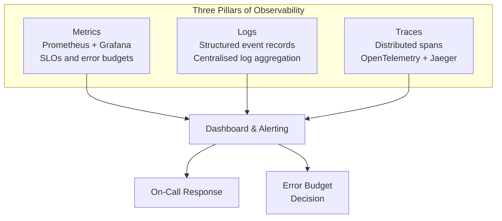

# Observability

You cannot improve what you cannot measure. This section covers the three pillars of observability (metrics, logs, traces), SLOs, alerting, performance tuning, and FinOps.

## What You'll Learn

- **Concepts**: Distributed tracing, log aggregation, SLOs & error budgets, performance profiling
- **Hands-On**: Implement distributed tracing, build SLO dashboards, run load tests
- **Failure Modes**: Thread pool exhaustion and storage bloat

## Where to Start

1. [Observability & SLOs](./concepts/observability-slos) — The three pillars: metrics, logs, traces
2. [Latency Percentiles](./concepts/latency-percentiles) — p50, p95, p99 explained
3. [Distributed Tracing](./hands-on/distributed-tracing) — Implement end-to-end tracing
4. [Load Testing with k6](./hands-on/load-testing-k6) — Measure before you optimize

## Topic Map

| Topic | Concepts | Hands-On | Problems at Scale | Interview Prep |
|-------|----------|----------|-------------------|----------------|
| SLOs & SLAs | [observability-slos](./concepts/observability-slos), [slo-error-budget-design](./concepts/slo-error-budget-design) | [slo-dashboard](./hands-on/slo-dashboard) | — | [observability-monitoring](/12-interview-prep/system-design/scale-and-reliability/observability-monitoring) |
| Distributed tracing | [distributed-tracing-design](./concepts/distributed-tracing-design) | [distributed-tracing](./hands-on/distributed-tracing) | — | [distributed-tracing](/12-interview-prep/system-design/scale-and-reliability/distributed-tracing) |
| Metrics & alerting | [metrics-design-patterns](./concepts/metrics-design-patterns), [alerting-strategy](./concepts/alerting-strategy) | — | — | — |
| Connection pool mgmt | [connection-pool-management](./concepts/connection-pool-management) | [database-connection-pooling](/01-databases/hands-on/database-connection-pooling), [connection-pool-sizing](/01-databases/hands-on/connection-pool-sizing) | [connection-pool-starvation](/problems-at-scale/performance/connection-pool-starvation), [thread-pool-exhaustion](/problems-at-scale/performance/thread-pool-exhaustion) | [connection-pooling](/12-interview-prep/quick-reference/databases/connection-pooling) |
| Latency percentiles | [latency-percentiles](./concepts/latency-percentiles) | — | — | [api-metrics](/12-interview-prep/quick-reference/caching/api-metrics) |
| AWS monitoring | — | — | — | [cloudwatch-monitoring](/12-interview-prep/quick-reference/aws-cloud/cloudwatch-monitoring) |
