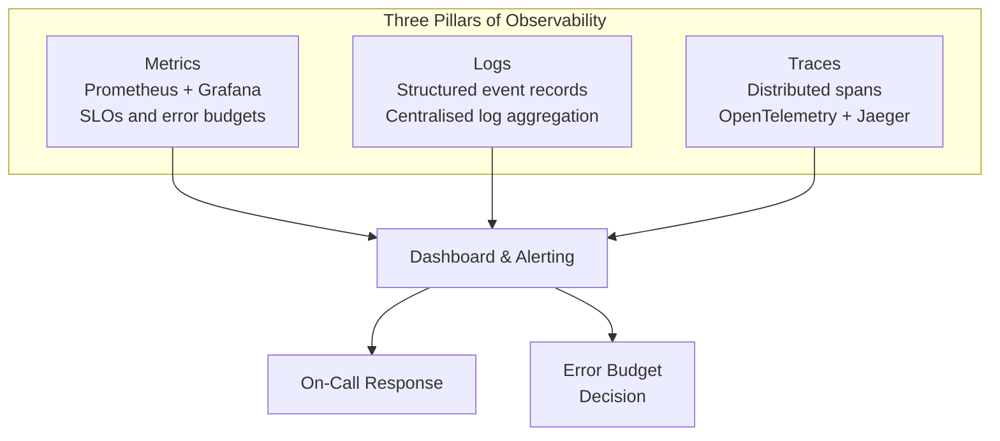

# Observability

You cannot improve what you cannot measure. This section covers the three pillars of observability (metrics, logs, traces), SLOs, alerting, performance tuning, and FinOps.

## Navigate by Role

| I am... | Start here | Goal |
|---------|-----------|------|
| 🟢 Junior | [observability-slos](./concepts/observability-slos) | Understand logs, metrics, and traces |
| 🟡 Mid-level | [distributed-tracing-design](./concepts/distributed-tracing-design) or [prometheus-grafana-stack](./concepts/prometheus-grafana-stack) | Implement the three pillars of observability |
| 🔴 Senior / TL | [slo-error-budget-design](./concepts/slo-error-budget-design) + [failures](./failures) | Design SLOs, on-call runbooks, failure analysis |
| 🏆 Interview prepping | [scale-and-reliability questions](../../12-interview-prep/system-design/scale-and-reliability) | Observability interview patterns |

## What You'll Learn

- **Concepts**: Distributed tracing, log aggregation, SLOs & error budgets, performance profiling
- **Hands-On**: Implement distributed tracing, build SLO dashboards, run load tests
- **Failure Modes**: Thread pool exhaustion and storage bloat

## Where to Start

1. [Observability & SLOs](/09-observability/concepts/observability-slos) — The three pillars: metrics, logs, traces
2. [Latency Percentiles](/09-observability/concepts/latency-percentiles) — p50, p95, p99 explained
3. [Distributed Tracing](/09-observability/hands-on/distributed-tracing) — Implement end-to-end tracing
4. [Load Testing with k6](/09-observability/hands-on/load-testing-k6) — Measure before you optimize

## Topic Map

| Topic | 📖 Concept | 🔬 Hands-On | ⚠️ Failures |
|-------|-----------|------------|------------|
| SLOs & error budgets | [observability-slos](./concepts/observability-slos), [slo-error-budget-design](./concepts/slo-error-budget-design), [slo-burn-rate-alerts](./concepts/slo-burn-rate-alerts) | [slo-dashboard](./hands-on/slo-dashboard) | — |
| Distributed tracing | [distributed-tracing-design](./concepts/distributed-tracing-design), [opentelemetry-instrumentation](./concepts/opentelemetry-instrumentation) | [distributed-tracing](./hands-on/distributed-tracing), [otel-distributed-tracing-poc](./hands-on/otel-distributed-tracing-poc) | — |
| Metrics & Prometheus | [prometheus-grafana-stack](./concepts/prometheus-grafana-stack), [metrics-design-patterns](./concepts/metrics-design-patterns), [metric-cardinality-management](./concepts/metric-cardinality-management) | [prometheus-nodejs-poc](./hands-on/prometheus-nodejs-poc) | — |
| Alerting strategy | [alerting-strategy](./concepts/alerting-strategy) | — | — |
| Log aggregation | [log-aggregation-design](./concepts/log-aggregation-design), [log-aggregation-elk-loki](./concepts/log-aggregation-elk-loki) | [elk-stack-poc](./hands-on/elk-stack-poc) | [storage-bloat](./failures/storage-bloat) |
| Latency & performance | [latency-percentiles](./concepts/latency-percentiles), [gc-pressure-tuning](./concepts/gc-pressure-tuning), [network-optimization](./concepts/network-optimization) | [load-testing-k6](./hands-on/load-testing-k6) | — |
| Thread & connection pools | [thread-pool-sizing](./concepts/thread-pool-sizing), [connection-pool-management](./concepts/connection-pool-management) | — | [thread-pool-exhaustion](./failures/thread-pool-exhaustion) |
| Database query perf | [database-query-performance](./concepts/database-query-performance) | — | — |
| APM platforms | [apm-platforms-comparison](./concepts/apm-platforms-comparison) | — | — |
| Synthetic & RUM | [real-user-monitoring](./concepts/real-user-monitoring), [synthetic-monitoring](./concepts/synthetic-monitoring) | [synthetic-monitoring-poc](./hands-on/synthetic-monitoring-poc) | — |
| Health checks | [cost-monitoring-finops](./concepts/cost-monitoring-finops) | [health-check-patterns](./hands-on/health-check-patterns) | — |
