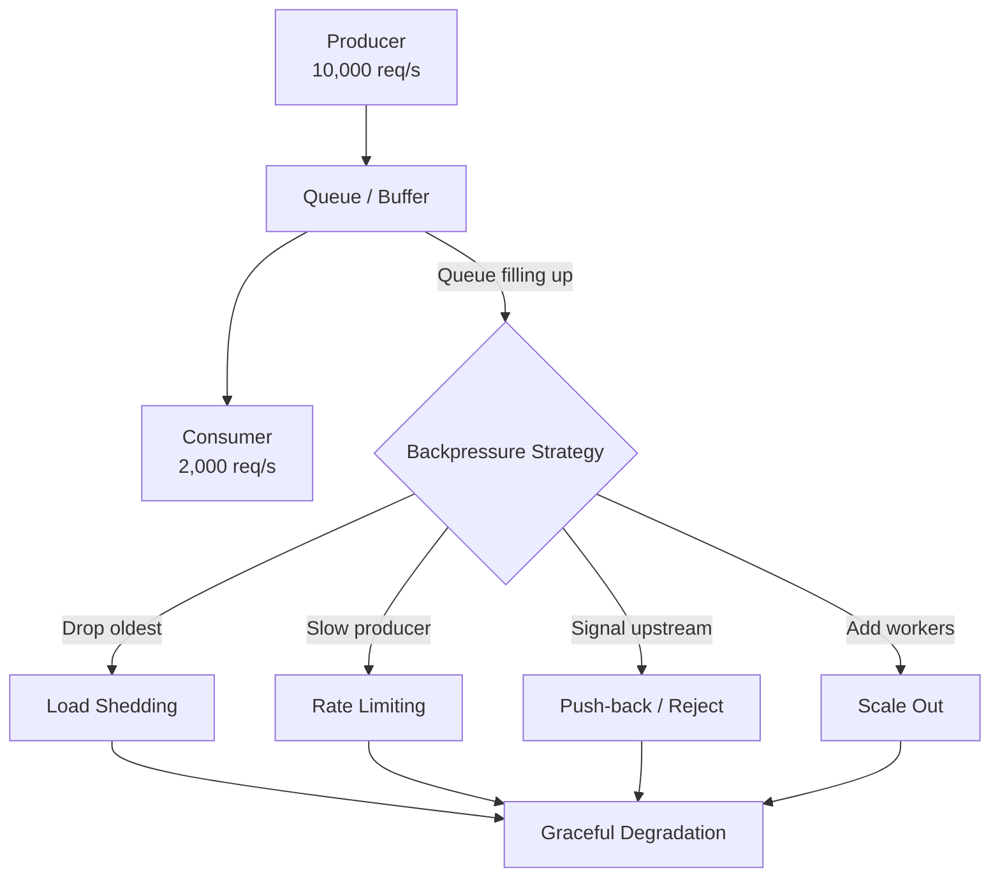
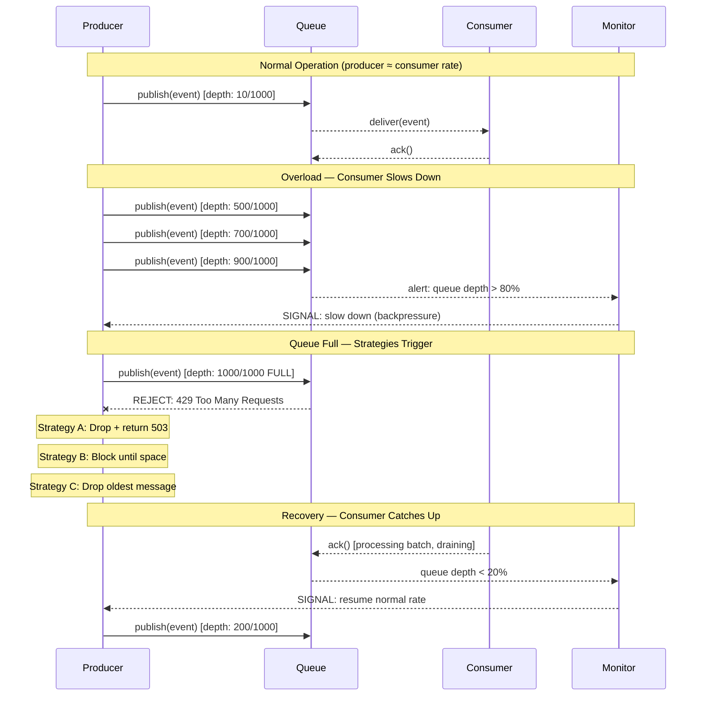

# Backpressure Handling - Flow Control Under Load

> **Reading Time:** 18 minutes
> **Difficulty:** Advanced
> **Impact:** The difference between graceful degradation and a total system meltdown

## 🗺️ Quick Overview



*Backpressure is flow control for overload — when consumers can't keep up with producers, the system must choose between dropping work, slowing intake, or scaling capacity.*

## What Is Backpressure?

```
Backpressure = when a system receives data faster than it can process it.

Real-world analogy:
  Highway: 4 lanes merge into 2 lanes
  Result: Traffic backs up (backpressure)
  If unmanaged: Complete gridlock (system crash)
  If managed: Meter lights, speed limits (controlled flow)

In software:
  Producer: 10,000 requests/sec
  Consumer: 2,000 requests/sec
  Gap: 8,000 requests/sec building up

  After 1 minute: 480,000 requests queued
  After 10 minutes: Queue full → OOM → crash
```

**Every system at scale hits backpressure. The question is: how do you handle it?**

---

## Where Backpressure Occurs

```
1. API Gateway → Backend Services
   Sudden traffic spike (viral content, DDoS)
   Backend can't keep up with requests

2. Service A → Service B (sync calls)
   Service B is slow (database issue)
   Service A threads blocked waiting
   Service A stops serving new requests → cascade!

3. Producer → Message Queue → Consumer
   Producer writes faster than consumer reads
   Queue grows unbounded → disk full

4. Application → Database
   Too many concurrent queries
   Connection pool exhausted
   New requests wait → timeout → error

5. Frontend → API
   Mobile client fires 100 requests on app open
   Each request spawns more backend requests
   Backend overwhelmed
```

---

## Backpressure Strategies

### Strategy 1: Drop Requests (Load Shedding)

```
When overloaded, reject excess requests immediately.

┌──────────┐     ┌──────────────────┐
│ Incoming │────▶│    Service       │
│ 10K/sec  │     │  Capacity: 5K/s  │
└──────────┘     │                  │
                 │ 5K/s → Process ✅ │
                 │ 5K/s → 503 Error ❌│
                 └──────────────────┘

Implementation:
  if (currentLoad > maxCapacity * 0.9) {
    return res.status(503).json({
      error: 'Service overloaded',
      retryAfter: 5
    });
  }
  // else process normally

Priority-based shedding (smarter):
  High priority (payments):    Always process
  Medium priority (browsing):  Shed above 80% capacity
  Low priority (analytics):    Shed above 60% capacity

  function shouldShed(request) {
    const load = getCurrentLoad();
    if (request.priority === 'high') return false;
    if (request.priority === 'medium' && load > 0.8) return true;
    if (request.priority === 'low' && load > 0.6) return true;
    return false;
  }
```

### Strategy 2: Buffer and Batch

```
Queue incoming requests, process in batches.

┌──────────┐     ┌──────────┐     ┌──────────┐
│ Incoming │────▶│  Buffer  │────▶│ Consumer │
│ 10K/sec  │     │ (Queue)  │     │ 2K/sec   │
│ (bursty) │     │ Absorbs  │     │ (steady) │
└──────────┘     │ spikes   │     └──────────┘
                 └──────────┘

Works when:
  ✅ Traffic is bursty (spikes then calms down)
  ✅ Processing can be delayed (async tasks)
  ✅ Queue has bounded size (won't grow forever)

Fails when:
  ❌ Traffic consistently exceeds capacity (queue grows forever)
  ❌ Real-time response required (can't queue API requests)
  ❌ Queue size unbounded (will eventually OOM)

Bounded buffer with overflow policy:
  const queue = new BoundedQueue(maxSize: 10000);

  // When queue is full:
  // Option A: Drop oldest (sliding window)
  // Option B: Drop newest (reject new requests)
  // Option C: Drop lowest priority
```

### Strategy 3: Rate Limiting (Throttling)

```
Limit the rate of incoming requests per client.

┌──────────┐     ┌──────────────┐     ┌──────────┐
│  Client  │────▶│ Rate Limiter │────▶│ Service  │
│ 1000/sec │     │ Limit: 100/s │     │          │
└──────────┘     │              │     └──────────┘
                 │ 100/s → Pass │
                 │ 900/s → 429  │
                 └──────────────┘

Protects against:
  - Single client overwhelming the system
  - Misbehaving clients (buggy retry loops)
  - DDoS attacks

Doesn't protect against:
  - Legitimate traffic from many clients
  - Internal service-to-service overload
```

### Strategy 4: Adaptive Concurrency Limits

```
Dynamically adjust how many requests to process concurrently.

Instead of fixed limits, measure and adapt:

  if (latency increasing) → decrease concurrency limit
  if (latency stable) → slowly increase concurrency limit

Netflix Concurrency Limits library:
  ┌──────────────────────────────────────────┐
  │  Adaptive Concurrency Control            │
  │                                          │
  │  Current limit: 50 concurrent requests   │
  │  Current latency: 25ms (normal)          │
  │                                          │
  │  Latency spikes to 200ms:               │
  │    → Reduce limit to 25                  │
  │    → Fewer concurrent requests           │
  │    → Each request gets more resources    │
  │    → Latency recovers                    │
  │                                          │
  │  Latency stable at 25ms:                │
  │    → Slowly increase limit to 30, 35...  │
  │    → Find the sweet spot                 │
  └──────────────────────────────────────────┘

TCP uses exactly this approach (congestion control):
  Slow start → Increase window → Packet loss detected →
  Cut window in half → Slowly increase again
```

### Strategy 5: Circuit Breaker

```
When downstream is overloaded, stop calling it entirely.

Normal:      Service A → Service B (responding normally)
Degraded:    Service A → Service B (slow, errors increasing)
Open:        Service A → [CIRCUIT OPEN] → Return fallback

States:
  CLOSED (normal):  Requests pass through
  OPEN (tripped):   Requests fail immediately (no call to B)
  HALF-OPEN (test): Allow one request to test if B recovered

  function call(request) {
    if (circuitBreaker.isOpen()) {
      // Don't even try — return cached/default response
      return getFallbackResponse(request);
    }

    try {
      const response = await serviceB.call(request);
      circuitBreaker.recordSuccess();
      return response;
    } catch (error) {
      circuitBreaker.recordFailure();
      return getFallbackResponse(request);
    }
  }
```

### Strategy 6: Reactive Streams / Async Pull

```
Consumer PULLS data at its own pace (instead of producer pushing).

Push model (backpressure prone):
  Producer ═══════════════▶ Consumer
  "Here's 10K events, deal with it!"

Pull model (backpressure safe):
  Producer ◀── "Give me 100" ── Consumer
  Producer ══ 100 events ═════▶ Consumer
  Consumer processes them...
  Producer ◀── "Give me 50" ─── Consumer  (slower this time)
  Producer ══ 50 events ══════▶ Consumer

Kafka consumer groups use this pattern:
  Consumer calls poll(maxRecords: 100)
  Processes 100 records
  Calls poll() again when ready
  If consumer is slow → it polls less frequently
  → Producer doesn't care, just appends to log

Reactive Streams (Java/Kotlin):
  Flux.from(dataSource)
    .onBackpressureBuffer(1000)    // Buffer up to 1000
    .onBackpressureDrop()          // Drop if buffer full
    .subscribe(item -> process(item));
```

---

## Backpressure at Each Layer

### API Gateway Level

```
First line of defense:

┌──────────────────────────────────────┐
│            API Gateway               │
│                                      │
│ 1. Global rate limit: 50K req/sec    │
│ 2. Per-client rate limit: 100 req/s  │
│ 3. Request queue: Max 10K pending    │
│ 4. Timeout: 30s max per request      │
│ 5. Load shed: 503 above 90% CPU     │
│                                      │
│ If all limits exceeded:              │
│   → Return 503 + Retry-After header  │
│   → CDN serves cached content        │
│   → Static "please wait" page        │
└──────────────────────────────────────┘
```

### Service Level

```
Each microservice protects itself:

┌──────────────────────────────────────┐
│          Order Service               │
│                                      │
│ Incoming:                            │
│   Thread pool: max 200 threads       │
│   Queue: max 500 pending requests    │
│   Timeout: 5s per request            │
│                                      │
│ Outgoing (to Payment Service):       │
│   Connection pool: max 50 connections│
│   Circuit breaker: Open after 5 fails│
│   Bulkhead: 30 threads max for       │
│             payment calls            │
│   Timeout: 3s per call               │
│                                      │
│ If overloaded:                       │
│   → Reject with 503                  │
│   → Return degraded response         │
│   → Disable non-critical features    │
└──────────────────────────────────────┘
```

### Database Level

```
Protect the database from connection storms:

┌──────────────┐     ┌──────────┐     ┌──────────┐
│ App (200     │────▶│ PgBouncer│────▶│PostgreSQL│
│  connections)│     │ Pool: 50 │     │ Max: 100 │
└──────────────┘     └──────────┘     └──────────┘

Without PgBouncer:
  200 app connections → 200 DB connections → DB overwhelmed

With PgBouncer:
  200 app connections → 50 pooled DB connections
  150 requests queue at PgBouncer level
  DB handles steady 50 concurrent queries

Query timeout:
  SET statement_timeout = '5000';  -- 5 second max per query
  Long queries killed before they block others
```

### Message Queue Level

```
Kafka backpressure handling:

Producer side:
  buffer.memory = 33554432        // 32MB buffer
  max.block.ms = 60000            // Block 60s if buffer full
  // If buffer stays full for 60s → throw exception

Consumer side:
  max.poll.records = 500          // Fetch 500 at a time
  max.poll.interval.ms = 300000   // 5 min to process batch
  // If processing takes > 5 min → consumer considered dead
  // → Partition reassigned to another consumer

Consumer lag monitoring:
  If lag > threshold → Scale up consumers
  If lag > critical → Alert + shed low-priority messages
```

---

## Graceful Degradation

```
Instead of crashing, offer a reduced experience:

Full service (normal load):
  ✅ Personalized recommendations
  ✅ Real-time inventory
  ✅ Dynamic pricing
  ✅ Full search with facets
  ✅ User reviews

Degraded service (high load):
  ✅ Static popular items (cached)
  ❌ Personalized recommendations → "Top sellers"
  ✅ Cached inventory (may be stale)
  ❌ Dynamic pricing → Use cached prices
  ✅ Basic search (cached results)
  ❌ User reviews → Hidden

Minimal service (extreme load):
  ✅ Static HTML product pages (CDN)
  ❌ Search → "Service temporarily limited"
  ✅ Cart and checkout (critical path preserved)
  ❌ Everything else → Cached/disabled

Priority order:
  1. Checkout/payment (revenue-generating)
  2. Product browsing (CDN-cached)
  3. Search (resource-heavy, shed first)
  4. Recommendations (non-critical)
  5. Analytics/logging (shed immediately)
```

---

## Real-World Example: Netflix

```
Netflix handles backpressure at every layer:

1. Zuul Gateway: Adaptive concurrency limits
   → Automatically adjusts based on backend latency
   → Sheds traffic when backends are slow

2. Hystrix (now Resilience4j): Circuit breakers
   → Recommendation service down?
   → Show "Top 10" instead of personalized recs
   → Users barely notice

3. EVCache: Cached responses
   → Database overloaded?
   → Serve from cache (might be 5 min stale)
   → Better than error page

4. Chaos Engineering: Test backpressure handling
   → Regularly inject latency, errors, traffic spikes
   → Verify graceful degradation works

Netflix mantra: "It's better to show something than nothing"
  Stale data > Error page
  Generic recommendations > No recommendations
  Cached content > Loading spinner
```

---

## Common Mistakes

### 1. Unbounded Queues

```
❌ Queue with no size limit
   Producer overwhelms consumer
   Queue grows to 10GB → OOM → crash

✅ Always set queue size limits
   When full: drop, reject, or block producer
   Monitor queue depth and alert on growth
```

### 2. Retries Without Backoff

```
❌ Service returns 503 → Retry immediately → 503 → Retry...
   Retry storm makes overload worse!

✅ Exponential backoff with jitter
   Retry after: 1s, 2s, 4s, 8s (+ random jitter)
   Max retries: 3-5 (then fail and alert)
```

### 3. No Timeouts

```
❌ HTTP call to slow service → waits forever
   Thread blocked → thread pool exhausted → service down

✅ Timeout everything
   HTTP calls: 3-5 second timeout
   Database queries: 5 second timeout
   Queue operations: 10 second timeout
   No operation should wait indefinitely
```

### 4. All-or-Nothing Responses

```
❌ If ANY sub-service is slow, entire response fails
   Product page needs: product + reviews + recommendations
   Reviews service slow → entire page fails

✅ Partial responses with timeouts
   Product data: ✅ (from cache in 5ms)
   Reviews: ⏱️ (timeout after 200ms) → Show "Loading..."
   Recommendations: ✅ (from cache in 10ms)
   Return partial page, fill in later
```

---

## Backpressure Flow: Producer vs. Consumer



## 🎯 Interview Questions

### Common Interview Questions on Backpressure

#### Q1: What is backpressure and where does it occur in a typical distributed system?
**What interviewers look for**: A concrete mental model of producer-consumer speed mismatch and ability to identify multiple backpressure points across an architecture.

**Answer framework**:
1. **Definition**: Backpressure occurs when a system receives data faster than it can process it — the producer outpaces the consumer; without control, the buffer between them grows until memory exhaustion causes a crash or data loss.
2. **Architectural hotspots**: API gateway → backend services (traffic spike); service A → service B (B is slow due to DB issue); Kafka producer → topic → consumer group (consumer falls behind); application → database (connection pool exhaustion, slow queries).
3. **Why it matters**: An unmanaged backpressure event at one layer cascades — the database backs up, causing service threads to block, causing the API gateway queue to fill, causing the load balancer to time out — and the whole system goes down, not just the original bottleneck.

**Key numbers to mention**: Kafka producer buffer default: 32MB (`buffer.memory`); if buffer full, producer blocks for 60s (`max.block.ms`); typical thread pool: 200 threads; at 100 RPS with 30s timeout = pool exhausted in 60s; consumer lag >100K messages = alert threshold at Netflix; OOM typically occurs when queue grows to available heap size (often 2–8GB).

---

#### Q2: Compare load shedding, rate limiting, and backpressure. When do you use each?
**What interviewers look for**: The ability to differentiate three related but distinct flow-control mechanisms and map them to specific scenarios.

**Answer framework**:
1. **Rate limiting**: Per-client throttle at the edge (API gateway); limits how fast a single client can send requests; returns 429 with `Retry-After`; protects against misbehaving clients and DDoS; does NOT help when legitimate aggregate traffic exceeds capacity.
2. **Backpressure / push-back**: Signal from consumer to producer to slow down; works at the service-to-service level (TCP flow control, Kafka consumer lag, gRPC flow control); regulates production rate so the system doesn't overflow; works when the producer can be slowed.
3. **Load shedding**: Drop requests when the system is already overwhelmed; operates when backpressure signals don't work (stateless HTTP clients can't be slowed down); drop lowest-priority requests first; return 503 to maintain SLAs for critical paths.

**Key numbers to mention**: Rate limit typical values: 100–10,000 RPS per API key; load shedding threshold: >90% CPU or >80% thread pool occupancy; HTTP 429 with `Retry-After: 5` seconds; HTTP 503 with `Retry-After: 30` seconds; Cloudflare sheds traffic at the edge before it reaches origin servers, handling 10M+ RPS; Netflix sheds low-priority recommendations traffic before it sheds playback traffic.

---

#### Q3: How does Kafka handle backpressure? What happens when consumers can't keep up with producers?
**What interviewers look for**: Understanding of Kafka's pull model, consumer lag monitoring, and the operational response to unbounded lag growth.

**Answer framework**:
1. **Kafka's pull model is naturally backpressure-safe**: Consumers poll at their own rate (`poll(maxRecords: 500)`); producers just append to the log regardless of consumer speed; Kafka is the buffer — it stores messages on disk (not in memory) so it can absorb large backlogs without crashing.
2. **Consumer lag is the backpressure metric**: If lag grows, the consumer is falling behind; monitor `consumer_group_lag` per partition; alert when lag exceeds a threshold (e.g., 10K messages or 5 minutes of data); lag is calculated as `latest_offset - committed_offset`.
3. **Response to excessive lag**: Scale out consumer group (add more consumer instances up to the partition count); optimize consumer processing (batch DB writes, parallelize processing); for critical topics, shed low-priority messages at consumer side (skip analytics events, keep payment events).

**Key numbers to mention**: Kafka default retention: 7 days; `max.poll.records: 500` per poll call; `max.poll.interval.ms: 300000` (5 minutes to process a batch before consumer is considered dead); consumer scaling limit = number of partitions (12 partitions → max 12 consumer instances); Kafka handles 1M+ messages/sec on a single broker; lag alert threshold: typically >5 minutes of data.

---

#### Q4: What is adaptive concurrency control and how does Netflix use it to handle backpressure?
**What interviewers look for**: Knowledge beyond static rate limits — understanding that dynamic limits respond to actual system state and are more effective at high scale.

**Answer framework**:
1. **Static limits are wrong by definition**: A static limit of 100 concurrent requests is either too conservative (wastes capacity when the system is healthy) or too permissive (allows overload when the system is degraded); the right limit changes based on how fast the system is actually processing.
2. **Adaptive approach**: Measure latency continuously; if P99 starts rising, reduce the concurrency limit (fewer in-flight requests → each gets more resources → latency recovers); if P99 is stable, slowly increase the limit to find the optimal throughput; this mimics TCP's congestion control algorithm.
3. **Netflix implementation**: Netflix open-sourced the `concurrency-limits` library; Zuul (their API gateway) uses it per backend service; when a backend's latency spikes, Zuul automatically reduces traffic to that backend, giving it time to recover without needing human intervention.

**Key numbers to mention**: Netflix Concurrency Limits reduces tail latency by 40% during load spikes vs. static limits; typical starting limit: 50–100 concurrent requests per backend instance; gradient algorithm adjusts limit every 1 second; TCP slow start analogy: window size doubles until loss detected, then halves; Little's Law: L = λ × W (concurrency = throughput × latency — if latency doubles, halve throughput to maintain same concurrency).

---

#### Q5: Describe graceful degradation in a high-traffic e-commerce system under backpressure.
**What interviewers look for**: Concrete feature prioritization (not just "return an error") — the ability to design a degradation hierarchy.

**Answer framework**:
1. **Identify the critical path**: Revenue-generating operations must never degrade — checkout, cart, payment, product detail pages; these get dedicated resources and are the last to be shed.
2. **Design degradation tiers**: Tier 1 (always serve): checkout, payment, core product pages from CDN cache. Tier 2 (degrade under 80% load): real-time inventory → cached inventory; personalized recommendations → "top sellers". Tier 3 (shed first): search with facets → basic search; user reviews → hidden; A/B tests → control variant only.
3. **Feature flags for runtime control**: Use a feature flag system (LaunchDarkly, Unleash) to toggle degradation tiers at runtime without deployments; when backpressure is detected, automatically flip flags based on service health metrics.

**Key numbers to mention**: Amazon's SLA: checkout must work even if 90% of features are degraded; Netflix shows 10+ fallback recommendation tiers before showing an error; CDN cache hit rate for product pages: 80–95% during load spikes; disabling recommendations reduces backend CPU by 30–40% at Netflix; feature flag evaluation adds <1ms overhead.

---

#### Q6: How do unbounded queues cause OOM crashes and how do you prevent them?
**What interviewers look for**: Understanding of memory growth dynamics and concrete queue configuration patterns.

**Answer framework**:
1. **OOM mechanics**: An unbounded queue grows at the rate of `ingest_rate - processing_rate`; at 1000 msg/s in, 100 msg/s out, the queue grows 900 msg/s; if each message is 1KB, that's 900KB/s = 54MB/minute = 3.2GB/hour → heap exhaustion → OOM kill.
2. **Bounded queue configuration**: Set `maxSize` explicitly; define overflow policy — drop (log and increment counter), reject (return error to producer), or block (pause producer thread); use the bounded queue size to signal backpressure to the upstream layer.
3. **Monitor queue depth, not just error rates**: Alert when queue depth exceeds 70% of capacity (not at 100%); this gives time to scale consumers or shed load before the queue fills; set a PagerDuty alert on `queue_depth > maxSize * 0.7` with a 2-minute evaluation window.

**Key numbers to mention**: Java LinkedList (unbounded): no max size, will grow until heap exhausted; Java ArrayBlockingQueue: fixed size, blocks producer when full; Node.js event loop: effectively unbounded if async callbacks pile up; Redis list (`LPUSH/RPOP`): bounded by `maxmemory`; typical service queue size: 500–2000 (enough for burst absorption, not enough to OOM); alert at 70% capacity.

---

#### Q7: How would you design a notification system (sending push notifications to 10M users) to handle backpressure gracefully?
**What interviewers look for**: End-to-end system design applying backpressure concepts to a concrete, recognizable problem.

**Answer framework**:
1. **Decouple production from delivery**: Never send notifications synchronously inline with the triggering event; write to a Kafka topic (`notifications.pending`) immediately and return; the notification workers consume at their own rate — the system can absorb traffic spikes without blocking the event producer.
2. **Priority queues for differentiated delivery**: Critical notifications (OTP, payment confirmation) go to a high-priority topic consumed by dedicated workers; marketing/promotional notifications go to a low-priority topic that is the first to have its consumer rate throttled under load.
3. **Rate limit per push provider**: Apple APNs and Firebase FCM have per-second rate limits per app; use a token bucket per notification channel; if APNs is slow, back off exponentially and shed lower-priority notifications rather than blocking the entire pipeline.

**Key numbers to mention**: APNs: 20M+ notifications/day per app; FCM: 500K messages/second globally; typical notification pipeline: 10M users → Kafka topic → 50 consumer instances → 200K notifications/sec; priority queue split: 5% high-priority (OTP, alerts), 95% marketing; Redis sorted set for deduplication with 24-hour TTL; mobile notification delivery SLA: <5 seconds for critical, <30 minutes for marketing.

---

## Key Takeaways

```
1. Every system hits backpressure eventually
   Plan for it before it happens
   Test with load testing and chaos engineering

2. Load shedding is better than crashing
   503 for some users > 500 for all users
   Shed low-priority traffic first

3. Timeout everything
   No request should wait indefinitely
   Set timeouts on all network calls and DB queries

4. Use adaptive concurrency
   Static limits are either too high or too low
   Measure latency, adjust limits dynamically

5. Graceful degradation preserves critical paths
   Checkout must work even if search is down
   Stale data is better than no data

6. Bounded queues prevent OOM crashes
   Always set max size on buffers and queues
   Define overflow policy: drop, block, or reject

7. Retry storms make backpressure worse
   Always use exponential backoff with jitter
   Circuit breakers prevent retries to dead services
```

## 🔗 Next Steps

- [Timeouts & Backpressure (patterns)](/10-architecture/concepts/timeouts-backpressure) - Implementation patterns for timeouts and flow control
- [Circuit Breaker Pattern](/10-architecture/concepts/circuit-breaker) - Prevent cascading failures when consumers are overwhelmed
- [Cascading Failures](/problems-at-scale/availability/cascading-failures) - How backpressure turns into full outages
- [Circuit Breaker Interview Prep](/12-interview-prep/system-design/fundamentals/circuit-breaker-pattern) - Interview Q&A covering resilience patterns including backpressure
