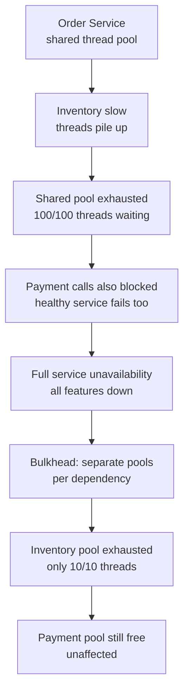
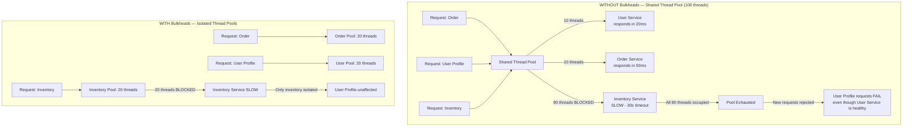
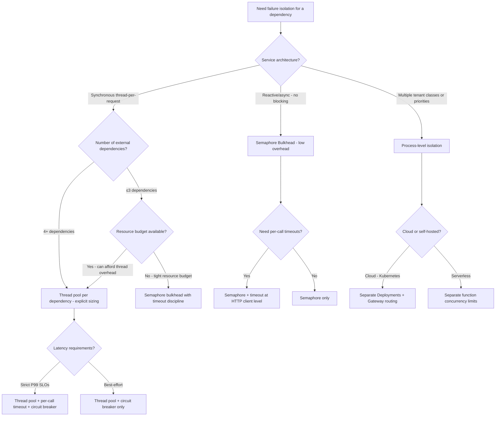

# Bulkhead Pattern: Thread Pool Isolation and Failure Domain Containment

## 🗺️ Quick Overview


*Normal path: requests complete quickly, threads return to pool. Trigger: one dependency slows without timeout. Without bulkheads, thread pool exhaustion in one dependency silently starves all others.*

**An inventory service goes down. Your order service should degrade gracefully — but instead, all threads pile up waiting for inventory responses, and the order service becomes unavailable too. The bulkhead pattern is why Netflix, Amazon, and every serious distributed systems team isolates thread pools per dependency.**

**The non-obvious part: bulkheads cost resources. Sizing the isolation tax is the difference between a resilient system and a resource-starved one.**

---

## The Problem Class `[Mid]`

The word comes from ship engineering. A ship's hull is divided into watertight compartments (bulkheads). If one compartment floods, others remain intact — the ship stays afloat. Without bulkheads, a single breach sinks the ship.

In software: if all your service's threads are in a shared pool, a slow dependency occupies threads. Those threads hold their place in the pool. New requests arrive, all available threads are occupied waiting for the slow dependency, and the service stops processing requests for all dependencies — including healthy ones.



The failure mode without bulkheads is called **thread starvation cascade**: one slow dependency causes all traffic to queue, queues fill up, response times spike across the board, clients time out and retry, amplifying the load.

---

## Why the Obvious Solution Fails `[Senior]`

**Why not just set aggressive timeouts?**

Timeouts help, but they don't prevent exhaustion — they shorten it. With a 10-second timeout and 500 RPS against a slow service, you accumulate 5,000 waiting threads in 10 seconds. If your pool has 200 threads, you exhaust it in 400ms. The timeout kicks in at 10s, but the damage is done at 400ms.

Timeouts and bulkheads work together — timeouts limit how long a thread is occupied, bulkheads limit how many threads are occupied.

**Why not just add more threads?**

Threads have overhead: ~1 MB stack size default in JVM (configurable, but ~256KB minimum for practical work). 1,000 threads = ~1 GB RSS just for stacks. Context switching overhead grows super-linearly. At 2,000+ threads, a JVM service spends more time on scheduling than work.

More threads delays exhaustion but doesn't prevent cascade. With 1,000 threads and 500 RPS against a 2-second slow dependency, you exhaust in 4 seconds, not 400ms.

**Why not async everywhere?**

Async/reactive (Project Reactor, RxJava, Node.js event loop) eliminates thread-per-request overhead — you don't exhaust threads because you're not holding threads during I/O. But:
1. Migration cost: converting a synchronous codebase to reactive is a full rewrite
2. Async doesn't eliminate connection exhaustion — HTTP connection pools, DB connection pools, gRPC channels are still finite
3. Async moves the exhaustion from threads to event loop starvation (if blocking code sneaks in) — often harder to diagnose

Bulkheads apply to connection pools in async systems too.

---

## The Solution Landscape `[Senior]`

Three bulkhead mechanisms, each applicable at a different layer: **Thread Pool Bulkhead**, **Semaphore Bulkhead**, and **Process-Level Isolation**.

---

### Solution 1: Thread Pool Bulkhead

**What it is**

Each downstream dependency gets its own dedicated thread pool. Requests destined for that dependency execute in that pool only. If the pool is full, requests are rejected immediately (fast fail) rather than queuing indefinitely.

**How it actually works at depth**

Resilience4j (Java) thread pool bulkhead configuration:

```java
BulkheadConfig inventoryBulkheadConfig = BulkheadConfig.custom()
    .maxConcurrentCalls(20)          // Max threads executing concurrently
    .maxWaitDuration(Duration.ofMillis(500))  // Max time to wait for thread
    .build();

ThreadPoolBulkheadConfig inventoryPoolConfig = ThreadPoolBulkheadConfig.custom()
    .maxThreadPoolSize(20)           // Thread pool size
    .coreThreadPoolSize(10)          // Core threads always kept alive
    .queueCapacity(10)               // Queue for waiting requests
    .keepAliveDuration(Duration.ofSeconds(20))
    .build();

// Separate pool for user service
ThreadPoolBulkheadConfig userPoolConfig = ThreadPoolBulkheadConfig.custom()
    .maxThreadPoolSize(10)
    .coreThreadPoolSize(5)
    .queueCapacity(5)
    .build();

// Usage
ThreadPoolBulkhead inventoryBulkhead = ThreadPoolBulkhead
    .of("inventory", inventoryPoolConfig);

CompletableFuture<InventoryResponse> result = inventoryBulkhead
    .executeSupplier(() -> inventoryClient.checkStock(itemId));
```

When the inventory service goes slow:
- First 20 requests: executing in pool
- Requests 21-30: queued (queue capacity = 10)
- Request 31+: `BulkheadFullException` thrown immediately — fast fail
- User service pool: unaffected, continues processing normally

**Sizing guidance** `[Staff+]`

The sizing formula for thread pool per dependency:

```
pool_size = (dependency_calls_per_sec × dependency_P99_latency_sec) × safety_factor

Example:
- Inventory service: 200 calls/sec, P99 = 100ms = 0.1s
- pool_size = 200 × 0.1 × 1.5 (safety factor) = 30 threads

- Under degraded conditions (inventory P99 = 2s):
- pool_size = 200 × 2 × 1.5 = 600 threads
  → This is too many. Cap pool at 30, accept that 570 calls/sec will fast-fail.
  → Fast-fail is preferable to 600 threads blocking all other dependencies.
```

**Queue capacity** = how many requests to buffer when all threads are busy. Set queue capacity to pool_size / 2 at most. Larger queues increase max latency without improving throughput; they just delay the fast-fail.

**The isolation tax**:
- 30 threads for inventory + 20 for user + 15 for payment + 10 for shipping = 75 dedicated threads
- vs shared pool of 40 threads that previously handled all four
- Trade-off: ~90% more thread overhead in exchange for failure isolation

**Configuration decisions that matter** `[Staff+]`

- **core vs max pool size**: Set core = expected steady-state concurrency, max = peak burst capacity. The difference is pre-allocated vs on-demand threads. Pre-allocating reduces latency spikes during bursts.
- **Keep-alive duration**: How long idle threads beyond core size stay alive. Set to 2-5x your traffic burst cycle (e.g., if you get bursts every 60s, keep 120s keep-alive).
- **Queue depth vs rejection**: Shallow queues (queue = 0) give immediate back-pressure signals to callers. Deep queues hide problems longer. Prefer shallow queues in latency-sensitive systems.
- **Rejection handler**: Log the rejection with dependency name and current pool state. Increment a metric. Return a meaningful error to the caller (not a generic 503).

**Failure modes** `[Staff+]`

1. **Under-sized pool causing correct fast-fail at steady state**: Pool too small for normal traffic, not just degraded. Symptom: BulkheadFull exceptions during normal load. Diagnosis: check `bulkhead.active.count` metric — if it's always at max, pool is under-sized.

2. **Shared pool for unrelated services**: Team adds a new dependency call inside an existing bulkhead-protected method. Now two dependencies share one pool. One slow dependency blocks the other. Code review must audit dependency calls inside bulkhead boundaries.

3. **Thread-local state leaking across pool threads**: If you use thread-local variables (MDC logging context, security context, request context), pool threads don't inherit the originating thread's state. Use explicit context propagation (MDC.getCopyOfContextMap(), pass security context as parameter).

**Observability** `[Staff+]`

Resilience4j emits these metrics per bulkhead:
- `resilience4j.bulkhead.active.count` — current threads executing
- `resilience4j.bulkhead.waiting.count` — threads in queue
- `resilience4j.bulkhead.failed.calls` — fast-fail count
- `resilience4j.threadpool.queue.capacity.remaining` — queue headroom

Alert thresholds:
- `active.count` consistently > 80% of `max_concurrent_calls`: pool needs resizing or dependency is degraded
- `failed.calls` rate > 1% over 1-minute window: dependency degraded, check circuit breaker integration

---

### Solution 2: Semaphore Bulkhead

**What it is**

Instead of dedicated threads, a semaphore limits concurrent calls to a dependency. Requests execute in the caller's thread but acquire a permit before calling and release it on return. If no permits are available, fast-fail or block briefly.

**How it actually works at depth**

```java
BulkheadConfig semaphoreBulkheadConfig = BulkheadConfig.custom()
    .maxConcurrentCalls(25)          // Max concurrent in-flight calls
    .maxWaitDuration(Duration.ofMillis(0))  // 0 = immediate rejection if full
    .build();

Bulkhead inventorySemaphore = Bulkhead.of("inventory-semaphore", semaphoreBulkheadConfig);

// Caller thread acquires permit, calls dependency, releases permit
Supplier<InventoryResponse> decorated = Bulkhead.decorateSupplier(
    inventorySemaphore,
    () -> inventoryClient.checkStock(itemId)
);
```

**Sizing guidance** `[Staff+]`

Semaphore sizing uses the same Little's Law formula as thread pools. The difference: with semaphore bulkheads, all calls share the same thread pool (usually a servlet container or coroutine pool). Semaphore limits concurrency to the dependency, not thread allocation.

**When to use semaphore vs thread pool**:
- Semaphore: lightweight, no thread overhead, suitable for non-blocking/async callers
- Thread pool: necessary when you need timeout enforcement per-call or truly isolated execution context
- In a reactive stack (WebFlux, Vert.x): use semaphore bulkheads — you don't have dedicated threads to isolate anyway

---

### Solution 3: Process-Level (Service) Isolation

**What it is**

Instead of isolating at the thread level, run separate service instances for different client types or traffic priorities. High-priority traffic (paid customers) goes to a dedicated instance; free-tier traffic goes to a shared instance. One instance's exhaustion doesn't affect the other.

**How it actually works at depth**

```yaml
# Kubernetes deployment: separate instance sets for critical vs standard traffic
# Critical path Order Service (handles VIP customers)
apiVersion: apps/v1
kind: Deployment
metadata:
  name: order-service-critical
spec:
  replicas: 10
  template:
    metadata:
      labels:
        tier: critical
    spec:
      containers:
      - name: order-service
        resources:
          requests: { cpu: "2", memory: "4Gi" }
          limits: { cpu: "4", memory: "8Gi" }
---
# Standard path Order Service (handles regular customers)
apiVersion: apps/v1
kind: Deployment
metadata:
  name: order-service-standard
spec:
  replicas: 20
  template:
    metadata:
      labels:
        tier: standard
```

The API gateway routes by customer tier to the appropriate instance set. A DDoS or traffic spike on standard tier doesn't affect critical tier.

**Sizing guidance** `[Staff+]`

Process-level isolation is the most expensive bulkhead: you're duplicating infrastructure. At 10 replicas for critical + 20 for standard, you're running 30 replicas instead of 25 integrated replicas (~20% overhead). The trade-off is worth it only when:
- Critical traffic revenue impact is significantly higher than standard
- Standard traffic is untrusted (public API, free tier) and could be malicious
- A single bad actor on standard tier could exhaust resources affecting critical traffic

---

## Trade-off Matrix `[Senior]` → `[Staff+]`

| Dimension | Thread Pool Bulkhead | Semaphore Bulkhead | Process Isolation |
|---|---|---|---|
| **Resource overhead** | High (dedicated threads per dep) | Low (shared threads) | Very High (duplicate services) |
| **Timeout enforcement** | Yes (via future timeout) | No (caller thread must timeout) | Depends on service |
| **Async compatibility** | Complex (future composition) | Native (non-blocking semaphore) | Transparent |
| **Failure isolation** | Thread-level | Concurrency-level | Process-level |
| **Context propagation** | Explicit required | Automatic (same thread) | Network boundary |
| **Implementation complexity** | Medium (Resilience4j config) | Low | High (infra + routing) |
| **Best for** | Synchronous Java services | Reactive/async services | Multi-tenant or priority isolation |

---

## Decision Framework `[Senior]` → `[Staff+]`



---

## Production Failure Story `[Staff+]`

**The Database Connection Pool Bulkhead Failure — A SaaS Platform**

A B2B SaaS company had a single PostgreSQL connection pool (HikariCP, max 100 connections) shared across all features: report generation, user dashboard, API, and background jobs. Reports were complex analytical queries (5-60 seconds each). Dashboard queries were fast (10-50ms).

A customer ran a report that triggered a query plan regression — 45-minute execution time. Their report generation queued 15 connections waiting. A second customer triggered the same report. 30 connections occupied. A third and fourth. By the time the operations team noticed, 85/100 connections were occupied by report generation, and dashboard queries were timing out for all customers.

**Fix**: Database connection pool bulkhead by feature:
```java
// HikariCP: separate pools per feature class
HikariConfig reportConfig = new HikariConfig();
reportConfig.setMaximumPoolSize(20);  // reports get max 20 connections
reportConfig.setConnectionTimeout(30_000);

HikariConfig apiConfig = new HikariConfig();
apiConfig.setMaximumPoolSize(50);  // API gets dedicated 50 connections

HikariConfig dashboardConfig = new HikariConfig();
dashboardConfig.setMaximumPoolSize(30);  // dashboards get 30 connections
```

Reports consuming all 20 connections no longer affects API or dashboard. Added circuit breaker on report queries > 30 seconds.

**Key insight**: Bulkheads apply to any shared resource pool — threads, DB connections, HTTP connections, file descriptors. The pattern is the same; the resource varies.

---

## Observability Playbook `[Staff+]`

**Per-bulkhead metrics to expose**:
- `bulkhead_active_calls{bulkhead_name}` — gauge: current in-flight
- `bulkhead_waiting_calls{bulkhead_name}` — gauge: current queued
- `bulkhead_rejected_calls_total{bulkhead_name}` — counter: fast-fails
- `bulkhead_call_duration_seconds{bulkhead_name, outcome}` — histogram

**Dashboard composition**:
- Row per dependency: active/waiting/rejected over time
- Rejection rate as percentage of total calls — spike indicates dependency degradation
- Pool utilization heatmap across deployments (for fleet-wide view)

**Runbook triggers**:
- Rejection rate > 5% sustained 2 minutes: likely dependency degradation → check dependency health
- Active count = max pool size for > 30 seconds: dependency slow → check upstream latency
- Waiting count growing: pool too small or dependency severely degraded → fast-fail and circuit break

---

## Architectural Evolution `[Staff+]`

**2026 perspective**:

Resilience4j remains the standard for JVM services. For Go services, `golang.org/x/sync/semaphore` handles semaphore bulkheads; dedicated thread pool isolation is less common in Go due to goroutine lightness (2KB stack vs JVM 256KB+).

**Service mesh bulkheads**: Istio's `DestinationRule` supports connection pool limits (upstream connection pool bulkhead):
```yaml
apiVersion: networking.istio.io/v1alpha3
kind: DestinationRule
metadata:
  name: inventory-service
spec:
  host: inventory-service
  trafficPolicy:
    connectionPool:
      tcp:
        maxConnections: 30      # TCP connection bulkhead
      http:
        http1MaxPendingRequests: 10  # Queue depth
        http2MaxRequests: 30         # Concurrent requests
        consecutiveGatewayErrors: 5
        outlierDetection:
          consecutive5xxErrors: 5
          interval: 30s
          baseEjectionTime: 30s
```

This provides bulkheads at the infrastructure level without code changes — a significant operational advantage.

**Kotlin Coroutines + Structured Concurrency**: `kotlinx.coroutines` allows defining `CoroutineScope` per dependency with explicit concurrency limits. This achieves thread pool isolation semantics without dedicated threads — better resource efficiency than Hystrix/Resilience4j thread pools for Kotlin codebases.

---

## 🎯 Interview Questions

### Common Interview Questions on the Bulkhead Pattern

#### Q1: How do you prevent thread pool exhaustion when calling multiple external services?
**What interviewers look for**: Whether you understand thread starvation cascade and can propose isolation at the right granularity. Many candidates know "use timeouts" but miss that timeouts alone are insufficient.

**Answer framework**:
1. Diagnose the failure mode: a shared thread pool means one slow service occupies all threads. With a 10s timeout and 500 RPS against a slow service, you exhaust a 200-thread pool in 400ms — the timeout kicks in at 10s, but the damage is done in under a second
2. Apply thread pool bulkheads: each downstream dependency gets its own dedicated pool. Inventory gets 30 threads, Payment gets 20, Shipping gets 15. Inventory pool exhaustion cannot affect Payment or Shipping
3. Size each pool using Little's Law: `pool_size = RPS × P99_latency_sec × safety_factor`. At 200 RPS and 100ms P99, that's 200 × 0.1 × 1.5 = 30 threads. If the dependency degrades to 2s P99, fast-fail at 30 threads rather than scaling to 600
4. Combine with circuit breaker: when bulkhead rejection rate exceeds 5% over 2 minutes, open the circuit — stop calling the dependency entirely and return a fallback immediately

**Key numbers to mention**: JVM thread stack size: ~256KB minimum, ~1MB default. 1000 threads = ~1GB RSS for stacks alone. Pool sizing formula: RPS × P99 × 1.5 safety factor. Alert when rejection rate > 1% over 1-minute window.

---

#### Q2: What's the difference between thread pool and semaphore bulkheads? When do you use each?
**What interviewers look for**: Deep understanding of the resource model difference and the async/reactive dimension.

**Answer framework**:
1. Thread pool bulkhead: each dependency call executes in a dedicated thread pool. The calling thread hands off to a pool thread and can proceed (or is freed in async mode). Provides true isolation — pool threads are separate from servlet container threads. Overhead: dedicated threads per dependency consume memory even when idle (~256KB per thread)
2. Semaphore bulkhead: limits concurrent calls via a counter (semaphore), but calls execute in the calling thread. No new threads are created. When the semaphore limit is reached, the calling thread either fast-fails or waits briefly. Overhead: near-zero (just a counter). Cannot enforce per-call timeouts via the bulkhead itself — must rely on HTTP client timeouts
3. Decision: synchronous thread-per-request service (Spring MVC, Java EE) → thread pool bulkheads for true isolation. Reactive/async service (Spring WebFlux, Vert.x, Node.js, Go goroutines) → semaphore bulkheads since you don't have dedicated threads to isolate anyway

**Key numbers to mention**: Resilience4j thread pool: 30 threads for one dependency = ~8MB thread stack overhead. Semaphore bulkhead: near-zero overhead. Go goroutines: 2KB initial stack (vs JVM 256KB) — semaphore sufficient for Go services.

---

#### Q3: How do you apply bulkhead patterns to database connection pools?
**What interviewers look for**: Understanding that bulkheads apply to any shared resource, not just HTTP calls.

**Answer framework**:
1. The pattern is identical: a shared connection pool of 100 connections, where report queries take 5-60 seconds, will exhaust the pool and starve dashboard queries (10-50ms) — same thread starvation cascade, just with DB connections
2. Solution: separate HikariCP pools per feature class. Reports: max 20 connections with a 30s query timeout and circuit breaker. API: max 50 connections. Dashboard: max 30 connections. Reports exhausting their 20 connections cannot affect API or Dashboard
3. Extended to other resources: HTTP connection pools per upstream service, Redis connection pools per use case (cache vs session vs rate limiting), file descriptor limits per feature

**Key numbers to mention**: Real incident pattern: B2B SaaS, 100 shared DB connections, report query regression (45 min), 4 customers triggered it simultaneously = 80/100 connections occupied = dashboard timeouts for all customers. Fix: HikariCP pools per feature class.

---

#### Q4: How do you implement service-level (process) isolation for multi-tenant systems?
**What interviewers look for**: When thread-level isolation isn't enough — the premium/free tier problem.

**Answer framework**:
1. Thread pool bulkheads protect within a service instance, but all tenant traffic still shares the same OS process. A DDoS on free-tier customers can CPU-saturate the pod and slow paid-tier customers even with bulkheads
2. Process isolation: separate Kubernetes Deployments for critical (paid/VIP) and standard (free) traffic. API gateway routes by customer tier — `X-Customer-Tier: enterprise` header routes to the critical deployment. Standard traffic cannot affect critical traffic at all levels: CPU, memory, network, DB connections
3. Cost justification: 10 critical replicas + 20 standard replicas = 30 replicas vs 25 integrated = ~20% overhead. Worth it only when critical traffic's revenue impact significantly exceeds standard, or when standard traffic is untrusted

**Key numbers to mention**: Process isolation overhead: ~20% more replicas vs integrated. Kubernetes: separate Deployments with `nodeAffinity` to ensure physical node isolation if required. Use `PodDisruptionBudget` to guarantee critical replicas survive node maintenance.

---

#### Q5: How do you size and test that bulkheads are working correctly?
**What interviewers look for**: Whether you can operationalize the pattern — not just implement but verify.

**Answer framework**:
1. Sizing test: verify normal-load operation first. If rejection rate > 0% at steady state, the pool is under-sized. Check `bulkhead.active.count` metric — if it's always at max under normal load, increase pool size
2. Isolation test: deliberately slow one dependency (chaos engineering: inject 5-second latency on Inventory service). Verify that Payment and Shipping pools remain free and their rejection rates stay at 0%. This is the key correctness test for bulkhead isolation
3. Fast-fail test: drive load beyond bulkhead capacity. Verify that requests return `BulkheadFullException` (or HTTP 503) immediately (< 1ms), not after a timeout. The fast-fail latency must be much lower than the dependency timeout
4. Metrics to watch: `bulkhead_active_calls`, `bulkhead_rejected_calls_total`, `bulkhead_waiting_calls`. Alert when rejection rate > 5% sustained 2 minutes

**Key numbers to mention**: Rejection latency should be < 1ms (immediate fast-fail vs 10s timeout). Load test tool for chaos: Chaos Monkey, k6, or direct HTTP timeout injection. Alert threshold: rejection rate > 5% for 2 minutes = dependency degraded.

---

#### Q6: Explain the Resilience4j bulkhead + circuit breaker combination. How do they interact?
**What interviewers look for**: Understanding of layered resilience — bulkheads and circuit breakers are complementary, not alternatives.

**Answer framework**:
1. Bulkhead limits concurrent calls. Circuit breaker stops calls entirely when failures exceed a threshold. They are different dimensions of protection: bulkhead = concurrency limit, circuit breaker = failure rate limit
2. Interaction: when the Inventory bulkhead consistently fills up (high rejection rate), this signals the dependency is slow or overloaded. The circuit breaker should open at this point, stopping new calls rather than queuing them. This means the bulkhead feeds signal into the circuit breaker
3. Configuration: Resilience4j allows stacking decorators — `CircuitBreaker.decorateSupplier(circuitBreaker, ThreadPoolBulkhead.decorateSupplier(bulkhead, () -> inventoryClient.call()))`. Order matters: circuit breaker wraps bulkhead so a tripped circuit prevents even bulkhead queue entries
4. Recovery: circuit breaker in HALF-OPEN state allows a small number of probe calls. If these succeed, the circuit closes and the bulkhead drains its queue normally

**Key numbers to mention**: Resilience4j circuit breaker threshold: open when failure rate > 50% over last 10 calls (configurable). Half-open: allow 5 probe calls. Bulkhead rejection rate > 1% over 1 minute → check if circuit breaker should open.

---

## 💡 Pseudocode Walkthrough

```pseudocode
// Thread Pool Bulkhead — protecting 3 dependencies with isolated pools
// Using Little's Law sizing: pool = RPS × P99_latency × safety_factor

DEFINE bulkheads:
  inventory_pool  = ThreadPool(maxThreads=30, queue=15)  // 200 RPS × 0.1s × 1.5
  payment_pool    = ThreadPool(maxThreads=20, queue=10)  // 100 RPS × 0.1s × 2.0
  shipping_pool   = ThreadPool(maxThreads=10, queue=5)   // 50 RPS × 0.1s × 2.0

function processOrder(order):
  // Each call executes in its own isolated pool
  inventoryFuture = inventory_pool.submit(() ->
    inventoryService.reserve(order.items)
  )
  // If inventory_pool is full → BulkheadFullException immediately (< 1ms)
  // Payment pool is unaffected by inventory pool exhaustion

  inventory = inventoryFuture.get(timeout=5s)
  if inventory.failed:
    return FAIL("inventory_unavailable")

  paymentFuture = payment_pool.submit(() ->
    paymentService.charge(order.amount)
  )
  payment = paymentFuture.get(timeout=10s)
  if payment.failed:
    inventory_pool.submit(() -> inventoryService.release(order.items))
    return FAIL("payment_declined")

  return SUCCESS

// FAILURE SCENARIO: Inventory service degrades to 30s response time
// inventory_pool hits maxThreads=30 after 30 × 30s = 900 seconds (overflow)
// Actually: pool fills at 200 RPS in 30/200 = 0.15 seconds
// Requests 31+ → BulkheadFullException in < 1ms (fast-fail)
// payment_pool remains at 0/20 — Payment calls unaffected
```

---

## Decision Framework Checklist `[All Levels]`

- [ ] Identified all external dependencies that could experience latency spikes
- [ ] Sized thread pool per dependency using Little's Law: pool = RPS × P99_latency × safety_factor
- [ ] Defined queue depth per bulkhead (recommendation: pool_size / 2)
- [ ] Defined rejection behavior: return error code, fall back to cache, or degrade feature
- [ ] Verified context propagation (MDC, security context) works across thread pool boundaries
- [ ] Metrics emitted per bulkhead: active, waiting, rejected counts
- [ ] Alert thresholds set: rejection rate > X% triggers investigation
- [ ] Circuit breaker integrated with bulkhead: when bulkhead consistently full, circuit opens
- [ ] Considered database connection pool bulkhead per feature class
- [ ] Load tested: verify that saturating one dependency's bulkhead does not affect others
- [ ] Sized the isolation tax: total threads across all bulkheads is within JVM memory budget
- [ ] If reactive stack: switched to semaphore bulkheads to avoid thread overhead

## Next Steps

- **Combine with circuit breakers**: Bulkheads and circuit breakers are a standard pair → [Circuit Breaker Pattern](/10-architecture/concepts/circuit-breaker)
- **Service mesh bulkheads**: Istio DestinationRule provides bulkheads at the infrastructure level → [Service Mesh Architecture](./service-mesh-architecture)
- **Resilience full picture**: How bulkheads fit into the broader resilience strategy → [Deployment Strategies](./deployment-strategies-deep-dive)

*Written by Gaurav Porwal — 10+ Year Engineer | Tech Lead | Product Owner | Business-Minded Builder*
*Last updated: 2026-03-18*
