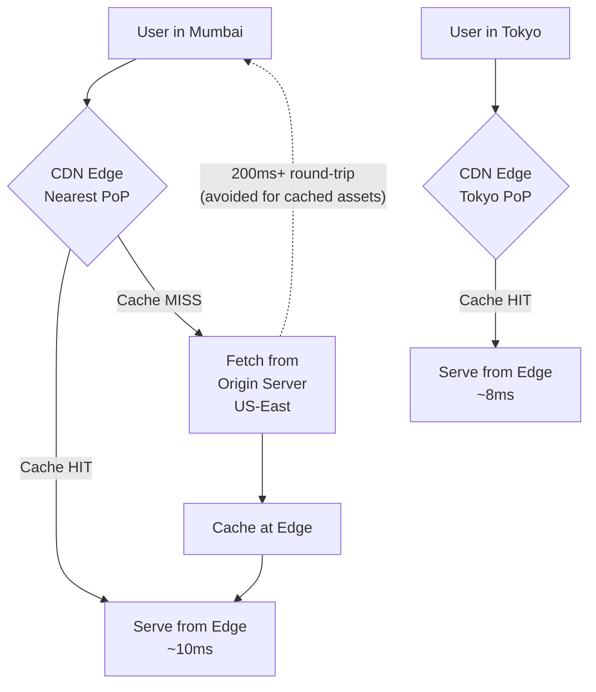

# CDN & Edge Computing - Serve Content from the Closest Location

> **Reading Time:** 22 minutes
> **Difficulty:** Intermediate
> **Impact:** Cut your P50 latency by 60-80% and survive traffic spikes you never planned for

## 🗺️ Quick Overview



*A CDN places cached copies of content at edge locations worldwide — users hit the nearest Point of Presence instead of a distant origin server, reducing latency from ~200ms to ~10ms.*

## Why CDNs Exist

**The speed of light is your enemy.**

```
Server location: US-East (Virginia)
User location: Mumbai, India

Without CDN:
  Distance: 13,500 km
  Round-trip time: ~200ms (just network, nothing else)
  TCP handshake: 200ms
  TLS handshake: 200ms
  Data transfer: 100ms
  Total: ~700ms for first byte

With CDN (edge server in Mumbai):
  Distance: 5 km (local PoP)
  Round-trip time: ~2ms
  TCP + TLS: 4ms (already cached)
  Data transfer: 5ms
  Total: ~11ms for first byte

  That's a 63x improvement.
```

**CDN impact at real companies:**

```
Netflix: CDN serves 95% of traffic from edge
  → Open Connect handles 15% of all internet traffic

Cloudflare: 310+ data centers globally
  → Average 50ms TTFB worldwide

Amazon: 1% latency increase = 1% revenue decrease
  → CloudFront serves from 450+ edge locations

Shopify: CDN reduced page load from 3.2s to 1.1s
  → 12% increase in conversion rate
```

---

## How CDNs Work

### The Basic Flow

```
First request (cache MISS):

User (Mumbai) → CDN Edge (Mumbai) → Origin Server (Virginia)
                                            │
                                     Generate response
                                            │
User (Mumbai) ← CDN Edge (Mumbai) ← Origin Server (Virginia)
                      │
                 Cache response
                 (for next time)

Second request (cache HIT):

User (Mumbai) → CDN Edge (Mumbai) → Response from cache!
                      │
                 No origin call
                 Response in <10ms
```

### CDN Architecture

```
┌─────────────────────────────────────────────────────────────┐
│                    CDN Network (Global)                      │
│                                                             │
│  ┌──────────┐  ┌──────────┐  ┌──────────┐  ┌──────────┐    │
│  │ Edge PoP │  │ Edge PoP │  │ Edge PoP │  │ Edge PoP │    │
│  │ Mumbai   │  │ London   │  │ Tokyo    │  │ São Paulo│    │
│  │          │  │          │  │          │  │          │    │
│  │ Cache    │  │ Cache    │  │ Cache    │  │ Cache    │    │
│  │ ┌─────┐  │  │ ┌─────┐  │  │ ┌─────┐  │  │ ┌─────┐  │    │
│  │ │SSD  │  │  │ │SSD  │  │  │ │SSD  │  │  │ │SSD  │  │    │
│  │ │Cache│  │  │ │Cache│  │  │ │Cache│  │  │ │Cache│  │    │
│  │ └─────┘  │  │ └─────┘  │  │ └─────┘  │  │ └─────┘  │    │
│  └─────┬────┘  └─────┬────┘  └─────┬────┘  └─────┬────┘    │
│        │             │             │             │          │
│        └─────────────┼─────────────┼─────────────┘          │
│                      │             │                        │
│              ┌───────▼─────────────▼───────┐                │
│              │     Regional Shields        │                │
│              │  (Mid-tier cache layer)     │                │
│              │                             │                │
│              │  US-East    EU-West  APAC   │                │
│              └─────────────┬───────────────┘                │
│                            │                                │
└────────────────────────────┼────────────────────────────────┘
                             │
                      ┌──────▼──────┐
                      │   Origin    │
                      │   Server    │
                      │ (your app)  │
                      └─────────────┘

PoP = Point of Presence (edge data center)
Shield = Regional cache that protects origin from thundering herd
```

---

## Caching Strategies

### Pull-Based (Lazy Loading)

```
How it works:
  1. User requests /image/cat.jpg
  2. CDN edge checks cache → MISS
  3. CDN fetches from origin
  4. CDN caches response + returns to user
  5. Next request → cache HIT

Timeline:
  Request 1: CDN ──MISS──▶ Origin (slow, ~500ms)
  Request 2: CDN ──HIT──▶ Cache (fast, ~10ms)
  Request 3: CDN ──HIT──▶ Cache (fast, ~10ms)
  ...
  TTL expires: CDN ──MISS──▶ Origin (slow again)

Pros:
  ✅ Simple - no push mechanism needed
  ✅ Only popular content gets cached (natural LRU)
  ✅ Origin only hit on cache miss

Cons:
  ❌ First request is slow (cold cache)
  ❌ TTL expiry causes periodic origin hits
  ❌ Cache stampede risk when TTL expires
```

### Push-Based (Pre-loading)

```
How it works:
  1. You upload content to CDN before users request it
  2. CDN distributes to all edge locations
  3. Users always get cache HIT

Use cases:
  - Video streaming (pre-position content)
  - Software updates (push to all edges)
  - New product launches (warm cache before announcement)
  - Static site deployment (push entire site)

Netflix Open Connect:
  New movie released → Push to all ISP caches overnight
  User clicks play → Served from ISP's local cache
  Result: No buffering even at 4K
```

### Cache Headers (Cache-Control)

```
Server tells CDN how to cache:

# Cache for 1 hour, allow CDN to cache
Cache-Control: public, max-age=3600

# Cache for 1 day, stale content OK for 1 hour while revalidating
Cache-Control: public, max-age=86400, stale-while-revalidate=3600

# Don't cache at all (user-specific content)
Cache-Control: private, no-store

# Cache but always revalidate with origin
Cache-Control: public, no-cache
ETag: "abc123"

Common patterns:
┌─────────────────────┬──────────────────────────────────┐
│ Content Type        │ Cache-Control                    │
├─────────────────────┼──────────────────────────────────┤
│ Static assets       │ public, max-age=31536000,        │
│ (JS, CSS, images)   │ immutable                        │
│                     │ (1 year, fingerprinted filenames) │
├─────────────────────┼──────────────────────────────────┤
│ HTML pages          │ public, max-age=300,             │
│                     │ stale-while-revalidate=60        │
│                     │ (5 min, serve stale while check) │
├─────────────────────┼──────────────────────────────────┤
│ API responses       │ public, max-age=60,              │
│ (product listings)  │ s-maxage=300                     │
│                     │ (1 min browser, 5 min CDN)       │
├─────────────────────┼──────────────────────────────────┤
│ User-specific data  │ private, no-store                │
│ (cart, profile)     │ (never cache on CDN)             │
├─────────────────────┼──────────────────────────────────┤
│ API responses       │ private, no-cache                │
│ (authenticated)     │ (revalidate every time)          │
└─────────────────────┴──────────────────────────────────┘
```

---

## Cache Invalidation

### The Hardest Problem in Computer Science

```
"There are only two hard things in Computer Science:
 cache invalidation and naming things."
 — Phil Karlton

Problem: You cached product price as $99
         Price changed to $79
         CDN still serves $99 for the next hour!
```

### Strategy 1: TTL-Based Expiration

```
Set it and forget it:
  Cache-Control: max-age=300 (5 minutes)

After 5 minutes, CDN fetches fresh content from origin.

Pros: Simple, predictable
Cons: Stale content for up to TTL duration
Best for: Content that changes infrequently
```

### Strategy 2: Purge / Invalidate

```
Actively tell CDN to drop cached content:

# Cloudflare API: Purge specific URL
POST /zones/{zone_id}/purge_cache
{ "files": ["https://example.com/product/123"] }

# CloudFront: Create invalidation
aws cloudfront create-invalidation \
  --distribution-id E1234 \
  --paths "/product/123" "/product/123/*"

Pros: Immediate freshness
Cons: Purge propagation takes 1-5 seconds globally
Best for: Price changes, content corrections
```

### Strategy 3: Versioned URLs (Best Practice)

```
Instead of purging, change the URL:

Old: /static/app.js         → Cached for 1 year
New: /static/app.a1b2c3.js  → New URL = new cache entry

Build process:
  app.js → hash contents → app.a1b2c3.js
  HTML updated to reference new filename

Pros: Instant updates, no purging needed, safe rollback
Cons: Requires build pipeline
Best for: Static assets (JS, CSS, images)

This is why frameworks use content hashing:
  Next.js:  /_next/static/chunks/app-a1b2c3.js
  Webpack:  /bundle.abc123.js
  Vite:     /assets/index-def456.js
```

### Strategy 4: Stale-While-Revalidate

```
Serve stale content immediately, refresh in background:

Cache-Control: max-age=60, stale-while-revalidate=30

Timeline:
  t=0:   Cache response (fresh)
  t=60:  Content is "stale" but still served
         CDN starts background fetch from origin
  t=61:  User gets stale content (fast!)
         Origin returns fresh content
  t=62:  Cache updated with fresh content
  t=90:  Content too old, must wait for origin

Pros: Users never wait for origin
Cons: Brief window of stale data
Best for: Product listings, search results, feeds
```

---

## Edge Computing: Beyond Caching

### Running Code at the Edge

```
Traditional: All logic runs at origin

            User (Tokyo) ────200ms────▶ Server (Virginia)
                                        Process request
            User (Tokyo) ◀───200ms──── Server (Virginia)
            Total: 400ms+ round trip

Edge computing: Logic runs at CDN edge

            User (Tokyo) ───2ms───▶ Edge (Tokyo)
                                    Run code HERE
            User (Tokyo) ◀──2ms─── Edge (Tokyo)
            Total: 4ms round trip
```

### What Runs at the Edge?

```
Use cases that benefit from edge computing:

1. A/B Testing
   Edge decides which variant to serve
   No origin round-trip needed

2. Authentication
   JWT validation at the edge
   Reject unauthorized requests before they reach origin

3. Geolocation Routing
   Detect country → serve localized content
   Redirect to nearest data center

4. Image Optimization
   Resize/compress images per device
   WebP for Chrome, AVIF for Safari

5. API Response Transformation
   Aggregate multiple origin APIs at edge
   Return combined response to mobile client

6. Bot Protection
   Block scrapers and bots at the edge
   Challenge suspicious traffic with CAPTCHA
```

### Edge Platforms Comparison

```
Platform           Runtime        Cold Start    Locations
─────────          ───────        ──────────    ─────────
Cloudflare Workers V8 Isolates   < 5ms         310+
AWS Lambda@Edge    Node.js/Python 50-100ms      450+
Vercel Edge        V8             < 5ms         100+
Fastly Compute     Wasm           < 1ms         90+
Deno Deploy        V8             < 5ms         35+
```

```javascript
// Example: Cloudflare Worker for A/B testing
export default {
  async fetch(request) {
    const url = new URL(request.url);

    // Get or assign user to test group
    const cookie = request.headers.get('Cookie') || '';
    let group = getCookie(cookie, 'ab-group');

    if (!group) {
      group = Math.random() < 0.5 ? 'A' : 'B';
    }

    // Route to different origins based on group
    const origin = group === 'A'
      ? 'https://v1.example.com'
      : 'https://v2.example.com';

    const response = await fetch(origin + url.pathname, request);

    // Set cookie for consistent experience
    const newResponse = new Response(response.body, response);
    newResponse.headers.set('Set-Cookie',
      `ab-group=${group}; Path=/; Max-Age=86400`
    );

    return newResponse;
  }
};
```

---

## CDN for Different Content Types

### Static Assets

```
Images, JS, CSS, fonts:

Strategy: Aggressive caching + versioned URLs
TTL: 1 year (immutable)
Invalidation: Change filename on deploy

Headers:
Cache-Control: public, max-age=31536000, immutable
```

### Dynamic Content (API Responses)

```
Product listings, search results, feeds:

Strategy: Short TTL + stale-while-revalidate
TTL: 30-300 seconds
Invalidation: TTL expiry + optional purge on update

Headers:
Cache-Control: public, s-maxage=60, stale-while-revalidate=30
Vary: Accept-Encoding, Accept-Language

Cache key includes:
  URL + query params + Accept-Language + device type
```

### Video Streaming

```
Netflix/YouTube approach:

Video chunks (HLS/DASH):
  - Video split into 2-10 second segments
  - Each segment is a separate cacheable file
  - CDN caches segments at edge

  video/movie-123/
  ├── manifest.m3u8        (playlist - short cache)
  ├── segment-001-1080p.ts (cached for days)
  ├── segment-001-720p.ts  (cached for days)
  ├── segment-002-1080p.ts (cached for days)
  └── ...

  Adaptive bitrate:
  - Player starts with low quality (fast start)
  - Monitors bandwidth
  - Switches to higher quality segments
  - Each quality level cached separately

Netflix Open Connect:
  - Custom CDN appliances inside ISPs
  - Pre-positions popular content overnight
  - 95% of traffic served from ISP cache
  - Zero transit costs for popular content
```

### Personalized Content

```
Problem: User-specific content can't be cached... or can it?

Strategy: Edge Side Includes (ESI) / Fragment Caching

Page structure:
┌─────────────────────────────┐
│ Header (cached - same for   │  ← CDN cache
│ all users)                  │
├─────────────────────────────┤
│ Product listing (cached -   │  ← CDN cache
│ same for all users)         │
├─────────────────────────────┤
│ "Hi John!" + Cart (5 items) │  ← NOT cached (personal)
│ Recommendations for John    │  ← NOT cached (personal)
├─────────────────────────────┤
│ Footer (cached)             │  ← CDN cache
└─────────────────────────────┘

80% of the page is cacheable
20% fetched from origin per request
Result: Much faster than fetching entire page from origin
```

---

## Multi-CDN Strategy

```
Why use multiple CDNs?

1. Redundancy: If Cloudflare goes down, traffic routes to Fastly
2. Performance: Different CDNs perform better in different regions
3. Cost: Route traffic to cheapest CDN per region
4. Features: Cloudflare for security, Akamai for video

Architecture:
┌────────┐     ┌──────────────┐
│  User  │────▶│  DNS (Route53)│
└────────┘     │  or GSLB     │
               └──────┬───────┘
                      │
          ┌───────────┼───────────┐
          ▼           ▼           ▼
    ┌──────────┐ ┌──────────┐ ┌──────────┐
    │Cloudflare│ │  Akamai  │ │ CloudFront│
    │(Primary) │ │(Failover)│ │  (Video)  │
    └─────┬────┘ └─────┬────┘ └─────┬────┘
          │            │            │
          └────────────┼────────────┘
                       ▼
                ┌─────────────┐
                │   Origin    │
                └─────────────┘

DNS-based routing:
  Asia → Cloudflare (best performance)
  Europe → Akamai (best coverage)
  Americas → CloudFront (lowest cost)
  Failover → If primary CDN health check fails,
             route to secondary
```

---

## CDN Security

```
CDNs provide critical security features:

1. DDoS Protection
   CDN absorbs volumetric attacks at edge
   Your origin never sees the traffic
   Cloudflare: Mitigated 71M req/sec DDoS (2023)

2. Web Application Firewall (WAF)
   Block SQL injection, XSS at the edge
   Rules updated globally in seconds

3. Bot Management
   Identify and block scrapers, credential stuffers
   CAPTCHA challenges for suspicious traffic

4. SSL/TLS Termination
   HTTPS handled at edge (faster handshake)
   Origin can use HTTP internally (simpler)

5. Rate Limiting
   Per-IP/per-path rate limits at edge
   Protect origin from abuse

6. Origin Shielding
   Regional cache layer between edge and origin
   Reduces origin requests by 90%+
```

---

## CDN Comparison

```
Provider      Locations  Best For              Pricing Model
──────────    ─────────  ──────────            ─────────────
Cloudflare    310+       Security, performance Free tier + usage
AWS CloudFront 450+      AWS integration       Per GB + requests
Akamai        4,100+     Enterprise, video     Per GB (premium)
Fastly        90+        Real-time purging     Per GB + requests
Bunny CDN     114+       Simple, affordable    Per GB (cheapest)

Decision guide:
  Startup/Small: Cloudflare (free tier, great defaults)
  AWS-heavy: CloudFront (integrated, no egress to AWS)
  Enterprise video: Akamai (most edge locations)
  Real-time content: Fastly (instant purge, VCL)
  Budget: Bunny CDN (cheapest per GB)
```

---

## Common Mistakes

### 1. Not Setting Cache Headers

```
❌ No Cache-Control header
   CDN may cache for unpredictable duration
   Or not cache at all

✅ Always set explicit cache headers
   Static: Cache-Control: public, max-age=31536000, immutable
   Dynamic: Cache-Control: public, max-age=60, stale-while-revalidate=30
   Private: Cache-Control: private, no-store
```

### 2. Caching Authenticated Responses

```
❌ Cache API response that includes user data
   GET /api/profile → cached at CDN
   Next user gets WRONG profile data!

✅ Use Vary header or private directive
   Cache-Control: private, no-store
   Or: Vary: Authorization (cache per auth token)
```

### 3. Cache Key Ignoring Important Parameters

```
❌ CDN caches /products?page=1 and serves for ?page=2
   Users see wrong page!

✅ Configure CDN cache key to include relevant query params
   Cache key: URL + page + sort + filter
   Ignore: tracking params (utm_source, fbclid)
```

### 4. No Origin Shield

```
❌ 100 edge locations all fetch from origin on cache miss
   = 100x load spike on origin when cache expires

✅ Use origin shield (regional cache)
   100 edges → 3 shields → 1 origin request
   99% reduction in origin load
```

---

## 🎯 Interview Questions

### Common Interview Questions on CDN and Edge Computing

#### Q1: How does a CDN reduce latency for global users?
**What interviewers look for**: The ability to explain the physics of latency (speed of light), the PoP caching model, and quantified impact — not just "it caches stuff closer."

**Answer framework**:
1. **Speed of light is the constraint**: A US-East origin server is 13,500 km from Mumbai. A round-trip takes ~200ms just for photons to travel the fiber route. TCP handshake + TLS + data transfer adds to 700ms+ for first-byte. No amount of software optimization can fix physics.
2. **CDN PoPs eliminate the distance**: A CDN edge server in Mumbai returns cached responses in ~10ms. The first request (cache MISS) still goes to origin, but subsequent requests (cache HITs) are served locally.
3. **Cache hit ratio matters**: A CDN delivering 95% cache hit ratio means only 5% of requests reach origin. Netflix Open Connect achieves 95% edge delivery, handling 15% of all internet traffic without overloading origin.

**Key numbers to mention**: CDN reduces P50 latency from ~500ms to ~10ms for global users (50x improvement). Shopify reduced page load from 3.2s to 1.1s with CDN, yielding a 12% conversion rate increase. Amazon's rule: 1% latency increase = 1% revenue decrease.

---

#### Q2: How would you invalidate CDN cache after a hotfix?
**What interviewers look for**: Knowledge of the three invalidation strategies and their trade-offs, and when each applies.

**Answer framework**:
1. **Purge/Invalidate API (for urgent fixes)**: Call Cloudflare or CloudFront's API to purge specific URLs. Takes 1–5 seconds to propagate globally. Use for price corrections, security patches, or content mistakes. Example: `aws cloudfront create-invalidation --paths "/product/123"`.
2. **Versioned URLs (best practice for deployments)**: Content-hash the filename at build time (`app.a1b2c3.js`). New deploy = new filename = new cache entry — no purging needed. Instant effect, safe rollback (old file still cached if you need to roll back). This is how Next.js, Webpack, and Vite all work.
3. **Short TTL + stale-while-revalidate (for dynamic content)**: Use `Cache-Control: public, max-age=60, stale-while-revalidate=30`. Content expires in 60 seconds; CDN serves stale while revalidating in background. No manual purge needed for most updates.

**Key numbers to mention**: Purge propagation on Cloudflare takes ~1–2 seconds globally (310+ PoPs). On CloudFront it takes 1–5 minutes to all 450+ edge locations. For immediate effect, versioned URLs are instant and require zero API calls.

---

#### Q3: What is edge computing and when does it make sense over CDN caching?
**What interviewers look for**: Understanding that edge computing = running code at the edge, not just serving static files — and the trade-offs vs. origin compute.

**Answer framework**:
1. **CDN caches static responses. Edge computing runs logic at the edge.** Instead of a request traveling 200ms to origin to run a function, you run the function 2ms away at the edge PoP. Cloudflare Workers, Lambda@Edge, and Vercel Edge Functions are examples.
2. **Good edge use cases**: A/B testing (assign variant at edge, no origin round-trip), JWT validation and auth (reject unauthorized requests before they reach origin — reduces origin load by 20–40%), geolocation routing (detect country, serve localized content or redirect to nearest datacenter), image resizing (convert to WebP/AVIF per device at edge).
3. **When NOT to use edge**: Anything requiring database writes or complex stateful logic — edge functions are stateless and have no local database access. Cloudflare KV adds ~20ms for reads; it's not a replacement for a relational DB. Keep complex business logic at origin.

**Key numbers to mention**: Cloudflare Workers cold start < 5ms (V8 isolates, not containers). Lambda@Edge cold start 50–100ms. Vercel Edge Functions < 5ms. Origin Lambda cold start 100–500ms. For auth and routing, edge is 10–100x faster.

---

#### Q4: What happens when a CDN cache misses on a popular URL after a deploy?
**What interviewers look for**: Awareness of the thundering herd / cache stampede problem at the CDN layer and mitigation with origin shielding.

**Answer framework**:
1. **Without origin shielding, all 300+ edge PoPs simultaneously miss and hit origin** on the first request after deploy. With 1,000 req/s globally, origin could receive 300,000 req/s in the first second.
2. **Origin Shield (mid-tier cache)**: A regional cache layer sits between edge PoPs and origin. 300 edge PoPs → 3 regional shields → 1 origin request. Reduces origin load by 99%+ on cache miss.
3. **Prewarming** for predictable events: Before a product launch announcement, push content to CDN edges using API (push-based caching). Netflix pre-positions new movie content on ISP appliances overnight before the premiere.

**Key numbers to mention**: Without origin shielding, a Cloudflare CDN with 310 PoPs can send 310x traffic to origin on cold cache. With origin shielding, origin sees 1–3x normal traffic. This prevents the [Thundering Herd](/problems-at-scale/availability/thundering-herd) pattern at the CDN level.

---

#### Q5: How do you design a global API for sub-100ms response times worldwide?
**What interviewers look for**: Multi-layer thinking that combines CDN, edge computing, and multi-region architecture, not just "use a CDN."

**Answer framework**:
1. **Layer 1 — CDN for cacheable responses**: Static assets (images, JS, CSS) with 1-year TTL. Dynamic but shared content (product listings, search results) with 60s TTL + stale-while-revalidate. This handles 70–90% of requests.
2. **Layer 2 — Edge compute for personalization**: JWT validation, A/B test assignment, geo-routing — all at the edge without origin round-trip. Adds ~2ms, not ~200ms.
3. **Layer 3 — Multi-region origin for uncacheable requests**: User-specific data (cart, profile, real-time prices) must hit origin. Deploy origin in 3–5 regions (US, EU, APAC). Use GeoDNS to route users to nearest region. P99 latency for uncacheable requests: ~50ms within region, ~150ms cross-region.

**Key numbers to mention**: Netflix achieves global P50 < 50ms by combining CDN (95% of traffic) + multi-region origin (5%). For purely API-heavy systems like trading platforms, multi-region alone can achieve <50ms within a continent without CDN.

---

## Key Takeaways

```
1. CDNs are not optional at scale
   60-80% latency reduction for global users
   Essential for static assets, beneficial for dynamic content

2. Use versioned URLs for static assets
   Content-hash filenames + long TTL = perfect caching
   No purging needed, instant updates on deploy

3. stale-while-revalidate is your best friend
   Users never wait for origin
   Fresh content arrives in background

4. Edge computing moves logic closer to users
   Auth, A/B testing, personalization at the edge
   Sub-5ms response times globally

5. Cache headers are not optional
   Every response needs explicit Cache-Control
   Different strategies per content type

6. Consider multi-CDN for resilience
   DNS-based routing between CDN providers
   No single point of failure

7. Security at the edge blocks threats early
   DDoS, WAF, bot protection before reaching origin
   CDN is your first line of defense
```
