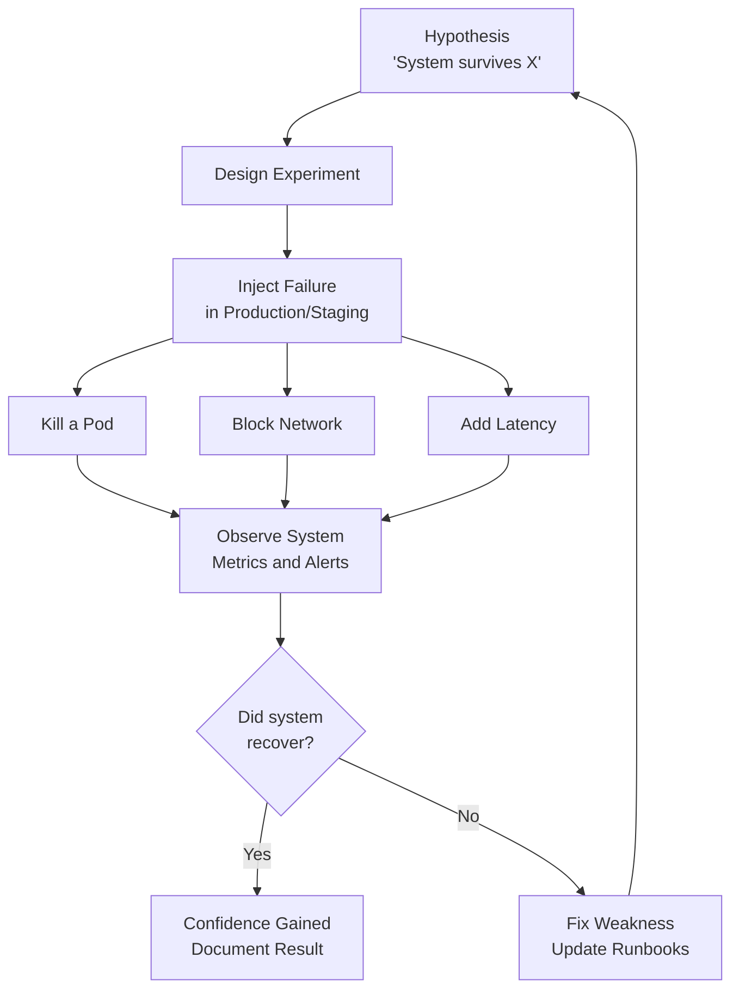

# Chaos Engineering - Test Resilience by Breaking Things

> **Reading Time:** 18 minutes
> **Difficulty:** Advanced
> **Impact:** Find failures in production before your users do

## 🗺️ Quick Overview



*Chaos engineering proactively injects known failure types into a running system to verify that resilience mechanisms actually work — closing the gap between "tests pass" and "production survives".*

## Why Break Things on Purpose?

```
Traditional testing:
  "Does the code work correctly when everything goes right?"
  Unit tests: ✅ Pass
  Integration tests: ✅ Pass
  Load tests: ✅ Pass
  Production: 💥 3 AM outage nobody expected

The gap:
  Tests cover KNOWN failure modes
  Production has UNKNOWN failure modes:
  - Network partition between services
  - DNS resolution failure
  - One database replica 2 seconds behind
  - Certificate expires at midnight
  - S3 has increased latency for 10 minutes
  - One container has a memory leak
  - Cloud provider has partial zone failure
```

```
Real incidents that chaos engineering could have caught:

2017 - AWS S3 outage:
  Engineer typo → cascading failure → half the internet down
  No one tested: "What if S3 is unavailable?"

2019 - Cloudflare 27-minute outage:
  Bad regex → CPU spike → global routing failure
  No one tested: "What if edge processing is slow?"

2021 - Facebook 6-hour outage:
  BGP misconfiguration → DNS unreachable → all services down
  No one tested: "What if DNS can't resolve our own domain?"

Companies that practice chaos engineering:
  Netflix: Chaos Monkey (since 2011)
  Amazon: GameDay exercises
  Google: DiRT (Disaster Recovery Testing)
  LinkedIn: LiX (LinkedIn Experiment framework)
```

---

## The Principles of Chaos Engineering

```
1. Define "Steady State"
   What does "normal" look like?
   Metrics: Request rate, error rate, latency, CPU, memory
   Baseline: P50 = 25ms, P99 = 200ms, error rate = 0.1%

2. Hypothesize
   "We believe that if [failure X occurs],
    the system will [expected behavior Y]"

   Example:
   "We believe that if one database replica fails,
    the system will automatically failover within 30 seconds
    with no more than 0.5% error rate increase"

3. Inject Failure
   Cause the failure in a controlled way
   Kill the database replica

4. Observe
   Did the system behave as hypothesized?
   ✅ Failover in 15 seconds, 0.2% error spike → Hypothesis confirmed
   ❌ Failover took 5 minutes, 15% errors → Found a real problem!

5. Fix and Repeat
   Fix the issue, inject the failure again
   Verify the fix works
```

---

## Types of Chaos Experiments

### Infrastructure Failures

```
Experiment: Kill a server/container
  What: Terminate a random instance in a service
  Why: Test auto-healing and load balancing
  Expected: Traffic redistributes, no user impact
  Tool: Chaos Monkey, kill -9, kubectl delete pod

Experiment: Network partition
  What: Block traffic between two services
  Why: Test circuit breakers and fallback logic
  Expected: Calling service uses fallback response
  Tool: tc netem, Toxiproxy, Istio fault injection

Experiment: DNS failure
  What: DNS resolution fails for a service
  Why: Test DNS caching and fallback
  Expected: Cached DNS entries used, service degrades gracefully
  Tool: Block DNS server, inject DNS errors

Experiment: Zone/AZ failure
  What: Simulate entire availability zone going down
  Why: Test multi-AZ redundancy
  Expected: Traffic fails over to other AZs
  Tool: Netflix Chaos Kong, AWS FIS
```

### Application Failures

```
Experiment: Memory leak
  What: Gradually consume memory in a service
  Why: Test OOM handling and auto-restart
  Expected: Service restarts, traffic handled by other instances
  Tool: stress-ng, custom memory consumer

Experiment: CPU spike
  What: Consume 100% CPU on a service instance
  Why: Test auto-scaling triggers and timeout handling
  Expected: Auto-scaling adds instances, requests timeout gracefully
  Tool: stress-ng, burn CPU in a container

Experiment: Disk full
  What: Fill disk to capacity on a node
  Why: Test log rotation, disk alerts, service behavior
  Expected: Service alerts, logs rotate, no crash
  Tool: dd, fallocate

Experiment: Clock skew
  What: Set system clock forward/backward
  Why: Test time-dependent logic (tokens, certs, TTL)
  Expected: Services handle clock differences gracefully
  Tool: date -s, chrony manipulation
```

### Dependency Failures

```
Experiment: Database latency
  What: Add 500ms latency to database calls
  Why: Test timeout handling and circuit breakers
  Expected: Circuit breaker opens, cached data served
  Tool: Toxiproxy, tc netem

Experiment: Third-party API failure
  What: Block calls to Stripe/Twilio/SendGrid
  Why: Test fallback behavior and error handling
  Expected: Graceful error messages, retry queues used
  Tool: Block at firewall, Toxiproxy

Experiment: Cache failure
  What: Kill Redis/Memcached
  Why: Test cache-miss storms and database resilience
  Expected: Requests fallback to database, maybe slower
  Tool: Kill Redis process, block Redis port

Experiment: Message queue failure
  What: Kill Kafka broker or fill queue to capacity
  Why: Test producer behavior when queue unavailable
  Expected: Messages buffered locally, retry when queue recovers
  Tool: Kill broker, Toxiproxy
```

---

## Chaos Engineering Tools

```
Tool              What It Does                    Used By
────              ────────────                    ───────
Chaos Monkey      Kill random instances            Netflix
Chaos Kong        Kill entire AWS region           Netflix
Litmus            K8s-native chaos experiments     CNCF
Gremlin           Enterprise chaos platform        Wide adoption
AWS FIS           AWS Fault Injection Simulator    AWS users
Toxiproxy         Network chaos (latency, errors)  Shopify
tc netem          Linux network emulation          Everyone
Istio             Service mesh fault injection     K8s users
Pumba             Docker chaos testing             Docker users
ChaosBlade        Alibaba chaos toolkit            Alibaba
```

### Chaos Monkey (Netflix)

```
Chaos Monkey: Randomly kills instances during business hours

Configuration:
  enabled: true
  schedule:
    start: "09:00"
    end: "15:00"
    timezone: "US/Pacific"
    weekdays: ["MON", "TUE", "WED", "THU", "FRI"]
  probability: 0.05  # 5% chance per instance per day
  grouping: "ASG"    # Kill within Auto Scaling Group

What happens:
  9:15 AM - Chaos Monkey picks a random instance
  9:15 AM - Instance terminated
  9:15 AM - ASG detects missing instance
  9:16 AM - New instance launched
  9:17 AM - New instance healthy, serving traffic
  Impact: Zero user-facing errors (if designed correctly)

Netflix Simian Army (graduated tools):
  Chaos Monkey:    Kill instances
  Chaos Gorilla:   Kill AZ
  Chaos Kong:      Kill region
  Latency Monkey:  Inject latency
  Conformity Monkey: Check config best practices
  Janitor Monkey:   Clean unused resources
```

### Kubernetes Chaos (Litmus/Gremlin)

```yaml
# Litmus: Kill a random pod in a deployment
apiVersion: litmuschaos.io/v1alpha1
kind: ChaosEngine
metadata:
  name: order-service-chaos
spec:
  appinfo:
    appns: production
    applabel: app=order-service
  chaosServiceAccount: litmus-admin
  experiments:
    - name: pod-delete
      spec:
        components:
          env:
            - name: TOTAL_CHAOS_DURATION
              value: "60"        # Run for 60 seconds
            - name: CHAOS_INTERVAL
              value: "10"        # Kill pod every 10 seconds
            - name: FORCE
              value: "true"      # Force kill (no graceful shutdown)
```

```yaml
# Network latency injection
apiVersion: litmuschaos.io/v1alpha1
kind: ChaosEngine
metadata:
  name: network-chaos
spec:
  appinfo:
    appns: production
    applabel: app=payment-service
  experiments:
    - name: pod-network-latency
      spec:
        components:
          env:
            - name: NETWORK_LATENCY
              value: "500"       # 500ms added latency
            - name: TOTAL_CHAOS_DURATION
              value: "120"       # 2 minutes
            - name: DESTINATION_IPS
              value: "10.0.1.50" # Only to database
```

---

## Running Chaos Experiments Safely

### The Blast Radius Approach

```
Start small, expand gradually:

Level 1: Development environment
  Kill pods, inject latency, break things freely
  No user impact, learn how services behave

Level 2: Staging environment
  Realistic data, realistic traffic (load test)
  Run automated chaos experiments
  Validate monitoring and alerting works

Level 3: Production - single instance
  Kill ONE instance of a service
  Monitor: Did users notice?
  Blast radius: 1/N of one service's traffic

Level 4: Production - single AZ
  Kill all instances in one AZ
  Monitor: Does cross-AZ failover work?
  Blast radius: ~33% of traffic (in 3-AZ setup)

Level 5: Production - entire region
  Redirect all traffic away from one region
  Monitor: Does cross-region failover work?
  Blast radius: Major, but controlled

Each level requires:
  ✅ Monitoring dashboard open
  ✅ One-click abort button ready
  ✅ Rollback plan documented
  ✅ Team aware experiment is running
  ✅ During business hours (not 2 AM)
```

### Game Day Framework

```
Structured chaos exercise for the team:

Before Game Day:
  1. Select scenario: "Redis cluster failure"
  2. Define hypothesis: "Orders continue with 5s degradation"
  3. Set success criteria: Error rate < 1%, latency < 5s
  4. Prepare abort procedure
  5. Notify stakeholders

During Game Day:
  1. Open monitoring dashboards
  2. Announce start of experiment
  3. Inject failure (kill Redis primary)
  4. Observe metrics (5-10 minutes)
  5. Record observations:
     - Did circuit breakers trigger? ✅
     - Did fallback to database work? ✅
     - Did auto-recovery happen? ❌ (needed manual failover)
  6. Abort if criteria exceeded

After Game Day:
  1. Document findings
  2. Create tickets for issues found
  3. Fix issues
  4. Schedule follow-up experiment
  5. Share learnings with team

Game Day report template:
  Date: 2026-01-15
  Scenario: Redis primary failure
  Hypothesis: Confirmed ✅ / Disproved ❌
  Metrics during experiment:
    Error rate: 0.3% (target: < 1%) ✅
    P99 latency: 3.2s (target: < 5s) ✅
    Recovery time: 45s (manual) ❌ (target: automatic)
  Action items:
    - Implement Redis Sentinel for auto-failover
    - Add cache fallback to in-memory LRU
  Next experiment: 2026-02-01
```

---

## What to Test First

```
Priority order for chaos experiments:

1. Single instance failure (most basic)
   Every service should survive one instance dying
   This is your minimum resilience requirement

2. Database failover
   Primary goes down → replica promoted
   How long? Data loss? Connection errors?

3. Cache failure
   Redis/Memcached goes down
   Can you survive the cache-miss storm?

4. Network latency
   Add 200-500ms to service-to-service calls
   Do timeouts and circuit breakers work?

5. Third-party dependency failure
   Block calls to external APIs
   Do you have fallbacks?

6. Full AZ failure
   All instances in one zone gone
   Does cross-zone redundancy work?

7. Region failure (advanced)
   Entire AWS region unavailable
   Does cross-region failover work?
```

---

## Monitoring During Chaos

```
Key metrics to watch during experiments:

┌──────────────────────────────────────────────────┐
│  Chaos Experiment Dashboard                      │
│                                                  │
│  Experiment: payment-service pod kill             │
│  Status: RUNNING (2:45 elapsed)                  │
│  Abort: [🛑 ABORT EXPERIMENT]                     │
│                                                  │
│  ┌────────────────────────────────────────────┐  │
│  │ Error Rate: 0.3% ────── (target: < 1%)    │  │
│  │ ▁▁▁▁▁▁▁▁▃▆▃▁▁▁▁▁▁▁▁                      │  │
│  └────────────────────────────────────────────┘  │
│                                                  │
│  ┌────────────────────────────────────────────┐  │
│  │ P99 Latency: 450ms ── (target: < 1000ms)  │  │
│  │ ▁▁▁▁▁▁▁▂▅▇▅▂▁▁▁▁▁▁▁                      │  │
│  └────────────────────────────────────────────┘  │
│                                                  │
│  ┌────────────────────────────────────────────┐  │
│  │ Active Instances: 4/5 (1 killed)          │  │
│  │ Auto-recovery: YES (new pod starting)      │  │
│  │ Time to recover: 35 seconds                │  │
│  └────────────────────────────────────────────┘  │
│                                                  │
│  Findings:                                       │
│  ✅ Circuit breaker activated in 5s              │
│  ✅ New pod started in 35s                       │
│  ⚠️  Brief error spike (0.3%) during failover    │
│  ⚠️  Connection pool not pre-warmed on new pod    │
└──────────────────────────────────────────────────┘
```

---

## Common Mistakes

### 1. Running Chaos Without Monitoring

```
❌ "Let's kill a pod and see what happens"
   (No dashboards, no alerting, no baseline)
   You won't know if anything went wrong until users complain

✅ Set up monitoring FIRST, establish baseline, THEN experiment
   Know what "normal" looks like before breaking things
```

### 2. Starting in Production

```
❌ "Let's kill a production database to test failover!"
   (First chaos experiment ever, no experience)

✅ Start in staging with synthetic traffic
   Then: single instance in production
   Then: gradually increase blast radius
   Build confidence before going big
```

### 3. No Abort Mechanism

```
❌ Inject failure → Things go wrong → Can't stop the experiment
   Scramble to undo while users are impacted

✅ One-click abort that immediately stops the experiment
   Automated abort if metrics exceed safety thresholds:
   - Error rate > 5% → Auto-abort
   - P99 latency > 10s → Auto-abort
   - Revenue impact detected → Auto-abort
```

### 4. Not Fixing What You Find

```
❌ Run chaos experiment → Find problems → "That's interesting"
   → Never fix them → Same failure hits production at 3 AM

✅ Every finding → Action item → Fix → Re-test
   Chaos engineering without follow-up is waste of time
```

---

## Key Takeaways

```
1. Chaos engineering finds failures before users do
   Test unknown failure modes, not just known ones
   Production will surprise you — be ready

2. Start with a hypothesis
   "If X fails, the system should Y"
   Not just randomly breaking things

3. Control the blast radius
   Start small (one pod), gradually increase
   Always have an abort mechanism ready

4. Fix what you find
   Every experiment should produce action items
   Re-test after fixes to verify

5. Make chaos routine, not special
   Netflix runs Chaos Monkey every business day
   Game Days monthly
   Resilience is a practice, not a project

6. Monitor everything during experiments
   Error rate, latency, throughput, recovery time
   Automated abort if safety thresholds exceeded

7. Chaos engineering requires mature monitoring
   If you can't observe your system, don't inject chaos
   Get observability right first, then start experiments
```
