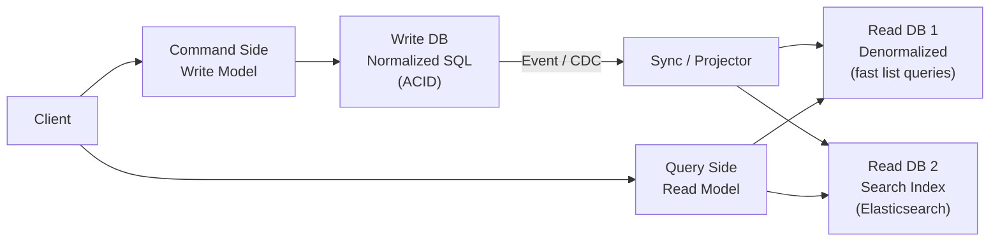

# CQRS - Separate Reads and Writes for Scale

> **Reading Time:** 20 minutes
> **Difficulty:** Advanced
> **Impact:** Scale reads and writes independently — 100x read throughput with optimized query models

## 🗺️ Quick Overview



*CQRS splits the data model in two — commands (writes) go to a normalized write store optimised for integrity, and queries (reads) hit purpose-built read models that trade consistency for query speed.*

## The Problem: One Model Can't Serve Everyone

```
Traditional CRUD: Same model for reads AND writes

┌──────────────┐       ┌──────────────────────┐
│   API        │       │     PostgreSQL        │
│              │       │                       │
│ POST /order  │──────▶│ orders table          │
│ GET  /order  │◀──────│ (normalized schema)   │
│ GET  /orders │◀──────│                       │
│   ?status=   │       │ + 5 JOINs for list    │
│   &user=     │       │ + 3 JOINs for detail  │
│   &date=     │       └──────────────────────┘
└──────────────┘

Problems at scale:
1. Read queries need JOINs across 5+ tables → SLOW
2. Write queries need validation + constraints → DIFFERENT needs
3. Read:Write ratio is 100:1 → Reads dominate
4. Can't optimize schema for both reads and writes
5. Adding a new read pattern requires schema migration
```

```
Example: E-commerce order page

Write needs (simple):
  INSERT order + line_items + payment

Read needs (complex):
  Order details page:
    orders + users + products + addresses +
    payments + shipping + reviews + promotions
    = 7-table JOIN

  Order list page:
    Sorted, filtered, paginated, aggregated
    Different fields than detail page!

  Analytics dashboard:
    Aggregate by day/week/month
    Top products, revenue, conversion rates
    Completely different query patterns!
```

---

## What Is CQRS?

**Command Query Responsibility Segregation: Use different models for reading and writing.**

```
Traditional:
  ┌────────────────────────────┐
  │      Single Model          │
  │   (reads + writes)         │
  │                            │
  │  ┌──────────────────────┐  │
  │  │    Database          │  │
  │  │  (one schema)        │  │
  │  └──────────────────────┘  │
  └────────────────────────────┘

CQRS:
  ┌──────────────────┐    ┌──────────────────┐
  │   Command Side   │    │   Query Side     │
  │   (writes)       │    │   (reads)        │
  │                  │    │                  │
  │  ┌────────────┐  │    │  ┌────────────┐  │
  │  │ Write DB   │  │───▶│  │ Read DB    │  │
  │  │(normalized)│  │sync│  │(denormalized│  │
  │  └────────────┘  │    │  │ optimized) │  │
  └──────────────────┘    └──────────────────┘

Write model: Optimized for data integrity
  - Normalized schema
  - Strong consistency
  - Validation rules

Read model: Optimized for query performance
  - Denormalized (pre-joined)
  - Eventually consistent
  - Tailored per query pattern
```

---

## CQRS Architecture

### Basic CQRS

```
┌──────────┐  Command   ┌───────────────┐
│  Client  │───────────▶│Command Handler│
│          │            │               │
│ POST/PUT │            │ Validate      │
│ DELETE   │            │ Business rules│
│          │            │ Save to DB    │
└──────────┘            └───────┬───────┘
                                │
                        ┌───────▼───────┐
                        │  Write DB     │
                        │ (PostgreSQL)  │
                        │ Normalized    │
                        └───────┬───────┘
                                │ Sync (CDC/Events)
                        ┌───────▼───────┐
                        │  Read DB      │
                        │ (Elasticsearch│
                        │  or Redis)    │
                        │ Denormalized  │
                        └───────┬───────┘
                                │
┌──────────┐  Query     ┌───────▼───────┐
│  Client  │◀───────────│ Query Handler │
│          │            │               │
│ GET      │            │ Simple fetch  │
│ Search   │            │ No JOINs      │
│ Filter   │            │ Pre-computed  │
└──────────┘            └───────────────┘
```

### CQRS with Event Sourcing

```
┌──────────┐  Command   ┌───────────────┐
│  Client  │───────────▶│Command Handler│
│          │            │               │
│ POST     │            │ Load aggregate│
│ "Place   │            │ Apply command │
│  Order"  │            │ Emit events   │
└──────────┘            └───────┬───────┘
                                │
                        ┌───────▼───────┐
                        │  Event Store  │
                        │               │
                        │ OrderCreated  │
                        │ PaymentDone   │
                        │ OrderShipped  │
                        └───────┬───────┘
                                │
                    ┌───────────┼───────────┐
                    ▼           ▼           ▼
             ┌──────────┐ ┌──────────┐ ┌──────────┐
             │ Orders   │ │ Search   │ │Analytics │
             │ Read     │ │ Index    │ │Dashboard │
             │ Model    │ │          │ │          │
             │(Postgres)│ │(Elastic) │ │(ClickHse)│
             └──────────┘ └──────────┘ └──────────┘

Each projection:
  - Subscribes to events
  - Builds its own optimized read model
  - Can be rebuilt from scratch (replay events)
  - Independently scalable
```

---

## Implementation

### Command Side

```javascript
// Command: Place an order
class PlaceOrderCommand {
  constructor(userId, items, shippingAddress) {
    this.userId = userId;
    this.items = items;
    this.shippingAddress = shippingAddress;
  }
}

// Command Handler: Business logic + validation
class PlaceOrderHandler {
  async handle(command) {
    // 1. Validate
    const user = await this.userRepo.findById(command.userId);
    if (!user) throw new Error('User not found');

    for (const item of command.items) {
      const stock = await this.inventoryRepo.getStock(item.productId);
      if (stock < item.quantity) {
        throw new Error(`Insufficient stock for ${item.productId}`);
      }
    }

    // 2. Create aggregate
    const order = Order.create({
      userId: command.userId,
      items: command.items,
      shippingAddress: command.shippingAddress
    });

    // 3. Save to write database
    await this.orderRepo.save(order);

    // 4. Publish domain events
    await this.eventBus.publish(new OrderCreated({
      orderId: order.id,
      userId: order.userId,
      items: order.items,
      total: order.total,
      createdAt: order.createdAt
    }));

    return order.id;
  }
}
```

### Query Side

```javascript
// Query: Get order list for user (denormalized read model)
class OrderListProjection {
  // Subscribes to events and builds read model
  async onOrderCreated(event) {
    await this.readDb.orderList.upsert({
      orderId: event.orderId,
      userId: event.userId,
      itemCount: event.items.length,
      total: event.total,
      status: 'PENDING',
      // Pre-joined data (no runtime JOINs needed)
      userName: await this.cache.getUserName(event.userId),
      firstItemName: event.items[0].name,
      firstItemImage: event.items[0].imageUrl,
      createdAt: event.createdAt
    });
  }

  async onOrderShipped(event) {
    await this.readDb.orderList.update(
      { orderId: event.orderId },
      { status: 'SHIPPED', trackingNumber: event.trackingNumber }
    );
  }

  async onPaymentProcessed(event) {
    await this.readDb.orderList.update(
      { orderId: event.orderId },
      { status: 'CONFIRMED', paidAt: event.timestamp }
    );
  }
}

// Query Handler: Simple fetch (no JOINs, no business logic)
class GetUserOrdersHandler {
  async handle(userId, { page, limit, status }) {
    // Single table query — already denormalized
    return await this.readDb.orderList.find({
      userId,
      ...(status && { status }),
      orderBy: 'createdAt DESC',
      offset: page * limit,
      limit
    });
  }
}
```

### Syncing Read Models

```
Three approaches to sync write → read:

1. Event-Driven (Recommended)
   Write DB → Publish event → Read model handler updates read DB

   ┌─────────┐  event   ┌───────┐  update  ┌─────────┐
   │Write DB │────────▶│ Kafka │────────▶│ Read DB │
   └─────────┘         └───────┘         └─────────┘

   Lag: 10-100ms
   Pro: Decoupled, scalable, reliable
   Con: Eventual consistency

2. Change Data Capture (CDC)
   Database transaction log → Stream → Read model

   ┌─────────┐  WAL     ┌──────────┐  update  ┌─────────┐
   │Write DB │────────▶│ Debezium │────────▶│ Read DB │
   └─────────┘  stream  └──────────┘         └─────────┘

   Lag: < 100ms
   Pro: No application code changes, captures all changes
   Con: Tied to database internals

3. Dual Write (Anti-pattern — avoid)
   Application writes to both databases

   ❌ app.writeDB.save(order);
   ❌ app.readDB.save(orderView);  // What if this fails?

   Pro: Immediate consistency
   Con: Data inconsistency if one write fails
        No transaction across two databases
```

---

## Multiple Read Models

```
Different read models for different query patterns:

Event Stream:
  [OrderCreated] [PaymentDone] [OrderShipped] [ItemReturned]
        │              │              │              │
        └──────────────┼──────────────┼──────────────┘
                       │              │
        ┌──────────────▼──────────────▼──────────────┐
        │                                            │
   ┌────▼────┐    ┌────▼────┐    ┌────▼────┐    ┌────▼────┐
   │ Order   │    │ Search  │    │ Analytics│    │Customer │
   │ Detail  │    │ Index   │    │Dashboard │    │ 360°    │
   │ View    │    │         │    │          │    │ View    │
   │         │    │         │    │          │    │         │
   │Postgres │    │Elastic  │    │ClickHouse│    │ Redis   │
   │         │    │search   │    │          │    │         │
   └─────────┘    └─────────┘    └─────────┘    └─────────┘

   Purpose:       Purpose:       Purpose:       Purpose:
   Full order     Full-text      Aggregations   Fast customer
   details w/     search with    by time, product, overview for
   history        facets,filters region         support team

Each read model:
  - Has its own schema optimized for its queries
  - Uses the best database for its access pattern
  - Can be rebuilt from events at any time
  - Scales independently
```

---

## When to Use CQRS

### Good Fit

```
✅ Read-heavy systems (100:1 read/write ratio)
   Reads and writes have very different requirements
   Example: E-commerce product catalog

✅ Complex query requirements
   Multiple views of the same data
   Full-text search + relational queries + analytics
   Example: Customer 360 dashboard

✅ Event-sourced systems
   CQRS is natural with event sourcing
   Events → Multiple projections
   Example: Financial ledger system

✅ Microservices with shared data needs
   Each service needs a different view of the data
   Example: Order data needed by shipping, billing, support

✅ High-scale reads with simpler writes
   Writes go to one database
   Reads scale across multiple replicas/caches
```

### Bad Fit

```
❌ Simple CRUD applications
   Overhead of two models isn't justified
   Standard read replicas work fine

❌ Strong consistency required
   Can't tolerate ANY stale reads
   Banking balance display (must be up-to-the-second)

❌ Small team / early stage
   Complexity isn't justified
   "We have 100 users" → CQRS is overkill

❌ Simple queries
   If reads are just "GET by ID" → don't need CQRS
   Denormalized NoSQL or cached SQL works fine
```

---

## Handling Eventual Consistency

```
CQRS read models lag behind writes by 10-100ms.
Users may see stale data.

Problem scenario:
  User places order → Redirected to order list
  Order list query returns from read model
  Read model hasn't been updated yet → ORDER MISSING!

Solutions:

1. Read-your-own-writes
   After write, read from WRITE database for THIS user
   Other users read from read model (slightly stale is fine)

   async function getOrders(userId, justCreatedOrderId) {
     const orders = await readDb.getOrders(userId);
     if (justCreatedOrderId && !orders.find(o => o.id === justCreatedOrderId)) {
       // Read model hasn't caught up — fetch from write DB
       const newOrder = await writeDb.getOrder(justCreatedOrderId);
       orders.unshift(newOrder);
     }
     return orders;
   }

2. Polling with version
   Client polls until read model has the expected version
   "Keep checking until orderId X appears"

3. Optimistic UI
   Show the order immediately in the client
   UI displays the order before read model confirms
   If something goes wrong, notify and correct

4. Event-driven notification
   After event is projected, push notification to client
   "Your order is confirmed" → client refreshes
```

---

## Real-World Example

```
E-commerce with CQRS:

Write Side:                              Read Side:
┌────────────────────┐                   ┌──────────────────────┐
│ OrderService       │                   │ Product Catalog      │
│                    │                   │ (Elasticsearch)      │
│ POST /orders       │                   │                      │
│  → Validate stock  │   events          │ GET /products?q=shoe │
│  → Calculate price │ ─────────────────▶│  → Full-text search  │
│  → Save order      │                   │  → Faceted filtering │
│  → Publish event   │                   │  → No JOINs needed   │
│                    │                   │  → 5ms response time │
│ PostgreSQL         │                   └──────────────────────┘
│ (normalized,       │
│  ACID transactions)│                   ┌──────────────────────┐
└────────────────────┘                   │ Order Dashboard      │
                                         │ (ClickHouse)         │
                         events          │                      │
                       ─────────────────▶│ Revenue by day       │
                                         │ Orders by region     │
                                         │ Top products         │
                                         │ Conversion funnel    │
                                         └──────────────────────┘

                                         ┌──────────────────────┐
                                         │ Customer View        │
                         events          │ (Redis)              │
                       ─────────────────▶│                      │
                                         │ Recent orders        │
                                         │ Loyalty points       │
                                         │ Recommendations      │
                                         │ Sub-ms response      │
                                         └──────────────────────┘

Write: 1 PostgreSQL (strong consistency)
Read: 3 specialized stores (each optimized for its queries)
All kept in sync via events from Kafka
```

---

## Common Mistakes

### 1. Using CQRS Everywhere

```
❌ "Let's make every service CQRS!"
   User profile service (simple CRUD) → CQRS overkill
   Settings service (10 reads/day) → CQRS overkill

✅ Use CQRS only where read/write patterns diverge significantly
   Or where you need multiple read model optimizations
```

### 2. Synchronous Read Model Updates

```
❌ Write to write DB AND read DB in same transaction
   If read DB write fails → rollback? Inconsistent?

✅ Async event-based sync
   Write DB → Event → Read DB
   Accept eventual consistency (typically < 100ms)
```

### 3. Not Planning for Rebuild

```
❌ Read model corrupted → no way to fix except manual patches

✅ Keep all events in event store
   Read model broken? → Replay events → Rebuild from scratch
   New read model needed? → Replay events → Built automatically
```

---

## 🎯 Interview Questions

### Common Interview Questions on CQRS

#### Q1: Explain CQRS and when you would use it.
**What interviewers look for**: A clear definition, a concrete use case, and awareness of the added complexity — they want to see you don't apply it everywhere.

**Answer framework**:
1. **CQRS separates the read model from the write model.** Commands (writes) go to a normalized write store optimized for integrity (ACID transactions, validation). Queries (reads) hit purpose-built read models optimized for query speed (denormalized, pre-joined, or in a different database like Elasticsearch).
2. **When to use**: Read-heavy systems with divergent read/write patterns (e.g., 100:1 read/write ratio); when you need multiple different views of the same data (search index, analytics dashboard, real-time view); naturally pairs with event sourcing.
3. **When NOT to use**: Simple CRUD apps where reads are just GET-by-ID; small teams where the added infrastructure complexity (event bus, projections, multiple DBs) isn't justified; when strong consistency is required and eventual consistency isn't acceptable.

**Key numbers to mention**: Read/write ratio is the trigger — above 20:1, CQRS typically pays off. The sync lag between write and read models is typically 10–100ms with event-driven projection.

---

#### Q2: How do you handle read/write model synchronization lag in CQRS?
**What interviewers look for**: Concrete strategies for the "stale read after write" problem and awareness of the user-facing symptoms.

**Answer framework**:
1. **Accept it by design** — 10–100ms eventual consistency is fine for most use cases (feeds, product listings, dashboards). The user doesn't see the difference between "just confirmed" and "shown on list 50ms later."
2. **Read-your-own-writes**: After a user writes, route their immediate subsequent read to the write database for that session/operation. All other users read from the (potentially stale) read model. This solves the "I just placed an order but it's not in my order list" problem.
3. **Optimistic UI + event notification**: Show the updated state immediately on the client side after the user action, before the read model catches up. When the event is projected, push a WebSocket notification to confirm. If something goes wrong, roll back the UI.

**Key numbers to mention**: Sync lag with Kafka + CDC (Debezium) is typically under 100ms end-to-end. If your read model is a Redis cache refreshed on events, it can be under 10ms.

---

#### Q3: What are the consistency trade-offs in a CQRS + event sourcing system?
**What interviewers look for**: Deep understanding of the CAP theorem trade-off made when combining these patterns, and practical experience with the failure modes.

**Answer framework**:
1. **You're choosing AP over CP for the read side.** The write side (event store) is your source of truth — strongly consistent. The read side (projections) is eventually consistent, lagging by 10–500ms depending on projection pipeline health.
2. **Failure modes**: If the projection consumer crashes, read models fall behind by minutes or hours. You need monitoring on consumer lag (`max(partition_lag) > 1000 messages` = alert). When consumer catches up, the read model self-heals.
3. **Compensating strategies**: For regulatory or financial data (exact balances, audit records), keep that query on the write DB directly. Reserve CQRS read models for non-critical reads where staleness is acceptable (e.g., recommendation feeds, analytics).

**Key numbers to mention**: In a payment system, the account balance query should go to the write DB (strong consistency). A transaction history view can be a CQRS read model with 100ms lag. Design the consistency tier per use case, not globally.

---

#### Q4: How do you rebuild a corrupted or outdated read model in CQRS?
**What interviewers look for**: Understanding of the event replay capability — this is one of the most powerful features of CQRS + event sourcing.

**Answer framework**:
1. **Because all events are stored durably, read models are disposable.** If a projection is corrupted, wrong, or you need a new one, replay all events from the event store through the projection handler.
2. **Blue-green projection rebuild**: Spin up a new projection consumer reading from the beginning of the event log into a new database table. Once caught up, swap the query routing from the old table to the new one. Zero downtime.
3. **Snapshot optimization**: For large event stores (10M+ events), full replay is slow. Use snapshots — periodically store the current state at offset N, then replay only events after N. Reduces rebuild from hours to minutes.

**Key numbers to mention**: A Kafka topic with 100M events replaying at 50K events/sec takes ~33 minutes to rebuild from scratch. With a 24-hour snapshot, only the last ~50K events need to be replayed — under 2 seconds.

---

#### Q5: How does CQRS compare to simply using read replicas?
**What interviewers look for**: The ability to distinguish nuanced architectural choices rather than treating similar-sounding patterns as interchangeable.

**Answer framework**:
1. **Read replicas are the same schema, different instance.** They reduce read load on the primary but can't optimize the schema for different query patterns. Complex JOIN queries are still slow even on a replica.
2. **CQRS read models are purpose-built.** You can use Elasticsearch for full-text search, ClickHouse for analytics, Redis for sub-millisecond hot-path queries — each with its own optimized schema. A read replica can't serve all these use cases.
3. **Operational difference**: A dead replica causes read degradation; you can failover to another replica or the primary. A dead CQRS projection consumer causes read model staleness, but the write model keeps working. Failure blast radius is smaller.

**Key numbers to mention**: Read replicas have ~sub-second lag (replication lag). CQRS event-driven read models have 10–100ms lag for event processing + projection update. Read replicas work well up to ~20:1 read/write ratio; above that, multiple specialized read models deliver better cost efficiency and query performance.

---

## Key Takeaways

```
1. CQRS separates read and write responsibilities
   Different models optimized for different access patterns

2. Use the best database for each read pattern
   Elasticsearch for search, ClickHouse for analytics,
   Redis for real-time, PostgreSQL for relational queries

3. Events sync write model to read models
   Event bus or CDC keeps read models updated
   Accept 10-100ms eventual consistency

4. Multiple read models are the power of CQRS
   One write → many read views, each optimized

5. Handle eventual consistency explicitly
   Read-your-own-writes, optimistic UI, polling

6. Don't use CQRS for simple CRUD
   Overhead isn't justified for basic applications
   Start simple, add CQRS when query patterns demand it

7. Events enable read model rebuilds
   Corrupted read model? Replay events from scratch
   New query pattern? Build a new projection
```
